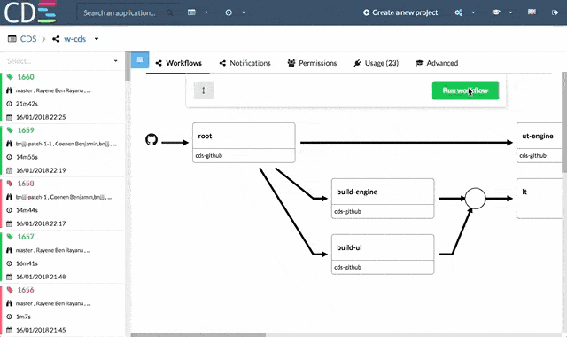

# CDS: Continuous Delivery Service

CDS is an Enterprise-Grade Continuous Delivery & DevOps Automation Platform written in Go(lang).

**This project is under active development**

**[Documentation](https://ovh.github.io/cds/)**

## Intuitive UI
CDS provides an intuitive UI that allows you to build complex workflows, run them and dig into the logs when needed.

## The most powerful Command Line for a CI/CD Platform

cdsctl is the CDS Command Line - you can script everything with it, cdsctl also provide some cool commands such as `cdsctl shell` to browse your projects and workflows without the need to open a browser.

[See all cdsctl commands](https://ovh.github.io/cds/cli/cdsctl/#see-also)

## Want a try?

Docker-Compose or Helm are your friends, see [Ready To Run Tutorials](https://ovh.github.io/cds/hosting/ready-to-run/)

## FAQ

### Why CDS? Discover the Origins

- [Self-Service](https://ovh.github.io/cds/gettingstarted/concepts/why_cds/#1-self-service)
- [Horizontal Scalability](https://ovh.github.io/cds/gettingstarted/concepts/why_cds/#2-horizontal-scalability)
- [High Availability](https://ovh.github.io/cds/gettingstarted/concepts/why_cds/#3-high-availability)
- [Pipeline Reutilisability](https://ovh.github.io/cds/gettingstarted/concepts/why_cds/#4-pipeline-reutilisability)
- [Rest API](https://ovh.github.io/cds/gettingstarted/concepts/why_cds/#5-rest-api)
- [Customizable](https://ovh.github.io/cds/gettingstarted/concepts/why_cds/#6-customizable)

### What is a CDS workflow?

Most of the CI/CD Tools play with jobs inside a pipeline. CDS introduce a new concept named `CDS Workflows`.
A [CDS Workflow](https://ovh.github.io/cds/gettingstarted/concepts/workflow/) allows you to chain pipelines with triggers.
A [pipeline](https://ovh.github.io/cds/gettingstarted/concepts/pipeline/) is structured in sequential [stages](https://ovh.github.io/cds/gettingstarted/concepts/stage/) containing one or multiple concurrent [jobs](https://ovh.github.io/cds/gettingstarted/concepts/job/).

### Can I use it in production?

Yes! CDS is used in production since 2015 @OVH and it launches more than 7M CDS workers per year. You can install the official release available on https://github.com/ovh/cds/releases

CDS provides everything needed to monitor and measure production activity (logs, metrics, monitoring)

### How to backup?

All data are stored in the database - nothing on filesystem. Just backup your database regularly and you will be safe.

### Need some help?

Core Team is available on [Gitter](https://gitter.im/ovh-cds/Lobby)

### Comparison Matrix

All the features of the table are detailed below.

| Feature | CDS | Bamboo | Buildbot | Gitlab CI | Jenkins | 
| --- | --- | --- | --- | --- | --- |
| [Pipeline](#pipeline) | :white_check_mark: | :white_check_mark: | :white_check_mark: | :white_check_mark: | :white_check_mark: | 
| [Workflow](#workflow) | :white_check_mark: | :x: | :white_check_mark: | :x: | :x: |
| [Visual configuration with Web UI](#visual-configuration-with-web-ui) | :white_check_mark: | :white_check_mark: | :x: | :x: | :x: [*1](#some-explanations-on-the-comparaison-matrix) | 
| [Configuration on Git Repository](#configuration-on-git-repository) | :white_check_mark: | :x: | :white_check_mark: | :white_check_mark: | :white_check_mark: |
| [Configuration as code on UI](#configuration-as-code-on-ui) | :white_check_mark: | :x: | :x: | :white_check_mark: | :x: [*2](#some-explanations-on-the-comparaison-matrix) |
| [Native Git branching](#native-git-branching) | :white_check_mark: | :white_check_mark: | :white_check_mark: | :white_check_mark: | :white_check_mark: [*3](#some-explanations-on-the-comparaison-matrix) |
| [Job's Services](#jobs-services) | :white_check_mark: | :x: | :x: | :white_check_mark: | :x: |
| [Secure Remote Caching](#secure-remote-caching) | :white_check_mark: | :x: | :white_check_mark: | :white_check_mark: | :x: [*4](#some-explanations-on-the-comparaison-matrix) | 
| [Enterprise Notification Bus](#enterprise-notification-bus) & [Built-in Hooks](#built-in-hooks) | :white_check_mark: | :x: | :x: | :x: | :x: |
| [Continuous Deployment & Environment Support](#continuous-deployment--environment-support) | :white_check_mark: | :white_check_mark: | :white_check_mark: | :white_check_mark: | :x: [*5](#some-explanations-on-the-comparaison-matrix) |
| [Enterprise-grade permissions, Support of ACLs delegation](#enterprise-grade-permissions--support-of-acls-delegation) | :white_check_mark: | :white_check_mark: | :white_check_mark: | :white_check_mark: | :x: [*6](#some-explanations-on-the-comparaison-matrix) |
| [Build Artifacts Cloud](#build-artifacts-cloud) | :white_check_mark: | :x: | :white_check_mark: | :white_check_mark: | :x: [*7](#some-explanations-on-the-comparaison-matrix) |
| [Tests & Vulnerabilities Reports](#tests--vulnerabilities-reports) | :white_check_mark: | :white_check_mark: | :white_check_mark: | :x: [*8](#some-explanations-on-the-comparaison-matrix) | :white_check_mark: |
| [Self-Service Project Creation - ability to create a tenant](#self-service-project-creation) | :white_check_mark: | :x: | :x: [*9](#some-explanations-on-the-comparaison-matrix) | :white_check_mark: | :x: |
| [Execution Environment Customization](#execution-environment-customization) | :white_check_mark: | :x: | :x: | :white_check_mark: | :x: [*10](#some-explanations-on-the-comparaison-matrix) |
| [Multi-Tenancy](#multi-tenancy) | :white_check_mark: | :x: | :x: | :white_check_mark: | :x: [*11](#some-explanations-on-the-comparaison-matrix) | 
| [Command Line Interface (cdsctl): 100% features supported & User Friendly](#command-line-interface-cdsctl-100-features-supported) | :white_check_mark: | :x: | :white_check_mark: | :x: | :x: [*12](#some-explanations-on-the-comparaison-matrix) | 
| [REST API & SDK](#rest-api--sdk) | :white_check_mark: | :white_check_mark: | :white_check_mark: | :white_check_mark: | :white_check_mark: |
| [Self-Hosting](#self-hosting) | :white_check_mark: | :white_check_mark: | :white_check_mark: | :white_check_mark: | :white_check_mark: |
| [High Availability & Scalability & Upgrade without User Downtime](#high-availability--scalability--upgrade-without-user-downtime) | :white_check_mark: | :x: | :x: | :white_check_mark: [*13](#some-explanations-on-the-comparaison-matrix) | :x: | 
| [Built-in Metrics](#built-in-metrics) | :white_check_mark: | :white_check_mark: | :white_check_mark: |  :white_check_mark: | :x: [*14](#some-explanations-on-the-comparaison-matrix) |
| [Extensibility Plugins](#extensibility-plugins) | :white_check_mark: | :white_check_mark: | :white_check_mark: | :white_check_mark: | :white_check_mark: |
| [OS/Arch Compatibility](#osarch-compatibility) | :white_check_mark: | :white_check_mark: | :white_check_mark: | :white_check_mark: | :white_check_mark: |
| [Auto-Scale OnDemand multi-cloud](#auto-scale-ondemand-multi-cloud) | :white_check_mark: | :x: | :x: | :x: [*15](#some-explanations-on-the-comparaison-matrix) | :x: [*16](#some-explanations-on-the-comparaison-matrix) | 

### CDS User features

#### Pipeline

Ability to run multiple jobs simultaneously while keeping an isolation between them. [See doc about stages & jobs inside a pipeline](https://ovh.github.io/cds/gettingstarted/concepts/pipeline/). A pipeline is started with a context: 0 or 1 application, 0 or 1 environment.

#### Workflow

A Workflow makes it possible to chain the pipelines. This is a key Feature of CDS. You can create workflows using one or more pipelines, pipelines that can be linked together with joins or forks.

You can imagine having only one builder workflow and deploying your entire microservice stack. The same pipeline can be used several times in a workflow, you can associate an application, an environment.
You will have only one deployment pipeline and only one build pipeline to maintain, even if you have hundreds of applications.

#### Workflow templates

A workflow template allow to share and reuse workflows across multiple teams. Any user can create a Workflow Template, maintain it as code or from UI, and bulk update a set of workflows with a single action.

As a company, you can offer a predefined catalog of workflows allowing you to standardize test and deployment practices across all your teams.

This also reduces the maintenance efforts since templates allow a scalable centralized management.

#### Visual configuration with Web UI

You can configure everything with the web UI. Even if you have complex use cases, it's usually easier to create your workflow graphically.

#### Configuration on Git Repository

Pipeline as code is a well-known concept of CI / CD tools. CDS, goes a step further and offers workflow as code. This is done by git-pushing using yaml configuration files of your workflow (+ pipeline, + applications, + environment). This is partucularly useful as you can test your new workflow on a dev branch, before merging the changes on the master branch.

#### Configuration as code on UI

You can modify your workflow with the UI, you can also modify the configuration by editing the yml directly in the UI if you wish. This is an excellent way to learn how to use the workflow-as-code feature.

#### Native Git branching

Ability to launch builds based on a branch pattern. This allows, for example, to deploy dev/* branches to "staging" and deploy the master branch to "prod".

Note that CDS's default behavior is to launch the whole workflow on every git commit. This behavior can be altered using "run conditions".

#### Native Github / Bitbucket Server / Gitlab / Gerrit integration

2-way integration with most popular git-based products.

1. Ability to get notified and start a build when a change is pushed .
2. Ability to notify the git-based tool of the success/failure of the build.

CDS natively supports Github, Gitlab, Bitbucket Server and Gerrit.
The link between your repo git and CDS is via a CDS application: 1 Git repository == a CDS application.
Through this integration, CDS will push build status of your commits : Building, Success or Failed.

#### Multiple VCS Support in Pipeline/Job

CDS gives you the possibility to clone from different git repositories within a single workflow. A CDS workflow can involve several different applications - or none if you do not want to have a connection with a git repo.

#### Job's Services

Ability to start ephemeral services (a database, a web server, etc.) to support your job. This is particularly handy while testing your code.

In CDS these services are called Service Prerequisites. You just need to specify the corresponding docker image and run params.

Take a simple example: you have a pipeline that builds a docker image containing your application. Your application needs a redis and a postgreSQL to work. You can in a CDS job put three prerequisites service: a redis, a postgreSQL and your application. CDS will take care of making a private network between its services so that they can communicate with each other.
Your CDS job can thus perform integration tests on your application started with a real database and a real cache.

Please read: https://ovh.github.io/cds/workflows/pipelines/requirements/service/

#### Secure Remote Caching

A remote cache is used by a team of developers and/or a continuous integration (CI) system to share build outputs. If your build is reproducible, the outputs from one machine can be safely reused on another machine, which can make builds significantly faster

Doc: https://ovh.github.io/cds/cli/worker/cache/

#### Enterprise Notification Bus

As an Enterprise-Grade platform, CDS can send a wide range of its internal events (e.g. build finished) in an event bus. 
This event flow can then feed other services (reporting, notifications, etc., ).

#### Built-in Hooks

Ability to launch a workflow manually or with git pushes or via a scheduler or via a webhook. 
In addition to the above, CDS can also be triggered using an event bus to (kafka or RabbitMQ).

#### Continuous Deployment & Environment Support

Ability to manage multiple environments (e.g. dev/prod/staging) in a secure way with segregated access rights.
In practice, an environment is a just set of variables that you can use within your workflows.

With CDS, You can use a deployment pipeline on your preproduction environment and use that same deployment pipeline on your production environment. The ability to deploy to production can be limited to a pre-established group of users.

#### Enterprise-grade permissions / Support of ACLs delegation

Users are free to create groups and manage users in their groups. A group can have the rights to read, write, execute on their projects and their workflows. You can also restrict the execution of some pipelines to some groups if you wish.

#### Build Artifacts Cloud

If you use CDS as a CI / CD tool, you will probably have built artifacts. CDS jobs are isolated from each other, but you can pass artifacts from one job to another using the Artifact Upload and Artifact Download actions.
At the end of a CDS job, all the files are deleted from the workers. To persist artifacts, CDS can use a Swift Storage or on a given filesystem (not recommended though).

#### Tests & Vulnerabilities Reports

CDS clearly displays the results of unit tests and vulnerabilities detected during builds.

#### Self-Service Project Creation

A CDS project is like a tenant. All users can create a CDS project, this project will bring together applications, environments, pipelines and of course workflows.

CDS projects are isolated from one another, but the same group may have access rights to multiple projects if you wish.

#### Execution Environment Customization

A worker model is a worker execution context. Let's say, you need to run a job that requires GoLang v1.11.5. In CDS, you just need to create a Go worker model, containing a go in version 1.11.5.
A worker model can be a docker image, an openstack image, a VSphere image.
Although CDS administrators can offer shared worker models, users can create their own template workers if they wish.

#### Self Service User’s Integrations

On a CDS project, you can add integrations like openstack, kubernetes, etc .... This will offer you features within your workflows. For example, with the Kubernetes integration, you can add your own cluster to your CDS project and thus be able to use the Deploy Application action to deploy your newly built application on your cluster, in helm format if you wish.
You can of course develop your own integrations.

#### Multi-Tenancy

After reading the previous points, you've understood: self-service everywhere. All users can do their project / workflow / worker models / workflow templates / actions ... And run Jobs in a totally isolated environment. CDS projects are builders, on which you can add integrations. All this allows you to have only one instance of CDS for your entire company.

#### Command Line Interface (cdsctl): 100% features supported

All you can do with the UI is available via the Command-Line Interface (CLI), named "cdsctl". cdsctl is available on all the OS: darwin, freebsd, linux, openbsd ... cdsctl will allow you to create, launch, export, import your workflows, monitor your CDS, navigate through your projects, workflows.
No need to go to the UI of CDS or your repository manager to check the status of your commit, `git push && cdsctl workflow --track` will display your workflow in your command line.

#### REST API & SDK

Do you have even more advanced automation needs, or the desire to develop an application that queries CDS? the [REST API](https://ovh.github.io/cds/cli/api/) and the [SDK](https://ovh.github.io/cds/cli/sdk/) will allow you to easily develop your software.

### CDS Administration features

#### Self-Hosting

CDS is open-source since October 2016. You can install it freely in your company or at home. Some tutorials are available to help you start a CDS, [docker-compose](https://ovh.github.io/cds/hosting/ready-to-run/docker-compose/), [Kubernetes with Helm](https://ovh.github.io/cds/hosting/ready-to-run/helm/), [Install with binaries](https://ovh.github.io/cds/hosting/ready-to-run/from-binaries/).

#### High Availability / Scalability / Upgrade without User Downtime

High availability is a very important point for a CI / CD tool. CDS is stateless, nothing is stored on the filesystem. This makes it possible to launch several CDS APIs behind a load balancer. Thus, you can scale the API of CDS to your needs. It also allows upgrades of CDS in full day without impact for users.
In production @OVH, CDS can be updated several times a day, without impacting users or stopping CDS workers.
Asking your users to stop working while updating the Continuous Delivery tool would be ironic, isn't it? ;-)

#### Built-in Metrics

CDS natively exposes monitoring data. You will be able to feed your instance [prometheus](https://prometheus.io/) or [warp10](https://www.warp10.io/) using [beamium](https://github.com/ovh/beamium).

#### Extensibility Plugins

A CDS job consists of steps. Each step is a built-in type action (script, checkoutApplication, Artifact upload / download ...). You can create your own actions, using existing actions - or develop your own action as a plugin. All languages are supported, as long as the language supports GRPC.

#### OS/Arch Compatibility

CDS is agnostic to languages and platforms. Users can launch Jobs on linux, windows, freebsd, osx, raspberry ... in Virtual Machine spawn on demand, in a docker container, on a dedicated host.

So, if your company uses multiple technologies, CDS will not be a blocker for building and deploying your internal software.

#### Auto-Scale OnDemand multi-cloud

One of the initial objectives of CDS at OVH: builder and deploy 150 applications as a container in less than 7 minutes. This has become reality since 2015. What is the secret key?
Auto-Scale on Demand!

Thus, you can have hundreds of workers model and when necessary, CDS will start the workers using the hatcheries.

A [hatchery](https://ovh.github.io/cds/hatchery/) is like an incubator, it gives birth to the CDS Workers and the right of life and death over them.

Several types of hatchery are available: 

 - **[hatchery kubernetes](https://ovh.github.io/cds/hatchery/kubernetes/)** starts workers in pods
 - **[hatchery openstack](https://ovh.github.io/cds/hatchery/openstack/)** starts virtual machines
 - **[hatchery swarm](https://ovh.github.io/cds/hatchery/swarm/)** starts docker containers
 - **[hatchery marathon](https://ovh.github.io/cds/hatchery/marathon/)** starts docker containers
 - **[hatchery VSphere](https://ovh.github.io/cds/hatchery/vsphere/)** starts virtual machines
 - **[hatchery local](https://ovh.github.io/cds/hatchery/local/)** starts processes on a host
 
 So yes, buzzwords or not, a multi-cloud Auto-scale OnDemand is a reality with CDS :-)

#### Some explanations on the comparaison matrix

- *1 Impossible if you create your pipeline with Pipeline plugin, force usage of jenkinsfile
- *2 There is the Pipeline plugin, but not compatible with Graphical COnfiguration with ui, Git branching, and repository manager integration.
- *3 [Multi-branch pipeline plugin](https://wiki.jenkins.io/display/JENKINS/Pipeline+Multibranch+Plugin ) - but incompatible [Pipeline plugin](https://wiki.jenkins.io/display/JENKINS/Pipeline+Plugin)
- *4 Job Cacher plugin not compatible with Blue Ocean, MultiBranch PIpeline, Pipeline plugin, but not compatible with Swift Storage
- *5 "The current version of this plugin may not be safe to use. " https://wiki.jenkins.io/display/JENKINS/EnvInject+Plugin
- *6 https://jenkins.io/doc/book/managing/security/#authorization
- *7 it's not builtin, it's JCloud plugin
- *8 Vulnerability report not available on CE Edition
- *9 everything is in the same bucket
- *10 docker only
- *11 explained on https://www.cloudbees.com/blog/multi-tenancy-jenkins
- *12 https://jenkins.io/doc/book/managing/cli/
- *13 Upgrade Gitlab can be on several days https://docs.gitlab.com/ee/update/ 
- *14 it's a plugin
- *15 K8s, Docker machine & GKE only 
- *16 limitated to about 150 executors https://www.cloudbees.com/blog/multi-tenancy-jenkins(§Scale)

## License

[3-clause BSD](./LICENCE)

