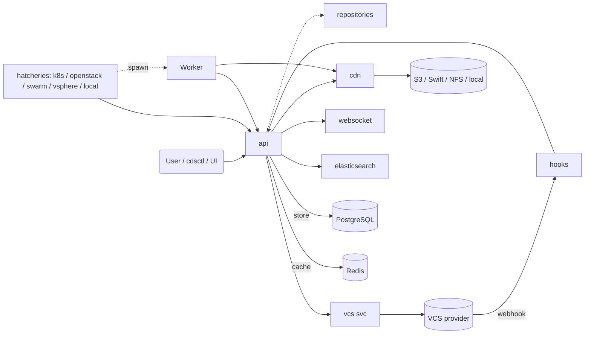
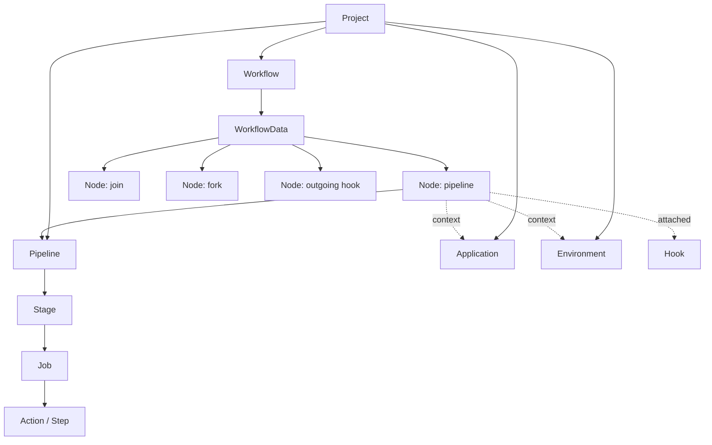
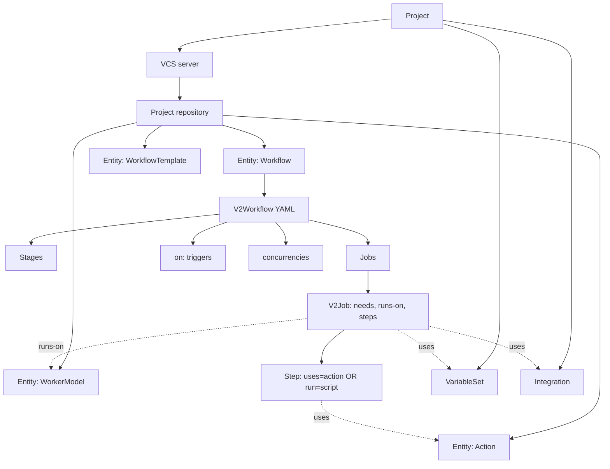
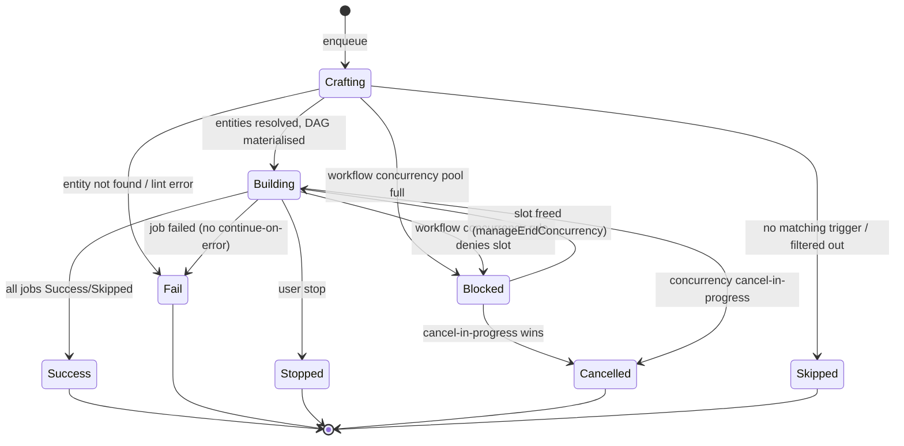
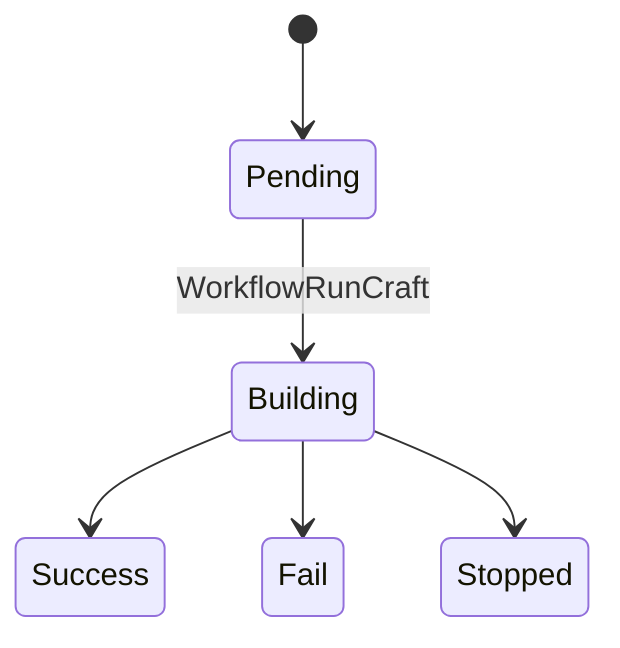
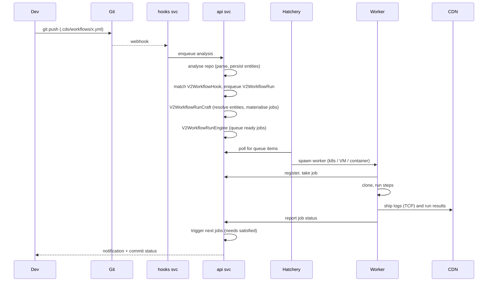

# CDS Platform Overview

This document is the entry point of the technical specification series for
**CDS** (Continuous Delivery Service), the OVHcloud open-source CI/CD
platform. It is written for a mixed audience: the first sections describe
user-facing concepts, then progressively open the architectural details.
Each section links to the dedicated spec where the topic is documented in
depth, and references the canonical Go source so a reader can grep the
code from any concept.

## 1. Table of contents

1. [What CDS is](#2-what-cds-is)
2. [High-level architecture](#3-high-level-architecture)
3. [Workflow v1 vs v2](#4-workflow-v1-vs-v2)
4. [Run lifecycle](#5-run-lifecycle)
5. [Glossary](#6-glossary)
6. [V1 to V2 transition](#7-v1-to-v2-transition)
7. [Specification series index](#8-specification-series-index)
8. [Architecture and internals](#9-architecture-and-internals)

## 2. What CDS is

CDS is an enterprise-grade CI/CD platform written in Go and used in
production at OVHcloud since 2015 to spawn millions of jobs per year on
heterogeneous infrastructure (Kubernetes, OpenStack, vSphere, Docker
Swarm, bare-metal hosts). It exposes a single REST API consumed by a web
UI, a CLI (`cdsctl`, in `cli/cdsctl/`), the worker binary (in
`engine/worker/`), and external integrations. Everything is
multi-tenant: any user can create a project and operate it autonomously.

The platform is built on four guiding principles:

1. **Self-service** — Project creation, ACL delegation, custom worker
   models, custom hatcheries, custom plugins. No central team approval
   is required to onboard a new use case.
2. **Horizontal scalability** — The API service is stateless; nothing is
   stored on its filesystem. Multiple API replicas can sit behind a load
   balancer.
3. **High availability** — The same statelessness enables rolling
   upgrades without user downtime.
4. **Pipeline reusability** — Workflow templates and the v2 actions
   library let teams share standardised CI/CD building blocks.

Two derivative principles shape the implementation:

- **REST-first** — The UI and the CLI consume the same API as
  third-party clients. The Go SDK in `sdk/cdsclient/` is the canonical
  client library.
- **Customizable** — gRPC plugins (`sdk/grpcplugin/`,
  `contrib/grpcplugins/`, `contrib/integrations/`) allow users to ship
  their own action and integration code in any language.

The platform is currently in transition between two workflow generations:

- **Workflow v1** is the historical model. Workflows (`sdk.Workflow` in
  `sdk/workflow.go`) are stored in PostgreSQL as a graph of nodes
  binding pipelines, applications, and environments. It is frozen in
  features and slated for deprecation.
- **Workflow v2 (ascode)** stores everything in a Git repository: the
  workflow YAML (`V2Workflow` in `sdk/v2_workflow.go`), the actions
  (`V2Action`), the worker models (`V2WorkerModel`), and the templates
  (`V2WorkflowTemplate`). Triggers come from repository events. RBAC is
  v2-only. V2 will replace v1.

This split is the subject of [section 4](#4-workflow-v1-vs-v2) and
[section 7](#7-v1-to-v2-transition).

## 3. High-level architecture

CDS is a fleet of cooperating microservices. The bootstrap entry point
is `engine/main.go`; each service implements a common interface
(`Service` in `engine/service/`) and the API service is the central
coordinator. The API is the only service that talks to PostgreSQL.

| Service | Entry point | Role |
| --- | --- | --- |
| api | `engine/api/api.go` | REST API, run engine, RBAC, authentication, integration management |
| cdn | `engine/cdn/cdn.go` | Logs, artifacts, run results, with pluggable storage backends |
| hooks | `engine/hooks/hooks.go` | Incoming VCS webhooks, schedulers, outgoing event chaining |
| vcs | `engine/vcs/vcs.go` | Provider abstraction over GitHub, GitLab, Bitbucket, Gerrit, Gitea, Forgejo |
| repositories | `engine/repositories/repositories.go` | Repository metadata caching service (git operations on disk) |
| hatchery (five impls) | `engine/hatchery/{local,kubernetes,openstack,swarm,vsphere}/` | Spawns workers on demand |
| worker | `engine/worker/main.go` | Job execution agent (v1 and v2 modes) |
| websocket | `engine/websocket/` (+ `engine/api/v2_websocket.go`) | Live event stream for the UI |
| elasticsearch | `engine/elasticsearch/` | Event search and metrics ingestion |
| migrateservice | `engine/migrateservice/` | Schema-migration runner (distinct from data migrations in `engine/api/migrate/`) |
| ui | `engine/ui/` (serves `ui/`) | Static Angular frontend |

The API service depends on PostgreSQL (schema in `engine/sql/api/`) and
Redis (cache abstraction in `engine/cache/`). The CDN service depends
on PostgreSQL (`engine/sql/cdn/`), Redis, and one or more storage units
(local, S3, Swift, NFS, Redis hot cache, WebDAV — under
`engine/cdn/storage/`). Hatcheries authenticate to the API as
`ConsumerHatchery`; the workers they spawn authenticate as worker
consumers (see [`08-auth.md`](./08-auth.md)).

For per-service details, deployment topology, request lifecycle, and
inter-service authentication, see [`01-architecture.md`](./01-architecture.md).

## 4. Workflow v1 vs v2

The two workflow generations coexist in the same binaries today. The
difference is essential to every other domain (hooks, RBAC, run engine,
UI), so it is captured here once and referenced from every later spec.

### Side-by-side comparison

| Aspect | Workflow v1 (legacy) | Workflow v2 (ascode) |
| --- | --- | --- |
| Source of truth | PostgreSQL (`sdk.Workflow`) | Git repository (`.cds/` folder) |
| Top concept | Workflow → Pipelines → Stages → Jobs → Actions | `V2Workflow` → Jobs (DAG via `needs`) → Steps |
| Trigger | `NodeHook` rows attached to nodes | `on:` block in YAML, indexed as `V2WorkflowHook` |
| Authoring | UI graph editor or `cdsctl` push | YAML in repo, parsed by repository analysis |
| Run model | Pipeline-build per node, joins and forks | `Crafting → Building → terminal`; single graph of jobs |
| Permissions | Group permissions on project / workflow (`GroupPermission`) | RBAC v2 (`RBACProject`, `RBACRegion`, `RBACWorkflow`, `RBACVariableSet`, `RBACHatchery`, `RBACGlobal`) |
| Worker assignment | Job requirements (binary, model, region) | `runs-on:` referencing a `V2WorkerModel` |
| Templates | `WorkflowTemplate` rows in the database | `V2WorkflowTemplate` stored in Git, with parameters |
| Notifications | `WorkflowNotification` attached to a workflow | `ProjectNotification` (project-scoped) |
| Variables | Project + Application + Environment variables | Project + `VariableSet` + workflow `env:` + job `env:` |
| Status | Frozen, to be deprecated | Active, replaces v1 |

### Workflow v1 hierarchy

V1 uses four node types — `NodeTypePipeline`, `NodeTypeJoin`,
`NodeTypeFork`, `NodeTypeOutGoingHook` (in `sdk/workflow_node.go`). The
aggregated `sdk.Workflow` embeds its `WorkflowData` (the graph), plus
indexes for the pipelines, applications, environments, hook models, and
notifications it references. A run walks the graph starting from the
root node and schedules a pipeline build per pipeline node — see
`engine/api/workflow/process.go`.

### Workflow v2 hierarchy

A v2 workflow is one YAML document declaring stages, jobs (a map keyed
by job name), gates, concurrencies, semver, integrations, variable sets,
and a top-level environment (see `V2Workflow`). Each job (`V2Job`)
carries `Needs`, `RunsOn`, `Steps`, an optional `Strategy` (matrix), a
`Region`, a `Concurrency` pool, and a `Gate`. The four ascode entity
kinds — `EntityTypeWorkerModel`, `EntityTypeAction`, `EntityTypeWorkflow`,
`EntityTypeWorkflowTemplate` (in `sdk/entity.go`) — are stored as one
`Entity` row per YAML file under `.cds/`.

### End-to-end ascode flow

A developer commits `.cds/workflows/my.yml` to a Git repository. The
repository webhook reaches the **hooks** service. The hooks service
notifies the **API** service, which schedules a repository analysis
(`engine/api/v2_repository_analyze.go`): it fetches the tarball through
the **VCS** service, parses every `.cds/**/*.yml`, and persists one
`Entity` row per file. Hooks declared by the `on:` block are extracted
from the parsed workflow and indexed as `V2WorkflowHook` rows. When a
matching event arrives later (push, pull-request, manual trigger,
schedule, model update, workflow update, workflow run), the API
enqueues a `V2WorkflowRun`. The run engine takes over from there (see
[section 5](#5-run-lifecycle)).

## 5. Run lifecycle

### Workflow v2 state machine

The eight `V2WorkflowRunStatus*` constants live in `sdk/v2_workflow_run.go`.

The terminal-status helper `V2WorkflowRunStatus.IsTerminated` treats
`Building`, `Crafting`, and `Blocked` as in-flight. Crafting is performed
by `V2WorkflowRunCraft` (in `engine/api/v2_workflow_run_craft.go`) which
consumes `workflowRunCraftChan` and resolves entities, contexts, gates,
concurrency, and matrix expansion. The build phase is driven by
`V2WorkflowRunEngineChan` and `V2WorkflowRunEngineDequeue` (in
`engine/api/v2_workflow_run_engine.go`). Runs blocked by a
workflow-level concurrency rule are periodically re-evaluated by
`TriggerBlockedWorkflowRuns`.

### Workflow v1 state machine (simplified)

V1 crafting is performed by `WorkflowRunCraft` (in
`engine/api/workflow_run_craft.go`); the DAG walker is
`processWorkflowDataRun` (`engine/api/workflow/process.go`).

### End-to-end git-push sequence (v2)

Where each phase is documented:

- **Repository analysis** — `engine/api/v2_repository_analyze.go`. See
  [`05-ascode-entities.md`](./05-ascode-entities.md).
- **Hook matching** — `engine/api/v2_hooks.go`,
  `engine/api/workflow_v2/dao_workflow_hook.go`. See
  [`06b-hooks-v2.md`](./06b-hooks-v2.md).
- **Crafting and engine** — `engine/api/v2_workflow_run_craft.go`,
  `engine/api/v2_workflow_run_engine.go`. See
  [`07b-run-engine-v2.md`](./07b-run-engine-v2.md).
- **Worker dispatch and execution** — `engine/api/v2_queue.go`,
  `engine/api/v2_queue_worker.go`, `engine/hatchery/`,
  `engine/worker/internal/`. See
  [`10-hatcheries.md`](./10-hatcheries.md) and
  [`11-workers.md`](./11-workers.md).
- **Reporting and logs** — `engine/cdn/cdn_log_tcp.go`,
  `engine/cdn/item_upload.go`. See
  [`12-cdn-and-artifacts.md`](./12-cdn-and-artifacts.md).

The full run engine is split into two specs:
[`07a-run-engine-v1.md`](./07a-run-engine-v1.md) for the legacy v1
process engine and
[`07b-run-engine-v2.md`](./07b-run-engine-v2.md) for the v2 craft +
engine pipeline.

## 6. Glossary

A short glossary scoped to terms used in this overview. The exhaustive
glossary lives in [`19-glossary-and-cross-references.md`](./19-glossary-and-cross-references.md).
Each entry is tagged `[v1]`, `[v2]`, or `[both]`.

- **Action** `[both]` — A reusable unit of execution. v1: rows in the
  `action` table (`sdk/action.go`). v2: a YAML entity referenced by
  `uses:` (`sdk/v2_action.go`).
- **Ascode** `[v2]` — Pattern of storing CDS objects as YAML files in a
  Git repository. Runtime model in `sdk/entity.go`.
- **Crafting** `[v2]` — First phase of a v2 run: resolve entities,
  evaluate triggers, materialise the job DAG. Status
  `V2WorkflowRunStatusCrafting`.
- **DAG** `[both]` — Directed acyclic graph. v1: `Node`s connected by
  `NodeTrigger`, joins, forks. v2: jobs connected by `needs:`.
- **Entity** `[v2]` — A YAML file from a project repository persisted
  in PostgreSQL. Defined in `sdk/entity.go`.
- **Gate** `[v2]` — Manual approval that holds a job until reviewers
  approve and/or a condition resolves true. `V2JobGate` in
  `sdk/v2_workflow.go`. A gated job does **not** receive the `Blocked`
  status; it stays out of the scheduling set until approved, then
  enters `Waiting`.
- **Hatchery** `[both]` — Service that spawns workers on demand. Five
  implementations under `engine/hatchery/`. Contract in
  `sdk/hatchery/types.go`.
- **Hook (incoming)** `[both]` — Trigger fed by an external event. v1:
  `NodeHook` (`sdk/workflow_hook.go`). v2: `V2WorkflowHook`
  (`sdk/v2_workflow.go`).
- **Hook (outgoing)** `[v1]` — Side-effect call to an external service
  from a workflow node. Currently v1-only (`NodeOutGoingHook`).
- **Initiator** `[v2]` — The user, hook, or run that started a v2 run.
  `V2Initiator` (`sdk/v2_workflow_run.go`).
- **Integration** `[both]` — Project-attached configuration giving a
  workflow access to an external system. `ProjectIntegration`,
  `IntegrationModel` (`sdk/integration.go`).
- **Job** `[both]` — A unit of execution scheduled to a worker. v1:
  `Job` (`sdk/job.go`). v2: `V2Job` (`sdk/v2_workflow.go`).
- **Needs** `[v2]` — Per-job list of upstream jobs that must complete
  before this job runs. Replaces v1 stages and triggers.
- **Plugin** `[both]` — gRPC binary providing actions or integrations.
  Protocol in `sdk/grpcplugin/`; built-ins under
  `contrib/grpcplugins/`.
- **Project** `[both]` — Tenant container. Holds workflows,
  integrations, keys, groups, regions, variables (v1) or variable sets
  (v2). `sdk/project.go`.
- **Region** `[both]` — Logical pool of hatcheries. Used for placement
  and RBAC. `sdk/region.go`.
- **Repository (project)** `[v2]` — A Git repository attached to a
  project, scanned for `.cds/` content. `sdk/repository.go`.
- **Run-attempt** `[v2]` — Counter of retries within a run, separate
  from the run number.
- **Run-number** `[both]` — Monotonic counter of runs of a given
  workflow.
- **Semver context** `[v2]` — Auto-computed version derived from git
  history or repository files. `WorkflowSemver`.
- **Stage** `[both]` — v1: parallel layer inside a pipeline
  (`sdk/stage.go`). v2: optional grouping over jobs
  (`WorkflowStage`).
- **Step** `[both]` — One command inside a job. V2 steps can be `run:`
  (script) or `uses:` (action reference). `ActionStep` in
  `sdk/v2_action.go`.
- **Trigger** `[both]` — Edge that schedules execution. v1:
  `NodeTrigger` between two nodes. v2: an `on:` event matching a
  `V2WorkflowHook`.
- **VariableSet** `[v2]` — Project-scoped named set of variables and
  items, attachable to a workflow or a job. `ProjectVariableSet`
  (`sdk/project_variable.go`).
- **VCS server** `[v2]` — Configured connection to a GitHub / GitLab /
  Bitbucket / Gerrit / Gitea / Forgejo instance, attached to a project.
  `VCSProject` (`sdk/vcs.go`).
- **Worker model** `[both]` — Description of the execution environment
  for a job. v1: `sdk.Model` (`sdk/worker_model.go`). v2:
  `V2WorkerModel` (`sdk/v2_worker_model.go`).
- **Workflow run** `[both]` — Instance of a workflow execution. v1:
  `WorkflowRun` (`sdk/workflow_run.go`). v2: `V2WorkflowRun`
  (`sdk/v2_workflow_run.go`).

## 7. V1 to V2 transition

This section answers the most-asked question: what is already v2-only,
what still requires v1, and how migration is meant to happen.

### Already v2-only

These features have **no v1 equivalent** and ship only with v2:

- **RBAC system** — roles covering global, project, region, hatchery,
  workflow, variable-set, and region-project scopes (`sdk/rbac.go`,
  `sdk/rbac_*.go`, `engine/api/rbac/`).
- **Ascode entities** — `V2WorkerModel`, `V2Action`,
  `V2WorkflowTemplate`, `V2Workflow` stored in Git via the `Entity`
  model.
- **VCS server, project repository, variable set, project
  notification** — all v2-only (`engine/api/v2_project_*.go`).
- **The new UI module** — `ui/src/app/views/projectv2/`.
- **Workflow concurrencies** — `WorkflowConcurrency` with named pools
  and cancel-in-progress semantics.
- **Semver auto-bump** — `WorkflowSemver`, computed per-run from git
  history or repository files.
- **Job gates with reviewers** — `V2JobGate` with typed inputs.

### Still requires v1

These have **no v2 implementation today**:

- `Application` and `Environment` as standalone first-class entities
  (`sdk/application.go`, `sdk/environment.go`).
- `WorkflowNotification` attached to a workflow object (v2 uses
  `ProjectNotification` instead).
- Outgoing hooks bound to nodes (`NodeOutGoingHook`,
  `engine/api/workflow/execute_outgoing_hook_run.go`).
- Old-format `WorkflowTemplate` (`sdk/workflow_template.go`).

### Both coexist

In production today, the platform serves both generations from the same
processes:

- Hatcheries serve both v1 and v2 jobs.
- The worker binary supports both modes (v1: `engine/worker/cmd_run.go`;
  v2: `engine/worker/v2_cmd_*.go`).
- CDN stores logs and artifacts of both.
- The hooks service routes both kinds (v1: `NodeHook` rows; v2:
  `V2WorkflowHook` + `Entity`).
- The same PostgreSQL, Redis, and object-store infrastructure backs
  both.

### Migration story

There is **no automated runtime migration** from v1 to v2. Each project
onboards v2 by:

1. Attaching a VCS server to the project.
2. Registering a project repository under that VCS server.
3. Adding `.cds/workflows/`, `.cds/actions/`, `.cds/worker-models/`, and
   `.cds/workflow-templates/` content to that repository.
4. Pushing the commit so a repository analysis runs and persists the
   entities.
5. Defining RBAC rules for the project.

`engine/api/migrate/` contains data migrations (one-shot data fixes),
not concept migrations. Existing v1 workflows continue to run unchanged.
The recommendation for new projects is to start v2 directly.

## 8. Specification series index

| File | Topic |
| --- | --- |
| [`00-overview.md`](./00-overview.md) | This document |
| [`01-architecture.md`](./01-architecture.md) | Microservices, request lifecycle, inter-service auth, background work |
| [`02-project-and-tenancy.md`](./02-project-and-tenancy.md) | Project, organization, groups, keys, integrations, regions, variable sets vs variables |
| [`03-workflow-v1.md`](./03-workflow-v1.md) | Legacy DAG model: workflows, pipelines, stages, jobs, applications, environments, templates v1 |
| [`04-workflow-v2.md`](./04-workflow-v2.md) | Ascode YAML model: workflow, job, gates, matrix, concurrency, semver, expressions |
| [`05-ascode-entities.md`](./05-ascode-entities.md) | `.cds/` folder layout, entity model, repository analysis, signatures, libraries |
| [`06a-hooks-v1.md`](./06a-hooks-v1.md) | Legacy v1 hooks: node-attached `Task` / `TaskExecution`, `/webhook/{uuid}`, `/task/*` routes, Kafka / RabbitMQ / Gerrit listeners, v1 schedulers, outgoing hooks |
| [`06b-hooks-v2.md`](./06b-hooks-v2.md) | V2 hooks: hooks-service architecture, 7 `WorkflowHookType*`, `HookRepositoryEvent` lifecycle, matching algorithm, schedulers, outgoing workflow-run events, HMAC secrets |
| [`07a-run-engine-v1.md`](./07a-run-engine-v1.md) | Legacy v1 run engine: `WorkflowRun`, process engine, v1 queue, v1 statuses, retention |
| [`07b-run-engine-v2.md`](./07b-run-engine-v2.md) | V2 run engine: craft + engine phases, queue, concurrency, gates, watchdogs, 20 result types |
| [`08-auth.md`](./08-auth.md) | Authentication: 9 drivers, sessions, JWT, scopes, link, v1 group ACL |
| [`09-rbac.md`](./09-rbac.md) | V2 RBAC: 7 scope tables, roles, glob, DAO, middleware, bypasses |
| [`10-hatcheries.md`](./10-hatcheries.md) | Hatcheries: interface, five implementations, region binding, worker-model dispatch |
| [`11-workers.md`](./11-workers.md) | Worker binary, in-worker execution, plugin invocation flow, log streaming |
| [`12-cdn-and-artifacts.md`](./12-cdn-and-artifacts.md) | CDN service, items, storage units, log streaming, run results, retention |
| [`13-vcs.md`](./13-vcs.md) | VCS providers, repositories service, commit status, link system, multi-VCS |
| [`14-integrations.md`](./14-integrations.md) | `IntegrationModel`, built-in catalogue, integration types matrix |
| [`15-cli.md`](./15-cli.md) | cdsctl: command catalogue, config, context, auth flow |
| [`16-sdk.md`](./16-sdk.md) | Go SDK: `cdsclient.Interface`, factories, HTTP layer, websocket client |
| [`17-plugins.md`](./17-plugins.md) | gRPC plugins (action + integration): protocol, catalogues |
| [`18-ui.md`](./18-ui.md) | Angular UI + engine-side websocket server |
| [`19-glossary-and-cross-references.md`](./19-glossary-and-cross-references.md) | Exhaustive glossary, statuses, events, expressions, contexts |

## 9. Architecture and internals

This closing section is for maintainers. It captures cross-cutting facts
that do not fit any single domain spec.

**Database** — PostgreSQL is the only database. Schema migrations live
as numbered SQL files in `engine/sql/api/` (api service) and
`engine/sql/cdn/` (cdn service). Persistence is mediated by the
in-house ORM at `engine/gorpmapper/` (on top of go-gorp), which adds
canonical-form templating, encryption, and signature verification used
by the entity model.

**Cache** — Redis at `engine/cache/`. Used for the session store,
distributed locks, queue helpers, websocket fan-out, and CDN hot-log
buffering.

**Authentication keys** — RSA key pair (or set of pairs) generated at
startup, used to sign session JWTs. Multi-key rotation is supported.
See [`08-auth.md`](./08-auth.md).

**Background work on the API service** — The API spawns a fixed set of
long-running goroutines, grouped by concern. A non-exhaustive list of
names (greppable in `engine/api/api.go`):

| Category | Goroutines |
| --- | --- |
| Event bus | `event.dequeue`, `event_v2.dequeue`, `PushInElasticSearch`, `Metrics.pushInElasticSearch` |
| Maintenance | `maintenance.Subscribe` |
| Workers | `workermodel.Initialize`, `worker.Initialize`, `worker.DeleteDisabledWorkers`, `worker.DisabledDeadWorkers` |
| Audit | `action.ComputeAudit`, `audit.ComputePipelineAudit`, `audit.ComputeWorkflowAudit`, `auditCleanerRoutine` |
| VCS event consumer | `repositoriesmanager.ReceiveEvents` |
| Service registry | `services.KillDeadServices`, `api.serviceAPIHeartbeat` |
| Sessions | `authentication.SessionCleaner` |
| Run engine v1 | `WorkflowRunCraft`, `WorkflowRunJobDeletion`, `workflow.Initialize`, `ResyncWorkflowRunResultsRoutine`, `workflow.CleanSecretsSnapshot` |
| Run engine v2 | `V2WorkflowRunCraft`, `V2WorkflowRunEngineChan`, `V2WorkflowRunEngineDequeue`, `ReEnqueueScheduledJobs`, `StopDeadJobs`, `StopUnStartedJobs`, `TriggerBlockedWorkflowRuns`, `CancelAbandonnedRunResults` |
| Ascode | `repositoryAnalysisPoller`, `cleanRepositoryAnalysis`, `project.CleanAsCodeEntities`, `project.CleanWorkflowVersion` |
| Templates | `WorkflowTemplateBulk` |
| Retention | `Purge-MarkRuns`, `Purge-Runs`, `Purge-Workflow`, `Purge-Runs-V2`, `Purge-OldRunsV1` |

The full enumeration with start sites and behaviours is in
[`01-architecture.md`](./01-architecture.md).

**Channels** — The API uses two in-process channels to bridge HTTP
handlers and the run-engine goroutines: `workflowRunCraftChan` (v1
craft) and `workflowRunTriggerChan` (v2 trigger enqueues). The v2
engine itself owns additional channels for its dequeue loop
(`V2WorkflowRunEngineChan`).

**Telemetry** — OpenCensus traces are wrapped at every public handler.
Helpers live in `sdk/telemetry/`.

**Configuration** — TOML, generated by `engine/cmd_config.go`. The api
configuration struct itself sits in `engine/api/api.go`.

**Tests** — Integration tests at the repo root `tests/`. Unit tests live
next to each Go file as `*_test.go`.

For the full microservice topology, deployment patterns, and request
flow, continue with [`01-architecture.md`](./01-architecture.md).
