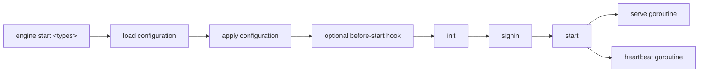
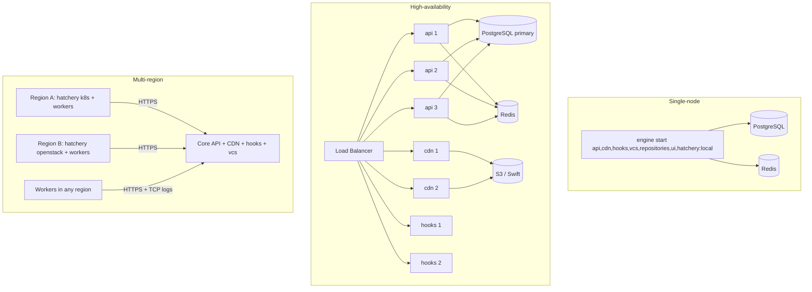
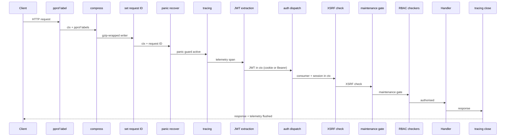
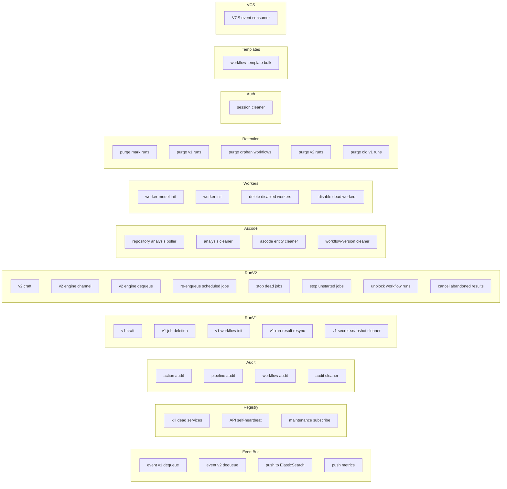

# Microservices and Topology

This document is the maintainer-level companion to
[`00-overview.md`](./00-overview.md). It deep-dives into each engine
service, the deployment shapes the platform supports, the lifecycle
of an HTTP request hitting the API, the way services authenticate to
each other, and the catalogue of background work the API service
runs.

Source code anchors. Bootstrap entry in `engine/main.go`. Service
dispatcher in `engine/cmd_start.go`. Service framework in
`engine/service/` (interface in `engine/service/types.go`, base in
`engine/service/service.go`). Common router and middleware chain in
`engine/api/router.go` and `engine/api/router_middleware*.go`. Public
auth types (`AuthConsumer`, `AuthUserConsumer`,
`AuthHatcheryConsumer`, `AuthConsumerScope*`, `Consumer*`) in
`sdk/token.go`. Context helpers in `engine/api/api_helper.go`. SDK
client factories (`NewServiceClient`, `NewHatcheryServiceClient`) in
`sdk/cdsclient/client.go`. API background work bootstrap in
`engine/api/api.go` (`api.Serve`).

## 1. Scope

**In scope** — Each engine service (api, cdn, hooks, vcs, repositories, hatchery × 5, worker, websocket, migrateservice, ui, elasticsearch); what each service talks to; PostgreSQL / Redis / object-store dependencies; the request lifecycle and middleware chain on the API; inter-service authentication (consumer types, scopes, JWT flows); named background work and the channels it consumes; operational considerations.

**Out of scope** — Workflow internals (see [`03-workflow-v1.md`](./03-workflow-v1.md), [`04-workflow-v2.md`](./04-workflow-v2.md)); run engine details (see [`07a-run-engine-v1.md`](./07a-run-engine-v1.md) and [`07b-run-engine-v2.md`](./07b-run-engine-v2.md)); authentication reference (see [`08-auth.md`](./08-auth.md)); RBAC reference (see [`09-rbac.md`](./09-rbac.md)); CDN storage units (see [`12-cdn-and-artifacts.md`](./12-cdn-and-artifacts.md)); VCS provider matrix (see [`13-vcs.md`](./13-vcs.md)); integrations (see [`14-integrations.md`](./14-integrations.md)).

## 2. Table of contents

1. [Scope](#1-scope)
2. [Table of contents](#2-table-of-contents)
3. [Common service framework](#3-common-service-framework)
4. [Service-by-service deep dive](#4-service-by-service-deep-dive)
5. [Deployment topology](#5-deployment-topology)
6. [Request lifecycle on the API service](#6-request-lifecycle-on-the-api-service)
7. [Inter-service authentication](#7-inter-service-authentication)
8. [Background work on the API](#8-background-work-on-the-api)
9. [Trigger channels on the API](#9-trigger-channels-on-the-api)
10. [Operational considerations](#10-operational-considerations)
11. [Cross-spec pointers](#11-cross-spec-pointers)

## 3. Common service framework

Every engine service is a Go binary built from `engine/main.go` and
dispatched by `engine start <service-type>` (`engine/cmd_start.go`).
The launcher parses the requested types, resolves each into a
`serviceConf`, then runs a deterministic lifecycle per service.

Every service implements `Service` (`engine/service/types.go`) with
methods: `ApplyConfiguration`, `Serve`, `CheckConfiguration`, `Start`,
`Init`, `Signin`, `Unregister`, `Heartbeat`, `Status`. The optional
`BeforeStart` hook runs after configuration but before serving.
Non-API services embed `service.Common` (`engine/service/service.go`)
which provides the shared `Heartbeat`: every 30 s,
`Client.ServiceHeartbeat(status(ctx))` publishes the status so the
API can mark the service alive in its registry. Services that die
without an explicit `Unregister` are reaped by
`services.KillDeadServices` on the API (see
[section 8](#8-background-work-on-the-api)).

The `Signin` step is the moment a service obtains its JWT against the
API: it calls `cdsclient.NewServiceClient` (or
`NewHatcheryServiceClient`) with a builtin token, receives a
`SessionToken`, and from then on every outgoing call includes
`Authorization: Bearer <token>`. This is detailed in
[section 7](#7-inter-service-authentication).

## 4. Service-by-service deep dive

The table below summarises every service shipped in the `engine`
binary. The "Consumer" column refers to the `ConsumerType` constants
defined in `sdk/token.go`.

| Service | Entry point | Config | Consumer | Dependencies |
| --- | --- | --- | --- | --- |
| api | `engine/api/api.go` (`Serve`) | `engine/api/api.go` (`Configuration`) | `ConsumerBuiltin` | PostgreSQL, Redis, object store, every other service over HTTP |
| cdn | `engine/cdn/cdn.go` (`Serve`) | `engine/cdn/types.go` | `ConsumerBuiltin` | PostgreSQL, Redis, storage units (S3, Swift, NFS, local, Redis, WebDAV) |
| hooks | `engine/hooks/hooks.go` (`Serve`) | `engine/hooks/types.go` | `ConsumerBuiltin` | Redis, API HTTP |
| vcs | `engine/vcs/vcs.go` (`Serve`) | `engine/vcs/types.go` | `ConsumerBuiltin` | Redis, VCS provider APIs, API HTTP |
| repositories | `engine/repositories/repositories.go` (`Serve`) | `engine/repositories/types.go` | `ConsumerBuiltin` | Redis, local filesystem, API HTTP |
| elasticsearch | `engine/elasticsearch/elasticsearch.go` (`Serve`) | `engine/elasticsearch/types.go` | `ConsumerBuiltin` | OpenSearch / Elasticsearch, optional Kafka, API HTTP |
| migrateservice | `engine/migrateservice/service.go` (`Serve`) | `engine/migrateservice/service.go` | none | PostgreSQL (api + cdn schemas) |
| ui | `engine/ui/ui.go` (`Serve`) | `engine/ui/types.go` | none | Static files, optional reverse proxy to api / hooks / cdn |
| hatchery local | `engine/hatchery/local/local.go` (`Serve`) | `engine/hatchery/local/types.go` | `ConsumerHatchery` | Local filesystem, API HTTP, CDN TCP / HTTP |
| hatchery kubernetes | `engine/hatchery/kubernetes/kubernetes.go` (`Serve`) | `engine/hatchery/kubernetes/types.go` | `ConsumerHatchery` | Kubernetes API, API HTTP, CDN |
| hatchery openstack | `engine/hatchery/openstack/openstack.go` (`Serve`) | `engine/hatchery/openstack/types.go` | `ConsumerHatchery` | OpenStack APIs (Keystone, Nova), API, CDN |
| hatchery swarm | `engine/hatchery/swarm/swarm.go` (`Serve`) | `engine/hatchery/swarm/types.go` | `ConsumerHatchery` | Docker Swarm socket, API, CDN |
| hatchery vsphere | `engine/hatchery/vsphere/hatchery.go` (`Serve`) | `engine/hatchery/vsphere/types.go` | `ConsumerHatchery` | vCenter API, API, CDN |
| worker | `engine/worker/main.go` | CLI flags + env | worker (implicit) | API HTTP, CDN |
| websocket | embedded in api (`engine/api/v2_websocket.go`, `engine/websocket/`) | embedded | n/a | Redis fan-out |

### 4.1 api

The API service is the source of truth: PostgreSQL state, the REST
router, the run engine, the run queues, the RBAC enforcer, the event
bus, and roughly 35 background goroutines (see
[section 8](#8-background-work-on-the-api)). The configuration struct
lives in `engine/api/api.go`. `Serve` (`engine/api/api.go`) is the
longest service `Serve` in the codebase: it warms defaults, loads
RSA keys, starts the websocket broker, initialises auth drivers
(local, LDAP, GitHub, GitLab, OIDC, Corporate SSO, Bitbucket Server,
Forgejo — see [`08-auth.md`](./08-auth.md)),
constructs the HTTP router via `InitRouter`
(`engine/api/api_routes.go`), then forks the background goroutines.

### 4.2 cdn

The CDN service ships logs, artifacts, and run-results. Logs arrive
over a dedicated TCP connection (`engine/cdn/cdn_log_tcp.go`), are
buffered in Redis, and are eventually persisted into one or more
storage units. Items (logs, artifacts) are tracked in PostgreSQL
(`engine/sql/cdn/`) and stored across a pluggable set of units
(`engine/cdn/storage/{s3,swift,nfs,local,redis,webdav,encryption}/`).
The router is in `engine/cdn/cdn_router.go`. Full details in
[`12-cdn-and-artifacts.md`](./12-cdn-and-artifacts.md).

### 4.3 hooks

The hooks service is the ingress for everything that triggers a run:
VCS webhooks per provider (`engine/hooks/github.go`,
`gitlab.go`, `bitbucket_server.go`, `gerrit.go`), Kafka consumers
(`kafka.go`), RabbitMQ consumers (`rabbitmq.go`), and Gerrit-style
pollers (`poller.go`). Schedulers (cron) are managed by
`engine/hooks/scheduler*.go`. It forwards matched events to the API,
which then enqueues a `V2WorkflowRunEnqueue`. Hook routing is split
into [`06a-hooks-v1.md`](./06a-hooks-v1.md) (legacy v1 hooks) and
[`06b-hooks-v2.md`](./06b-hooks-v2.md) (v2 hooks and shared
hooks-service architecture).

### 4.4 vcs

The vcs service abstracts the VCS providers. The same endpoint shape
(`/vcs/{name}/repos`, `/vcs/{name}/commits`, `/vcs/{name}/pullrequests`)
is implemented by every provider package
(`engine/vcs/{github,gitlab,bitbucketserver,bitbucketcloud,gerrit,gitea,forgejo}/`).
The router is in `engine/vcs/vcs_router.go`; the auth middleware in
`engine/vcs/vcs_auth.go`. Per-provider authentication models are
detailed in [`13-vcs.md`](./13-vcs.md).

### 4.5 repositories

The repositories service (`engine/repositories/`) caches Git
repository metadata locally so the API does not have to re-clone for
every operation. It exposes `/operations` and `/operations/{uuid}`
(`engine/repositories/repositories_router.go`) to drive long-running
clones, pushes, and tag operations. State lives on the service's
local filesystem (`Basedir`) plus Redis.

### 4.6 hatchery (five implementations)

A hatchery is a worker spawner. All five implementations satisfy
`sdk.hatchery.Interface` (`sdk/hatchery/types.go`) and share the
common server bootstrap (`engine/hatchery/serve.go`):

- `engine/hatchery/local/` — spawns workers as local processes.
- `engine/hatchery/kubernetes/` — schedules workers as pods.
- `engine/hatchery/openstack/` — boots Nova VMs.
- `engine/hatchery/swarm/` — runs workers as Docker Swarm tasks.
- `engine/hatchery/vsphere/` — clones VM templates in vCenter.

All five register to the API as `ConsumerHatchery` (`sdk/token.go`)
and consume the job queue on behalf of the workers they spawn.
Worker provisioning and `V2JobRunsOn` resolution are covered in
[`10-hatcheries.md`](./10-hatcheries.md); the worker binary in
[`11-workers.md`](./11-workers.md).

### 4.7 worker

The worker binary (`engine/worker/main.go`) is a dual-mode agent: it
understands both v1 jobs (`engine/worker/cmd_run.go`) and v2 jobs
(`engine/worker/v2_cmd_output.go`, `v2_cmd_result.go`). It receives
a short-lived JWT from its hatchery, registers against the API at
`/auth/consumer/worker/signin` (`postRegisterWorkerHandler`), polls
for jobs, clones the repository, runs steps, ships logs to CDN over
TCP, uploads run results, and reports status. The internal execution
helpers live in `engine/worker/internal/`.

### 4.8 websocket

The websocket surface is embedded in the API binary. Live event
streams are exposed at `/ws` (v1 legacy, `engine/api/websocket.go`),
`/v2/ws` (`engine/api/v2_websocket.go`), and `/v2/hatchery/ws`
(`engine/api/v2_hatchery_ws.go`). The standalone `engine/websocket/`
package is the broker variant used when the operator wants to scale
the websocket plane horizontally. See
[`18-ui.md`](./18-ui.md) for the
event catalogue.

### 4.9 elasticsearch

`engine/elasticsearch/elasticsearch.go` ingests events (`/events`,
`/v2/events`) and metrics (`/metrics`) from the API and pushes them
to an OpenSearch / ElasticSearch backend. When Kafka is configured
(`engine/elasticsearch/types.go`), job summary events are mirrored on
a Kafka topic for downstream consumers.

### 4.10 migrateservice

The migrate service (`engine/migrateservice/`) runs SQL schema
migrations against the api and cdn databases. It is the only service
that holds two `DBConfiguration` values simultaneously. It exposes
administrative endpoints under `/admin/database/migration*` and does
not authenticate against the API — it is meant to be invoked as a
one-shot orchestration step. See
[section 10.2](#102-schema-migrations-vs-data-migrations).

### 4.11 ui

The ui service (`engine/ui/`) serves the Angular static bundle and,
optionally, acts as a reverse proxy to the api, hooks, and cdn
services. It does not heartbeat to the API.

## 5. Deployment topology

CDS is shipped as a single Go binary that decides at runtime which service(s) to start, so the same artefact can be deployed in three canonical shapes.

The architecture is intentionally **stateless on every node**: nothing is persisted to the local filesystem on the api, hooks, vcs, websocket, or elasticsearch services. The CDN service keeps a hot cache on the local filesystem when the local storage unit is enabled, but the source of truth always lives in the configured persistent storage unit (S3, Swift, NFS, etc.). This is what makes rolling upgrades and horizontal scaling possible — see the four guiding principles in [`00-overview.md`](./00-overview.md).

Multi-region is realised by placing one or more hatcheries (and the workers they spawn) in each region while keeping a central api / cdn / hooks / vcs / repositories core. Each region is modelled in the database as a region object and hatcheries declare which region they serve. Region RBAC rules gate which projects can submit jobs to which region. See [`09-rbac.md`](./09-rbac.md).

## 6. Request lifecycle on the API service

This section traces an HTTP request from socket accept to handler invocation on the API service. The middleware chain is the same for every route; only the auth middleware can be overridden per route (e.g. signin endpoints use a no-auth middleware).

### 6.1 Router and framework

The router is built on top of `gorilla/mux`. The `*mux.Router` is
created in `engine/api/api.go` and wrapped in the internal `Router`
struct (`engine/api/router.go`) that adds the middleware pipeline. The
wiring happens in `InitRouter` (`engine/api/api_routes.go`):
`Middlewares` is appended with `tracingMiddleware` and `jwtMiddleware`;
`DefaultAuthMiddleware` is set to `authMiddleware`;
`PostAuthMiddlewares` is appended with `xsrfMiddleware` and
`maintenanceMiddleware`; `PostMiddlewares` is appended with
`service.TracingPostMiddleware`; and `EnforceScopes` is enabled.

Every route declaration enforces that the route has both a scope and
either a `PermissionLevel` or `RbacCheckers` — registering a route
without these gates panics at startup, so missing-authorisation bugs
cannot ship.

### 6.2 Middleware chain

References per stage:

| Stage | File |
| --- | --- |
| `pprofLabel` | `engine/api/router.go` |
| `compress` | `engine/api/router.go` |
| `setRequestID` | `engine/api/router.go` |
| `recoverWrap` | `engine/api/router.go` |
| `tracingMiddleware` | `engine/api/router_middleware_tracing.go` |
| `jwtMiddleware` | `engine/api/router_middleware_auth.go` |
| `authMiddleware` | `engine/api/router_middleware_auth.go` |
| `xsrfMiddleware` | `engine/api/router_middleware_auth.go` |
| `maintenanceMiddleware` | `engine/api/router_middleware.go` |
| `rbacMiddleware` (RBAC checkers) | `engine/api/router_middleware_rbac.go` |
| Handler invocation | `engine/api/router.go` |
| `TracingPostMiddleware` | `engine/service/router.go` |

The orchestration inside `handle` (`engine/api/router.go`) loops over
`Middlewares`, then runs `DefaultAuthMiddleware` (or the per-route
override), then `PostAuthMiddlewares`, then the handler, then
`PostMiddlewares`.

### 6.3 Auth flow

The API accepts a JWT either as a cookie (`jwt_token`) or as an
`Authorization: Bearer` header. Extraction is performed by
`engine/service/auth.go`, which writes three keys into the context:
`service.ContextJWTRaw`, `service.ContextJWT`,
`service.ContextJWTFromCookie`. JWT signature validation uses an RSA
key pair with multi-key rotation
(`engine/api/authentication/authentication.go` — `VerifyJWT` tries
every key newest-first), so the platform can rotate keys without
breaking in-flight sessions (see
[`08-auth.md`](./08-auth.md)).

After JWT parsing, `authMiddleware`
(`engine/api/router_middleware_auth.go`) calls
`authOptionalMiddleware`, then enforces the presence of a consumer,
then dispatches based on consumer type:

- `ConsumerHatchery` → `handleAuthMiddlewareHatcheryConsumer`.
- Every other consumer → `handleAuthMiddlewareUserConsumer`.

The branch sets either `contextUserConsumer` or
`contextHatcheryConsumer` plus, when the request comes from a worker,
`contextWorker`.

### 6.4 Scopes versus RBAC

Routes declare their required scope at registration time
(`engine/api/api_routes.go`) — for example, `/auth/me` is registered
with `Scope(sdk.AuthConsumerScopeUser)`.

The full `AuthConsumerScope*` list lives in `sdk/token.go`:
`AuthConsumerScopeUser`, `AuthConsumerScopeAccessToken`,
`AuthConsumerScopeAction`, `AuthConsumerScopeAdmin`,
`AuthConsumerScopeGroup`, `AuthConsumerScopeTemplate`,
`AuthConsumerScopeProject`, `AuthConsumerScopeRun`,
`AuthConsumerScopeRunExecution`, `AuthConsumerScopeHooks`,
`AuthConsumerScopeWorkerModel`, `AuthConsumerScopeHatchery`,
`AuthConsumerScopeService`. Scope enforcement is performed by
`engine/api/router_middleware_auth.go`: a logical OR over the
route-declared scopes intersected with the consumer's scopes
(`AuthConsumerScopeDetails`). An empty consumer scope set means "no
restriction".

RBAC enforcement runs separately, via the `RbacCheckers` registered
per handler and looped in
`engine/api/router_middleware_rbac.go`. Admin consumers bypass RBAC
after `trackSudo` (`engine/api/api_helper.go`) logs the override.

**Scopes and RBAC are cumulative**: a request must pass both gates.
Scopes give coarse-grained capability; RBAC gives fine-grained
resource permission.

### 6.5 Context propagation

The API uses typed private keys for context propagation
(`engine/api/router_context.go`). The `contextKey` enum carries:
`contextClaims`, `contextSession`, `contextUserConsumer`,
`contextHatcheryConsumer`, `contextDriverManifest`, `contextDate`,
`contextWorker`.

Each middleware stage populates one or more keys; handlers extract
them through helpers in `engine/api/api_helper.go`:

| Helper | Returns |
| --- | --- |
| `getUserConsumer(ctx)` | `*sdk.AuthUserConsumer` |
| `getHatcheryConsumer(ctx)` | `*sdk.AuthHatcheryConsumer` |
| `getWorker(ctx)` | `*sdk.V2Worker` |
| `getAuthSession(ctx)` | `*sdk.AuthSession` |
| `getAuthClaims(ctx)` | `*sdk.AuthSessionJWTClaims` |
| `isAdmin(ctx)` | `bool` |
| `isMaintainer(ctx)` | `bool` |
| `isService(ctx)` | `bool` |
| `isWorker(ctx)` | `bool` |
| `isHatchery(ctx)` | `(bool, error)` |
| `isCDN(ctx)` | `bool` |
| `isMFA(ctx)` | `bool` |
| `trackSudo(ctx, w)` | `void` |

Logging fields (`cdslog.RequestID`, `cdslog.AuthConsumerID`,
`cdslog.AuthUserID`, `cdslog.AuthWorkerName`, etc.) are written into
the context alongside the typed keys so every log line carries the
request identity.

### 6.6 Telemetry

OpenCensus tracing wraps every handler. `tracingMiddleware`
(`engine/api/router_middleware_tracing.go`) opens the span;
`TracingPostMiddleware` (`engine/service/router.go`) closes it.
Throughout the request lifecycle, the router records four counters
and a latency histogram declared at `engine/api/router.go` (`Hits`,
`Errors`, `ServerRequestCount`, `ServerLatency`) and emits them on
every transition. The main router span is named `router.handle`.

## 7. Inter-service authentication

CDS does not use a sidecar mesh: every cross-service call is an HTTP call carrying a JWT. The kind of JWT and the way it is obtained depend on who is calling.

### 7.1 Consumer types

The `ConsumerType` constants are defined in `sdk/token.go`:

| Constant | Used by |
| --- | --- |
| `ConsumerLocal`, `ConsumerGithub`, `ConsumerGitlab`, `ConsumerOIDC`, `ConsumerCorporateSSO`, `ConsumerLDAP`, … | Real users authenticating through the corresponding driver |
| `ConsumerBuiltin` | Long-lived PATs and the consumers used by every service (api, cdn, hooks, vcs, repositories, elasticsearch) |
| `ConsumerHatchery` | One per hatchery instance |
| (implicit `worker`) | Workers are authenticated via a JWT signed by their hatchery, not via a server-side consumer |
| `AuthConsumerScopeService` | Scope marker for service-targeted endpoints |

### 7.2 Caller-to-callee matrix

| Caller | Callee | Auth header | Token issuer | Validator |
| --- | --- | --- | --- | --- |
| worker | api (heartbeat, dequeue, output) | `Bearer <JWT>` | hatchery (RSA signed with hatchery private key) | `engine/api/authentication/worker/worker.go` |
| hatchery | api (signin) | builtin token in body | admin or platform-issued builtin token | `engine/api/v2_hatchery.go` |
| hatchery | api (heartbeat, spawn) | `Bearer <SessionToken>` | api at signin time | `authMiddleware` |
| hooks | api (repository event callback) | signed JWS in payload | project key | `postHookEventRetrieveSignKeyHandler` (`engine/api/v2_hooks.go`) |
| cdn, vcs, repositories, elasticsearch | api | `Bearer <SessionToken>` | api at signin time | `authMiddleware` |
| cdsctl / UI (interactive) | api | cookie `jwt_token` or `Bearer <SessionToken>` | api after driver signin | `authMiddleware` |
| cdsctl (PAT) | api | `Bearer <BuiltinConsumerAuthenticationToken>` | builtin token (long-lived) | `engine/api/authentication/builtin/builtin.go` |

### 7.3 JWT flows per consumer type

**Worker JWT (v2).** The hatchery mints a `WorkerJWTClaimsV2` token
(`sdk/hatchery/`) signed with its own RSA private key. The worker
presents this token to the API on every call. The API parses the
unsigned claims to extract `Worker.HatcheryName`, loads the hatchery
via `services.LoadByNameAndType`, fetches its public key, and verifies
the RSA signature (`engine/api/authentication/worker/worker.go`). The
token has a 24-hour lifetime.

**Hatchery session JWT.** At startup the hatchery calls
`cdsclient.NewHatcheryServiceClient` (`sdk/cdsclient/client.go`)
which POSTs `/v2/auth/consumer/hatchery/signin` with a builtin token
in the body. The API responds with
`AuthConsumerHatcherySigninResponse.Token` (a JWS signed with the
API RSA key). The hatchery then includes that token on every
subsequent request.

**Service builtin JWT.** Other services follow a similar flow with
`cdsclient.NewServiceClient` hitting `/auth/consumer/builtin/signin`
and receiving a session token.

**User session JWT.** Each driver (`local`, `github`, `gitlab`,
`oidc`, `corpsso`, `bitbucketserver`, `forgejo`, …) returns a
`SessionToken` after `/auth/consumer/{driver}/signin`. The API stores
the session, the consumer, and the JWT serial; the `SessionCleaner`
goroutine expires sessions.

**Personal access token.** A user or admin can mint a builtin
consumer. The resulting `BuiltinConsumerAuthenticationToken` is the
long-lived equivalent of a session token and is verified by
`engine/api/authentication/builtin/builtin.go`.

## 8. Background work on the API

The API runs a fixed set of long-running goroutines. They follow three patterns:

- **Channel-driven** — block on an in-process channel populated by an HTTP handler or by another goroutine.
- **Subscriber** — listen on Redis pub/sub (events, maintenance flag).
- **Ticker** — wake on a periodic timer (purge, cleanup, audit batches).

A restart-on-failure wrapper bounds the blast radius of a transient failure: a goroutine that returns an error gets restarted, but a goroutine receiving context cancellation propagates the cancellation upward and exits cleanly.

The catalogue, grouped by concern:

### 8.2 Exhaustive table

| Goroutine | File | Trigger | Purpose |
| --- | --- | --- | --- |
| `event.dequeue` | `engine/api/api.go` | Redis dequeue, 250 ms timeout | Drain SDK v1 events to subscribers |
| `event_v2.dequeue` | `engine/api/api.go` | Redis dequeue | Drain SDK v2 events to UI websockets |
| `maintenance.Subscribe` | `engine/api/api.go` | Redis pub/sub | React to maintenance flag toggle |
| `workermodel.Initialize` | `engine/api/api.go` | One-shot at startup | Warm worker-model cache |
| `worker.Initialize` | `engine/api/api.go` | One-shot at startup | Sync existing worker state |
| `action.ComputeAudit` | `engine/api/api.go` | Event subscription | Record action audit trail |
| `audit.ComputePipelineAudit` | `engine/api/api.go` | Ticker | Batch pipeline audits |
| `audit.ComputeWorkflowAudit` | `engine/api/api.go` | Ticker | Batch workflow audits |
| `auditCleanerRoutine` | `engine/api/audit.go` | Ticker (1 min) | Purge expired audits |
| `repositoriesmanager.ReceiveEvents` | `engine/api/api.go` | Event channel | Receive VCS webhook payloads |
| `services.KillDeadServices` | `engine/api/api.go` | Ticker | Mark stale services |
| `serviceAPIHeartbeat` | `engine/api/api.go` | Ticker | Publish API own heartbeat |
| `authentication.SessionCleaner` | `engine/api/authentication/session.go` | Ticker (10 s) | Drop expired sessions |
| `WorkflowRunCraft` | `engine/api/workflow_run_craft.go` | Ticker (100 ms) | Craft v1 runs from queue |
| `WorkflowRunJobDeletion` | `engine/api/api.go` | Ticker | Delete finished v1 jobs in batches |
| `V2WorkflowRunCraft` | `engine/api/v2_workflow_run_craft.go` | `workflowRunCraftChan` + 10 s Redis-polling fallback | Resolve v2 entities and materialise DAG |
| `V2WorkflowRunEngineChan` | `engine/api/v2_workflow_run_engine.go` | `workflowRunTriggerChan` | Consume v2 run triggers |
| `V2WorkflowRunEngineDequeue` | `engine/api/v2_workflow_run_engine.go` | Redis polling | Pop v2 enqueued runs |
| `ReEnqueueScheduledJobs` | `engine/api/v2_workflow_run_job_routines.go` | Ticker (1 min) | Re-enqueue v2 jobs older than `JobSchedulingTimeout` (default 600 s) |
| `StopDeadJobs` | `engine/api/v2_workflow_run_job_routines.go` | Ticker (1 min) | Time out v2 jobs |
| `StopUnStartedJobs` | `engine/api/v2_workflow_run_job_routines.go` | Ticker (1 min) | Time out v2 jobs older than `JobWaitingTimeout` (default 3600 s) |
| `TriggerBlockedWorkflowRuns` | `engine/api/v2_workflow_run_engine.go` | Ticker (1 min) | Re-enqueue runs blocked by workflow-level concurrency for slot re-evaluation |
| `CancelAbandonnedRunResults` | `engine/api/v2_workflow_run_job_routines.go` | Ticker (5 min) | Cancel orphaned run-results |
| `repositoryAnalysisPoller` | `engine/api/v2_repository_analyze.go` | Ticker (5 s) | Drive ascode repository analyses |
| `cleanRepositoryAnalysis` | `engine/api/v2_repository_analyze.go` | Ticker (1 h) | Purge old analyses |
| `workflow.ResyncWorkflowRunResultsRoutine` | `engine/api/api.go` | Ticker (5 s) | Reconcile v1/v2 run-results between DB and cache |
| `project.CleanAsCodeEntities` | `engine/api/v2_project_clean_ascode.go` | Retention config | Garbage-collect ascode entities |
| `project.CleanWorkflowVersion` | `engine/api/v2_project_clean_ascode.go` | Ticker | Drop expired workflow versions |
| `worker.DeleteDisabledWorkers` | `engine/api/clean_worker.go` | Ticker (10 s) | Delete workers marked disabled |
| `worker.DisabledDeadWorkers` | `engine/api/clean_worker.go` | Ticker (1 min) | Mark dead workers as disabled |
| `workflow.CleanSecretsSnapshot` | `engine/api/api.go` | Retention config | Drop expired secret snapshots |
| `WorkflowTemplateBulk` | `engine/api/api.go` | Channel + ticker (100 ms) | Process workflow-template bulk ops |
| `workflow.Initialize` | `engine/api/api.go` | One-shot + ticker | Bring v1 workflows back to a coherent state on boot |
| `PushInElasticSearch` | `engine/api/api.go` | Run | Push events to ElasticSearch |
| `Metrics.pushInElasticSearch` | `engine/api/api.go` | Run | Push metrics to ElasticSearch |
| `Purge-MarkRuns` | `engine/api/purge/` | Run | Mark runs eligible for purge |
| `Purge-Runs` | `engine/api/purge/` | Run | Delete marked v1 runs |
| `Purge-Workflow` | `engine/api/purge/` | Run | Drop orphan workflows |
| `Purge-Runs-V2` | `engine/api/purge/purge_v2.go` | Run | Apply v2 run retention |
| `Purge-OldRunsV1` | `engine/api/purge/purge_workflow_run_v1.go` | Run | Mark stale v1 runs for purge |

## 9. Channels on the API struct

Two channels declared on the `API` struct (`engine/api/api.go`) are
the seam between HTTP handlers and the run engine. Both feed v2 only.

| Channel | Type | Producer | Consumer |
| --- | --- | --- | --- |
| `workflowRunCraftChan` | `chan string` | `postWorkflowRunV2Handler` (`engine/api/v2_workflow_run.go`) | `V2WorkflowRunCraft` (`engine/api/v2_workflow_run_craft.go`) |
| `workflowRunTriggerChan` | `chan sdk.V2WorkflowRunEnqueue` | `workflowRunV2Trigger` (`engine/api/v2_workflow_run_engine.go`) | `V2WorkflowRunEngineChan` (`engine/api/v2_workflow_run_engine.go`) |

Both channels are buffered (`workflowRunCraftChan` size 50,
`workflowRunTriggerChan` size 1, allocated in
`engine/api/api.go:972-973`): producers don't block until the buffer
fills, after which the HTTP handler is throttled. Once the buffer is
full, producers fall back to a Redis queue (`WorkflowEngineKey`) which
covers restart scenarios as well; `V2WorkflowRunEngineDequeue` drains
it at 250 ms intervals.

## 10. Operational considerations

### 10.1 Graceful shutdown

Every service has its own `Serve` returning when the parent context
is cancelled, and `Unregister` is called by the framework on shutdown
(see `engine/cmd_start.go`). The `RunWithRestart` helper bounds the
restart blast radius: a goroutine that returns an error gets
restarted, but a goroutine receiving a context cancellation
propagates the cancellation upward and exits cleanly.

### 10.2 Schema migrations vs data migrations

CDS has three concepts that look similar and are easy to confuse:

- **Schema migrations** — Numbered SQL files in `engine/sql/api/`
  and `engine/sql/cdn/`. Applied by the `migrateservice` against the
  api and cdn databases.
- **Data migrations** — Go functions in `engine/api/migrate/`.
  One-shot data fixes run by the API on demand or at startup. Not a
  place to put structural changes.
- **Migrate service** — The standalone binary at
  `engine/migrateservice/` that runs the schema migrations. Distinct
  from `engine/api/migrate/`.

### 10.3 Configuration loading

All services load their configuration from a TOML file (`--config`),
a Consul KV (`--remote-config`), Vault (`--vault-addr`,
`--vault-token`), or environment variables prefixed with `CDS_`. The
loader is `engine/config.go` and the generation of the canonical TOML
scaffolding is `engine/cmd_config.go`. The api configuration struct
sits in `engine/api/api.go`.

### 10.4 Restart semantics

The platform's stateless design means that any api, cdn, hooks, vcs,
repositories, websocket, or elasticsearch instance can be restarted
at any time without losing user state. State that does need to
survive lives in PostgreSQL, Redis, or the configured object store.
Long-running operations (repository analyses, run crafting, run
engine) are designed to be resumable: the polling and ticker
goroutines pick up unfinished work on the next tick.

A long-lived `Crafting` or `Building` v2 run is kept moving by the
goroutines in [section 8](#8-background-work-on-the-api)
(`StopDeadJobs`, `StopUnStartedJobs`, `ReEnqueueScheduledJobs`); a run
blocked by a workflow-level concurrency rule is re-evaluated by
`TriggerBlockedWorkflowRuns`. A v1 run stuck in `Pending` is re-driven
by `WorkflowRunCraft`. There is no leader election: every api replica
runs the full goroutine set, and concurrency on shared work is
mediated through PostgreSQL row locks or Redis distributed locks
(`engine/cache/`).

## 11. Cross-spec pointers

- Project, organization, groups, regions, integrations, variable sets → [`02-project-and-tenancy.md`](./02-project-and-tenancy.md)
- Workflow v1 internal model and DAG walker → [`03-workflow-v1.md`](./03-workflow-v1.md)
- Workflow v2 YAML model, expressions, gates, matrix → [`04-workflow-v2.md`](./04-workflow-v2.md)
- Ascode entities and repository analysis → [`05-ascode-entities.md`](./05-ascode-entities.md)
- V1 hooks internals (`Task` / `TaskExecution`, `/webhook` and `/task/*` routes, Kafka / RabbitMQ / Gerrit listeners) → [`06a-hooks-v1.md`](./06a-hooks-v1.md)
- V2 hooks internals (per-provider parsers, schedulers, `HookRepositoryEvent` lifecycle, shared hooks-service architecture) → [`06b-hooks-v2.md`](./06b-hooks-v2.md)
- V1 run engine (legacy `WorkflowRun`, process engine, retention) → [`07a-run-engine-v1.md`](./07a-run-engine-v1.md)
- V2 run engine (craft + engine, state machine, retry, concurrency) → [`07b-run-engine-v2.md`](./07b-run-engine-v2.md)
- Authentication drivers, sessions, JWT, scopes, link → [`08-auth.md`](./08-auth.md)
- RBAC v2 → [`09-rbac.md`](./09-rbac.md)
- Hatcheries: contract, the five implementations, region binding, worker-model dispatch → [`10-hatcheries.md`](./10-hatcheries.md)
- Worker binary, in-worker execution, plugin invocation, log streaming → [`11-workers.md`](./11-workers.md)
- CDN service, items, storage units, log streaming, run-results → [`12-cdn-and-artifacts.md`](./12-cdn-and-artifacts.md)
- VCS providers, link system, commit status → [`13-vcs.md`](./13-vcs.md)
- Integrations (`IntegrationModel`, types matrix) → [`14-integrations.md`](./14-integrations.md)
- cdsctl → [`15-cli.md`](./15-cli.md)
- Go SDK → [`16-sdk.md`](./16-sdk.md)
- gRPC plugins → [`17-plugins.md`](./17-plugins.md)
- UI structure and websocket events → [`18-ui.md`](./18-ui.md)
- Glossary, statuses, events, expression language, contexts → [`19-glossary-and-cross-references.md`](./19-glossary-and-cross-references.md)
