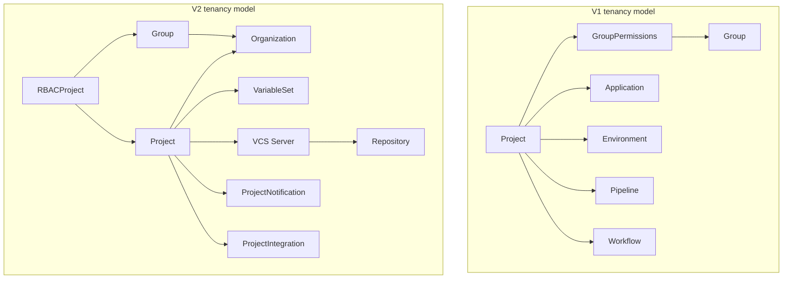
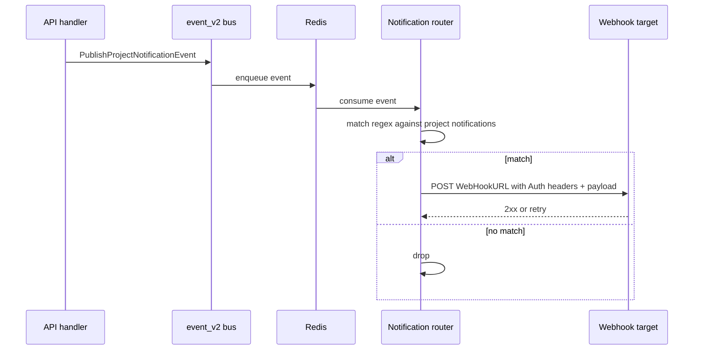

# Project, Organization, Groups, Multi-Tenancy

This document is the tenancy spec of the CDS series (see the full index
in [`00-overview.md`](./00-overview.md)). It describes the data
structures that make CDS multi-tenant: how a `Project` is shaped, what
an `Organization` adds on top, how groups carry permissions in v1 and
how RBAC replaces them in v2, how project-scoped objects (keys,
integrations, VCS servers, repositories, variables, notifications) are
attached, and how regions bind projects to hatcheries.

Source code anchors. Public types live in `sdk/`: `Project`
(`sdk/project.go`), `Organization` (`sdk/organization.go`), `Group`
(`sdk/group.go`), `ProjectKey` / `ApplicationKey` / `EnvironmentKey`
(`sdk/key.go`), `VCSProject` and `VCSAuthProject` and `VCSOptionsProject`
(`sdk/vcs.go`), `ProjectRepository` (`sdk/repository.go`),
`IntegrationModel` / `ProjectIntegration` (`sdk/integration.go`),
`ProjectVariableSet` / `ProjectVariableSetItem` (`sdk/project_variable.go`),
`Region` (`sdk/region.go`), `ProjectNotification` (`sdk/notification.go`),
`RBACProject` / `RBACRegion` / `RBACVariableSet` / `RBACRegionProject`
(`sdk/rbac_*.go`). API handlers live under `engine/api/v2_project_*.go`,
`engine/api/v2_region.go`, `engine/api/v2_project_variable*.go`.

## 1. Scope

**In scope** — `Project` (the tenant container); `Organization`;
groups (`Group`, `GroupPermission`) and group permissions (v1) versus
RBAC (v2); project keys (PGP / SSH at project / application /
environment levels — `KeyTypeSSH`, `KeyTypePGP`); project-scoped
integrations and their builtin models; VCS servers and project
repositories attached to a project (v2); variables (project /
application / environment in v1) versus `ProjectVariableSet` (v2);
variable migration v1 → v2; regions; project notifications (v2).

**Out of scope** — Workflows (see [`03-workflow-v1.md`](./03-workflow-v1.md),
[`04-workflow-v2.md`](./04-workflow-v2.md)); ascode entities and
repository analysis (see [`05-ascode-entities.md`](./05-ascode-entities.md));
the full RBAC rule matrix (see [`09-rbac.md`](./09-rbac.md));
VCS provider implementations (see [`13-vcs.md`](./13-vcs.md));
integration model details (see [`14-integrations.md`](./14-integrations.md));
hatchery internals (see [`10-hatcheries.md`](./10-hatcheries.md));
worker internals (see [`11-workers.md`](./11-workers.md)).

## 2. Table of contents

1. [Scope](#1-scope)
2. [Table of contents](#2-table-of-contents)
3. [Project: the tenant container](#3-project-the-tenant-container)
4. [Organization](#4-organization)
5. [Groups: v1 permissions and v2 references](#5-groups-v1-permissions-and-v2-references)
6. [Project keys (PGP / SSH)](#6-project-keys-pgp--ssh)
7. [VCS servers and project repositories (v2)](#7-vcs-servers-and-project-repositories-v2)
8. [Integrations](#8-integrations)
9. [Variables: v1 hierarchy versus VariableSet (v2)](#9-variables-v1-hierarchy-versus-variableset-v2)
10. [Variable migration v1 to v2](#10-variable-migration-v1-to-v2)
11. [Regions](#11-regions)
12. [Project notifications (v2)](#12-project-notifications-v2)
13. [Cross-spec pointers](#13-cross-spec-pointers)

## 3. Project: the tenant container

A `Project` is the top-level multi-tenancy boundary in CDS. Every
workflow, pipeline, application, environment, integration, key, VCS
server, repository, variable set, and notification is owned by exactly
one project. The type lives in `sdk/project.go`.

A project carries:

| Aspect | Description |
| --- | --- |
| Identity | A numeric `ID`, a unique human-readable `Key` (upper-case alphanumeric matching `ProjectKeyPattern`, immutable), a `Name`, and a `Description`. |
| Tenancy link | An `Organization` reference (v2). |
| Aggregates | `Workflows`, `Pipelines`, `Applications`, `Environments`, `Integrations`, `Keys`, `VCSServers`, variables / variable sets, `Labels`, notifications. Aggregates are loaded on demand, not implicitly. |
| Access control | `GroupPermissions` (v1) and RBAC rules (v2). |
| Metadata | Free-form `Metadata` map and a `Features` flag map. |

The project `Key` is the human-readable identifier used in REST URLs
(`/project/{projectKey}/…`, `/v2/project/{projectKey}/…`) and in the
runtime context (`${{ cds.project_key }}` in v2). It is upper-case
alphanumeric and immutable after creation.

### 3.1 Loading and lifecycle

Project CRUD is split between two route trees:

| Concern | v1 route (`engine/api/project.go`) | v2 route (`engine/api/v2_project.go`) |
| --- | --- | --- |
| Create | `POST /project` | `POST /v2/project` |
| List | `GET /project` | `GET /v2/project` (RBAC-filtered) |
| Read | `GET /project/{projectKey}` | `GET /v2/project/{projectKey}` |
| Delete | `DELETE /project/{projectKey}` | `DELETE /v2/project/{projectKey}` |

Aggregates (workflows, pipelines, etc.) are loaded only when the caller
asks for them through query options on the DAO — fetching a project
does not implicitly fetch its workflows.

### 3.2 Lookups on a project

The `Project` type exposes typed lookup helpers (in `sdk/project.go`):
`IsValid()`, `GetSSHKey(name)` / `SSHKeys()`, `PGPKeys()`,
`GetIntegration(name)` / `GetIntegrationByID(id)`, `ProjectsToIDs`.
`GroupPermissions.ComputeOrganization` enforces, at project creation,
that every group attached with a permission stronger than read belongs
to the same organization as the project.

### 3.3 Multi-tenancy diagram



## 4. Organization

Organizations are a v2-only concept (`Organization` in
`sdk/organization.go`). They are the RBAC scope **above** the project:
a project belongs to one organization, and a user / group can only
carry write permission on a project if it belongs to the same
organization. The struct is intentionally minimal — a UUID and a unique
name — and rows are stored with `SignedEntity` so a tampered row is
detectable on read (see `engine/api/organization/gorp_model.go`).

### 4.1 Routes

Handlers in `engine/api/v2_organization.go`.

| Route | Method | Handler | RBAC |
| --- | --- | --- | --- |
| `/v2/organization` | POST | `postOrganizationHandler` | `GlobalRoleManageOrganization` |
| `/v2/organization` | GET | `getOrganizationsHandler` | list-filtered |
| `/v2/organization/{organizationIdentifier}` | GET | `getOrganizationHandler` | list-filtered |
| `/v2/organization/{organizationIdentifier}` | DELETE | `deleteOrganizationHandler` | `GlobalRoleManageOrganization` |

### 4.2 Relation with groups and projects

`Group.Organization` (`sdk/group.go`) and `Project.Organization` are
the linkage points. `GroupPermissions.ComputeOrganization`
(`sdk/project.go`) walks every group with permission > read and rejects
any organization mismatch. The check runs at every project mutation
that touches its group ACLs, not just at creation.

## 5. Groups: v1 permissions and v2 references

Groups (`Group` in `sdk/group.go`) exist in both generations with
different roles. The shape is shared: a `Name`, a `Members` set
(`GroupMember` carrying username, full name, organization, admin flag),
and an `Organization` reference (used in v2 for tenancy alignment).

The builtin **shared infrastructure** group `SharedInfraGroupName`
(`shared.infra`, in `sdk/group.go`) is a special-case identity: it is
the implicit owner for resources not bound to any user-defined group.

### 5.1 Permission levels (v1)

V1 wires authorisation through `GroupPermission` rows on every protected
entity (project, workflow). Three numeric levels (constants in
`sdk/group.go`):

| Constant | Value | Meaning |
| --- | --- | --- |
| `PermissionRead` | 4 | View only |
| `PermissionReadExecute` | 5 | View and trigger runs |
| `PermissionReadWriteExecute` | 7 | Full management |

Persistence: `LinkGroupProject` (`engine/api/group/gorp_model.go`) ties
`(group_id, project_id, role)`. The default group can only be granted
read on a project — the check is in `engine/api/project_group.go`.

V1 routes for groups and project group attachments:

| Route | Method | Purpose |
| --- | --- | --- |
| `/group` | GET | List groups |
| `/group/{name}` | GET | Read one group |
| `/admin/group` | POST | Admin: create a group |
| `/project/{key}/groups/{groupName}` | PUT | Attach a group with a permission level |
| `/project/{key}/groups/{groupName}` | DELETE | Detach a group |

### 5.2 Groups in v2

V2 does not encode authorisation in `GroupPermission`. Instead it stores
RBAC rules per scope (project, region, workflow, variableset, hatchery,
global) — see [`09-rbac.md`](./09-rbac.md). Groups
still exist as identity sets and are referenced from RBAC rules by name
(`RBACGroupsName`) or by ID (`RBACGroupsIDs`).

The summary of effective permissions for a group is served at
`GET /v2/group/{name}/permission`
(`engine/api/v2_group_permission.go`). The exhaustive role catalogue
(`ProjectRoleRead`, `ProjectRoleManage`, `ProjectRoleManageNotification`,
`ProjectRoleManageWorkerModel`, `ProjectRoleManageAction`,
`ProjectRoleManageWorkflow`, `ProjectRoleManageWorkflowTemplate`,
`ProjectRoleManageVariableSet`) is in `sdk/rbac.go`.

## 6. Project keys (PGP / SSH)

Keys are a **both** feature: the data model is the same in v1 and v2,
only the management endpoints differ. CDS supports two key types
(`KeyTypeSSH = "ssh"`, `KeyTypePGP = "pgp"`, in `sdk/key.go`) at three
scopes: Project, Application, Environment.

### 6.1 Shape

A scoped key (`ProjectKey`, `ApplicationKey`, `EnvironmentKey` in
`sdk/key.go`) carries an `ID` and `Name`, the public material in clear,
the private material encrypted at rest, plus key-id metadata (`KeyID`,
`LongKeyID` for PGP) and ownership pointers (project / application /
environment ID). A `Builtin` flag distinguishes platform-seeded keys
from operator-created ones, and a `Disabled` flag lets operators revoke
a key without deleting it.

Private material carries the gorp tag `gorpmapping:"encrypted,ID,Name"`;
decryption only happens when the run engine assembles a worker context.
The default name is generated by `GenerateProjectDefaultKeyName`
(`sdk/key.go`) following `proj-{type}-{lowercasekey}`.

### 6.2 v2 endpoints

Handlers in `engine/api/v2_project_keys.go`.

| Route | Method | Handler | RBAC |
| --- | --- | --- | --- |
| `/v2/project/{projectKey}/keys` | GET | `getProjectKeysHandler` | `projectRead` |
| `/v2/project/{projectKey}/keys` | POST | `postProjectKeyHandler` | `projectManage` |
| `/v2/project/{projectKey}/keys/{name}` | DELETE | `deleteProjectKeyHandler` | `projectManage` |

Creation logic:

1. Validate the name against `NamePattern`.
2. Auto-prefix `proj-` if absent.
3. Generate the key pair: `keys.GeneratePGPKeyPair` for PGP,
   `keys.GenerateSSHKey` for SSH (`engine/api/keys/`).
4. Persist the public material in clear and the private material
   encrypted, with an integrity envelope on the row.

Deletion refuses to drop an SSH key that is still referenced by a VCS
server — this prevents a project from being silently locked out of its
repositories.

### 6.3 Worker-side usage

Keys are exposed to a running worker through the job context. SSH keys
are used for `git clone` over SSH; PGP keys are used for tag signing
and artifact signing. The helpers `GetSSHKey`, `SSHKeys`, `PGPKeys` (on
`Project`) are called by the run engine when materialising the job
context. See [`11-workers.md`](./11-workers.md).

## 7. VCS servers and project repositories (v2)

A v2 project that wants to consume ascode content must declare two
things in order: a **VCS server** (`VCSProject`, an authenticated
connection to GitHub / GitLab / Bitbucket Server / Bitbucket Cloud /
Gerrit / Gitea / Forgejo) and one or more **repositories**
(`ProjectRepository`) under that VCS server.

### 7.1 VCS server attached to a project

`VCSProject` (`sdk/vcs.go`) carries:

| Field | Purpose |
| --- | --- |
| `Name` | Local identifier inside the project |
| `Type` | Provider family — one of `VCSTypeGithub`, `VCSTypeGitlab`, `VCSTypeBitbucketServer`, `VCSTypeBitbucketCloud`, `VCSTypeGerrit`, `VCSTypeGitea`, `VCSTypeForgejo` |
| `URL` | Provider base URL |
| `Auth` | `VCSAuthProject` (user, token, SSH and GPG keys), encrypted at rest |
| `Options` | `VCSOptionsProject` (webhook delivery, polling, etc.) |
| `Description` | Free-form metadata |

Routes (handlers in `engine/api/v2_project_vcs.go`):

| Route | Method | RBAC |
| --- | --- | --- |
| `/v2/project/{projectKey}/vcs` | GET | `projectRead` |
| `/v2/project/{projectKey}/vcs` | POST | `projectManage` |
| `/v2/project/{projectKey}/vcs/{vcsIdentifier}` | GET | `projectRead` |
| `/v2/project/{projectKey}/vcs/{vcsIdentifier}` | PUT | `projectManage` |
| `/v2/project/{projectKey}/vcs/{vcsIdentifier}` | DELETE | `projectManage` |

On create and update, the handler calls `vcsProject.Lint(*project)` and
probes the credentials via `repositoriesmanager.AuthorizedClient` so a
configuration that cannot actually reach the provider is rejected at
write time rather than discovered at runtime.

### 7.2 Project repository

`ProjectRepository` (`sdk/repository.go`) is owned by a VCS server. It
carries the fullname (`owner/name`), a `ProjectRepositoryAnalysis`
state, and `ProjectRepositoryData` (default branch, discovered ascode
entities).

Routes (handlers in `engine/api/v2_project_repository.go`):

| Route | Method | RBAC |
| --- | --- | --- |
| `/v2/project/{projectKey}/vcs/{vcsIdentifier}/repository` | POST | `projectManage` |
| `/v2/project/{projectKey}/vcs/{vcsIdentifier}/repository` | GET | `projectRead` |
| `/v2/project/{projectKey}/vcs/{vcsIdentifier}/repository/{repositoryIdentifier}` | GET | `projectRead` |
| `/v2/project/{projectKey}/vcs/{vcsIdentifier}/repository/{repositoryIdentifier}` | DELETE | `projectManage` |
| `…/analysis` | POST/GET | `projectManage` / `projectRead` |
| `…/entities` | GET | `projectRead` |

Creation does three things: insert the row, probe the repo through the
VCS client (`vcsClient.RepoByFullname`), and enqueue an initial
analysis on the default branch. The analysis discovers and persists
ascode entities (`Workflow`, `Action`, `WorkerModel`,
`WorkflowTemplate`) — see [`05-ascode-entities.md`](./05-ascode-entities.md).

## 8. Integrations

A project integration attaches an external system (Kubernetes,
OpenStack, Artifactory, AWS, Kafka, RabbitMQ, etc.) to the project so
workflows can deploy to it, store artifacts in it, or receive events
from it.

### 8.1 Data model

Three concepts cooperate (in `sdk/integration.go`):

| Concept | Type | Role |
| --- | --- | --- |
| Integration model | `IntegrationModel` | Abstract description of a system (one per kind). Declares which capability buckets it supports through booleans: `Hook`, `Storage`, `Deployment`, `Compute`, `Event`, `ArtifactManager`. |
| Project integration | `ProjectIntegration` | An instance attached to a project. Carries its model, a name, and a `IntegrationConfig`. |
| Integration config | `IntegrationConfig` (map of `IntegrationConfigValue`) | Name → typed value with a description. Sensitive entries are encrypted at rest. |

Capability buckets are summarised by five integration-type categories
(`IntegrationType*` constants in `sdk/integration.go`):
`IntegrationTypeEvent`, `IntegrationTypeCompute`, `IntegrationTypeHook`,
`IntegrationTypeStorage`, `IntegrationTypeDeployment`.

### 8.2 Builtin models

Five integration models are seeded by the API at boot in
`engine/api/integration/builtin.go` via `CreateBuiltinModels`:

| Identifier | Source | Capabilities |
| --- | --- | --- |
| Kafka | `sdk.KafkaIntegration` | hook, event |
| RabbitMQ | `sdk.RabbitMQIntegration` | hook |
| OpenStack | `sdk.OpenstackIntegration` | storage, hook |
| Artifactory | `sdk.ArtifactoryIntegration` | artifact-manager |
| AWS | `sdk.AWSIntegration` | storage |

Custom models can be registered through the gRPC plugin protocol
(`sdk/grpcplugin/`) or via the admin API. DAO calls: `LoadModels`,
`InsertModel` in `engine/api/integration/dao_model.go`.

### 8.3 v2 endpoints

Handlers in `engine/api/v2_project_integration.go`.

| Route | Method | RBAC |
| --- | --- | --- |
| `/v2/project/{projectKey}/integrations` | GET | `projectRead` |
| `/v2/project/{projectKey}/integrations` | POST | `projectManage` |
| `/v2/project/{projectKey}/integrations/{integrationName}` | GET | `projectRead` |
| `/v2/project/{projectKey}/integrations/{integrationName}` | PUT | `projectManage` |
| `/v2/project/{projectKey}/integrations/{integrationName}` | DELETE | `projectManage` |

DAO entry points (`engine/api/integration/dao_project_integration.go`):
`LoadProjectIntegrationByName`,
`LoadProjectIntegrationByNameWithClearPassword` (used by the run engine
when injecting secrets into a worker context),
`LoadIntegrationsByProjectID`, `InsertIntegration`, `UpdateIntegration`,
`DeleteIntegration`.

### 8.4 Plugin integrations

Contributed integration plugins live under `contrib/integrations/`:

| Path | Purpose |
| --- | --- |
| `contrib/integrations/kubernetes/plugin-kubernetes-deployment/` | Deploy workloads to a Kubernetes cluster |
| `contrib/integrations/openstack/` | OpenStack cloud provider |
| `contrib/integrations/artifactory/` | JFrog Artifactory artifact manager |
| `contrib/integrations/aws/` | AWS S3 storage |
| `contrib/integrations/arsenal/` | Arsenal deployment platform |
| `contrib/integrations/hello/` | Reference / demo plugin |

The plugin protocol is documented in [`17-plugins.md`](./17-plugins.md).

### 8.5 Runtime: integration in a worker

When a job declares an integration, the run engine resolves its config
(decrypted) and ships it into the worker context via
`ProjectIntegration.ToJobRunContextConfig`. Public config values stay
as-is; secret values are masked in logs through the worker placeholder
mechanism.

## 9. Variables: v1 hierarchy versus VariableSet (v2)

The two generations expose variables to a job, but the data shape and
the lifecycle differ deeply.

### 9.1 V1: three scopes, nine types

V1 variables live at three scopes:

| Scope | Type | Audit type |
| --- | --- | --- |
| Project | `ProjectVariable` (`sdk/project.go`) | `ProjectVariableAudit` |
| Application | `ApplicationVariable` (`sdk/application.go`) | `ApplicationVariableAudit` |
| Environment | `EnvironmentVariable` (`sdk/environment.go`) | `EnvironmentVariableAudit` |

The shared shape (`sdk/variable.go`) carries `Name`, `Value`, `Type`.
Nine types (`sdk/variable.go`): `string`, `password`, `text`, `boolean`,
`number`, `key`, `ssh`, `pgp`, `repository`. `NeedPlaceholder` marks
the encrypted-and-masked subset (`password`, `key`, `ssh`, `pgp`).

| Type | Encrypted at rest | Placeholder in logs |
| --- | --- | --- |
| string, text, boolean, number, repository | no | no |
| password, key, ssh, pgp | yes (gorpmapper) | yes |

V1 syntax in a pipeline or job:

- `{{.cds.proj.VAR}}` for a project variable
- `{{.cds.app.VAR}}` for an application variable
- `{{.cds.env.VAR}}` for an environment variable

Builtins (`cds.run.number`, `git.author`, …) are listed in
`sdk/variable.go` and documented in
[`19-glossary-and-cross-references.md`](./19-glossary-and-cross-references.md).

The persistence layer separates `CipherValue` from `ClearValue` so that
only sensitive types are stored encrypted (`engine/api/project/gorp_model.go`).
Decryption goes through `project.DecryptWithBuiltinKey`. Audit rows are
governed by `auditCleanerRoutine` (see [`01-architecture.md`](./01-architecture.md)).

### 9.2 V2: VariableSet, two types, project-scoped

V2 replaces the three-scope hierarchy with **named bags of items
attached to the project**. `ProjectVariableSet` carries a name; each
`ProjectVariableSetItem` carries a name, a type, and a value
(`sdk/project_variable.go`).

Only two types exist (constants in `sdk/project_variable.go`):

| Constant | Encrypted | DB table |
| --- | --- | --- |
| `ProjectVariableTypeString` | no | `project_variable_set_text` |
| `ProjectVariableTypeSecret` | yes (gorpmapper) | `project_variable_set_secret` |

The split into two tables is intentional: secrets get their own row
with `gorpmapping:"encrypted,…"`; strings stay in clear. The gorp
models are in `engine/api/project/gorp_model.go`.

A v2 workflow opts into a VariableSet by name, either at the workflow
level (`V2Workflow.VariableSets`) or per-job (`V2Job.VariableSets`):

```yaml
vars:
  - shared-set
jobs:
  build:
    vars:
      - build-secrets
```

At runtime each set is materialised as `vars.<setName>.<itemName>` in
the expression context.

### 9.3 v2 endpoints

VariableSet routes (handlers in `engine/api/v2_project_variable.go`):

| Route | Method | RBAC |
| --- | --- | --- |
| `/projects/{projectKey}/variables` | GET | `projectRead` |
| `/projects/{projectKey}/variables` | POST | `projectManageVariableSet` |
| `/projects/{projectKey}/variables/{name}` | GET | `projectManageVariableSet` (+ optional `VariableSetRoleUse`) |
| `/projects/{projectKey}/variables/{name}?force={bool}` | DELETE | `projectManageVariableSet` |

Item routes (`engine/api/v2_project_variable_item.go`):

| Route | Method |
| --- | --- |
| `/projects/{projectKey}/variables/{name}/items` | POST |
| `/projects/{projectKey}/variables/{name}/items/{itemName}` | GET |
| `/projects/{projectKey}/variables/{name}/items/{itemName}` | PUT |
| `/projects/{projectKey}/variables/{name}/items/{itemName}` | DELETE |

The handler picks the right insert (`InsertVariableSetItemSecret` vs
`InsertVariableSetItemText`) based on the item type.

### 9.4 RBAC for VariableSets

RBAC roles are scoped per VariableSet (`sdk/rbac_variableset.go`):

| Constant | Effect |
| --- | --- |
| `VariableSetRoleUse` | Read items (including secret values) |
| `VariableSetRoleManageItem` | Create / update / delete items |

`RBACVariableSet` carries `AllUsers`, `Role`, `RBACUsersName`,
`RBACGroupsName`, `RBACVariableSetNames`, `AllVariableSets`,
`RBACVCSUsers`. The permission check is
`rbac.HasRoleOnVariableSetAndUserID` (`engine/api/rbac/dao_rbac_variableset.go`).

## 10. Variable migration v1 to v2

There is no automatic bulk migration: each variable is converted
explicitly by the operator, who chooses the target VariableSet. The API
ships four targeted endpoints, all in
`engine/api/v2_project_variable_migrate.go`:

| Source | Endpoint | Handler |
| --- | --- | --- |
| Project variable (v1) | `POST /projects/{key}/variables/{name}/to-variable-set` | `postMigrateProjectVariableHandler` |
| Application variable (v1) | `POST /projects/{key}/…variables/{name}/app-to-variable-set` | `postMigrateApplicationVariableToVariableSetHandler` |
| Application integration variable (v1) | `POST /projects/{key}/…variables/{name}/integration-to-variable-set` | `postMigrateApplicationIntegrationVariableToVariableSetHandler` |
| Environment variable (v1) | `POST /projects/{key}/…variables/{name}/env-to-variable-set` | `postMigrateEnvironmentVariableToVariableSetHandler` |

The body declares the source variable, the target VariableSet name, an
optional rename, and a `force` flag that auto-creates the set when it
does not exist.

The type mapping is conservative:

| V1 type | V2 type |
| --- | --- |
| `password` | `ProjectVariableTypeSecret` |
| anything else (`text`, `string`, `boolean`, `number`, `key`, `ssh`, `pgp`, `repository`) | `ProjectVariableTypeString` |

A migration loads the v1 variable (decrypting if needed), resolves the
target set (or creates it under `force`), inserts an item with the
mapped type, and publishes `EventVariableSetItemCreated`.

## 11. Regions

A `Region` (`sdk/region.go`) is the placement primitive: it scopes which
hatcheries can serve a job and which projects are allowed to dispatch
into them. The struct is intentionally minimal — a UUID and a unique
name.

### 11.1 Routes

Handlers in `engine/api/v2_region.go`.

| Route | Method | RBAC |
| --- | --- | --- |
| `/v2/region` | POST | `GlobalRoleManageRegion` |
| `/v2/region` | GET | filtered by `region:list` |
| `/v2/region/{regionIdentifier}` | GET | `region:list` |
| `/v2/region/{regionIdentifier}` | DELETE | `GlobalRoleManageRegion` |

Delete is the heaviest handler: it cleans up dangling RBAC entries
(hatchery bindings via `RBACHatchery.RegionID`, project bindings via
`RBACRegionProject.RegionID`) before dropping the row.

### 11.2 Hatchery binding

A hatchery declares the region it serves through its TOML config
(`Provision.Region`). The signin handshake
(`AuthConsumerHatcherySigninResponse.Region` in `sdk/hatchery.go`)
echoes the region back so the API can index the hatchery under that
region. Workers spawned by the hatchery inherit its region; jobs
carrying a `runs-on:` plus an explicit `region:` are routed by the run
engine to a matching hatchery — see
[`07b-run-engine-v2.md`](./07b-run-engine-v2.md) and
[`10-hatcheries.md`](./10-hatcheries.md).

### 11.3 RBAC

Two rule types govern region permissions:

| Type | File | Question |
| --- | --- | --- |
| `RBACRegion` | `sdk/rbac_region.go` | Can identity X execute or manage region Y? (Roles: `RegionRoleList`, `RegionRoleExecute`, `RegionRoleManage`.) |
| `RBACRegionProject` | `sdk/rbac_region_project.go` | Can project P submit work to region Y? (Single role: `RegionRoleExecute`.) |

Region-project rules can wildcard across all projects in the region
(`AllProjects = true`). DAO helpers in
`engine/api/rbac/dao_rbac_region.go`. See
[`09-rbac.md`](./09-rbac.md) for the full RBAC
catalogue.

## 12. Project notifications (v2)

V2 project notifications are project-scoped webhook subscriptions
(`ProjectNotification` in `sdk/notification.go`) that fire on platform
events. A notification carries:

| Field | Purpose |
| --- | --- |
| `Name` | Identifier within the project |
| `WebHookURL` | HTTP target |
| `Filters` | `ProjectNotificationFilters` — map of event namespace → list of regex patterns |
| `Auth.Headers` | `ProjectNotificationAuth` headers (e.g. an authorization token), encrypted at rest |

### 12.1 Routes

Handlers in `engine/api/v2_project_notification.go`.

| Route | Method | RBAC |
| --- | --- | --- |
| `/projects/{projectKey}/notifications` | GET | `projectRead` |
| `/projects/{projectKey}/notifications/{name}` | GET | `projectRead` |
| `/projects/{projectKey}/notifications` | POST | `projectManageNotification` |
| `/projects/{projectKey}/notifications/{name}` | PUT | `projectManageNotification` |
| `/projects/{projectKey}/notifications/{name}` | DELETE | `projectManageNotification` |

POST and PUT compile every regex in `Filters` so a bad pattern is
rejected at write time, not at firing time.

### 12.2 Filter semantics

`Filters` is a map keyed by event namespace (`workflow_run`,
`variable_set`, `project_notification`, etc.), each value carrying a
list of regex patterns matched against the v2 `EventType` (the
`Event*` constants in `sdk/event_v2.go`).

```json
{
  "workflow_run": { "events": ["WorkflowRunStarted", "WorkflowRunFailed"] },
  "variable_set": { "events": [".*Created$", ".*Updated$"] }
}
```

### 12.3 Firing flow



### 12.4 Difference with WorkflowNotification (v1)

| Aspect | `WorkflowNotification` (v1) | `ProjectNotification` (v2) |
| --- | --- | --- |
| Scope | Attached to a workflow node | Project-wide |
| Trigger | Node events: success, failure, start, manual | v2 event-type regex match across the whole project |
| Channel | Email, jabber, in-app, webhook (`sdk.UserNotificationSettings`) | Webhook only |
| Authoring | YAML in `.cds/workflows/` or UI | REST API only |

The v1 type still lives in `sdk/workflow.go` and is documented in
[`03-workflow-v1.md`](./03-workflow-v1.md).

## 13. Cross-spec pointers

- Microservices, request lifecycle, goroutines → [`01-architecture.md`](./01-architecture.md)
- Workflow v1 DAG (pipelines / stages / jobs / applications / environments) → [`03-workflow-v1.md`](./03-workflow-v1.md)
- Workflow v2 YAML model (jobs, gates, matrix, expressions, `vars`) → [`04-workflow-v2.md`](./04-workflow-v2.md)
- Ascode entities and repository analysis → [`05-ascode-entities.md`](./05-ascode-entities.md)
- Hooks and incoming triggers (v1, including Kafka / RabbitMQ / Gerrit listeners) → [`06a-hooks-v1.md`](./06a-hooks-v1.md)
- Hooks and incoming triggers (v2) → [`06b-hooks-v2.md`](./06b-hooks-v2.md)
- V1 run engine → [`07a-run-engine-v1.md`](./07a-run-engine-v1.md)
- V2 run engine → [`07b-run-engine-v2.md`](./07b-run-engine-v2.md)
- Authentication drivers, sessions → [`08-auth.md`](./08-auth.md)
- RBAC v2 → [`09-rbac.md`](./09-rbac.md)
- Hatchery provisioning + region binding → [`10-hatcheries.md`](./10-hatcheries.md)
- Worker binary + in-worker execution → [`11-workers.md`](./11-workers.md)
- CDN, artifacts, run results → [`12-cdn-and-artifacts.md`](./12-cdn-and-artifacts.md)
- VCS providers, link system, commit status → [`13-vcs.md`](./13-vcs.md)
- Integrations (`IntegrationModel`, catalogue) → [`14-integrations.md`](./14-integrations.md)
- cdsctl → [`15-cli.md`](./15-cli.md)
- Go SDK → [`16-sdk.md`](./16-sdk.md)
- gRPC plugins → [`17-plugins.md`](./17-plugins.md)
- UI → [`18-ui.md`](./18-ui.md)
- Glossary, statuses, events, expressions, contexts → [`19-glossary-and-cross-references.md`](./19-glossary-and-cross-references.md)
