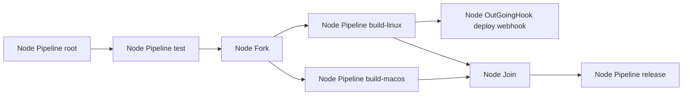
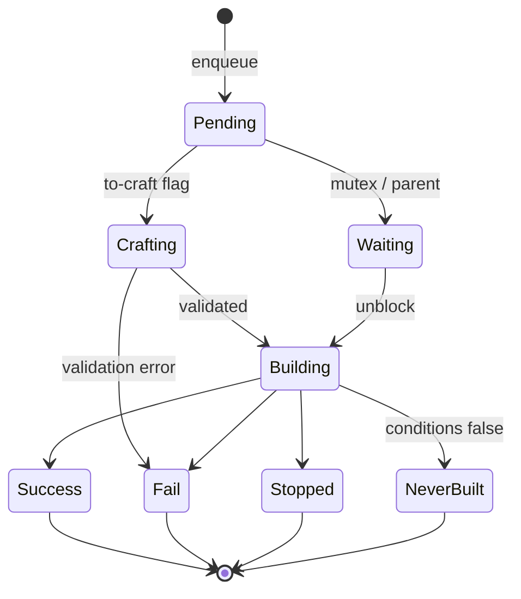

# Workflow v1 (Legacy DAG)

This document describes the **legacy** workflow model. It is frozen —
no new features land here and it will eventually be deprecated in
favour of [`04-workflow-v2.md`](./04-workflow-v2.md). The spec is
preserved as a reference for maintainers who operate v1 workflows in
production and for everyone who needs to understand the migration
target.

The high-level v1 / v2 split is introduced in
[`00-overview.md`](./00-overview.md). This document is the deep dive
on v1 only.

Source code anchors. Public types: `Workflow` (`sdk/workflow.go`),
`WorkflowData` (`sdk/workflow_data.go`), `Node`, `NodeContext`,
`NodeTrigger`, `NodeJoin`, `NodeOutGoingHook`, `NodeTypePipeline`,
`NodeTypeJoin`, `NodeTypeOutGoingHook`, `NodeTypeFork`
(`sdk/workflow_node.go`); `NodeHook`, `WorkflowNodeHookConfig`,
`WorkflowHookModel` (`sdk/workflow_hook.go`); `Pipeline`
(`sdk/pipeline.go`), `Stage` (`sdk/stage.go`), `Job` (`sdk/job.go`),
`Action` (`sdk/action.go`); `Application` (`sdk/application.go`),
`Environment` (`sdk/environment.go`); `Requirement`
(`sdk/requirement.go`); `WorkflowRun`, `WorkflowNodeRun`,
`WorkflowNodeJobRun`, `WorkflowNodeOutgoingHookRunCallback`
(`sdk/workflow_run.go`); `WorkflowTemplate`,
`WorkflowTemplateInstance` (`sdk/workflow_template.go`);
`WorkflowNodeConditions`, `WorkflowNodeCondition`
(`sdk/workflow.go`, `sdk/workflow_conditions.go`); `BuiltinHookModels`
(`sdk/hook.go`). DAG walker in `engine/api/workflow/process.go` and
`process_*.go`. Crafting in `engine/api/workflow_run_craft.go`.
Outgoing-hook handling in `engine/api/workflow/execute_outgoing_hook_run.go`.
YAML import/export in `sdk/exportentities/` and
`engine/api/workflow/workflow_parser.go` /
`engine/api/workflow/workflow_exporter.go`.

## 1. Scope

**In scope** — The `Workflow` root and its `WorkflowData` graph; the
four `NodeType*` values (`NodeTypePipeline`, `NodeTypeJoin`,
`NodeTypeFork`, `NodeTypeOutGoingHook`); the
`Pipeline → Stage → Job → Action` hierarchy with field semantics;
`Application` and `Environment` as first-class entities bound to a
node; v1 hook models (`NodeHook` incoming and `NodeOutGoingHook`);
v1 run conditions (plain and Lua); the `WorkflowRun`, `WorkflowNodeRun`,
and `WorkflowNodeJobRun` lifecycle; YAML formats `v1.0` and `v2.0`
(both v1 export formats — not to be confused with v2 ascode); v1
`WorkflowTemplate`; mutex semantics; the outgoing-hook callback model.

**Out of scope** — Ascode entities and v2 workflows (see [`04-workflow-v2.md`](./04-workflow-v2.md), [`05-ascode-entities.md`](./05-ascode-entities.md)); authentication and RBAC (see [`08-auth.md`](./08-auth.md) and [`09-rbac.md`](./09-rbac.md)); CDN log and artifact storage (see [`12-cdn-and-artifacts.md`](./12-cdn-and-artifacts.md)); detailed v1 hook routing internals (see [`06a-hooks-v1.md`](./06a-hooks-v1.md)); v1 run engine internals (see [`07a-run-engine-v1.md`](./07a-run-engine-v1.md)).

## 2. Table of contents

1. [Scope](#1-scope)
2. [Table of contents](#2-table-of-contents)
3. [The DAG model](#3-the-dag-model)
4. [Node context: pipeline, application, environment](#4-node-context-pipeline-application-environment)
5. [Hooks v1: incoming and outgoing](#5-hooks-v1-incoming-and-outgoing)
6. [Pipeline → Stage → Job → Action](#6-pipeline--stage--job--action)
7. [Applications and Environments](#7-applications-and-environments)
8. [Job requirements](#8-job-requirements)
9. [Run conditions (plain and Lua)](#9-run-conditions-plain-and-lua)
10. [Workflow-run lifecycle](#10-workflow-run-lifecycle)
11. [YAML formats v1.0 and v2.0](#11-yaml-formats-v10-and-v20)
12. [Workflow template v1](#12-workflow-template-v1)
13. [Outgoing hook execution](#13-outgoing-hook-execution)
14. [Deprecation status and cross-spec pointers](#14-deprecation-status-and-cross-spec-pointers)

## 3. The DAG model

A v1 workflow is a directed acyclic graph rooted at a single `Node`,
with optional `Joins` that converge multiple parents. The
`sdk.Workflow` (`sdk/workflow.go`) root carries:

| Aspect | Description |
| --- | --- |
| Identity | A numeric ID, a name, a project key, a project ID. |
| Graph | A single workflow-data block holding the root node and any join nodes. |
| Indexes | Flat indexes (by ID) of every pipeline, application, environment, hook model, and outgoing-hook model the graph references — so node payloads stay compact. |
| Permissions | V1 group permissions (see [`02-project-and-tenancy.md`](./02-project-and-tenancy.md)). |
| Lifecycle | History length, purge tags, retention policy, max runs. |
| Provenance | `from-repository` set when imported from a Git repo; an optional template instance pointer when the workflow was instantiated from a v1 template. |
| Notifications | Workflow-scoped notifications (email, jabber, in-app, webhook). |
| Audit | An audit trail of mutations. |

`WorkflowData` (`sdk/workflow_data.go`) holds `Node` (root) and
`Joins []Node` (convergence points). Nodes refer to pipelines,
applications, environments, and integrations through IDs that resolve
against the flat indexes carried on the workflow.

### 3.1 Node types

The four `NodeType*` constants are declared in `sdk/workflow_node.go`:

| Constant | Value | Purpose |
| --- | --- | --- |
| `NodeTypePipeline` | `pipeline` | Run a pipeline with a context (application, environment, integration) |
| `NodeTypeJoin` | `join` | Wait for several parents to finish, then continue |
| `NodeTypeOutGoingHook` | `outgoinghook` | Call an external endpoint after a node completes |
| `NodeTypeFork` | `fork` | Fan out: trigger several children in parallel |

The `Node` struct (`sdk/workflow_node.go`) carries an identity (`ID`,
`Name`, `Ref`, `WorkflowID`, `TriggerID`), a `Type`, a context
(`Context *NodeContext` for pipeline / fork, `OutGoingHookContext
*NodeOutGoingHook` for outgoing-hook, `JoinContext []NodeJoin` for
joins), `Hooks []NodeHook` (matching events trigger this node),
`Triggers []NodeTrigger` (outbound edges), and `GroupPermissions` for
node-scoped ACL overrides.

A `NodeTrigger` is a single outbound edge carrying
`(ID, ParentNodeID, ChildNodeID, ParentNodeName, ChildNode)`. A
`NodeJoin` lists the parents a join node waits for so the run engine
can decide when the join is satisfied.

### 3.2 Graph diagram



### 3.3 Walking the graph

The DAG is walked by `processWorkflowDataRun`
(`engine/api/workflow/process_data.go`). On the first execution the
walker starts at the root via `processStartFromRootNode`
(`engine/api/workflow/process_start.go`). On reruns or manual restart
it can start from a specific node via `processStartFromNode`. After
each node completes:

- `processAllNodesTriggers` (`process_start.go`) — fire ready triggers.
- `processAllJoins` (`process_start.go`) — re-evaluate joins (all
  parents done?).
- `processNodeTriggers` (`process_node.go`) — schedule the children of
  a finished node.
- `processNodeRun` (`process_node.go`) — actually run the child
  (pipeline, fork, join, outgoing hook).

The full status flow is in [section 10](#10-workflow-run-lifecycle).

## 4. Node context: pipeline, application, environment

A pipeline or fork node carries `NodeContext`
(`sdk/workflow_node.go`):

| Field | Purpose |
| --- | --- |
| `PipelineID`, `PipelineName` | The pipeline the node runs |
| `ApplicationID`, `ApplicationName` | The VCS repository plus deployment strategies |
| `EnvironmentID`, `EnvironmentName` | The deployment target with its variables and keys |
| `ProjectIntegrationID`, `ProjectIntegrationName` | Optional project integration |
| `DefaultPayload` | Used when the run is triggered without explicit input |
| `DefaultPipelineParameters` | Default `Parameter` values |
| `Conditions` (`WorkflowNodeConditions`) | Gating |
| `Mutex` | When true, makes the node sequential |

The triplet `(Pipeline, Application, Environment)` is the runtime
binding: the same pipeline can be reused across nodes with different
application / environment combinations, and the same application can
be deployed across many environments. This is the v1 idiom for
"deploy to dev then staging then prod".

`Mutex = true` makes the node sequential: at most one run can occupy
the node at a time; other runs queue in `StatusWaiting` until the
running one terminates. The v1.0 YAML key for this is `one_at_a_time`.

## 5. Hooks v1: incoming and outgoing

### 5.1 Incoming hooks

A `NodeHook` (`sdk/workflow_hook.go`) is attached to a node and
**triggers** the node when an external event matches. Each hook is
parameterised by `WorkflowNodeHookConfig` (a
`map[string]WorkflowNodeHookConfigValue`) plus an optional
`Conditions` block.

The builtin incoming hook models live in `sdk/hook.go`
(`BuiltinHookModels`):

| Model | Variable | Trigger source |
| --- | --- | --- |
| WebHook | `WebHookModel` | Arbitrary HTTP POST |
| Repository WebHook | `RepositoryWebHookModel` | VCS webhook (GitHub, GitLab, Bitbucket, Gerrit) |
| Git Repository Poller | `GitPollerModel` | Poll a repo for commits |
| Scheduler | `SchedulerModel` | Cron schedule |
| Kafka | `KafkaHookModel` | Kafka topic consumer |
| RabbitMQ | `RabbitMQHookModel` | RabbitMQ queue consumer |
| Gerrit | `GerritHookModel` | Gerrit patchset events |
| Workflow | `WorkflowModel` | Triggered by another workflow's outgoing hook |

### 5.2 Outgoing hooks

A `NodeOutGoingHook` (`sdk/workflow_node.go`) is the inverse — it
**fires** when the node completes. Two outgoing models exist in
`sdk/hook.go`:

| Model | Variable | Behaviour |
| --- | --- | --- |
| Outgoing webhook | `OutgoingWebHookModel` | POST an arbitrary URL with a configurable payload |
| Outgoing workflow | `OutgoingWorkflowModel` | Trigger another v1 workflow (cross-workflow chaining) |

Outgoing hooks are v1-only — v2 does not implement them. The
execution flow is detailed in
[section 13](#13-outgoing-hook-execution).

### 5.3 Hook models

Every model is described by `WorkflowHookModel`
(`sdk/workflow_hook.go`), which also persists in the database so
administrators can disable or extend the catalogue.

## 6. Pipeline → Stage → Job → Action

### 6.1 `Pipeline` (`sdk/pipeline.go`)

A pipeline is a list of `Stages` plus a set of `Parameter`s. The same
pipeline is reused across nodes via `NodeContext.PipelineID`. A
pipeline also carries `FromRepository` and `AsCodeEvents` for
git-imported pipelines.

### 6.2 `Stage` (`sdk/stage.go`)

A stage is an ordered position inside a pipeline (`BuildOrder`).
Stages run **sequentially** in their declared order. `Jobs` inside the
same stage run **in parallel**. A stage carries a `Conditions`
(`WorkflowNodeConditions`) block. A legacy `Prerequisites` field exists
for older pipelines but should be replaced by the modern `Conditions`
form (see [section 9](#9-run-conditions-plain-and-lua)).

### 6.3 `Job` (`sdk/job.go`)

A job is a thin wrapper around an embedded `Action`. The action
defines what runs; the job is the placement of that action in a
stage.

### 6.4 `Action` (`sdk/action.go`)

An `Action` carries a `Name`, `Description`, `Type`, `Enabled`,
`Deprecated`, `StepName`, `Optional`, `AlwaysExecuted`,
`Requirements` (see [section 8](#8-job-requirements)), `Parameters`,
and a recursive `Actions []Action` for composition. Five action types
(`sdk/action.go`):

| Type | Source |
| --- | --- |
| `Default` | Custom user-defined actions (group-owned) |
| `Builtin` | Ship-in-binary actions |
| `Plugin` | gRPC plugin actions |
| `Joined` | Composed actions (deprecated in v2) |
| `ActionAsCode` | v2 action referenced from v1 via the bridge |

The builtin catalogue (`sdk/action.go`):

| Action | Purpose |
| --- | --- |
| `Script` | Run a script with a chosen interpreter |
| `JUnit` | Parse JUnit XML reports |
| `Coverage` | Capture coverage results |
| `GitClone` | Clone a repository |
| `GitTag` | Tag a repository |
| `ReleaseVCS` | Create a release on the VCS provider |
| `CheckoutApplication` | Checkout the application repo with its `RepositoryStrategy` |
| `DeployApplication` | Drive a deployment integration |
| `PushBuildInfo` | Push build info to an artifact manager |
| `InstallKey` | Install an SSH / PGP key in the worker filesystem |
| `Release` | Publish an artifact release |
| `Promote` | Promote an artifact between maturity levels |

Each builtin is declared as a `Manifest` under `sdk/action/` (e.g.
`GitClone` in `sdk/action/git-clone.go`, `Script` in
`sdk/action/script.go`). The recursive `Actions []Action` field
enables composition; `FlattenRequirements` (`sdk/action.go`)
aggregates the requirements of every sub-action so that the hatchery
sees the full list when it picks a worker.

## 7. Applications and Environments

### 7.1 Application

In v1, an application encapsulates the binding between a workflow and a VCS repository, plus its deployment strategies. It carries:

| Aspect | Purpose |
| --- | --- |
| Identity | ID, name, description, icon |
| VCS binding | The project's VCS server name and the repository fullname (`owner/repo`) |
| Repository strategy | Whether `git clone` happens over SSH or HTTPS, which key or user/password to use, what the default branch is |
| Variables | Application-scoped variables (with optional encryption) |
| Keys | Application-scoped keys |
| Deployment strategies | A per-integration configuration map so the same application can be deployed through several deployment integrations |
| Notifications | User notifications attached to the application |
| Metadata | Free-form tags |

### 7.2 Environment

An environment is a named bag of variables and keys, attached to a project, used at job execution to inject deployment-specific values.

Application + environment together are the v1 idiom for "deploy this code with these credentials to that target".

V2 dropped this split: there is no first-class application or environment, and what they expressed is now spread across project repositories, integrations, and variable sets — see [`02-project-and-tenancy.md`](./02-project-and-tenancy.md).

## 8. Job requirements

A job requirement is how v1 asks the hatchery for a specific worker.
Requirements live on the action as `Requirement` rows
(`sdk/requirement.go`). Ten constants:

| Constant | Type | Notes |
| --- | --- | --- |
| `BinaryRequirement` | `binary` | `which <value>` must succeed on the worker |
| `ModelRequirement` | `model` | Exact worker model name; at most one per action |
| `HostnameRequirement` | `hostname` | Pin to one worker; at most one per action |
| `PluginRequirement` | `plugin` | A specific gRPC plugin |
| `ServiceRequirement` | `service` | Sidecar container next to the worker |
| `MemoryRequirement` | `memory` | Container memory cap |
| `OSArchRequirement` | `os-architecture` | One of `OSArchRequirementValues` |
| `RegionRequirement` | `region` | Hatchery region |
| `SecretRequirement` | `secret` | Regex pattern over the project secrets |
| `FlavorRequirement` | `flavor` | OpenStack / vSphere VM sizing |

`AvailableRequirementsType` lists every supported value. Validation
enforces uniqueness on the `model` and `hostname` requirements and
validates regex syntax for `secret` requirements.

## 9. Run conditions (plain and Lua)

Conditions live on three v1 sites:

- `NodeContext.Conditions` (`sdk/workflow_node.go`) — gating the
  execution of a pipeline / fork node.
- `Stage.Conditions` (`sdk/stage.go`) — gating an individual stage
  inside a pipeline.
- `NodeHook.Conditions` (`sdk/workflow_hook.go`) — gating an incoming
  hook (filter events).

All three reuse the same `WorkflowNodeConditions` (`sdk/workflow.go`):
either `PlainConditions []WorkflowNodeCondition` (AND-ed) or
`LuaScript string` for cases where the conditions cannot be expressed
as a flat list (boolean combinations across multiple variables).

A `WorkflowNodeCondition` is a `(Variable, Operator, Value)` triplet.
Seven operators are listed in `sdk/workflow_conditions.go`: `eq`,
`ne`, `lt`, `le`, `gt`, `ge`, `regex`. The evaluator
`WorkflowCheckConditions` interpolates parameters from the run
context and AND-s the results.

## 10. Workflow-run lifecycle

### 10.1 Status reference

V1 status constants live in `sdk/build.go`:

| Constant | Value | Meaning |
| --- | --- | --- |
| `StatusPending` | `Pending` | Queued, not yet processed |
| `StatusWaiting` | `Waiting` | Waiting on mutex / parent / trigger |
| `StatusBuilding` | `Building` | Currently running |
| `StatusSuccess` | `Success` | Finished, all good |
| `StatusFail` | `Fail` | Finished, at least one failure |
| `StatusDisabled` | `Disabled` | Node disabled by configuration |
| `StatusNeverBuilt` | `Never Built` | Conditions did not match, node skipped |
| `StatusSkipped` | `Skipped` | Stage / job skipped at runtime |
| `StatusStopped` | `Stopped` | User stop |
| `StatusCrafting` | `Crafting` | Post-processing in `WorkflowRunCraft` |
| `StatusScheduling` | `Scheduling` | Job awaiting a worker |

### 10.2 State machine



### 10.3 Run structs

The three nested run types (`sdk/workflow_run.go`):

| Type | Role |
| --- | --- |
| `WorkflowRun` | Instance of a workflow execution. Carries `Number`, `Status`, a `Workflow` snapshot, `WorkflowNodeRuns map[int64][]WorkflowNodeRun`, `Infos`, `Tags`, `Header`, `ToCraft` / `ToCraftOpts`, `JoinTriggersRun`. |
| `WorkflowNodeRun` | One execution of one node. Carries `Number` / `SubNumber` (for retries), `Status`, `Stages` snapshot, `HookEvent` / `Manual` (triggering payload), `SourceNodeRuns` (for joins), `Payload` and `BuildParameters`, `Contexts`, VCS coordinates (`VCSRepository`, `VCSTag`, `VCSBranch`, `VCSHash`, `VCSServer`), and — for outgoing-hook nodes — `OutgoingHook` + `Callback`. |
| `WorkflowNodeJobRun` | One execution of one job. Carries `Job` (executed), `Status`, `Retry`, `Queued` / `Start` / `Done` timestamps, `Model` / `ModelType`, `Region`, `BookedBy`, `SpawnInfos`, `HatcheryName` / `WorkerName`, `IntegrationPlugins`, `Contexts`. |

`WorkflowRun.WorkflowNodeRuns` is keyed by `Node.ID` and holds a slice
because the same node can be retried (`SubNumber` carries the retry
index).

### 10.4 Entry points

The handlers in `engine/api/workflow/run_workflow.go` cover the four
ways a run starts:

| Function | Trigger |
| --- | --- |
| `runFromHook` | An incoming hook matched |
| `manualRun` | User clicked Run |
| `manualRunFromNode` | User clicked Restart from node |
| `StartWorkflowRun` | Common entry that dispatches into the three above |

The crafting goroutine `WorkflowRunCraft`
(`engine/api/workflow_run_craft.go`) consumes runs with `ToCraft = true`,
validates them (max runs, retention, ascode), and pushes them into the
engine via `workflowRunCraft`. The actual DAG walker is
`processWorkflowDataRun` (`engine/api/workflow/process_data.go`);
status reconciliation is done by `computeAndUpdateWorkflowRunStatus`.

## 11. YAML formats v1.0 and v2.0

Workflow v1 has **two YAML export formats**, confusingly named v1.0
and v2.0. **Both describe the same v1 workflow model** — they are
simply two serialisation conventions. They are not related to v2
ascode workflows, which live in a separate tree
(`sdk/exportentities/v2/` for ascode is distinct from
`sdk/exportentities/v1/` and `sdk/exportentities/v2/` for the workflow
v1 exporter).

Version constants (`sdk/exportentities/workflow.go`):

```
WorkflowVersion1 = "v1.0"
WorkflowVersion2 = "v2.0"
```

### 11.1 Dispatch

The entry parser `UnmarshalWorkflow` (`sdk/exportentities/workflow.go`)
reads the YAML `version:` field and dispatches:

- `version: v1.0` → `sdk/exportentities/v1/workflow.go` (`Workflow`),
  then `workflowV1.GetWorkflow()`.
- `version: v2.0` → `sdk/exportentities/v2/workflow.go` (richer with
  stages / gates / semver hints), then `workflowV2.GetWorkflow(ctx)`.

Internal exports always serialise to v2.0 via `NewWorkflow`. When the
importer encounters v1.0 it emits a deprecation message
(`engine/api/workflow/workflow_parser.go`).

### 11.2 v1.0 format

The v1.0 struct (`sdk/exportentities/v1/workflow.go`) is intentionally
compact and works for simple workflows. It has a simple form for
single-pipeline workflows (just `pipeline:`, `application:`,
`environment:`) and a full form with explicit `workflow:` map and
`hooks:` map. A `NodeEntry` describes one node — its `depends_on`,
conditions, pipeline / application / environment binding, payload,
parameters, outgoing hook, and permissions.

The condition shape in YAML mirrors the SDK: `ConditionEntry` holds
either `check:` (plain conditions) or `lua:` (script).

### 11.3 v2.0 format

The v2.0 format (`sdk/exportentities/v2/workflow.go`) adds stages,
gates (manual approvals), semver hints, retention policy, and
notifications in a more decentralised layout that maps closer to the
API model.

### 11.4 Parser and importer

The full import pipeline is `ParseAndImport`
(`engine/api/workflow/workflow_parser.go`): it parses the YAML,
normalises both formats into `sdk.Workflow`, validates against the
project, optionally creates the repository webhook, computes a derived
workflow if the import is from a branch, and finally writes to the
database. The simpler `Parse` is used by tools that only need the
in-memory result.

The exporter `Export`
(`engine/api/workflow/workflow_exporter.go`) always returns v2.0;
downgrading to v1.0 is not supported.

## 12. Workflow template v1

`WorkflowTemplate` (`sdk/workflow_template.go`) is a Go text/template
skeleton for a v1 workflow. It carries:

| Field | Description |
| --- | --- |
| `ID`, `GroupID`, `Name`, `Slug`, `Description` | Identity |
| `Parameters` (`WorkflowTemplateParameters`) | Typed parameters (`TemplateParameterType`: `string`, `boolean`, `repository`, `ssh-key`, `pgp-key`, `json`) |
| `Workflow` | YAML body |
| `Pipelines` (`PipelineTemplates`), `Applications` (`ApplicationTemplates`), `Environments` (`EnvironmentTemplates`) | Sub-resource templates |
| `Version int64` | Bumped on every edit |
| `FirstAudit`, `LastAudit` (`AuditWorkflowTemplate`) | Audit entries |
| `Editable`, `ChangeMessage` | Edit metadata |

`WorkflowTemplateParameter` carries `Key`, `Type`, `Required`.

Instantiation is recorded as `WorkflowTemplateInstance`
(`sdk/workflow_template.go`) carrying
`WorkflowTemplateID` / `ProjectID` / `WorkflowID`,
`WorkflowTemplateVersion`, the user `Request`
(`WorkflowTemplateRequest` with `ProjectKey`, `WorkflowName`,
`Parameters`, `Detached`), audit trail, and aggregates.

The `WorkflowTemplateBulk` goroutine (see
[`01-architecture.md`](./01-architecture.md)) processes batched apply
and rollback requests asynchronously.

### 12.1 v2 template (out of scope here)

`V2WorkflowTemplate` (`sdk/v2_workflow_template.go`) exists for v2
workflows; its data lives in Git rather than the database. It is
documented in [`05-ascode-entities.md`](./05-ascode-entities.md). The
two template families do not interoperate.

## 13. Outgoing hook execution

When a node of type `outgoinghook` completes, the API sends an HTTP
request (for `OutgoingWebHookModel`) or schedules a child workflow run
(for `OutgoingWorkflowModel`). The node enters `StatusWaiting` until
the callback arrives.

The callback shape is `WorkflowNodeOutgoingHookRunCallback`
(`sdk/workflow_run.go`): `NodeHookID`, `Start` / `Done` timestamps,
`Status`, `Log`, and `WorkflowRunNumber` (child run number when the
target was another workflow).

Callback handling lives in
`engine/api/workflow/execute_outgoing_hook_run.go`:

- `UpdateOutgoingHookRunStatus` — write the callback to the parent
  run, reprocess the workflow from this point, recompute final status.
- `UpdateParentWorkflowRun` — when the workflow that ran was
  triggered by an outgoing hook from another workflow, propagate the
  child status back to the parent's callback.

The list of pending outgoing hooks is exposed via
`WorkflowRun.PendingOutgoingHook()` (`sdk/workflow_run.go`).

## 14. Deprecation status and cross-spec pointers

### 14.1 What is frozen

- The `Workflow`, `WorkflowData`, `Node`, `Pipeline`, `Stage`, `Job`,
  `Action`, `Application`, `Environment`, `Requirement` struct shapes
  are frozen — no new fields land.
- No new `NodeType*` values beyond the four documented above.
- The Lua condition engine receives only bug fixes.
- The v1.0 YAML format is in deprecation mode; the importer surfaces a
  deprecation message on every import
  (`engine/api/workflow/workflow_parser.go`).
- `NodeOutGoingHook` remains v1-only — it will not get a v2 equivalent.

### 14.2 What remains v1-only

The following capabilities have no v2 equivalent at the time of
writing:

- `Application` and `Environment` as standalone, reusable entities
  (`sdk/application.go`, `sdk/environment.go`).
- `WorkflowNotification` attached to a workflow (v2 uses
  `ProjectNotification` instead, see
  [`02-project-and-tenancy.md`](./02-project-and-tenancy.md)).
- `NodeOutGoingHook` bound to nodes.
- Old-format `WorkflowTemplate` (`sdk/workflow_template.go`) versus
  the new `V2WorkflowTemplate` (`sdk/v2_workflow_template.go`).

### 14.3 Cross-spec pointers

- Microservices, request lifecycle, API background work → [`01-architecture.md`](./01-architecture.md)
- Project, organisation, groups, integrations, regions, variable sets → [`02-project-and-tenancy.md`](./02-project-and-tenancy.md)
- Ascode workflow model (v2 successor) → [`04-workflow-v2.md`](./04-workflow-v2.md)
- Ascode entities and `.cds/` layout → [`05-ascode-entities.md`](./05-ascode-entities.md)
- V1 hooks internals (`Task` / `TaskExecution`, `/webhook` and `/task/*` routes, Kafka / RabbitMQ / Gerrit listeners, outgoing hooks) → [`06a-hooks-v1.md`](./06a-hooks-v1.md)
- V1 run engine → [`07a-run-engine-v1.md`](./07a-run-engine-v1.md)
- V2 run engine (for comparison) → [`07b-run-engine-v2.md`](./07b-run-engine-v2.md)
- Authentication and v1 group permissions → [`08-auth.md`](./08-auth.md)
- RBAC v2 (for comparison) → [`09-rbac.md`](./09-rbac.md)
- Hatchery + worker-model dispatch → [`10-hatcheries.md`](./10-hatcheries.md)
- Worker binary + in-worker job execution → [`11-workers.md`](./11-workers.md)
- CDN, run results, log streaming → [`12-cdn-and-artifacts.md`](./12-cdn-and-artifacts.md)
- VCS providers, link system → [`13-vcs.md`](./13-vcs.md)
- Integration matrix → [`14-integrations.md`](./14-integrations.md)
- cdsctl → [`15-cli.md`](./15-cli.md)
- Go SDK → [`16-sdk.md`](./16-sdk.md)
- gRPC plugins → [`17-plugins.md`](./17-plugins.md)
- UI → [`18-ui.md`](./18-ui.md)
- Glossary, statuses, expressions → [`19-glossary-and-cross-references.md`](./19-glossary-and-cross-references.md)
