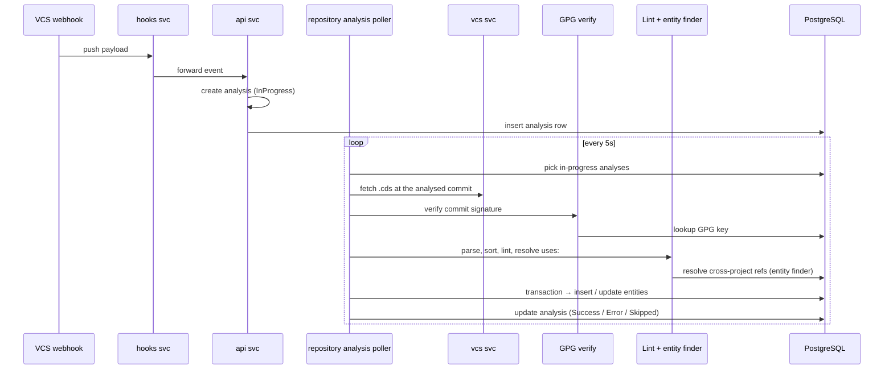
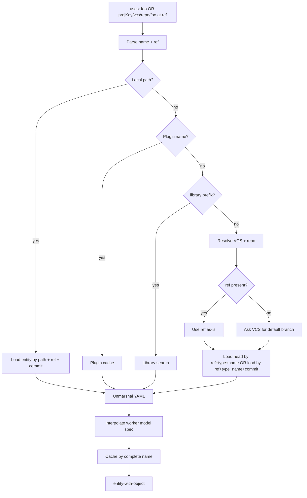

# Ascode Entities (Repository as Source of Truth)

This document specifies how CDS materialises the four ascode entity types
(`EntityTypeWorkflow`, `EntityTypeAction`, `EntityTypeWorkerModel`,
`EntityTypeWorkflowTemplate`) from a Git repository into the database,
how it walks the `.cds/` layout, how it verifies commit signatures,
how cross-project references are resolved, and how stale entities are
reclaimed. The model itself (`V2Workflow`, `V2Job`, `V2Action`,
`V2WorkerModel`, `V2WorkflowTemplate`) is documented in
[`04-workflow-v2.md`](./04-workflow-v2.md).

Source code anchors. Public types: `Entity`, `EntityWithObject`,
`EntityFullName`, `EntityType*` constants, `EntityNamePattern`,
`GetManageRoleByEntity` in `sdk/entity.go`; `ProjectRepositoryAnalysis`,
`GitRefBranchPrefix`, `GitRefTagPrefix` in `sdk/repository.go`;
`V2WorkflowTemplate` in `sdk/v2_workflow_template.go`. Analysis pipeline
in `engine/api/v2_repository_analyze.go`. Entity finder in
`engine/api/entity_search.go`. Entity DAO in `engine/api/entity/dao.go`.
Worker-model secrets in `engine/api/entity/worker_model.go`. Entity
routes in `engine/api/v2_entities.go`. GC routines in
`engine/api/v2_project_clean_ascode.go`.

## 1. Scope

**In scope** — The `EntityType` enum and the `Entity` row;
`EntityWithObject` composition; `.cds/` folder layout and per-type
filename patterns; repository analysis pipeline (HTTP entry, poller,
signature verification, archive download, YAML parse, RBAC filter,
batch persist); ref / commit / HEAD semantics; cross-project library
references and the `EntityFinder` cache; worker-model interpolation
and secret decryption (`WorkerModelDecryptSecrets`); entity-level HTTP
routes; `V2WorkflowTemplate` resolution; garbage-collection routines
(`cleanRepositoryAnalysis`, `project.CleanAsCodeEntities`,
`project.CleanWorkflowVersion`).

**Out of scope** — The workflow / job / action / model schemas themselves (see [`04-workflow-v2.md`](./04-workflow-v2.md)); hook routing and webhook ingestion (see [`06b-hooks-v2.md`](./06b-hooks-v2.md)); run engine and crafting (see [`07b-run-engine-v2.md`](./07b-run-engine-v2.md)); RBAC enforcement (see [`09-rbac.md`](./09-rbac.md)); VCS provider details (see [`13-vcs.md`](./13-vcs.md)).

## 2. Table of contents

1. [Scope](#1-scope)
2. [Table of contents](#2-table-of-contents)
3. [The entity model](#3-the-entity-model)
4. [The `.cds/` folder layout](#4-the-cds-folder-layout)
5. [Repository analysis pipeline](#5-repository-analysis-pipeline)
6. [Refs, commits, and HEAD](#6-refs-commits-and-head)
7. [Cross-project resolution: entity finder](#7-cross-project-resolution-entity-finder)
8. [Worker model interpolation and secret decryption](#8-worker-model-interpolation-and-secret-decryption)
9. [V2 workflow template](#9-v2-workflow-template)
10. [Entity HTTP routes](#10-entity-http-routes)
11. [Garbage collection](#11-garbage-collection)
12. [Validation](#12-validation)
13. [Cross-spec pointers](#13-cross-spec-pointers)

## 3. The entity model

### 3.1 `EntityType` constants

Four `EntityType*` constants are stored in the database
(`sdk/entity.go`); a fifth (`EntityTypeJob`) is reserved for future
use. `EntityTypes` aggregates the four active types.

| Constant | Value | Layer |
| --- | --- | --- |
| `EntityTypeWorkerModel` | `WorkerModel` | Execution environment |
| `EntityTypeAction` | `Action` | Reusable step |
| `EntityTypeWorkflow` | `Workflow` | The run graph |
| `EntityTypeWorkflowTemplate` | `WorkflowTemplate` | Parameterised workflow |

Entity names must match `EntityNamePattern` (alphanumeric plus dash and
underscore).

### 3.2 `Entity`

The `Entity` row (`sdk/entity.go`) stored in PostgreSQL carries:

| Field | Purpose |
| --- | --- |
| `ID` | UUID assigned at insert |
| `ProjectKey` | Owning project |
| `ProjectRepositoryID` | FK → `project_repository.id` |
| `Type` | One of the `EntityType*` values |
| `FilePath` | The path inside `.cds/` (e.g. `.cds/workflows/build.yml`) |
| `Name` | The entity name |
| `Commit` | Git SHA of the commit that produced this version |
| `Ref` | Branch or tag the commit was observed on |
| `LastUpdate` | Last persistence timestamp |
| `Data` | Raw YAML (a single document) |
| `UserID` | Optional FK → `authentified_user.id` (nullable) |
| `Head` | True when this row is the current head for `(repo, ref, type, name)` |

Every row is signed via `SignedEntity` so an attacker with raw SQL
access cannot quietly swap the YAML content. The signature canonical
includes `ID`, `Name`, `ProjectKey`, `ProjectRepositoryID`, `Type`,
`Ref`, `Commit`, `Data`.

Persistence guarantees:

- A unique index on `(project_repository_id, ref, type, name, commit)`.
- A cascading FK on the project repository, so dropping a repository
  deletes its entities.
- A nullable FK on the user, set to null when a user is deleted.
- A dedicated `head` column to mark the current version per ref.

### 3.3 `EntityWithObject`

Once `Entity.Data` is unmarshalled, the result is wrapped in
`EntityWithObject` (`sdk/entity.go`) which composes the entity row with
the parsed concrete type (`V2Workflow`, `V2Action`, `V2WorkerModel`,
`V2WorkflowTemplate`). Only the field corresponding to `Entity.Type` is
populated. The wrapper also carries a `CompleteName`
(`projKey/vcsName/repoName/name@ref`) used in cross-project lookups
(see [section 7](#7-cross-project-resolution-entityfinder)).

### 3.4 `EntityFullName`

For cross-project listings the API returns the slim `EntityFullName`
(`sdk/entity.go`): `Name`, `Ref`, `VCSName`, `RepoName`, `ProjectKey`.
This is the return type of `UnsafeLoadAllByType` /
`UnsafeLoadAllByTypeAndProjectKeys` (`engine/api/entity/dao.go`), used
by library searches.

## 4. The `.cds/` folder layout

CDS expects every ascode repository to keep its content under a single `.cds/` directory. Four sub-folders are recognised, each pinned to an entity type:

| Folder | Entity type |
| --- | --- |
| `.cds/workflows/` | Workflow |
| `.cds/actions/` | Action |
| `.cds/worker-models/` | Worker model |
| `.cds/workflow-templates/` | Workflow template |

Both `.yml` and `.yaml` extensions are accepted. One file describes one entity, although the parser accepts multi-document YAML (one row per document).

### 4.1 Dependency ordering

The analyser processes files in a fixed order so that downstream entities always see their dependencies in cache:

1. Worker models — no internal dependencies.
2. Actions — may reference worker models.
3. Workflow templates — may reference worker models and actions.
4. Workflows — may reference everything above.

### 4.2 Example layout

```
.cds/
├── worker-models/
│   ├── docker-ubuntu.yml
│   └── openstack-debian.yml
├── actions/
│   ├── checkout.yml
│   └── go-build.yml
├── workflow-templates/
│   └── service-template.yml
└── workflows/
    ├── ci.yml
    └── release.yml
```

## 5. Repository analysis pipeline

A push reaches the hooks service; the hooks service notifies the API; the API enqueues an analysis. From that point on the pipeline is asynchronous and idempotent — a poller goroutine drives it.



### 5.1 HTTP entry

`postRepositoryAnalysisHandler` accepts the
`POST /v2/project/{key}/vcs/{vcs}/repository/{repo}/analysis` request.
The body carries the ref, the commit, an optional `hookEventUUID`, and
an optional explicit initiator. The handler resolves missing refs to
commits, validates the project / VCS / repository, then calls
`createAnalyze` which inserts a `ProjectRepositoryAnalysis` row with
status `InProgress`. The HTTP response returns immediately — work
continues asynchronously in the poller.

### 5.2 The poller

`repositoryAnalysisPoller` is a goroutine on the API service (default
cadence 5 seconds). It picks up to a hundred in-progress analyses per
tick. For each analysis it acquires a 5-minute distributed lock and
dispatches into `analyzeRepository`.

### 5.3 Signature verification

If the analysis has no explicit initiator (triggered by a raw VCS
webhook), commit signature verification kicks in. Two routes exist
depending on the provider:

- **Bitbucket Cloud, GitLab** — `analyzeCommitSignatureThroughOperation`:
  clone the repo via the repositories service and read the signature
  locally.
- **GitHub, Gitea, Forgejo, Bitbucket Server** —
  `analyzeCommitSignatureThroughVcsAPI`: ask the VCS provider for the
  signature directly.

`retrieveSigninKey` extracts the GPG key ID from the signature, and
`findCommitter` maps it to either a CDS user (via the user's registered
GPG keys, `user.LoadGPGKeyByKeyID`), to a project-configured VCS key,
or to a VCS-user record. If no match is found, the analysis is marked
skipped with a message explaining that the key is unknown.

### 5.4 Archive download

Two download strategies exist depending on the VCS provider:

- **Bitbucket** — `getCdsArchiveFileOnRepo`: request a tarball from the
  VCS service (`GetArchive("repo", ".cds", "tar.gz", commit)`) and
  stream it through `gzip.Reader` + `tar.Reader`, keeping only `*.yml`
  / `*.yaml` entries.
- **Everything else** — `getCdsFilesOnVCSDirectory`: recursively walk
  `.cds/` through `ListContent` and `GetContent`, base64-decoding
  inline file content. This is the path used by GitHub, GitLab, Gitea,
  and Forgejo.

Both return a `map[string][]byte` keyed by repository path.

### 5.5 Parse, lint, and resolve

`handleEntitiesFiles` is the inner loop:

1. Sort files by path so worker models come first (see
   [section 4.1](#41-dependency-ordering)).
2. Match each path against the four recognised sub-folders.
3. Parse the YAML via `yaml.UnmarshalMultipleDocuments`.
4. Run the entity-specific lint: `V2Workflow.Lint`, `V2Action.Lint`,
   `V2WorkerModel.Lint`, `V2WorkflowTemplate.Lint`.
5. While linting, resolve any `uses:` reference through the
   `EntityFinder` (see [section 7](#7-cross-project-resolution-entityfinder)).
6. Build the final `EntityWithObject` plus a `ProjectRepositoryDataEntity`
   record for the analysis report.

### 5.6 RBAC filter

Before persistence the analyser checks RBAC per entity type. For each
entity, the role required is `sdk.GetManageRoleByEntity(t)`:

| Entity type | Required role |
| --- | --- |
| `EntityTypeWorkerModel` | `ProjectRoleManageWorkerModel` |
| `EntityTypeAction` | `ProjectRoleManageAction` |
| `EntityTypeWorkflow` | `ProjectRoleManageWorkflow` |
| `EntityTypeWorkflowTemplate` | `ProjectRoleManageWorkflowTemplate` |

The committer's identity (CDS user or VCS user) was resolved during
signature verification. If the committer lacks the role, the entity is
dropped with status skipped instead of success. The analysis as a
whole still completes — only the offending entities are skipped.

### 5.7 Persist

Everything happens inside a single transaction:

1. For each entity, load the existing row at the same
   `(repo, ref, type, name)` and `commit`.
2. If the entity is new on this commit and the commit is the head of
   its branch, mark the previous HEAD row as `head = false`, then
   insert the new row with `head = true`.
3. Otherwise insert with `head = false`.
4. Clean up the legacy row that used `commit = "HEAD"` (pre-migration).
5. Update `ProjectRepositoryAnalysis.Status` and commit.

Entity insertion goes through `entity.Insert` (`engine/api/entity/dao.go`)
which assigns a UUID, stamps `LastUpdate`, and signs the row via
`gorpmapping.InsertAndSign`. Failure rolls the whole analysis back.

## 6. Refs, commits, and HEAD

Every entity is uniquely keyed by `(project_repository_id, ref, type, name, commit)`.
Two ref forms are accepted (`sdk/repository.go`): `GitRefBranchPrefix`
(`refs/heads/`) and `GitRefTagPrefix` (`refs/tags/`).

The `Head` boolean marks the **current** row for a given
`(repo, ref, type, name)`. It is set to true only when the analysed
commit equals the latest commit of the branch at analysis time
(computed via the VCS client). When a new push arrives:

1. The previous `head = true` row stays in the database but is updated
   to `head = false`.
2. The new row is inserted with `head = true`.

This is what makes historical resolution possible (see
[section 7](#7-cross-project-resolution-entityfinder)): `uses: foo@abc1234`
will find the row that was HEAD at commit `abc1234` even though it is
no longer HEAD now.

The DAO (`engine/api/entity/dao.go`) offers two reading modes:

- `LoadHeadByTypeAndRef(repo, type, ref)` — only rows with `head = true`.
- `LoadByTypeAndRefCommit(repo, type, ref, commit)` — exact-commit
  lookup.

## 7. Cross-project resolution: `EntityFinder`

A `uses:` reference can take five forms:

| Form | Resolution |
| --- | --- |
| `my-action` | Local action in the same repository on the current ref |
| `actions/checkout` | gRPC plugin or shared action registered with the platform |
| `library/shared-action` | Action from the configured project library |
| `projKey/vcsName/repo/action` | Cross-project, default branch of the target |
| `projKey/vcsName/repo/action@ref` | Cross-project at a specific ref or tag |

The resolver `EntityFinder` (`engine/api/entity_search.go`) holds the
current `(project, vcs, repo, ref, sha)` context plus per-kind caches:
VCS servers, repositories, default refs, local actions, global actions,
worker models, templates, workflows, and gRPC plugins. The key
resolution function is `searchEntity`.



Default-ref resolution: if the consumer asks for a bare name without a ref, the finder reads the default branch of the target repo via the VCS client and uses it. If the consumer asks for `@v1`, the finder first tries the branch `refs/heads/v1`, then the tag `refs/tags/v1`.

Caching is keyed by the complete-name form `projKey/vcsName/repoName/name@ref`. Local and remote caches are separated to keep memory bounded per analysis run.

### 7.1 The library project

The platform supports a single configured "library project" used to
host shared actions, worker models, and templates. References of the
form `library/<name>` resolve here through
`unsafeSearchEntityFromLibrary` (`engine/api/entity_search.go`), which
calls `entity.UnsafeLoadAllByTypeAndProjectKeys` on the configured
library key. There is no first-class library concept — it is just a
regular project that everyone has read access to.

## 8. Worker model interpolation and secret decryption

### 8.1 Interpolation

`EntityWithObject.Interpolate` (`sdk/entity.go`) is invoked while the
`EntityFinder` unmarshals a worker model. It interpolates expressions
inside the worker model spec — specifically the image field for Docker,
OpenStack, and vSphere — so that a model can declare its image with a
context-dependent template such as `${{ git.ref_name }}`:

```yaml
name: build
osarch: linux/amd64
type: docker
spec:
  image: my-registry/builder:${{ git.ref_name }}
```

`Interpolate` walks three branches keyed on the worker-model type:

| Type | Field interpolated |
| --- | --- |
| `WorkerModelTypeDocker` | `dockerSpec.Image` |
| `WorkerModelTypeVSphere` | `vsphereSpec.Image` |
| `WorkerModelTypeOpenstack` | `openstackSpec.Image` |

The call site is `EntityFinder.searchWorkerModel`
(`engine/api/entity_search.go`). The expression parser is the same one
used at runtime — see [`04-workflow-v2.md`](./04-workflow-v2.md).

### 8.2 Secret decryption

Worker model specs can contain encrypted fields (Docker registry
password, vSphere password). Decryption happens through
`WorkerModelDecryptSecrets` (`engine/api/entity/worker_model.go`):

- **Docker** and **vSphere** — decrypts `spec.Password` in place.
- **OpenStack** — nothing to decrypt because credentials are managed by
  the cloud provider.

Storage at rest is encrypted via the gorpmapper `encrypted` tag
combined with `SignedEntity`. Workers receive the decrypted spec only
at job dispatch time — never before. Expressions are **not**
interpolated at this point; the raw decrypted value is shipped, and the
worker resolves expressions through its own context.

## 9. `V2WorkflowTemplate`

`V2WorkflowTemplate` (`sdk/v2_workflow_template.go`) is a Go-template
skeleton stored as an ascode entity. It carries a `Name`, a
`Description`, a list of typed `Parameters`
(`V2WorkflowTemplateParameter` with `Key`, `Type` — `string` or `json`
— a `Required` flag, and an optional `Default`), and a `Spec`
(`WorkflowSpec`) — the workflow body with Go-template placeholders
(`[[ … ]]`).

A workflow declares its template binding through a `from:` field:

```yaml
name: my-service
from: ./.cds/workflow-templates/service.yml
parameters:
  service_name: payments
  runtime: golang
```

At analysis time, `V2WorkflowTemplate.Resolve(ctx, workflow)`
(`sdk/v2_workflow_template.go`) renders the template: it parses the
template body with the Go `text/template` engine **using `[[` and `]]`
as delimiters** (so that runtime `${{ … }}` placeholders pass through
untouched), feeds it the user's parameters, and emits the materialised
workflow YAML. The result is what gets stored as the workflow entity.

### 9.1 Differences from v1 templates

| Aspect | v1 (`sdk/workflow_template.go`) | v2 (`sdk/v2_workflow_template.go`) |
| --- | --- | --- |
| Storage | `WorkflowTemplate` DB row, group-owned | `V2WorkflowTemplate` ascode entity in Git |
| Body | YAML strings for workflow + pipelines + applications + environments | A single `WorkflowSpec` block |
| Parameters | `WorkflowTemplateParameters` | `V2WorkflowTemplateParameter[]` |
| Resolution | `Go text/template` over multiple files | `Go text/template` with `[[ ]]` delimiters |
| Versioning | `Version int64` field | Versioned by git commit |

V1 templates live on; the two systems do not interoperate. The legacy bulk-apply pipeline is documented in [`03-workflow-v1.md`](./03-workflow-v1.md).

## 10. Entity HTTP routes

Four routes manage entity reads (handlers in
`engine/api/v2_entities.go`):

| Route | Method | Handler | Purpose |
| --- | --- | --- | --- |
| `/v2/entity/{entityType}` | GET | `getEntitiesHandler` | Project-wide list of entities of one type (RBAC-filtered) |
| `/v2/entity/{entityType}/check` | POST | `postEntityCheckHandler` | Lint a YAML body without persisting |
| `/v2/project/{key}/vcs/{vcs}/repository/{repo}/entities` | GET | `getProjectEntitiesHandler` | List entities for one repo / ref / commit |
| `/v2/project/{key}/vcs/{vcs}/repository/{repo}/entities/{type}/{name}` | GET | `getProjectEntityHandler` | Read one entity |

The list and read handlers accept four query parameters:

- `?ref=refs/heads/develop` — explicit git ref
- `?branch=develop` — shortcut that expands to `refs/heads/develop`
- `?tag=v1.2.0` — shortcut that expands to `refs/tags/v1.2.0`
- `?commit=abc1234` — fetch at a specific commit (defaults to HEAD of the resolved ref)

`postEntityCheckHandler` reads a JSON body, dispatches on the URL
parameter `entityType`, and runs the corresponding `Lint()` method.
Failures come back as `EntityCheckResponse.Messages`. This is the
endpoint used by IDE plugins and `cdsctl` for pre-flight validation.

## 11. Garbage collection

Three goroutines maintain the entity tables. All three live behind
`RunWithRestart` so a transient failure does not stop them permanently.

### 11.1 `cleanRepositoryAnalysis`

Periodic (hourly by default). Implementation
`engine/api/v2_repository_analyze.go`. For each project repository,
count the analyses; if the count exceeds `Config.Entity.AnalysisRetention`
(default 250), delete the oldest ones via
`repository.DeleteOldestAnalysis`.

### 11.2 `project.CleanAsCodeEntities`

Periodic (`Config.Entity.RoutineDelay`, default 60 min). Implementation
`engine/api/v2_project_clean_ascode.go`. Walks every project, every
VCS, every repository, every ref, with a 10-worker pool. For each ref:

- **If the ref still exists** on the VCS, `cleanNonHeadEntities` drops
  entities with `head = false` and `LastUpdate > retention` (default
  24 h). This keeps a short history for retries while bounding storage.
- **If the ref has been deleted** on the VCS, `cleanEntitiesByDeletedRef`
  drops every entity for that ref, regardless of age.

Branches and tags are read from the VCS in pages (default 100 per
call).

### 11.3 `project.CleanWorkflowVersion`

Periodic (`Config.WorkflowV2.VersionRetentionScheduling`, default
60 min). Implementation `engine/api/v2_project_clean_ascode.go`. Walks
every distinct workflow, then for each workflow:

- Counts persisted `workflow_v2.WorkflowVersion` rows (the semver-tagged
  versions of the workflow).
- If the count exceeds `Config.WorkflowV2.VersionRetention` (default
  10), drops the oldest excess versions.
- If the workflow no longer exists on the default branch, drops
  **every** version.

This routine cleans the `workflow_version` table — a sibling of
`entity` that tracks semver releases — distinct from the entity GC
above.

## 12. Validation

Validation flows through the analyser only — there is no other way to
land an entity in the database. Three checkpoints apply on every
analysis:

1. **YAML well-formedness** — `yaml.UnmarshalMultipleDocuments` rejects
   parse errors.
2. **Lint** — each entity type has a `Lint()` method that runs the
   static checks documented in [`04-workflow-v2.md`](./04-workflow-v2.md).
   Failures populate the analysis report and skip the offending entity;
   the rest of the analysis continues.
3. **Cross-project resolution** — `EntityFinder` errors mean an `uses:`
   reference points to something that does not exist on the requested
   ref. The hosting workflow / action is marked as failing analysis.

Once persisted, the row is signed (`SignedEntity`). Reads through
`gorpmapping.CheckSignature` re-verify the signature; a tampered row is
treated as missing.

## 13. Cross-spec pointers

- Microservices, request lifecycle, background work → [`01-architecture.md`](./01-architecture.md)
- Projects, VCS servers, project repositories, integrations, regions → [`02-project-and-tenancy.md`](./02-project-and-tenancy.md)
- Workflow v1 model → [`03-workflow-v1.md`](./03-workflow-v1.md)
- Workflow v2 YAML schema, expressions, contexts → [`04-workflow-v2.md`](./04-workflow-v2.md)
- Hook routing and per-provider webhooks (v2) → [`06b-hooks-v2.md`](./06b-hooks-v2.md)
- V2 run engine (uses entities to materialise jobs) → [`07b-run-engine-v2.md`](./07b-run-engine-v2.md)
- RBAC v2 (defines the manage roles enforced by the analyser) → [`09-rbac.md`](./09-rbac.md)
- Authentication and the user-link system (commit signer mapping) → [`08-auth.md`](./08-auth.md)
- Hatchery + worker-model dispatch → [`10-hatcheries.md`](./10-hatcheries.md)
- Worker (consumes ascode actions) → [`11-workers.md`](./11-workers.md)
- CDN, artifacts, run results → [`12-cdn-and-artifacts.md`](./12-cdn-and-artifacts.md)
- VCS providers and link system → [`13-vcs.md`](./13-vcs.md)
- Integrations → [`14-integrations.md`](./14-integrations.md)
- cdsctl → [`15-cli.md`](./15-cli.md)
- Go SDK → [`16-sdk.md`](./16-sdk.md)
- gRPC plugins → [`17-plugins.md`](./17-plugins.md)
- UI → [`18-ui.md`](./18-ui.md)
- Glossary, statuses, events → [`19-glossary-and-cross-references.md`](./19-glossary-and-cross-references.md)
