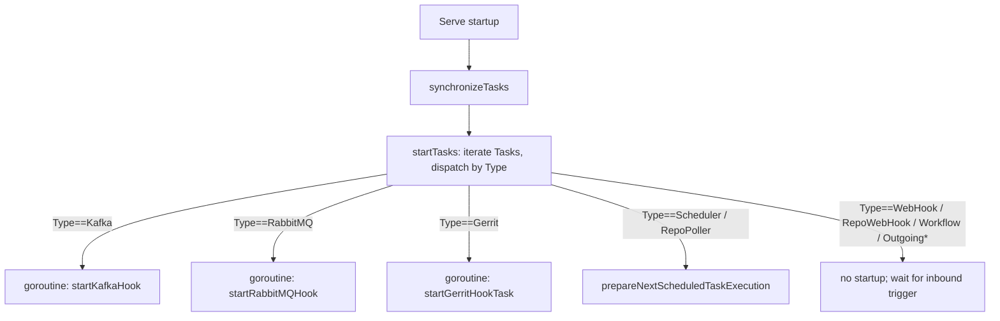

# Hooks (workflow v1)

This document specifies the **legacy v1 hook subsystem** of CDS: the
node-attached hook models, the `Task` / `TaskExecution` runtime, the
generic `/webhook/{uuid}` entry point, the `/task/*` admin surface, the
per-provider repository webhook handlers (v1 path), the Kafka /
RabbitMQ / Gerrit listeners, the v1 scheduler and the git-repository
poller, and v1 outgoing hooks (`OutgoingWebHook`, `OutgoingWorkflow`).

The v2 hook model (declared in the YAML `on:` block,
`HookRepositoryEvent`-driven) is a separate subsystem and lives in
[`06b-hooks-v2.md`](./06b-hooks-v2.md). The hooks service itself
(`Service` struct, `Configuration`, maintenance mode, Redis cache,
shared HTTP router) is documented once in
[`06b-hooks-v2.md`](./06b-hooks-v2.md#3-hooks-service-architecture);
this file only covers what is specific to v1.

Source code anchors. V1 hook models live in `sdk/hook.go`; node
attachment in `sdk/workflow_hook.go` and `sdk/workflow_node.go`; the
runtime `Task` / `TaskExecution` types in `sdk/hooks.go`; the v1
runtime loop in `engine/hooks/tasks.go` and `engine/hooks/scheduler.go`;
per-provider v1 payload generators in `engine/hooks/{github,gitlab,bitbucket_server,bitbucket_cloud,type_gitea,type_forgejo}.go`
(the `generatePayloadFrom*Request` family — distinct from the v2
`extractDataFrom*Request` family in the same files); Kafka, RabbitMQ
and Gerrit listeners in `engine/hooks/{kafka,rabbitmq,gerrit,poller}.go`;
outgoing-hook execution in `engine/hooks/outgoing_hooks.go`; the legacy
`/webhook/{uuid}` handler in `engine/hooks/hooks_handlers.go`; v1 routes
in `engine/hooks/hooks_router.go`. API-side persistence is in
`engine/api/workflow/dao_data_hook.go`,
`engine/api/workflow/dao_data_outgoing_hook.go`,
`engine/api/workflow/dao_hook_model.go`,
`engine/api/workflow/dao_outgoing_hook_model.go`, and the
registration / unregistration lifecycle in
`engine/api/workflow/hook.go`.

## 1. Scope

**In scope** — V1 hook taxonomy (10 built-in models); `NodeHook` and
`NodeOutGoingHook` persistence; `Task` / `TaskExecution` runtime; the
`runTasks` / `runScheduler` loops and their helper routines; the
generic `/webhook/{uuid}` handler and the `/task/*` administration
surface; v1 per-provider repository webhook handlers; v1 scheduler
(cron + payload on a node); git-repository poller; Kafka and RabbitMQ
listeners; Gerrit SSH stream listener (v1 path); v1 outgoing hooks
(HTTP fire-and-forget and intra-CDS workflow-to-workflow trigger); the
v1 share of the Redis key layout; maintenance-mode behaviour for the v1
loops.

**Out of scope** — V2 hooks (see [`06b-hooks-v2.md`](./06b-hooks-v2.md));
the shared hooks-service architecture (see
[`06b-hooks-v2.md`](./06b-hooks-v2.md#3-hooks-service-architecture));
workflow v1 schema, nodes, runs, and the run engine (see
[`03-workflow-v1.md`](./03-workflow-v1.md)); VCS provider
implementations (see [`13-vcs.md`](./13-vcs.md)).

## 2. Table of contents

1. [Scope](#1-scope)
2. [Table of contents](#2-table-of-contents)
3. [V1 hook taxonomy](#3-v1-hook-taxonomy)
4. [Persistence: `NodeHook` and `NodeOutGoingHook`](#4-persistence-nodehook-and-nodeoutgoinghook)
5. [Runtime data types: `Task` and `TaskExecution`](#5-runtime-data-types-task-and-taskexecution)
6. [Runtime loops: `runTasks` and `runScheduler`](#6-runtime-loops-runtasks-and-runscheduler)
7. [Inbound hook handlers](#7-inbound-hook-handlers)
8. [Kafka and RabbitMQ listeners](#8-kafka-and-rabbitmq-listeners)
9. [Gerrit SSH listener (v1 path)](#9-gerrit-ssh-listener-v1-path)
10. [Outgoing hooks](#10-outgoing-hooks)
11. [HTTP routes (`/webhook` and `/task/*`)](#11-http-routes-webhook-and-task)
12. [Redis layout for v1](#12-redis-layout-for-v1)
13. [Maintenance mode](#13-maintenance-mode)
14. [Cross-spec pointers](#14-cross-spec-pointers)

## 3. V1 hook taxonomy

Every v1 hook is one of ten built-in models, all marked
`Type: WorkflowHookModelBuiltin` (`sdk/workflow_hook.go:155`,
`WorkflowHookModelBuiltin = "builtin"`). The models live in
`sdk/hook.go`; the model **name** is the public identifier used by the
API, the runtime **task type** is the dispatcher key used by the hooks
service.

### 3.1 Inbound models

| Model variable | Name constant | Default config keys | Runtime task type |
| --- | --- | --- | --- |
| `WebHookModel` (`sdk/hook.go:127-140`) | `WebHookModelName = "WebHook"` | `method` (default `POST`) | `TypeWebHook` |
| `RepositoryWebHookModel` (`sdk/hook.go:142-160`) | `RepositoryWebHookModelName = "RepositoryWebHook"` | `method` (default `POST`), `eventFilter` | `TypeRepoManagerWebHook` |
| `SchedulerModel` (`sdk/hook.go:177-200`) | `SchedulerModelName = "Scheduler"` | `cron`, `timezone`, `payload` | `TypeScheduler` |
| `GitPollerModel` (`sdk/hook.go:162-175`) | `GitPollerModelName = "Git Repository Poller"` | `payload` | `TypeRepoPoller` |
| `KafkaHookModel` (`sdk/hook.go:67-85`) | `KafkaHookModelName = "Kafka hook"` | `integration`, `topic` | `TypeKafka` |
| `RabbitMQHookModel` (`sdk/hook.go:87-125`) | `RabbitMQHookModelName = "RabbitMQ hook"` | `integration`, `queue`, `exchange_type`, `exchange_name`, `binding_key`, `consumer_tag` | `TypeRabbitMQ` |
| `WorkflowModel` (`sdk/hook.go:217-223`) | `WorkflowModelName = "Workflow"` | none | `TypeWorkflowHook` |
| `GerritHookModel` (`sdk/hook.go:202-215`) | `GerritHookModelName = "GerritHook"` | `eventFilter` | `TypeGerrit` |

The full set is registered in
`BuiltinHookModels` (`sdk/hook.go:51-60`).

### 3.2 Outgoing models

| Model variable | Name constant | Default config keys | Runtime task type |
| --- | --- | --- | --- |
| `OutgoingWebHookModel` (`sdk/hook.go:225-247`) | implicit name `"WebHook"` reused | `method`, `URL`, `payload` | `TypeOutgoingWebHook` |
| `OutgoingWorkflowModel` (`sdk/hook.go:249-274`) | implicit name `"Workflow"` reused | `target_project`, `target_workflow`, `target_hook`, `payload` | `TypeOutgoingWorkflow` |

Outgoing models are listed in `BuiltinOutgoingHookModels`
(`sdk/hook.go:62-65`).

Runtime task-type constants are declared in `engine/hooks/tasks.go:18-28`:

```
TypeRepoManagerWebHook = "RepoWebHook"
TypeWebHook            = "Webhook"
TypeScheduler          = "Scheduler"
TypeRepoPoller         = "RepoPoller"
TypeKafka              = "Kafka"
TypeGerrit             = "Gerrit"
TypeRabbitMQ           = "RabbitMQ"
TypeWorkflowHook       = "Workflow"
TypeOutgoingWebHook    = "OutgoingWebhook"
TypeOutgoingWorkflow   = "OutgoingWorkflow"
```

Note that the v1 task type `TypeWebHook = "Webhook"` shares a string
value with the v2 hook type `WorkflowHookTypeWebhook = "Webhook"`
(`sdk/v2_workflow.go:22`); they live in different namespaces (runtime
task type vs persisted hook row type) and are never compared against
each other.

## 4. Persistence: `NodeHook` and `NodeOutGoingHook`

V1 hooks are stored as rows attached to a workflow **node** of the v1
workflow tree. There is no `on:` block in v1 — every trigger is a
node-attached hook.

### 4.1 `NodeHook`

```go
// sdk/workflow_hook.go:21-30
type NodeHook struct {
    ID            int64
    UUID          string
    NodeID        int64
    HookModelID   int64
    HookModelName string                 // e.g. "Scheduler", "RepositoryWebHook"
    Config        WorkflowNodeHookConfig
    Conditions    WorkflowNodeConditions
}
```

Carried by `sdk.Node.Hooks []NodeHook` (`sdk/workflow_node.go:30`).

Table `w_node_hook`, mapped by `dbNodeHookData` in
`engine/api/workflow/gorp_model.go`. DAO functions in
`engine/api/workflow/dao_data_hook.go`:

| Function | Purpose |
| --- | --- |
| `LoadHookByUUID(db, uuid)` | Single hook lookup |
| `LoadAllHooks(db)` | Cluster-wide enumeration (used by hooks service synchronisation) |
| `insertNodeHookData(db, node)` | Persist hooks of a node at workflow-update time |
| `CountRepositoryWebHooksByApplication(db, appID)` | Used by the VCS layer to detect orphan webhook registrations |

The hook-model table is `workflow_hook_model`; DAO functions in
`engine/api/workflow/dao_hook_model.go`.

### 4.2 `NodeOutGoingHook`

Outgoing hooks are attached to a **dedicated node** of type
`NodeTypeOutGoingHook = "outgoinghook"` (`sdk/workflow_node.go:14`); the
node itself triggers the outgoing call when its predecessors complete.

```go
// sdk/workflow_node.go:150-157
type NodeOutGoingHook struct {
    ID            int64
    NodeID        int64
    HookModelID   int64
    HookModelName string                 // "WebHook" or "Workflow"
    Config        WorkflowNodeHookConfig
}
```

The node embeds the configuration as `OutGoingHookContext *NodeOutGoingHook`
(`sdk/workflow_node.go:28`).

Table `w_node_outgoing_hook`, mapped by `dbNodeOutGoingHookData`. DAO
in `engine/api/workflow/dao_data_outgoing_hook.go`
(`insertNodeOutGoingHookData`); model DAO in
`engine/api/workflow/dao_outgoing_hook_model.go`.

### 4.3 Registration and unregistration

When the API persists or updates a workflow, it reconciles the v1 hook
rows with the hooks service via the `/task/*` endpoints:

| Function | File | Purpose |
| --- | --- | --- |
| `hookRegistration` | `engine/api/workflow/hook.go` | For each new or updated `NodeHook`, register a `Task` in the hooks service and (for `RepositoryWebHook`) instruct the VCS layer to install the provider-side webhook |
| `hookUnregistration` | `engine/api/workflow/hook.go` | Delete tasks the hooks service no longer needs (calls `DELETE /task/bulk`) and remove orphan VCS-side webhook registrations |
| `computeHookToDelete` | `engine/api/workflow/hook.go` | Diff the previous and next `NodeHook` lists to compute the set to remove |

## 5. Runtime data types: `Task` and `TaskExecution`

The hooks service represents every v1 hook as a `Task` (registered
once per `NodeHook`) and every firing as a `TaskExecution` (one row per
firing, retained for audit).

```go
// sdk/hooks.go:115-147
type Task struct {
    UUID              string
    Type              string                 // one of the Type* constants above
    Conditions        WorkflowNodeConditions
    Stopped           bool
    Executions        []TaskExecution
    NbExecutionsTotal int
    NbExecutionsTodo  int
    Configuration     HookConfiguration
    Config            WorkflowNodeHookConfig // DEPRECATED
}

type TaskExecution struct {
    UUID                string
    Type                string
    Timestamp           int64
    NbErrors            int64
    LastError           string
    ProcessingTimestamp int64
    WorkflowRun         int64
    WebHook             *WebHookExecution       // TypeWebHook, TypeRepoManagerWebHook
    Kafka               *KafkaTaskExecution
    RabbitMQ            *RabbitMQTaskExecution
    ScheduledTask       *ScheduledTaskExecution // TypeScheduler, TypeRepoPoller
    GerritEvent         *GerritEventExecution
    Status              string
    Configuration       HookConfiguration
    Config              WorkflowNodeHookConfig // DEPRECATED
}
```

Execution-status constants (`engine/hooks/types.go:13-17`):

| Constant | Value |
| --- | --- |
| `TaskExecutionScheduled` | `"SCHEDULED"` |
| `TaskExecutionEnqueued` | `"ENQUEUED"` |
| `TaskExecutionDoing` | `"DOING"` |
| `TaskExecutionDone` | `"DONE"` |

The DAO functions for tasks and task executions live in
`engine/hooks/dao.go`:
`SaveTask`, `DeleteTask`, `FindTask`, `FindAllTasks`, `SaveTaskExecution`,
`DeleteTaskExecution`, `EnqueueTaskExecution`, `FindAllTaskExecutions`,
`FindAllTaskExecutionsForTasks`, `QueueLen`, `TaskExecutionsBalance`.

## 6. Runtime loops: `runTasks` and `runScheduler`

Two top-level goroutines, launched from `Serve` in
`engine/hooks/hooks.go`, drive the v1 subsystem:

| Goroutine | Entry | Purpose |
| --- | --- | --- |
| `runTasks` | `engine/hooks/tasks.go:53` | Synchronise tasks with the API at startup, then keep the per-type listeners alive (Kafka, RabbitMQ, Gerrit) |
| `runScheduler` | `engine/hooks/scheduler.go` | Drive the scheduled-task queue (cron schedulers and pollers), retry stalled executions, and consume the execution queue |

### 6.1 `runTasks` lifecycle



Key functions in `engine/hooks/tasks.go`:

| Function | Lines | Role |
| --- | --- | --- |
| `synchronizeTasks` | `66-149` | Reconcile in-memory tasks with the API's `LoadAllHooks` result |
| `initGerritStreamEvent` | `151-177` | Spawn one Gerrit SSH listener per VCS server |
| `nodeHookToTask` | `180-239` | Translate a `NodeHook` into a `Task` (model-name → task-type mapping) |
| `startTasks` | `241-263` | Iterate over all stored tasks and start them |
| `startTask` | `283-307` | Dispatch a single task by `Type` |
| `prepareNextScheduledTaskExecution` | `309-377` | Compute next firing time for `TypeScheduler` (cron) and `TypeRepoPoller` (1-minute default) |
| `stopTask` | `379-402` | Inverse of `startTask` |
| `doTask` | `404-470` | Execute one `TaskExecution`, route by payload (`WebHook`, `Kafka`, `RabbitMQ`, `GerritEvent`, `ScheduledTask`) |

Cron parsing uses the `github.com/gorhill/cronexpr` library
(`tasks.go:339`):

```go
cronExpr, err := cronexpr.Parse(confCron.Value)
loc, _ := time.LoadLocation(confTimezone.Value)
t0 := time.Now().In(loc)
nextSchedule = cronExpr.Next(t0)
```

### 6.2 `runScheduler` lifecycle

`engine/hooks/scheduler.go` runs four cooperating routines:

| Function | Lines | Role |
| --- | --- | --- |
| `retryTaskExecutionsRoutine` | `52-134` | Re-enqueue executions stuck in `DOING` longer than the configured threshold; **pauses on maintenance** |
| `enqueueScheduledTaskExecutionsRoutine` | `136-186` | Move scheduled executions whose time has come to the in-progress queue |
| `deleteTaskExecutionsRoutine` | `188-229` | Apply the retention policy (drop oldest done executions per task) |
| `dequeueTaskExecutions` | `231-end` | Consume the in-progress queue and call `doTask` for each |

The scheduled-task queue is the Redis key `hooks:queue:schedulers`, an
ordered set keyed by next-execution timestamp.

## 7. Inbound hook handlers

### 7.1 Generic `/webhook/{uuid}` — `TypeWebHook`

Route declared in `engine/hooks/hooks_router.go:67`:

```go
r.Handle("/webhook/{uuid}", nil,
    r.POST(s.webhookHandler,   service.OverrideAuth(service.NoAuthMiddleware)),
    r.GET(s.webhookHandler,    service.OverrideAuth(service.NoAuthMiddleware)),
    r.DELETE(s.webhookHandler, service.OverrideAuth(service.NoAuthMiddleware)),
    r.PUT(s.webhookHandler,    service.OverrideAuth(service.NoAuthMiddleware)))
```

Implementation `webhookHandler` in
`engine/hooks/hooks_handlers.go:509-557`:

1. Read `{uuid}` from the URL.
2. Load the task from the DAO.
3. Check the HTTP method against `config[WebHookModelConfigMethod]`.
4. Read the request body and create a `TaskExecution` with a `WebHook`
   payload.
5. Persist and return immediately; firing is asynchronous via the
   scheduler queue.

There is no signature verification on this route — security relies on
the secrecy of `{uuid}`. **No v2 equivalent**: v2 uses a different
HMAC-signed endpoint at `/v2/webhook/repository/...` and
`/v2/webhook/workflow/...` (see
[`06b-hooks-v2.md`](./06b-hooks-v2.md#5-per-provider-webhook-parsing)).

### 7.2 Repository webhook — `TypeRepoManagerWebHook`

Repository webhooks are received via the same `/webhook/{uuid}` route
but the task was registered with `Type == TypeRepoManagerWebHook`. The
firing goes through `executeRepositoryWebHook` in
`engine/hooks/webhook.go`, which calls the per-provider payload
generator depending on the VCS type:

| Provider | Generator | File |
| --- | --- | --- |
| GitHub | `generatePayloadFromGithubRequest` | `engine/hooks/github.go:10` |
| GitLab | `generatePayloadFromGitlabRequest` | `engine/hooks/gitlab.go:10` |
| Bitbucket Server | `generatePayloadFromBitbucketServerRequest` | `engine/hooks/bitbucket_server.go:11` |
| Bitbucket Cloud | `generatePayloadFromBitbucketCloudRequest` | `engine/hooks/bitbucket_cloud.go:12` |
| Gitea | `generatePayloadFromGiteaRequest` | `engine/hooks/type_gitea.go` |
| Forgejo | `generatePayloadFromForgejoRequest` | `engine/hooks/type_forgejo.go` |

These `generatePayloadFrom*Request` functions are **distinct** from the
v2 `extractDataFrom*Request` family that lives in the same files. The
v1 functions produce a payload map suitable for the v1 workflow
context; the v2 functions produce the canonical `HookRepositoryEvent`
extract data.

### 7.3 Scheduler — `TypeScheduler`

The cron expression, timezone and JSON payload live in the
`NodeHook.Config` of the registered task:

```yaml
cron:     "0 * * * *"
timezone: "UTC"
payload:  "{}"
```

`prepareNextScheduledTaskExecution` parses the cron expression with
`cronexpr.Parse`, computes the next firing in the configured timezone,
and persists a `ScheduledTaskExecution` on the Redis ordered set
`hooks:queue:schedulers`. The dequeue loop picks up the entry when its
time elapses and produces a `TaskExecution` with status `ENQUEUED`.

### 7.4 Git repository poller — `TypeRepoPoller`

Same scheduling mechanism as `TypeScheduler`, but the firing function
polls the configured VCS repository for new commits. Default
reschedule interval is 1 minute; an override is read from
`Config["next_execution"]` (`tasks.go:348-356`). The polling logic
lives in `doPollerTaskExecution` (`engine/hooks/poller.go`).

### 7.5 Workflow hook — `TypeWorkflowHook`

An intra-CDS trigger: another v1 workflow emits a workflow event that
the hooks service translates into a `TaskExecution`. No HTTP route is
involved on the inbound side — the firing is enqueued by the API
directly.

## 8. Kafka and RabbitMQ listeners

Both are long-lived consumer goroutines started by `startTask` when a
v1 task of the matching type is registered. There is no v2 equivalent
— in v2, message-broker integrations are not exposed as a hook type.

### 8.1 Kafka

`engine/hooks/kafka.go`:

- `startKafkaHook` — start a Sarama consumer-group goroutine per task.
- `ConsumeClaim` (Sarama callback) — record each message as a
  `TaskExecution` with a `Kafka` payload.
- `doKafkaTaskExecution` — parse the JSON body into a payload map and
  produce the workflow trigger.

Configuration keys: `integration` (project Kafka integration), `topic`.

### 8.2 RabbitMQ

`engine/hooks/rabbitmq.go`:

- `startRabbitMQHook` — open one AMQP consumer per task.
- `doRabbitMQTaskExecution` — message handler; ACKs only after the
  `TaskExecution` is saved.

Configuration keys: `integration`, `queue`, `exchange_type`,
`exchange_name`, `binding_key`, `consumer_tag`.

Both listeners save the resulting `TaskExecution` via
`Dao.SaveTaskExecution` and rely on the scheduler queue to actually
fire them.

## 9. Gerrit SSH listener (v1 path)

Gerrit exposes no HTTP webhook, so v1 connects via SSH to Gerrit's
`stream-events` channel. The same listener is reused by v2 events
(events are still routed through the v2 pipeline when a matching v2
hook is registered), but the SSH connection itself is owned by the v1
task-driven layer.

`engine/hooks/gerrit.go` and `engine/hooks/poller.go`:

- `startGerritHookTask` — register the task; the actual stream is
  initialised once per VCS server by `initGerritStreamEvent`.
- `ListenGerritStreamEvent` — long-lived SSH session, JSON-decode each
  event, hash for deduplication, distributed-lock with 5-minute TTL on
  `hooks:gerrit:repo`, then enqueue.
- `doGerritExecution` — process the resulting `TaskExecution`.

Observed Gerrit event types (`engine/hooks/type_gerrit.go`):
`assignee-changed`, `change-abandoned`, `change-deleted`,
`change-merged`, `change-restored`, `comment-added`, `draft-published`,
`patchset-created`, `ref-updated`, `reviewer-added`, `reviewer-deleted`,
`topic-changed`, `wip-state-changed`, `private-state-changed`,
`vote-deleted`.

## 10. Outgoing hooks

V1 retains an **outgoing-hook** model — a fire-and-forget HTTP call (or
intra-CDS workflow trigger) attached to a dedicated node of type
`outgoinghook`. There is no equivalent in v2: v2 workflow chaining is
event-driven via `HookWorkflowRunOutgoingEvent` (see
[`06b-hooks-v2.md`](./06b-hooks-v2.md#11-outgoing-events-workflow-run-chaining)).

`engine/hooks/outgoing_hooks.go`:

| Function | Purpose |
| --- | --- |
| `startOutgoingWebHookTask` | Build a `TaskExecution` with the URL, HTTP method and payload from `OutgoingWebHookModel` config |
| `doOutgoingWebHookExecution` | Issue the HTTP request, capture the response status and body, mark the execution `DONE` |
| `startOutgoingWorkflowTask` | Build a `TaskExecution` carrying the target project / workflow / hook |
| `doOutgoingWorkflowExecution` | Call back into the API to trigger the target workflow run |

Configuration keys (`sdk/hook.go:225-274`):

- `OutgoingWebHookModel`: `method`, `URL`, `payload`.
- `OutgoingWorkflowModel`: `target_project`, `target_workflow`,
  `target_hook`, `payload`.

The outgoing call is best-effort: failures are recorded as
`NbErrors` / `LastError` on the `TaskExecution` but do not block the
upstream workflow's progression.

## 11. HTTP routes (`/webhook` and `/task/*`)

All v1-specific routes are listed in `engine/hooks/hooks_router.go`. The
shared `/admin/maintenance` route is documented in the v2 spec.

| Method | Route | Auth | Handler | Purpose |
| --- | --- | --- | --- | --- |
| `*` | `/webhook/{uuid}` | none | `webhookHandler` | Generic v1 webhook reception (see [section 7.1](#71-generic-webhookuuid--typewebhook)) |
| POST / GET | `/task` | service | `postTaskHandler` / `getTasksHandler` | Single-task register / list-all |
| GET | `/task/bulk/start` | service | `startTasksHandler` | Start all tasks |
| GET | `/task/bulk/stop` | service | `stopTasksHandler` | Stop all tasks |
| POST | `/task/bulk` | service | `postTaskBulkHandler` | Bulk register |
| DELETE | `/task/bulk` | service | `deleteTaskBulkHandler` | Bulk delete (used by `hookUnregistration`) |
| POST | `/task/execute` | service | `postAndExecuteTaskHandler` | Register and fire immediately |
| GET / PUT / DELETE | `/task/{uuid}` | service | `getTaskHandler` / `putTaskHandler` / `deleteTaskHandler` | CRUD |
| GET | `/task/{uuid}/start` | service | start a single task |
| GET | `/task/{uuid}/stop` | service | stop a single task |
| GET | `/task/{uuid}/execution` | service | `getTaskExecutionsHandler` | List executions |
| DELETE | `/task/{uuid}/execution` | service | `deleteAllTaskExecutionsHandler` | Drop all executions |
| GET | `/task/{uuid}/execution/{timestamp}` | service | single-execution details |
| POST | `/task/{uuid}/execution/{timestamp}/stop` | service | stop a running execution |

## 12. Redis layout for v1

The v1 share of the hooks-service Redis key space:

| Key prefix | Purpose |
| --- | --- |
| `hooks:tasks` | Task storage (one entry per registered hook) |
| `hooks:tasks:executions` | Task-execution storage (per-firing audit trail) |
| `hooks:queue:schedulers` | Ordered set of next-execution timestamps for `TypeScheduler` and `TypeRepoPoller` |
| `hooks:lock:repository` | Per-repository distributed lock used by `executeRepositoryWebHook` |
| `hooks:gerrit:repo` | Gerrit deduplication keys |

The maintenance markers `cds_maintenance_hook` and
`cds_maintenance_queue_hook` are shared with the v2 subsystem and are
documented in
[`06b-hooks-v2.md`](./06b-hooks-v2.md#12-maintenance-mode).

## 13. Maintenance mode

When the operator enables maintenance mode (`POST /admin/maintenance`,
shared route), `retryTaskExecutionsRoutine` (`engine/hooks/scheduler.go:52-134`)
detects the flag and sleeps for one minute before its next iteration.
The Kafka, RabbitMQ and Gerrit listeners are **not paused** — they
keep receiving messages and persist `TaskExecution` rows, which queue
up on `hooks:queue:schedulers`. Once maintenance is disabled, the retry
routine resumes and the accumulated executions drain naturally.

The shared `postMaintenanceHandler` and the maintenance pub/sub channel
are documented in
[`06b-hooks-v2.md`](./06b-hooks-v2.md#12-maintenance-mode).

## 14. Cross-spec pointers

- V2 hooks (the modern subsystem) and shared hooks-service architecture →
  [`06b-hooks-v2.md`](./06b-hooks-v2.md)
- Workflow v1 schema, nodes, runs → [`03-workflow-v1.md`](./03-workflow-v1.md)
- Microservices and request lifecycle → [`01-architecture.md`](./01-architecture.md)
- Projects, VCS servers, integrations (Kafka, RabbitMQ, Gerrit) →
  [`02-project-and-tenancy.md`](./02-project-and-tenancy.md)
- VCS providers and webhook installation → [`13-vcs.md`](./13-vcs.md)
- Kafka / RabbitMQ as v1 hook sources → [`14-integrations.md`](./14-integrations.md)
- Glossary, statuses, events → [`19-glossary-and-cross-references.md`](./19-glossary-and-cross-references.md)
