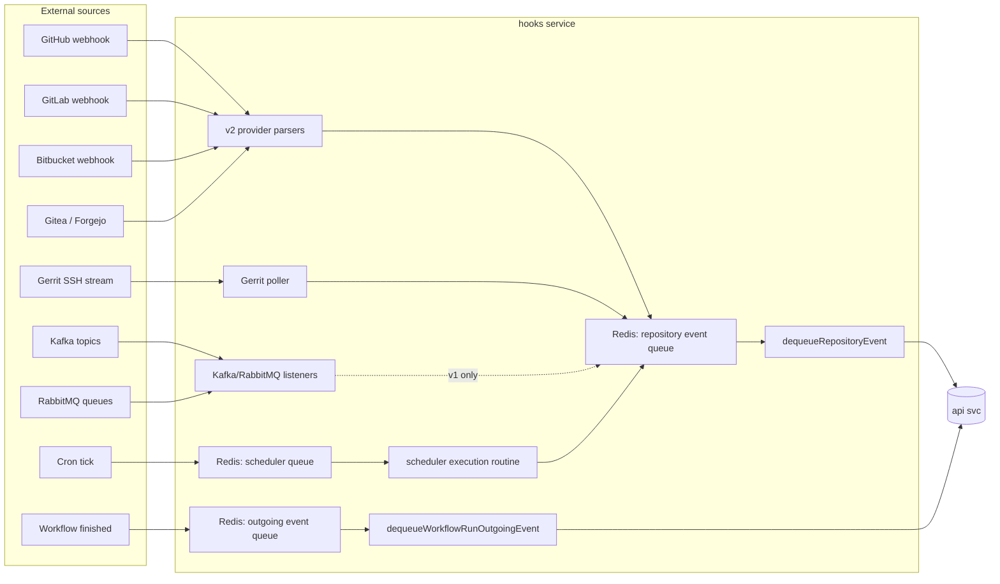
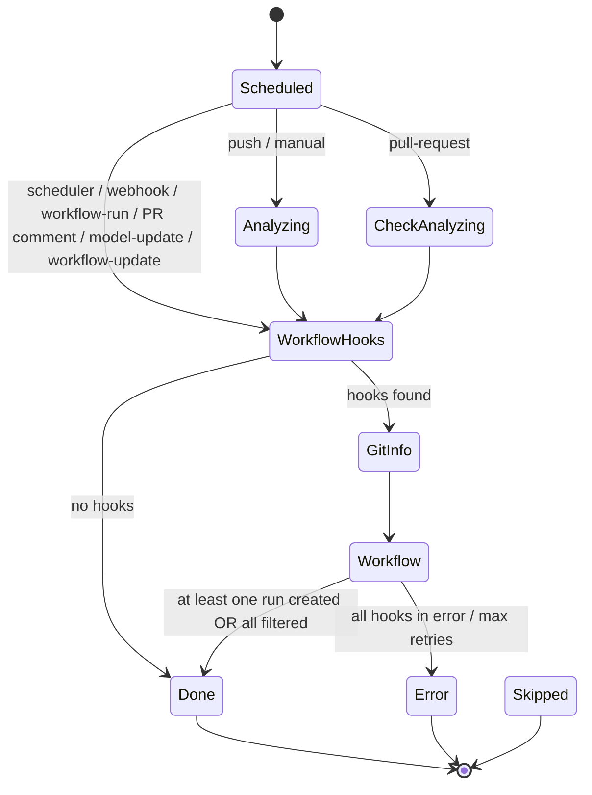
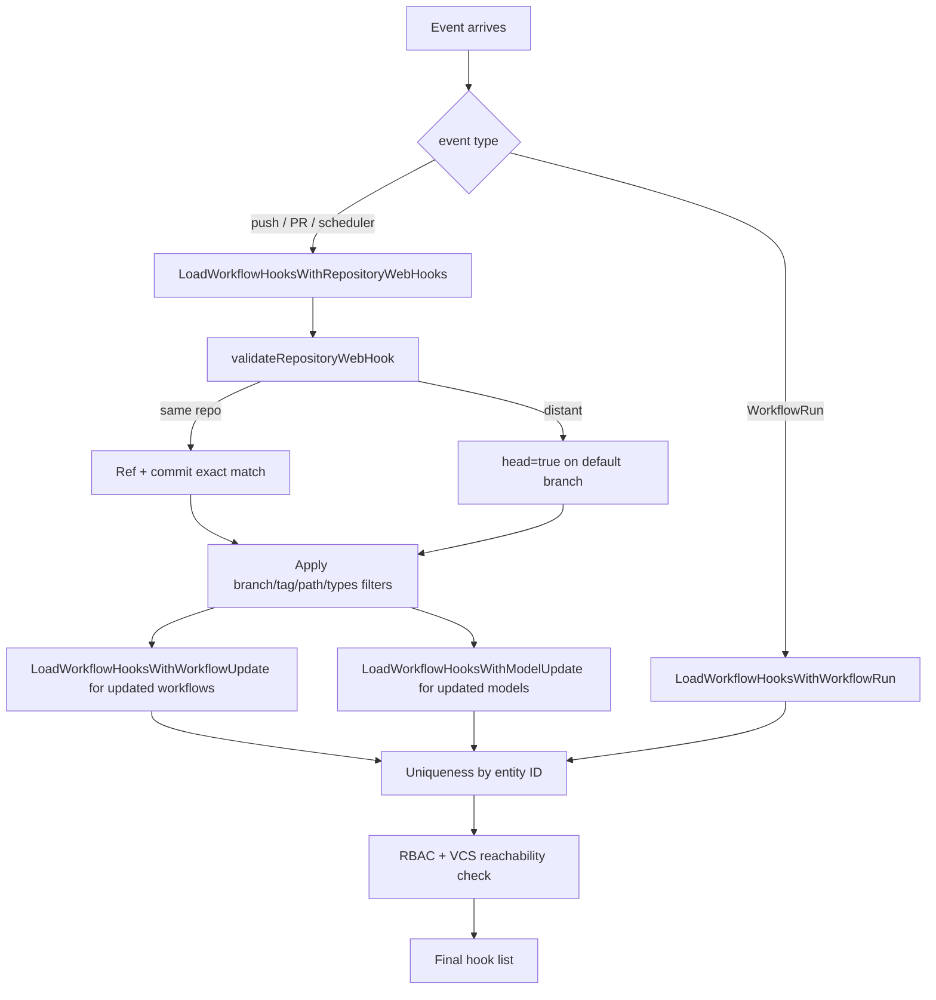

# Hooks (workflow v2)

This document specifies the **v2 hook subsystem** of CDS and the shared
hooks-service infrastructure that hosts it. It covers the seven
`WorkflowHookType*` values; the `V2WorkflowHook` row model; the
`HookRepositoryEvent` state machine; per-provider webhook parsing on
the v2 path; the v2 HMAC secret model and the JWS-signed VCS-relay
endpoint; the v2 matching algorithm with HEAD discovery; the v2
scheduler with its resync routine; outgoing workflow-run events
(workflow-to-workflow chaining); the maintenance queue; the VCS
insight report; and the failure-mode / observability story.

The legacy v1 hook model (node-attached, `Task` /
`TaskExecution`-driven) is documented in
[`06a-hooks-v1.md`](./06a-hooks-v1.md). The YAML `on:` block syntax —
how a v2 workflow author declares its triggers — is documented in
[`04-workflow-v2.md`](./04-workflow-v2.md); this file specifies how the
declared triggers are persisted, matched and fired. The ascode entity
pipeline that materialises hook rows lives in
[`05-ascode-entities.md`](./05-ascode-entities.md); the run engine that
consumes the enqueued runs is in [`07b-run-engine-v2.md`](./07b-run-engine-v2.md).

Source code anchors. The hooks service entry point and lifecycle live
in `engine/hooks/hooks.go`; the HTTP router in
`engine/hooks/hooks_router.go`; the handlers in
`engine/hooks/hooks_handlers.go`; the in-memory DAO and counters in
`engine/hooks/dao.go`, `engine/hooks/dao_repository_event.go`,
`engine/hooks/dao_repository_event_callback.go`,
`engine/hooks/dao_repository_outgoing.go`; per-provider v2 parsers in
`engine/hooks/{github,gitlab,bitbucket_server,bitbucket_cloud,type_gitea,type_forgejo}.go`
(the `extractDataFrom*Request` family — distinct from the v1
`generatePayloadFrom*Request` family in the same files); scheduler
internals in `engine/hooks/scheduler_v2.go` and
`engine/hooks/scheduler_repository_event.go`; outgoing-event handling
in `engine/hooks/scheduler_workflow_run_outgoing_event.go`; per-phase
handlers in `engine/hooks/trigger_*.go`. The API-side hook matching
lives in `engine/api/v2_hooks.go`; v2 hook DAO in
`engine/api/workflow_v2/dao_workflow_hook.go`; ascode materialisation
in `engine/api/v2_repository_analyze.go`.

## 1. Scope

**In scope** — Hooks-service architecture (shared with v1); the seven
`WorkflowHookType*` values; `V2WorkflowHook` persistence and the
`V2WorkflowHookData` substructure; per-provider webhook parsing on the
v2 path; HMAC-SHA256 secret management for direct provider webhooks;
the `HookRepositoryEvent` state machine
(`HookEventStatusScheduled` → `Analysis` → `CheckAnalysis` →
`WorkflowHooks` → `GitInfo` → `Workflow` → `Done` / `Error` /
`Skipped`); the v2 hook matching algorithm; HEAD discovery for distant
workflows; v2 schedulers with the resync mechanism; the maintenance
queue for operator-driven manual triggers; the VCS insight report;
outgoing workflow-run events for v2 chaining; failure modes and
retry semantics.

**Out of scope** — V1 hooks (see [`06a-hooks-v1.md`](./06a-hooks-v1.md));
the `on:` YAML schema and expression evaluation (see
[`04-workflow-v2.md`](./04-workflow-v2.md)); ascode entity persistence
and signature verification (see [`05-ascode-entities.md`](./05-ascode-entities.md));
run engine and crafting (see [`07b-run-engine-v2.md`](./07b-run-engine-v2.md));
VCS provider implementations (see [`13-vcs.md`](./13-vcs.md));
RBAC enforcement (see [`09-rbac.md`](./09-rbac.md)).

## 2. Table of contents

1. [Scope](#1-scope)
2. [Table of contents](#2-table-of-contents)
3. [Hooks service architecture](#3-hooks-service-architecture)
4. [HTTP routes and Redis topology](#4-http-routes-and-redis-topology)
5. [Per-provider webhook parsing](#5-per-provider-webhook-parsing)
6. [HMAC secret management](#6-hmac-secret-management)
7. [`HookRepositoryEvent` lifecycle](#7-hookrepositoryevent-lifecycle)
8. [The seven v2 hook types](#8-the-seven-v2-hook-types)
9. [V2 hook matching algorithm](#9-v2-hook-matching-algorithm)
10. [HEAD discovery](#10-head-discovery)
11. [Scheduler v2 internals](#11-scheduler-v2-internals)
12. [Outgoing events (workflow-run chaining)](#12-outgoing-events-workflow-run-chaining)
13. [Maintenance mode](#13-maintenance-mode)
14. [VCS Insight report](#14-vcs-insight-report)
15. [Failure modes and observability](#15-failure-modes-and-observability)
16. [Cross-spec pointers](#16-cross-spec-pointers)

## 3. Hooks service architecture

The hooks service is the ingress for every event that can start a
workflow run, v1 or v2. This section documents the **shared**
infrastructure — the v1 doc cross-references it instead of duplicating
it. Its entry point is `Serve` in `engine/hooks/hooks.go`. The service
state lives on the `Service` struct, configured by the `Configuration`
struct in `engine/hooks/types.go:40-76`, which holds a Redis cache, an
HTTP router, an API client, the public key used to validate signed
inbound webhooks (`WebHooksParsedPublicKey`), and the maintenance flag.



### 3.1 Background goroutines

`Serve` spawns the following long-running goroutines, each owning one
queue or one housekeeping concern.

| Goroutine | Layer | Purpose |
| --- | --- | --- |
| `dequeueRepositoryEvent` | v2 | Drain the main repository-event queue and run the state machine for each event |
| `dequeueMaintenanceRepositoryEvent` | v2 | Drain the maintenance-mirror queue — never paused, even during maintenance |
| `dequeueWorkflowRunOutgoingEvent` | v2 | Drive outgoing workflow-run events (chained workflows) |
| `dequeueRepositoryEventCallback` | v2 | Apply asynchronous callbacks from the API (analysis, git operations) |
| `manageOldRepositoryEvent` | v2 | Re-enqueue events that have been stuck in-progress for too long |
| `manageOldOutgoingEvent` / `manageOldWorkflowRunOutgoingEvent` | v2 | Same, for outgoing events |
| `cleanRepositoryEvent` | v2 | TTL-driven purge of expired events |
| `schedulerExecutionRoutine` | v2 | Fire v2 schedulers when their next-execution time elapses |
| `runTasks` | v1 | Drive the v1 `Task` lifecycle (Kafka / RabbitMQ / Gerrit listeners, scheduler / poller scheduling) |
| `runScheduler` | v1 | Drive the v1 scheduled-task queue (retry, enqueue, delete, dequeue) |
| `listenMaintenance` | shared | React to maintenance pub/sub broadcast |

The v1 lifecycle is documented in
[`06a-hooks-v1.md`](./06a-hooks-v1.md#6-runtime-loops-runtasks-and-runscheduler).

### 3.2 Metrics

The DAO layer (`engine/hooks/dao.go`,
`engine/hooks/dao_repository_event.go`,
`engine/hooks/dao_repository_outgoing.go`) keeps in-memory counters for
every enqueue / dequeue operation on every queue, plus a
`MaintenanceQueue` gauge for the maintenance-mirror size. Prometheus
scrapes these counters; they let operators see queue throughput at a
glance and detect a stuck consumer (enqueue growing, dequeue flat)
without inspecting Redis directly. Per-queue helpers:
`RepositoryEventBalance`, `WorkflowRunOutgoingEventBalance`,
`TaskExecutionsBalance`.

## 4. HTTP routes and Redis topology

### 4.1 Routes

The hooks service exposes the following v2 endpoints
(`engine/hooks/hooks_router.go`). V1 routes (`/webhook/{uuid}` and
`/task/*`) are listed in
[`06a-hooks-v1.md`](./06a-hooks-v1.md#11-http-routes-webhook-and-task).

Event reception:

| Method | Route | Auth | Handler | Purpose |
| --- | --- | --- | --- | --- |
| POST | `/v2/webhook/repository` | JWS (internal CDS public key) | `repositoryHooksHandler` | v2 multi-provider repository webhook relayed by the VCS service |
| POST | `/v2/webhook/repository/{projectKey}/{vcsServerType}/{vcsServer}/{uuid}` | HMAC-SHA256 (`X-Hub-Signature-256`) | `repositoryWebHookHandler` | v2 repository webhook posted directly by a provider |
| POST | `/v2/webhook/workflow/{projectKey}/{vcsServer}/{repoName}/{workflowName}/{uuid}` | HMAC-SHA256 (`X-Hub-Signature-256`) | `workflowWebHookHandler` | Dedicated workflow webhook; raw body preserved as payload |
| POST | `/v2/workflow/manual` | service | `workflowManualHandler` | Manual run from API / UI / CLI |
| POST | `/v2/workflow/outgoing` | service | `workflowRunOutgoingEventHandler` | Outgoing workflow-run event (cross-workflow chaining) |

Callbacks:

| Method | Route | Auth | Handler |
| --- | --- | --- | --- |
| POST | `/v2/repository/event/callback` | service | `postRepositoryEventAnalysisCallbackHandler` |

Consultation and administration:

| Method | Route | Auth | Purpose |
| --- | --- | --- | --- |
| GET | `/v2/repository` | service | List repositories |
| GET | `/v2/repository/event/{vcsServer}/{repoName}` | service | List events for a repository |
| GET | `/v2/repository/event/{vcsServer}/{repoName}/{uuid}` | service | Event details |
| DELETE | `/v2/repository/event/{vcsServer}/{repoName}` | service | Delete events for a repository |
| DELETE | `/v2/workflow/outgoing/{projectKey}` | service | Delete outgoing events for a project |
| POST | `/admin/repository/event/{vcsServer}/{repoName}/{uuid}/stop` | service | Force stop an event |
| POST | `/admin/repository/event/{vcsServer}/{repoName}/{uuid}/restart` | service | Restart an event |
| DELETE | `/admin/repository/{vcsServer}/{repoName}` | service | Delete a repository |
| POST | `/admin/maintenance` | service | Toggle maintenance mode (`postMaintenanceHandler`) — **shared with v1** |

Scheduler administration:

| Method | Route | Auth | Purpose |
| --- | --- | --- | --- |
| POST | `/v2/workflow/scheduler` | service | `postInstantiateSchedulerHandler` — register schedulers |
| DELETE | `/v2/workflow/scheduler/{vcsServer}/{repoName}/{workflowName}` | service | `deleteSchedulerByWorkflowHandler` |
| POST | `/admin/scheduler/resync` | service | `postResyncSchedulersHandler` — full reconciliation |
| GET | `/admin/scheduler` | service | List all schedulers |
| GET | `/admin/scheduler/{vcsServer}/{repoName}/{workflowName}` | service | List schedulers for a workflow |
| GET | `/admin/scheduler/execution/{hookID}` | service | Get the planned execution of a scheduler |
| DELETE | `/admin/scheduler/execution/{hookID}` | service | Delete a specific scheduler execution |

Webhook secret management (see [section 6](#6-hmac-secret-management)):

| Method | Route | Auth | Purpose |
| --- | --- | --- | --- |
| POST | `/v2/repository/key/{projectKey}/{vcsServer}/{repoName}` | service | Generate secret for a repository webhook |
| POST | `/v2/workflow/key/{projectKey}/{vcsServer}/{repoName}/{workflowName}` | service | Generate secret for a workflow webhook |

Outgoing-event administration:

| Method | Route | Auth | Purpose |
| --- | --- | --- | --- |
| GET | `/admin/outgoing/{projectKey}/{vcsServer}/{repoName}/{workflowName}` | service | List outgoing-event executions for a workflow |
| GET | `/admin/outgoing/{projectKey}/{vcsServer}/{repoName}/{workflowName}/{hookID}` | service | Single outgoing-event execution |

### 4.2 Redis keys (v2)

The v2 share of the hooks-service Redis key space:

| Key | Purpose |
| --- | --- |
| `hooks:queue:repository:event` | Main repository-event queue |
| `hooks:queue:repository:event:maintenance` | Mirrored queue used while maintenance is active |
| `hooks:queue:repository:event:callback` | Async-callback queue |
| `hooks:queue:repository:event:inprogress` | In-progress event tracker |
| `hooks:queue:repository:outgoing` | Outgoing-event queue |
| `hooks:queue:repository:outgoing:inprogress` | In-progress outgoing tracker |
| `hooks:events:repository` | Event payload storage |
| `hooks:events:lock` | Per-event distributed lock |
| `hooks:outgoing:repository` | Outgoing-event storage |
| `hooks:outgoing:lock` | Per-outgoing-event lock |
| `hooks:repository` | Repository metadata cache |
| `hooks:v2:definition:schedulers` | Scheduler definitions |
| `hooks:queue:schedulers` | Ordered set of next scheduler executions |
| `hooks:v2:executions:lock:<whID>` | Per-scheduler execution lock |

Shared with v1:

| Key | Purpose |
| --- | --- |
| `cds_maintenance_hook` | Maintenance flag (Redis value) |
| `cds_maintenance_queue_hook` | Maintenance pub/sub channel |

V1 keys (`hooks:tasks*`, `hooks:scheduler:queue`, `hooks:gerrit:repo`,
`hooks:lock:repository`) are listed in
[`06a-hooks-v1.md`](./06a-hooks-v1.md#12-redis-layout-for-v1).

All events are stored under TTL so a service restart cannot lose them
silently and a slow consumer cannot accumulate indefinitely.

## 5. Per-provider webhook parsing

Every supported VCS provider has its own v2 parser. The router
dispatches by VCS type to the right parser, which validates the
request signature, then calls `extractDataFromPayload`
(`engine/hooks/hook_repository_event.go`) to translate the native
event into a canonical bag of variables.

Two authentication modes coexist, depending on the entry route:

| Route | Auth model |
| --- | --- |
| `/v2/webhook/repository` (`repositoryHooksHandler`) | The request is signed with the **internal CDS public key**, because the CDS VCS service is the relayer (the provider does not call the hooks service directly). |
| `/v2/webhook/repository/{projectKey}/{vcsServerType}/{vcsServer}/{uuid}` (`repositoryWebHookHandler`) | **HMAC-SHA256** with a shared secret known to the provider and the project. The event is scoped to the project named in the URL. |
| `/v2/webhook/workflow/{…}` (`workflowWebHookHandler`) | Same HMAC-SHA256 model, but the URL additionally points at a workflow; the raw body is preserved as a payload accessible in the run context. |

Per-provider v2 parsers (the `extractDataFrom*Request` family —
distinct from the v1 `generatePayloadFrom*Request` family in the same
files):

| Provider | File | Event header | Notes |
| --- | --- | --- | --- |
| GitHub | `engine/hooks/github.go` | `X-Github-Event` | Single payload per event |
| GitLab | `engine/hooks/gitlab.go` | `X-Gitlab-Event` | Detects branch / tag deletions via an all-zero SHA |
| Bitbucket Server | `engine/hooks/bitbucket_server.go` | `X-Event-Key` | Iterates over `changes[]` — one push event can produce N payloads |
| Bitbucket Cloud | `engine/hooks/bitbucket_cloud.go` | `X-Event-Key` | Cloud-specific layout |
| Gitea | `engine/hooks/type_gitea.go` | `X-Gitea-Event` | |
| Forgejo | `engine/hooks/type_forgejo.go` | `X-Forgejo-Event` (+ `X-Forgejo-Event-Type`) | |
| Gerrit | `engine/hooks/gerrit.go` (SSH stream) | n/a | Shares the v1 listener; events are also processed by v2 when a matching `V2WorkflowHook` is registered |

### 5.1 Output: payload variables

Each parser produces the same canonical bag of variables
(`engine/hooks/variable.go`). These variables are what the engine
reads when matching hooks and what it feeds into the `git.*` context
at run time.

| Variable | Meaning |
| --- | --- |
| `git.hook` | Event name (`push`, `pull_request`, `comment-added`, …) |
| `git.author` / `git.author.email` | Commit author |
| `git.branch` | Branch name (stripped of `refs/heads/`) |
| `git.branch.before` / `git.branch.dest` | PR source / target branches (Bitbucket) |
| `git.tag` | Tag name when `ref` is `refs/tags/…` |
| `git.hash`, `git.hash.short`, `git.hash.before` | Commit SHAs |
| `git.repository`, `git.repository.before`, `git.repository.dest` | Repo identifiers |
| `git.message` | Commit message |
| `git.pr.id`, `git.pr.title`, `git.pr.state`, `git.pr.comment` | PR metadata |
| `git.pr.reviewer`, `git.pr.reviewer.status` | PR reviewer info |
| `cds.triggered_by.username`, `cds.triggered_by.fullname`, `cds.triggered_by.email` | Identity |

## 6. HMAC secret management

The two HMAC-signed routes (`/v2/webhook/repository/...` and
`/v2/webhook/workflow/...`) verify the `X-Hub-Signature-256` header
against a per-hook HMAC-SHA256 key derived from a service-wide secret
(`Cfg.RepositoryWebHookKey`) and the URL coordinates. The key
generation endpoints return the secret to the API once at registration
time; the secret is never stored on the hooks side.

| Handler | File / lines | Output |
| --- | --- | --- |
| `postGenerateRepositoryWebHookSecretHandler` | `engine/hooks/hooks_handlers.go:42-56` | `sdk.GeneratedWebhook{Key, UUID, HookPublicURL}` derived via `sdk.GenerateRepositoryWebHookSecret(svcKey, projectKey, vcs, repo, uuid)` |
| `postGenerateWorkflowWebHookSecretHandler` | `engine/hooks/hooks_handlers.go:24-40` | Same, with `workflowName` added via `sdk.GenerateWorkflowWebHookSecret(svcKey, projectKey, vcs, repo, workflow, uuid)` |

Middleware signature verification:

| Middleware | Route | Lines |
| --- | --- | --- |
| `CheckRepositoryHmac256Signature("X-Hub-Signature-256")` | `/v2/webhook/repository/{…}` | `engine/hooks/hooks_router.go:116-150` |
| `CheckWorkflowHmac256Signature("X-Hub-Signature-256")` | `/v2/webhook/workflow/{…}` | `engine/hooks/hooks_router.go:81-113` |

Both reconstruct the per-hook key from the URL parameters, recompute
the HMAC over the request body, and compare with the header value via
`checkHmac246Signature` (`engine/hooks/hooks_router.go:161`).

## 7. `HookRepositoryEvent` lifecycle

Every event entering the v2 subsystem becomes a `HookRepositoryEvent`
(defined in `sdk/hooks_repository_event.go:133-150`) — the central
object of the v2 pipeline. The struct carries the raw VCS body, the
parsed `ExtractData`, the current status, retry counters, last error
message, the `IsInMaintenance` flag, and the list of matched hooks
once analysis is complete. The state machine drives the event from
reception to the start of one or more workflow runs.

### 7.1 Status machine

The `HookEventStatus*` constants are in
`sdk/hooks_repository_event.go:64-72`.

The state labels in the diagram below are the **persisted string
values** stored in the DB / logs (not the Go constant names; see the
table that follows for the mapping).



| Go constant | Persisted value | Meaning |
| --- | --- | --- |
| `HookEventStatusScheduled` | `Scheduled` | Initial state |
| `HookEventStatusAnalysis` | `Analyzing` | Repository analysis pending or in progress |
| `HookEventStatusCheckAnalysis` | `CheckAnalyzing` | Confirming an existing analysis (PR events) |
| `HookEventStatusWorkflowHooks` | `WorkflowHooks` | Matching workflow hooks |
| `HookEventStatusGitInfo` | `GitInfo` | Fetching commit signature + git context |
| `HookEventStatusWorkflow` | `Workflow` | Triggering workflows |
| `HookEventStatusDone` | `Done` | Terminal: success |
| `HookEventStatusError` | `Error` | Terminal: error |
| `HookEventStatusSkipped` | `Skipped` | Terminal: skipped |

### 7.2 Entry points

Five HTTP handlers create events (all in
`engine/hooks/hooks_handlers.go`):

1. **Internal VCS webhook** — `repositoryHooksHandler`. The VCS service
   relays provider events; the handler extracts and normalises data
   per provider, then persists the event.
2. **Direct VCS webhook** — `repositoryWebHookHandler`. A provider
   posts directly with an HMAC-SHA256 signature. The created event is
   restricted to the project named in the URL.
3. **Dedicated workflow webhook** — `workflowWebHookHandler`. Same as
   above, but the URL targets a specific workflow. The created event
   has type `webhook`; the raw HTTP body is preserved as a payload
   accessible in the run context.
4. **Manual trigger** — `workflowManualHandler`. UI or CLI requests
   carrying project + workflow + target ref/commit + optional job
   inputs. The created event has type `manual`.
5. **Outgoing workflow-run event** — `workflowRunOutgoingEventHandler`.
   When a workflow finishes, the engine publishes an outgoing event.
   An intermediate `HookWorkflowRunOutgoingEvent` (see
   [section 12](#12-outgoing-events-workflow-run-chaining)) is
   processed first; it resolves the matching `WorkflowRun` hooks then
   creates a pre-populated `HookRepositoryEvent`.

The common creation flow:

1. Build the `HookRepositoryEvent` with status
   `HookEventStatusScheduled`.
2. Extract and normalise VCS-specific data (webhooks).
3. Save the event in the Redis cache.
4. `EnqueueRepositoryEvent` routes to the right queue
   (standard vs maintenance — see [section 13](#13-maintenance-mode)).

### 7.3 Processing pipeline

The `dequeueRepositoryEvent` loop
(`engine/hooks/scheduler_repository_event.go`) pops one event from
the queue, acquires a 30-second distributed lock keyed by event UUID
(in `hooks:events:lock`), and runs the state machine via
`manageRepositoryEvent` → `executeEvent`. After a phase advances, the
state is persisted and the event is re-enqueued for the next
iteration. The lock is released at the end of every iteration,
success or failure.

Per-phase handlers (in `engine/hooks/trigger_*.go`):

| Phase | Handler | Purpose |
| --- | --- | --- |
| `Analysis` | `triggerAnalyses` | Multi-project analysis (see [section 7.4](#74-analysing-repository-analysis)) |
| `CheckAnalysis` | `triggerCheckAnalyses` | Verify existing analyses (PR events) |
| `WorkflowHooks` | `triggerGetWorkflowHooks` | Resolve hooks to trigger |
| `GitInfo` | `triggerGetGitInfo` | Fetch semver, changesets, commit message |
| `Workflow` | `triggerWorkflows` | Create workflow runs on the API |

The workflow-hook resolution step calls back into the API at
`POST /v2/hooks/workflows`, handled by
`postRetrieveWorkflowToTriggerHandler` (`engine/api/v2_hooks.go`).

### 7.4 Analysing (repository analysis)

This phase applies to `push` and `manual` events. The hooks service
lists every CDS project associated with the repository via the API,
then for each project sends an analysis request. The API clones the
repository at the given commit, verifies the commit signature, scans
`.cds/`, and discovers entities (see
[`05-ascode-entities.md`](./05-ascode-entities.md)).

When the API-side analysis completes, it posts to
`/v2/repository/event/callback` (`postRepositoryEventAnalysisCallbackHandler`)
with: discovered workflows, discovered models, skipped workflows,
skipped hooks, analysis status, initiator identity, signing key. The
callback is enqueued in `hooks:queue:repository:event:callback` and
applied by `dequeueRepositoryEventCallback`, which updates the event
with the results. On the next iteration, if **all** analyses are
complete, the event transitions to `WorkflowHooks`. A per-project
analysis error does not abort the others.

### 7.5 CheckAnalysing

This phase applies to `pull-request` events. The corresponding `push`
already triggered an analysis; this phase verifies the analysis
exists at the PR commit and is complete. For each project, the
analysis is looked up. If it is not yet found, a retry counter is
incremented; once a maximum is reached, the missing analysis is
marked in error. Once all expected analyses are complete, the event
transitions to `WorkflowHooks`.

### 7.6 WorkflowHooks (hook resolution)

Behaviour depends on the event type (`triggerGetWorkflowHooks` in
`engine/hooks/trigger_workflow_hook.go:15`):

- **`push`, `pull-request`, `pull-request-comment`** — call the API
  to obtain the list of matching workflow hooks. The API examines
  workflows of the concerned projects and returns those whose `on:`
  configuration matches the event (event name, type, ref, branch /
  tag filters).
- **`manual`** — load the target workflow entity from the API,
  verify it exists, build a single `WorkflowHookTypeManual` hook.
- **`webhook`** — like manual, target the workflow named in the URL.
- **`scheduler`** — build a single `WorkflowHookTypeScheduler` hook
  with the cron metadata (target VCS / repository / workflow, cron
  expression, timezone).
- **`workflow-run`** — hooks were pre-populated at event creation by
  the outgoing-event processing. The workflow entity is loaded to
  obtain the initiator's identity.

If no hooks are found → `HookEventStatusDone`. Otherwise → `GitInfo`.

### 7.7 GitInfo (git information retrieval)

For each matched hook, the hooks service asks the API for: current
and next semver, changesets (files modified between source and target
commit), and the commit message. The API creates a git operation
(clone, semver computation from tags, changeset extraction). When the
operation completes, the result returns via a callback — or, if the
callback never arrives, the next pass through `GitInfo` directly
queries the operation status. Each hook is enriched with: current /
next semver, modified files, commit message, author and email, target
commit.

If all hooks have their information → `Workflow`. A failing git
operation is retried a bounded number of times before being marked in
error.

### 7.8 Workflow (workflow-run triggering)

The last active phase creates workflow runs on the API.

1. **Initiator resolution** — if the initiator is not yet known, the
   hooks service calls the API to map the commit's GPG signing key to
   a CDS user. If no user is found and the workflow does not disable
   signature verification (`InsecureSkipSignatureVerify`), the hook
   is marked skipped.
2. **For each hook**:
   - **Path filter** — if the hook declares path filters, they are
     applied to the changesets. No match → skipped with reason
     *"no file matches path filters"*.
   - **Commit-message filter** — if the hook declares a commit
     filter, the commit message is validated. CI-skip keywords
     (`[skip ci]`, `[ci skip]`, …) are also checked. No match →
     skipped with reason *"commit message does not match commit
     filter or contains a skip-CI directive"*.
   - On success, send a workflow-run-create request to the API with
     the full metadata (ref, sha, semver, changesets, event payload,
     hook type, initiator identity). The API creates the
     `V2WorkflowRun` and enters the crafting phase
     ([`07b-run-engine-v2.md`](./07b-run-engine-v2.md)). The hooks service
     receives the new run's ID and number.
3. **Final status**:
   - At least one run created → `HookEventStatusDone`.
   - All hooks in error → `HookEventStatusError`.
   - All hooks filtered out → `HookEventStatusDone` (no runs but no
     errors either).

## 8. The seven v2 hook types

Each row in the v2 workflow-hook table (`v2_workflow_hook`) is one
`V2WorkflowHook` (`sdk/v2_workflow.go:474-486`). The
`WorkflowHookType*` constants (`sdk/v2_workflow.go:17-25`):

| # | Constant | Value | Created by | Triggered by | Persisted |
| --- | --- | --- | --- | --- | --- |
| 1 | `WorkflowHookTypeRepository` | `RepositoryWebHook` | YAML analysis | VCS push / PR / comment | yes |
| 2 | `WorkflowHookTypeWorkerModel` | `WorkerModelUpdate` | YAML analysis on default branch (distant workflow) | Commit modifying a `.cds/worker-models/*.yml` | yes |
| 3 | `WorkflowHookTypeWorkflow` | `WorkflowUpdate` | YAML analysis on default branch (distant workflow) | Commit modifying the workflow file | yes |
| 4 | `WorkflowHookTypeManual` | `Manual` | not persisted | REST manual run | no |
| 5 | `WorkflowHookTypeWebhook` | `Webhook` | Manual setup | Generic HTTP webhook into the hooks service | yes (project webhook) |
| 6 | `WorkflowHookTypeScheduler` | `Scheduler` | YAML analysis (default branch HEAD) | Cron tick | yes (+ Redis tick queue) |
| 7 | `WorkflowHookTypeWorkflowRun` | `WorkflowRun` | YAML analysis (default branch HEAD) | Another workflow finishes | yes |

The `V2WorkflowHook` row carries:

```go
// sdk/v2_workflow.go:474-486
type V2WorkflowHook struct {
    ID             string
    ProjectKey     string
    VCSName        string
    RepositoryName string
    EntityID       string
    WorkflowName   string
    Ref            string
    Commit         string
    Type           string             // one of WorkflowHookType*
    Data           V2WorkflowHookData
    Head           bool
}
```

The `Data` field is a typed JSON blob carrying trigger-specific
configuration (`sdk/v2_workflow.go:499-516`):

```go
type V2WorkflowHookData struct {
    VCSServer                   string
    RepositoryName              string
    RepositoryEvent             WorkflowHookEventName // push, pull-request, …
    Model                       string
    CommitFilter                string
    BranchFilter                []string
    TagFilter                   []string
    PathFilter                  []string
    TypesFilter                 []WorkflowHookEventType
    TargetBranch                string
    TargetTag                   string
    Cron                        string
    CronTimeZone                string
    WorkflowRunName             string
    WorkflowRunStatus           []string
    InsecureSkipSignatureVerify bool
}
```

Helper `V2WorkflowHookData.ValidateRef(ctx, ref) bool`
(`sdk/v2_workflow.go:518`) applies the branch/tag filters when
matching.

### 8.1 Creation rules at analysis time

When the ascode analyser persists an entity, `prepareWorkflowHooks`
(`engine/api/v2_repository_analyze.go:882-1164`) materialises hooks
subject to the following rules:

- **Push, pull-request, pull-request-comment** — create a
  `RepositoryWebHook` when the workflow declares the matching trigger
  **and** either it is co-located with the repo it watches, or the
  analysed ref is the default branch.
- **`WorkflowUpdate`** — only created when the workflow is **distant**
  (lives in a different repo than the one it watches) and the
  analysis is on the default branch.
- **`WorkerModelUpdate`** — same condition as `WorkflowUpdate`, with
  a per-model entry parsed from `on.model-update.models` (the model
  reference may be 1, 3, 4, or 5 dotted parts, expanded to
  `vcs/repo/model`).
- **`Scheduler`** — created when the analysis is on the default
  branch at HEAD and the workflow declares a schedule.
- **`WorkflowRun`** — same default-branch / HEAD condition with a
  non-empty `workflow_run` trigger.

`Manual` is the only type with no persistence — it is conjured on the
fly when a user triggers a run.

The companion routine `manageWorkflowHooks`
(`engine/api/v2_repository_analyze.go:1174-1220`) drops stale
`Scheduler` and `WorkflowRun` rows by loading them via
`LoadHookByWorkflowAndType` and instructing the hooks service to
clean up the corresponding Redis state.

## 9. V2 hook matching algorithm

The API handler `postRetrieveWorkflowToTriggerHandler`
(`engine/api/v2_hooks.go:252-335`) accepts a request carrying the
event UUID, ref and commit, PR target ref (if applicable), the lists
of touched workflow and model entities, the list of changed paths,
the event name and type, the VCS and repository names, and the list
of already-analysed project keys. It returns the list of hooks to
trigger.



### 9.1 Steps in detail

1. **Repository webhooks** —
   `LoadWorkflowHooksWithRepositoryWebHooks`
   (`engine/api/v2_hooks.go:422`) loads rows of type
   `RepositoryWebHook` matching the event's VCS server, repository,
   and event name. Each candidate is then validated by
   `validateRepositoryWebHook` (`engine/api/v2_hooks.go:590`):
   - Same repository → strict ref + commit match (the hook must be
     persisted at the exact commit of the event).
   - Distant repository → the hook row must be marked HEAD on the
     default branch.
   - Per-event additional filters: branch filter, tag filter, types
     filter, path filter, commit filter — all matched against the
     event metadata.
2. **Workflow updates** — `LoadWorkflowHooksWithWorkflowUpdate`
   (`engine/api/v2_hooks.go:356`) loads hooks declared by other
   workflows that watch any of the workflows touched by the event.
3. **Worker model updates** — `LoadWorkflowHooksWithModelUpdate`
   (`engine/api/v2_hooks.go:339`) does the same for worker models.
   The hook's data is keyed by `{projectKey}/{vcs}/{repo}/{modelName}`.
4. **Workflow run hooks** — `LoadWorkflowHooksWithWorkflowRun`
   (`engine/api/v2_hooks.go:372`), taken only for events of type
   `WorkflowRun`.
5. **Deduplication** — combine the three sources and deduplicate by
   entity ID.
6. **RBAC and reachability** — for each surviving hook, check that
   the project still has authorisation and that the VCS server can
   reach the repository; otherwise drop the hook silently.
7. **Fallback** — if step 1 returns nothing and the event was
   previously seen but skipped, the algorithm tries
   `LoadHookHeadRepositoryWebHookByWorkflowAndEvent` on the same ref
   with HEAD, then on the default branch. This is the "last resort"
   path that lets a freshly pushed workflow file react to events that
   arrived in the same batch.

### 9.2 Per-event additional rules

- **Push** — validate the event ref against the branch and tag
  filters.
- **Pull request / pull-request-comment** — validate the PR target
  ref against the filters, plus a types filter matching `opened`,
  `closed`, `created`, etc.

## 10. HEAD discovery

The semantics of the `Head` flag on a hook row are what make a
workflow respond to events triggered from arbitrary branches.

- **Same-repo workflow** — the hook row at the **exact event commit**
  is the authoritative one. The HEAD flag is ignored.
- **Distant workflow** — only the row marked HEAD on the default
  branch is considered. The platform refuses to dispatch a distant
  workflow off a stale commit, because the recipient project owns its
  own update cadence.

When the ascode analyser writes a new entity (see
[`05-ascode-entities.md`](./05-ascode-entities.md)), it flips the
previous HEAD row to non-HEAD and inserts the new one as HEAD. The
hook rows that the analyser creates inherit the same HEAD flag, so
the matching algorithm naturally picks up the new version on the next
event.

## 11. Scheduler v2 internals

V2 schedulers are cron expressions declared in the `on.schedule:`
block. The hooks service stores their definitions in Redis and a
goroutine fires them when the next-execution time elapses. The full
implementation lives in `engine/hooks/scheduler_v2.go` and
`engine/hooks/scheduler_repository_event.go`.

### 11.1 Lifecycle

```mermaid
sequenceDiagram
  participant API as api svc
  participant Hooks as hooks svc
  participant Redis
  participant Loop as scheduler execution routine
  participant EventQ as repository event queue
  API->>Hooks: POST /v2/workflow/scheduler (postInstantiateSchedulerHandler)
  Hooks->>Redis: persist scheduler definition (instantiateScheduler)
  Hooks->>Hooks: compute next execution (cron + timezone)
  Hooks->>Redis: store next execution (createSchedulerNextExecution)
  loop every 10s
    Loop->>Redis: load executions where next <= now
    Loop->>Loop: enqueueSchedulerAsHookRepositoryEvent
    Loop->>Redis: distributed lock 20s on hooks:v2:executions:lock:<whID>
    Loop->>EventQ: enqueue repository event of kind scheduler
    Loop->>Redis: reschedule next execution
  end
```

**Creation.** When a push lands on the default branch of a repository,
the API analyses the repository content. If it detects `Scheduler`
hooks, it deletes the old schedulers (by calling the hooks service),
saves the new hooks in the database, and calls
`POST /v2/workflow/scheduler` on the hooks service to instantiate
them. The hooks service:

- deletes every old definition and planned execution for the workflow,
- creates each new scheduler definition in Redis
  (`instantiateScheduler`, `engine/hooks/scheduler_v2.go:22-55`),
- computes the next execution from the cron expression and configured
  timezone (`createSchedulerNextExecution`,
  `engine/hooks/scheduler_v2.go:57-80`).

**Execution.** The background routine launched at startup wakes
every 10 seconds. For each execution whose time has passed:

1. Acquire a 20-second Redis lock on
   `hooks:v2:executions:lock:<whID>` to prevent double triggers in
   multi-instance environments.
2. Verify the scheduler definition still exists locally in Redis.
3. Verify the hook still exists API-side. If it has been deleted,
   remove the definition and the execution (orphan cleanup).
4. Build a `HookRepositoryEvent` of type `scheduler`, save it,
   enqueue it.
5. Recompute and persist the next execution.

The event then follows the standard repository-event pipeline
(analysis, hook resolution, workflow-run creation).

**Update.** A new push to the default branch triggers a re-analysis.
The process is identical to creation: old schedulers are deleted, new
ones are instantiated.

**Deletion.** Triggered in three cases: workflow deletion, project
deletion, manual administrative deletion. Removes the scheduler
definition and its planned execution from Redis.

### 11.2 Cron format and timezone

Cron expressions are parsed in extended format (5 to 7 fields) via
the `github.com/gorhill/cronexpr` library — the same library used by
v1 schedulers, but with independent parser instances. An optional
timezone can be associated with each scheduler. If specified, the
next execution is computed in that timezone; otherwise the server's
local time is used. Daylight savings transitions are honoured.

### 11.3 Fault tolerance

- **Distributed lock** — each trigger takes a 20-second Redis lock,
  preventing double executions across hooks replicas.
- **API-side verification** — before each trigger, the hooks service
  verifies the hook still exists API-side. This auto-cleans
  schedulers whose workflow or entity was deleted without the hooks
  service being notified.
- **Maintenance mode** — when the hooks service enters maintenance,
  the trigger routine is paused.

### 11.4 Resynchronisation

A reconciliation mechanism ensures consistency between the Redis
state and the API database (source of truth).

- **Startup resync** — at hooks-service startup, a goroutine
  automatically runs a full resynchronisation. This handles cases
  where schedulers were created or deleted while the hooks service
  was down.
- **Manual resync** — `POST /admin/scheduler/resync`
  (`postResyncSchedulersHandler`) triggers a resync on demand.

The resync runs the following seven steps, protected by a dedicated
5-minute Redis lock to prevent concurrent reconciliations:

1. **Load source of truth** — read all scheduler hooks from the API
   database.
2. **Load Redis state** — read every scheduler definition and
   execution.
3. **Repository verification** — for each repository referenced by a
   scheduler, verify it exists in Redis (required for event
   processing to work).
4. **Add missing / update changed schedulers** — schedulers present
   API-side but missing from Redis are created; schedulers whose cron
   or timezone has changed are updated and their next execution
   recomputed.
5. **Remove orphaned schedulers** — schedulers present in Redis but
   absent API-side are deleted (with a double-check via API to
   confirm).
6. **Clean orphaned executions** — planned executions whose
   scheduler definition is gone are removed.
7. **Ensure pending executions** — verify that every scheduler in
   the API database has a corresponding planned execution in Redis.

## 12. Outgoing events (workflow-run chaining)

V2 does not implement v1-style outgoing hooks (HTTP fire-and-forget
after a node — see
[`06a-hooks-v1.md`](./06a-hooks-v1.md#10-outgoing-hooks)). Instead,
when a v2 workflow finishes, the API publishes a workflow-run
outgoing event. The hooks service routes it back through the
standard pipeline as a `WorkflowRun` event.

When the engine notifies the hooks service via
`POST /v2/workflow/outgoing`, an intermediate
`HookWorkflowRunOutgoingEvent` object is created
(`sdk/hooks_repository_event.go:110-131`):

```go
type HookWorkflowRunOutgoingEvent struct {
    UUID                string
    Created             int64
    ProcessingTimestamp int64
    LastUpdate          int64
    Event               HookWorkflowRunEvent
    Status              string
    LastError           string
    NbErrors            int64
    HooksToTriggers     []HookWorkflowRunOutgoingEventHooks
}
```

`dequeueWorkflowRunOutgoingEvent`
(`engine/hooks/scheduler_workflow_run_outgoing_event.go`) then
processes the queue:

1. Pop one outgoing event.
2. Acquire a distributed lock on the event, check the retry counter
   (default max 30).
3. Ask the API for the list of `WorkflowRun` hooks matching the
   upstream run's git context.
4. For each match, create a `HookRepositoryEvent` carrying the
   upstream run's request as body, enqueue it, mark the outgoing
   event done.
5. On error, increment the retry counter and re-enqueue. After max
   retries, the outgoing event flips to error.

A companion watchdog `manageOldWorkflowRunOutgoingEvent` re-enqueues
outgoing events that have been stuck in progress for too long,
mirroring the repository-event retry behaviour.

Outgoing events persist in Redis under `hooks:outgoing:repository`
with a 7-day TTL by default.

## 13. Maintenance mode

Operators can enable maintenance mode through `POST /admin/maintenance`
(`postMaintenanceHandler`, `engine/hooks/hooks_handlers.go:1153-1171`,
plus `engine/hooks/maintenance.go:13-39` for the pub/sub
broadcast). The handler:

1. Writes the new boolean to Redis under `cds_maintenance_hook`.
2. Publishes the change to the `cds_maintenance_queue_hook` pub/sub
   channel so every replica updates its in-memory flag.
3. Toggles the `s.Maintenance` field on the local `Service` struct.

The main processing goroutines are paused while maintenance is
active, but **manual triggers performed by maintainers remain
possible** thanks to a dedicated queue.

### 13.1 What is paused

V2 routines that respect the flag:

- `dequeueRepositoryEvent` (`scheduler_repository_event.go:30-34`) —
  sleeps one minute on the flag.
- `schedulerExecutionRoutine` (`scheduler_v2.go:115-118`) — sleeps
  one minute on the flag.

V1 routines that respect the flag:

- `retryTaskExecutionsRoutine` (`scheduler.go:70-73`) — sleeps one
  minute on the flag.

What is **not** paused:

- `dequeueMaintenanceRepositoryEvent` — explicitly designed to keep
  processing manual events flagged `IsInMaintenance`.
- The Kafka, RabbitMQ and Gerrit listeners — they keep receiving and
  persisting `TaskExecution` rows that drain naturally once the
  retry routine resumes.

### 13.2 Maintenance queue

When a maintainer manually triggers a workflow while maintenance is
active:

1. `workflowManualHandler` detects maintenance is active and sets
   the `IsInMaintenance` flag on `ExtractData.Manual` of the event.
2. `EnqueueRepositoryEvent` (`engine/hooks/dao.go`) routes the event
   to the **dedicated maintenance queue**
   (`hooks:queue:repository:event:maintenance`) instead of the
   standard queue.
3. The **dedicated** goroutine `dequeueMaintenanceRepositoryEvent`
   continuously consumes that queue and is **never** paused.
4. The event follows the normal state machine (analysis, hook
   resolution, GitInfo, workflow-run triggering).

This mechanism allows unblocking an urgent deployment without
disabling global maintenance.

### 13.3 Maintenance retry

The retry goroutine respects maintenance mode: only events flagged
`IsInMaintenance` are re-enqueued; others wait for maintenance to
end.

### 13.4 Metric

The maintenance queue size is exposed as the `MaintenanceQueue`
Prometheus metric.

## 14. VCS Insight report

At the end of processing each event (except `workflow-run`), the
hooks service sends an Insight report to the VCS provider via the
API. This report is displayed on the commit or pull-request page on
the VCS side and contains:

- The overall event status.
- Details of each triggered analysis, with a link to the repository
  settings in the CDS UI.
- Details of each triggered workflow run, with a link to the run in
  the CDS UI.

If the number of analyses or workflows is too large, an aggregated
summary is displayed with a link to the filtered runs view.

## 15. Failure modes and observability

### 15.1 Retries

Every queue uses an `inprogress` companion set. A worker that crashes
mid-event leaves the event in the in-progress set; the watchdog
goroutine `manageOldRepositoryEvent` re-enqueues anything that has
been stuck for too long. The maximum number of retries is
configurable (default 30 for outgoing events). During maintenance,
only events flagged `IsInMaintenance` are retried (see
[section 13.3](#133-maintenance-retry)).

### 15.2 Distributed locks

Concurrency between hooks-service replicas is handled by distributed
locks in Redis:

| Lock | TTL | Purpose |
| --- | --- | --- |
| `hooks:events:lock` (per event UUID) | 30 s | One holder per event |
| `hooks:v2:executions:lock:<whID>` | 20 s | One holder per scheduler execution |
| Gerrit deduplication (per event hash) | 5 min | Avoid duplicate Gerrit events |
| Scheduler resync | 5 min | Prevent concurrent reconciliations |

### 15.3 Error counter and last message

Each event maintains an error counter and the last error message.
Errors are logged but processing can resume. The error message
surfaces in the admin event-details endpoint for operator inspection.

### 15.4 Git operation verification

If a `GitInfo` callback is never received, the next pass through the
`GitInfo` phase directly queries the API for the operation status,
guaranteeing forward progress without relying on the callback channel.

### 15.5 TTL and cleanup

Events live in Redis under TTL (default 7 days for outgoing,
configurable for repository events). A periodic goroutine
(`cleanRepositoryEvent`) deletes old events when the number of
events for a repository exceeds the configured
`RepositoryEventRetention` threshold; the oldest are removed first.

### 15.6 Metrics

The hooks service exposes the enqueue / dequeue counters described
in [section 3.2](#32-metrics) for Prometheus scraping; the API side
records latency and per-status counts on the hook-resolution
endpoint.

## 16. Cross-spec pointers

- V1 hooks (legacy node-attached subsystem) → [`06a-hooks-v1.md`](./06a-hooks-v1.md)
- Microservices and request lifecycle → [`01-architecture.md`](./01-architecture.md)
- Project, VCS servers, integrations → [`02-project-and-tenancy.md`](./02-project-and-tenancy.md)
- v2 `on:` schema, hook semantics, expression context → [`04-workflow-v2.md`](./04-workflow-v2.md)
- Repository analysis (creates and updates hook rows) → [`05-ascode-entities.md`](./05-ascode-entities.md)
- V2 run engine and crafting (consumes the workflow-run enqueue) → [`07b-run-engine-v2.md`](./07b-run-engine-v2.md)
- Authentication → [`08-auth.md`](./08-auth.md)
- RBAC v2 (gates `manage` roles when persisting hooks) → [`09-rbac.md`](./09-rbac.md)
- Hatchery dispatch → [`10-hatcheries.md`](./10-hatcheries.md)
- Worker side → [`11-workers.md`](./11-workers.md)
- VCS providers and link system → [`13-vcs.md`](./13-vcs.md)
- Integrations → [`14-integrations.md`](./14-integrations.md)
- cdsctl → [`15-cli.md`](./15-cli.md)
- Go SDK → [`16-sdk.md`](./16-sdk.md)
- gRPC plugins → [`17-plugins.md`](./17-plugins.md)
- UI → [`18-ui.md`](./18-ui.md)
- Glossary, statuses, events → [`19-glossary-and-cross-references.md`](./19-glossary-and-cross-references.md)
