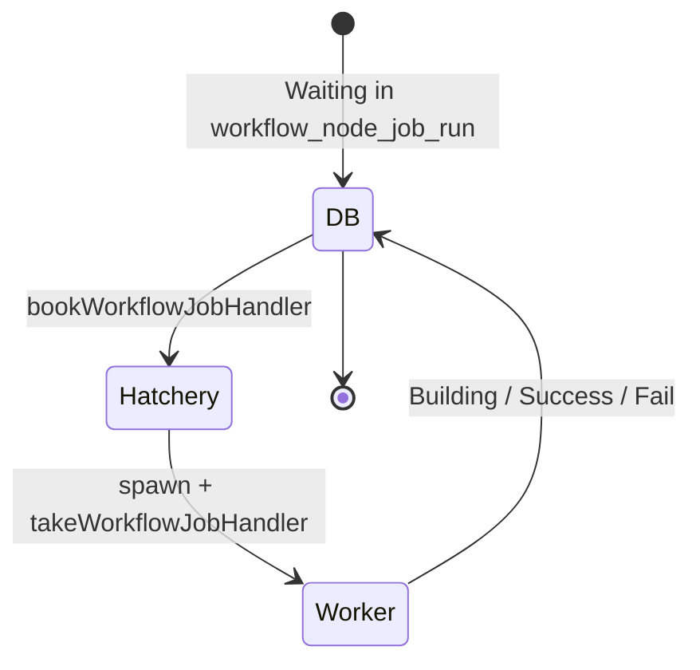

# Run engine (workflow v1)

This document specifies the **legacy v1 run engine** of CDS: how a
`WorkflowRun` materialises from a node-attached trigger, how the DAG
of `WorkflowNodeRun` rows is walked by the process engine, how jobs
land on the v1 queue for hatchery pickup, how the 14-state status
classification works, and how retention drops old runs.

The v2 run engine (`V2WorkflowRun`-driven, ascode-aware, gate-aware,
concurrency-aware) is a separate subsystem and lives in
[`07b-run-engine-v2.md`](./07b-run-engine-v2.md). The v1 workflow data
model (nodes, joins, triggers, pipelines, stages, jobs) is documented
in [`03-workflow-v1.md`](./03-workflow-v1.md); v1 hook routing in
[`06a-hooks-v1.md`](./06a-hooks-v1.md).

Source code anchors. V1 craft lives in
`engine/api/workflow_run_craft.go`; the process engine in
`engine/api/workflow/process.go` and the `process_*.go` files (one
per concern: `process_start.go`, `process_node.go`,
`process_outgoinghook.go`, `process_data.go`,
`process_requirements.go`, `process_parameters.go`). The queue
endpoint for hatcheries is in `engine/api/workflow_queue.go`. Retention
is split between `engine/api/purge/purge_run.go` and
`engine/api/purge/purge_workflow_run_v1.go`. Public types
(`WorkflowRun`, `WorkflowNodeRun`, `WorkflowNodeJobRun`, status
constants) live in `sdk/workflow_run.go` and `sdk/build.go`.

## 1. Scope

**In scope** — V1 status constants (the 14 values in `sdk/build.go`);
the v1 SDK shapes (`WorkflowRun`, `WorkflowNodeRun`,
`WorkflowNodeJobRun`); v1 craft (`WorkflowRunCraft`); the v1 process
engine and its per-concern handlers; the v1 queue handoff to hatcheries
(booking, worker take); v1 retention (`Purge-Runs`, `Purge-OldRunsV1`);
v1 outgoing hooks executed as part of node runs (cross-ref to the
hooks doc).

**Out of scope** — V2 run engine (see
[`07b-run-engine-v2.md`](./07b-run-engine-v2.md)); v1 workflow schema
(see [`03-workflow-v1.md`](./03-workflow-v1.md)); v1 hook routing (see
[`06a-hooks-v1.md`](./06a-hooks-v1.md)); hatchery contract (see
[`10-hatcheries.md`](./10-hatcheries.md)); worker internals (see
[`11-workers.md`](./11-workers.md));
CDN log streaming and result storage (see
[`12-cdn-and-artifacts.md`](./12-cdn-and-artifacts.md)); RBAC v2 (see
[`09-rbac.md`](./09-rbac.md)); the legacy v1 group permissions are
in [`08-auth.md`](./08-auth.md#13-v1-legacy-group-permissions).

## 2. Table of contents

1. [Scope](#1-scope)
2. [Table of contents](#2-table-of-contents)
3. [V1 statuses](#3-v1-statuses)
4. [V1 SDK shapes](#4-v1-sdk-shapes)
5. [V1 craft](#5-v1-craft)
6. [V1 process engine](#6-v1-process-engine)
7. [V1 queue and worker handoff](#7-v1-queue-and-worker-handoff)
8. [V1 outgoing hooks in node runs](#8-v1-outgoing-hooks-in-node-runs)
9. [V1 retention](#9-v1-retention)
10. [V1 run-result types](#10-v1-run-result-types)
11. [Failure modes](#11-failure-modes)
12. [Cross-spec pointers](#12-cross-spec-pointers)

## 3. V1 statuses

The v1 status set lives in `sdk/build.go:113-133`. There are 14
constants; `StatusIsTerminated` (`sdk/build.go:141`) classifies the
terminal subset.

| Constant | Value | Terminal | Meaning |
| --- | --- | --- | --- |
| `StatusPending` | `Pending` | no | Pre-craft state (only used by v1) |
| `StatusCrafting` | `Crafting` | no | Run materialised but DAG not yet built |
| `StatusWaiting` | `Waiting` | no | Job queued, awaiting a hatchery |
| `StatusScheduling` | `Scheduling` | no | Hatchery booked, worker not yet spawned |
| `StatusBuilding` | `Building` | no | Worker took the job, steps running |
| `StatusSuccess` | `Success` | yes | All steps succeeded |
| `StatusFail` | `Fail` | yes | A step failed |
| `StatusDisabled` | `Disabled` | yes | Node disabled at design time |
| `StatusNeverBuilt` | `Never Built` | yes | Node was never reached |
| `StatusSkipped` | `Skipped` | yes | Node condition false |
| `StatusStopped` | `Stopped` | yes | User stop |
| `StatusBlocked` | `Blocked` | no | Manual restart pending |
| `StatusCancelled` | `Cancelled` | yes | Operator cancellation |
| `StatusRetrying` | `Retrying` | no | Re-enqueue scheduled (v1 has no automatic retry — this state is rare) |

V1 has **no equivalent** to v2's `Cancelled`-via-concurrency or
`Blocked`-via-gate semantics; gates and concurrency are v2-only.

## 4. V1 SDK shapes

### 4.1 `WorkflowRun`

Top-level row, defined in `sdk/workflow_run.go:55`. Identified by an
`int64 ID` and a `Number`. Carries:

| Aspect | Description |
| --- | --- |
| Identity | `ID`, `Number`, `WorkflowID`, `ProjectID` |
| Timing | `Start`, `LastModified` |
| State | `Status`, `ToDelete`, `ToCraft` |
| DAG | `WorkflowNodeRuns map[int64][]WorkflowNodeRun` — keyed by node ID, value is the list of attempts |
| Trigger | `Infos` (audit messages), `Tags`, `Header` |

V1 uses int64 IDs throughout — there is no UUID at the run level.
Re-runs of a node append entries to the slice under its `WorkflowNodeRuns`
key; the slice index is the sub-number.

### 4.2 `WorkflowNodeRun`

One row per node execution, in `sdk/workflow_run.go:361`. Carries:

| Aspect | Description |
| --- | --- |
| Identity | `ID`, `WorkflowRunID`, `WorkflowNodeID`, `Number`, `SubNumber`, `UUID` |
| State | `Status`, `Start`, `Done`, `LastModified`, `CanBeRun` |
| Trigger | `HookEvent`, `Manual`, `SourceNodeRuns` (parents that triggered this run) |
| Data | `Payload`, `PipelineParameters`, `BuildParameters`, `Contexts` |
| Pipeline | `Stages []Stage` — each stage holds its jobs (which are the runtime instances of pipeline jobs) |
| Outputs | `Coverage`, `Tests`, `Commits` |
| Children | `TriggersRun map[int64]WorkflowNodeTriggerRun` — outcomes of the node's outgoing triggers |
| VCS | `VCS*` (VCS data captured at run time), `Header` |
| Outgoing | `OutgoingHook *NodeOutGoingHook` when the node is an outgoing-hook node |

### 4.3 `WorkflowNodeJobRun`

One row per job in a node, in `sdk/workflow_run.go:477`. This is the
runtime instance of a v1 pipeline job. Carries:

| Aspect | Description |
| --- | --- |
| Identity | `ID`, `WorkflowNodeRunID`, `ProjectID` |
| Definition | `Job ExecutedJob` (frozen snapshot of the action's steps) |
| State | `Status`, `Retry`, `Queued`, `Start`, `Done` |
| Booking | `BookedBy`, `HatcheryName`, `WorkerName` |
| Worker requirements | `Model`, `Region`, `ContainsService` |
| Parameters | `Parameters` |
| Telemetry | `SpawnInfos`, `ExecGroups`, `IntegrationPlugins`, `Contexts`, `Header` |

## 5. V1 craft

`WorkflowRunCraft` (`engine/api/workflow_run_craft.go:22`) is the
goroutine that picks up newly-created `WorkflowRun` rows still in
`Crafting` and materialises their first `WorkflowNodeRun`. It runs at
a high cadence (a fresh tick every few seconds) so user-perceived
latency stays low.

| Function | Lines | Purpose |
| --- | --- | --- |
| `WorkflowRunCraft` | `:22` | Goroutine entry; ticker-based recovery loop |
| `workflowRunCraft` | `:55` | Per-run craft: load row, call `api.initWorkflowRun`, then `workflow.UpdateCraftedWorkflowRun` to flip the status forward |
| `WorkflowRunJobDeletion` | `:170` | Companion goroutine that prunes deleted node-job-run rows from the queue |

A craft failure leaves the row in `Crafting`; the next tick will pick
it up again. Unlike v2 there is no per-run Redis lock — v1 relies on
the row-level status flip to deduplicate concurrent processing.

## 6. V1 process engine

The process engine walks the workflow DAG node by node, scheduling
children when parents complete. It is split across
`engine/api/workflow/process.go` and a family of `process_*.go` files,
each owning one concern.

### 6.1 Files and entry points

| File | Purpose |
| --- | --- |
| `process.go` | Entry point and dispatch: `processWorkflowDataRun` |
| `process_start.go` | First execution and manual restart: `processStartFromRootNode`, `processStartFromNode` |
| `process_node.go` | Node creation and run: `processNode`, `processNodeRun` |
| `process_outgoinghook.go` | Outgoing-hook nodes: `processNodeOutGoingHook` |
| `process_data.go` | DAG progression: `processAllNodesTriggers`, `processAllJoins` |
| `process_requirements.go` | Worker-requirement computation for jobs |
| `process_parameters.go` | Parameter resolution and substitution |

### 6.2 Top-level walk

`processWorkflowDataRun` is the entry point invoked after craft and
after every status change on a child node. The walk follows three
phases:

1. **Roots** — if no node has run yet, `processStartFromRootNode`
   materialises the first node (or set of nodes, if the workflow has
   multiple roots).
2. **Triggers** — `processAllNodesTriggers` examines every node that
   has just completed and schedules its outgoing triggers if the
   per-trigger conditions evaluate true.
3. **Joins** — `processAllJoins` re-evaluates `Join` nodes whose
   upstream sources have all completed and schedules the downstream
   joined node.

Each newly-materialised node goes through `processNode` →
`processNodeRun`, which builds the `WorkflowNodeRun` row, computes
the build parameters, persists the row, and (for pipeline nodes)
inserts the job rows on the queue.

### 6.3 Manual restart

`processStartFromNode` is the entry used when a user clicks
"re-run from this node" in the UI. The handler creates a new
`SubNumber` for the target node and walks downstream as if the
original parents had just completed.

### 6.4 Outgoing-hook nodes

Nodes of type `outgoinghook` are not pipeline executions — they fire
an HTTP webhook or trigger another workflow. `processNodeOutGoingHook`
posts the request to the hooks service, persists the resulting
`TaskExecution` reference, and waits for the callback. The full
outgoing-hook execution flow is documented in
[`06a-hooks-v1.md`](./06a-hooks-v1.md#10-outgoing-hooks).

## 7. V1 queue and worker handoff

A v1 job spends most of its life in one of three runtime locations:

### 7.1 Discovery

A hatchery polls the v1 queue through `getWorkflowJobQueueHandler`
(`engine/api/workflow_queue.go`). The API filters jobs by worker-model
type (the `Model` field on the `WorkflowNodeJobRun`), by region (if
configured), and by group permissions (`PermissionReadExecute`
required on the workflow — see
[`08-auth.md`](./08-auth.md#13-v1-legacy-group-permissions)).

### 7.2 Booking

`bookWorkflowJobHandler` flips the job to `Scheduling`, sets
`BookedBy` (hatchery service ID), and acquires a short-lived lock to
prevent two hatcheries from racing on the same row. The hatchery then
spawns a worker matching `Model`.

### 7.3 Worker take

`takeWorkflowJobHandler` (still in `engine/api/workflow_queue.go`)
flips the job to `Building`, sets `WorkerName` and `Start`, and ships
the resolved build parameters and secrets back in the response. The
worker runs the steps, streams logs to CDN, registers run results, and
finally posts the terminal status.

### 7.4 Worker output

The worker calls back through the `WorkflowJobResult` endpoint. The
final status is applied to `WorkflowNodeJobRun.Status`; if every job
of the node has finished, the parent `WorkflowNodeRun.Status` is
recomputed and `processWorkflowDataRun` is invoked to walk the
triggers.

## 8. V1 outgoing hooks in node runs

V1 retains a fire-and-forget outgoing-hook model wired into node runs.
The execution path runs through the hooks service and is documented in
full in
[`06a-hooks-v1.md`](./06a-hooks-v1.md#10-outgoing-hooks). The
run-engine side limits itself to:

1. `processNodeOutGoingHook` — issue the outgoing call.
2. Wait for the hooks-service callback that confirms execution.
3. Apply the resulting status to the parent `WorkflowNodeRun`.
4. Continue the trigger walk.

## 9. V1 retention

V1 retention is governed by `Workflow.HistoryLength` and
`Workflow.PurgeTags`. Two goroutines collaborate under
`engine/api/purge/`:

| Goroutine | Implementation | Purpose |
| --- | --- | --- |
| `Purge-OldRunsV1` | `engine/api/purge/purge_workflow_run_v1.go` (`MarkOldWorkflowRunsV1` at `:16`) | Mark stale v1 runs for purge (sets `ToDelete = true`) |
| `Purge-Runs` | `engine/api/purge/purge_run.go` (`markWorkflowRunsToDelete` at `:46`, `ApplyRetentionPolicyOnWorkflow` at `:72`, `applyRetentionPolicyOnRun` at `:233`) | Drop the marked rows in batches |

Marked runs are deleted in batches with `FOR UPDATE SKIP LOCKED` so
multiple API replicas can drain the queue in parallel without
deadlocking.

The shared helper `MarkRunsAsDelete` lives in
`engine/api/purge/purge.go` and is used by both v1 and v2 retention.

## 10. V1 run-result types

V1 has a narrower set of result kinds than v2 (which exposes 20 — see
[`07b-run-engine-v2.md`](./07b-run-engine-v2.md#16-run-result-types)).
The main kinds are: artefact upload, JUnit test report, coverage
report. Storage paths and CDN integration are documented in
[`12-cdn-and-artifacts.md`](./12-cdn-and-artifacts.md).

## 11. Failure modes

- **Craft failure** — the row stays in `Crafting`; the next ticker
  iteration retries.
- **Job failed** — the node's status becomes `Fail`; downstream
  triggers whose conditions require success are skipped (their nodes
  become `NeverBuilt`).
- **Worker crash** — the hatchery is responsible for detecting the
  loss and flipping the job; there is no v1 equivalent of v2's
  `StopDeadJobs` watchdog.
- **Hatchery crash after booking** — the job stays in `Scheduling`
  until an operator reissues it; v1 has no equivalent of v2's
  `ReEnqueueScheduledJobs`.
- **Outgoing-hook failure** — the node fails; the workflow's
  configured failure handling applies.
- **Run purged mid-flight** — the `ToDelete` flag is checked at every
  status update; a run flagged for deletion stops producing new node
  runs.

## 12. Cross-spec pointers

- V2 run engine (modern subsystem) → [`07b-run-engine-v2.md`](./07b-run-engine-v2.md)
- Workflow v1 schema, nodes, joins, triggers → [`03-workflow-v1.md`](./03-workflow-v1.md)
- V1 hooks routing and outgoing-hook execution → [`06a-hooks-v1.md`](./06a-hooks-v1.md)
- Auth, sessions, v1 group permissions → [`08-auth.md`](./08-auth.md)
- Hatchery contract, worker-model dispatch → [`10-hatcheries.md`](./10-hatcheries.md)
- Worker binary, in-worker execution → [`11-workers.md`](./11-workers.md)
- CDN, log streaming, result storage → [`12-cdn-and-artifacts.md`](./12-cdn-and-artifacts.md)
- VCS providers and commit-status callback → [`13-vcs.md`](./13-vcs.md)
- Glossary, statuses → [`19-glossary-and-cross-references.md`](./19-glossary-and-cross-references.md)
