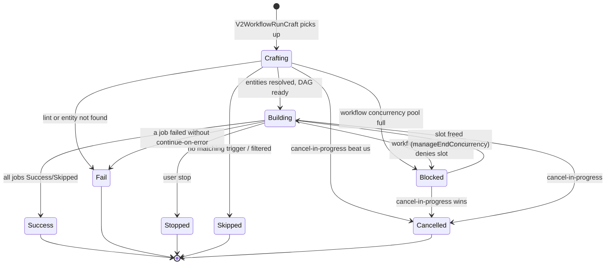
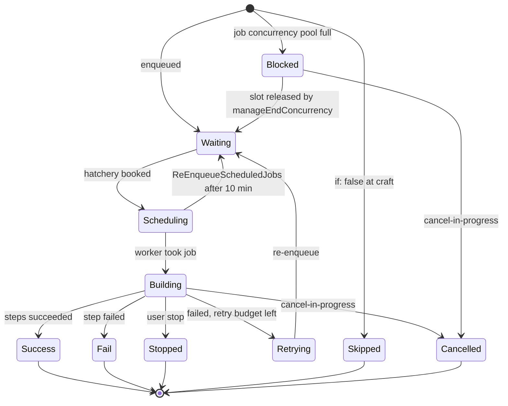
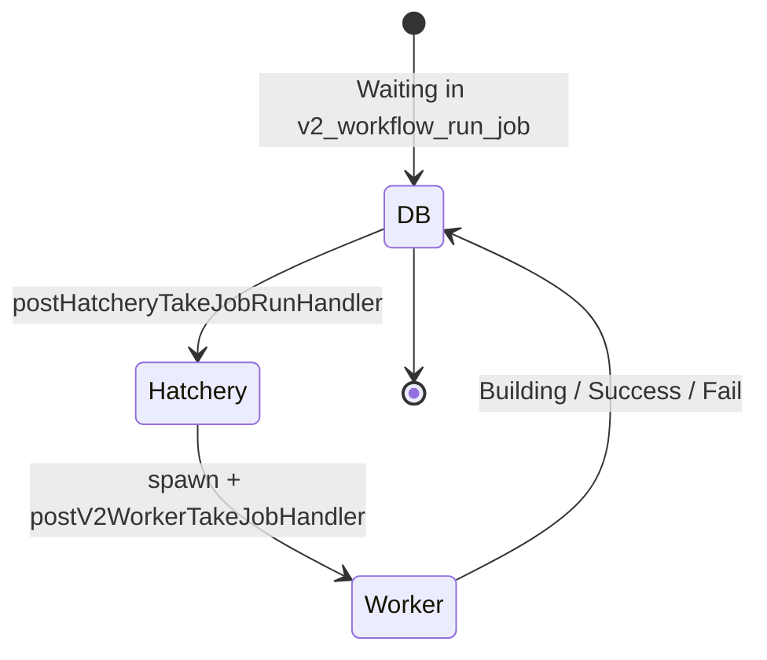

# Run engine (workflow v2)

This document specifies how CDS executes **v2 workflows** once a
trigger has been delivered. It covers the craft / engine pipeline, the
status state machines at workflow and job level, the queue handoff to
hatcheries, the concurrency engine, retry, gates, dead-job watchdogs,
run-result types, and retention.

The legacy v1 run engine (`WorkflowRun` driven by
`engine/api/workflow/process*.go`) is documented in
[`07a-run-engine-v1.md`](./07a-run-engine-v1.md). The trigger sources
(hooks, schedulers, manual runs) are in
[`06b-hooks-v2.md`](./06b-hooks-v2.md). The hatchery that picks up
jobs from the queue lives in [`10-hatcheries.md`](./10-hatcheries.md);
the worker binary that executes them in
[`11-workers.md`](./11-workers.md).

Source code anchors. V2 craft lives in
`engine/api/v2_workflow_run_craft.go`; v2 engine in
`engine/api/v2_workflow_run_engine.go`,
`engine/api/v2_workflow_run_engine_concurrency.go`, and
`engine/api/v2_workflow_run_engine_context.go`. Watchdogs and dead-job
routines in `engine/api/v2_workflow_run_job_routines.go`. The v2 queue
endpoint in `engine/api/v2_queue.go` and
`engine/api/v2_queue_worker.go`. The public types (`V2WorkflowRun`,
`V2WorkflowRunJob`, `V2WorkflowRunResult`, `V2Initiator`,
`V2WorkflowRunEnqueue`, status constants) live in
`sdk/v2_workflow_run.go` and `sdk/v2_workflow_run_detail.go`.
Retention helpers in `engine/api/purge/`.

## 1. Scope

**In scope** — v2 craft phase (entity resolution, condition
evaluation, matrix expansion, context construction, concurrency); v2
engine phase (`needs:` DAG walk, ready-set computation, queue
handoff); the v2 status state machines at workflow and job level; the
queue (hatchery booking, worker take); the concurrency engine
(including the `Blocked` status produced when a pool is full) and
cancel-in-progress; retry semantics; dead-job watchdogs
(`ReEnqueueScheduledJobs`, `StopDeadJobs`, `StopUnStartedJobs`,
`TriggerBlockedWorkflowRuns`, `CancelAbandonnedRunResults`); the 20
`V2WorkflowRunResultType*` kinds and their uploads; v2 retention
(`Purge-Runs-V2`, `Purge-MarkRuns`).

**Out of scope** — V1 run engine (see
[`07a-run-engine-v1.md`](./07a-run-engine-v1.md)); workflow schema
(see [`04-workflow-v2.md`](./04-workflow-v2.md)); hook routing (see
[`06b-hooks-v2.md`](./06b-hooks-v2.md)); hatchery contract and
worker-model dispatch (see [`10-hatcheries.md`](./10-hatcheries.md));
in-worker execution (see [`11-workers.md`](./11-workers.md));
CDN log streaming and run-result storage (see
[`12-cdn-and-artifacts.md`](./12-cdn-and-artifacts.md)); RBAC v2 (see
[`09-rbac.md`](./09-rbac.md)).

## 2. Table of contents

1. [Scope](#1-scope)
2. [Table of contents](#2-table-of-contents)
3. [Status reference](#3-status-reference)
4. [V2 run shapes](#4-v2-run-shapes)
5. [V2 state machines](#5-v2-state-machines)
6. [V2 craft phase](#6-v2-craft-phase)
7. [V2 engine phase](#7-v2-engine-phase)
8. [Job context construction](#8-job-context-construction)
9. [V2 queue model](#9-v2-queue-model)
10. [Concurrency engine](#10-concurrency-engine)
11. [Retry](#11-retry)
12. [Gates](#12-gates)
13. [Dead-job watchdogs](#13-dead-job-watchdogs)
14. [V1 vs V2 status comparison](#14-v1-vs-v2-status-comparison)
15. [Run retention](#15-run-retention)
16. [Run result types](#16-run-result-types)
17. [Failure modes](#17-failure-modes)
18. [Cross-spec pointers](#18-cross-spec-pointers)

## 3. Status reference

### 3.1 V2 workflow-run status (`V2WorkflowRunStatus`)

Defined in `sdk/v2_workflow_run.go:84`. The `IsTerminated` helper
treats `Crafting`, `Building`, and `Blocked` as non-terminal.

| Constant | Value | Terminal | Meaning |
| --- | --- | --- | --- |
| `V2WorkflowRunStatusCrafting` | `Crafting` | no | Entities being resolved, DAG materialised |
| `V2WorkflowRunStatusBuilding` | `Building` | no | One or more jobs running or queued |
| `V2WorkflowRunStatusBlocked` | `Blocked` | no | Blocked by a workflow-level concurrency rule |
| `V2WorkflowRunStatusSuccess` | `Success` | yes | All jobs in Success or Skipped |
| `V2WorkflowRunStatusFail` | `Fail` | yes | At least one Fail without continue-on-error |
| `V2WorkflowRunStatusStopped` | `Stopped` | yes | User stop |
| `V2WorkflowRunStatusSkipped` | `Skipped` | yes | No matching trigger or all conditions false |
| `V2WorkflowRunStatusCancelled` | `Cancelled` | yes | Concurrency cancel-in-progress |

### 3.2 V2 run-job status (`V2WorkflowRunJobStatus`)

Defined in `sdk/v2_workflow_run.go:304`.

| Constant | Value | Terminal | Meaning |
| --- | --- | --- | --- |
| `V2WorkflowRunJobStatusWaiting` | `Waiting` | no | In the queue, available for hatcheries |
| `V2WorkflowRunJobStatusScheduling` | `Scheduling` | no | Hatchery booked, worker not yet spawned |
| `V2WorkflowRunJobStatusBuilding` | `Building` | no | Worker took the job, steps running |
| `V2WorkflowRunJobStatusSuccess` | `Success` | yes | All steps succeeded |
| `V2WorkflowRunJobStatusFail` | `Fail` | yes | At least one step failed |
| `V2WorkflowRunJobStatusStopped` | `Stopped` | yes | User stop |
| `V2WorkflowRunJobStatusBlocked` | `Blocked` | no | Blocked by a concurrency rule |
| `V2WorkflowRunJobStatusSkipped` | `Skipped` | yes | Job condition evaluated to false |
| `V2WorkflowRunJobStatusRetrying` | `Retrying` | no | Will be re-enqueued |
| `V2WorkflowRunJobStatusCancelled` | `Cancelled` | yes | Concurrency cancel-in-progress |
| `V2WorkflowRunJobStatusUnknown` | `` (empty) | no | Bootstrap, never persisted |

## 4. V2 run shapes

### 4.1 `V2WorkflowRun`

Top-level row, defined in `sdk/v2_workflow_run.go:56`. Carries:

| Aspect | Description |
| --- | --- |
| Identity | UUID, project key, VCS server, repository, workflow name, workflow ref and SHA |
| State | `Status`, `RunNumber`, `RunAttempt`, `Started` / `LastModified` timestamps, `ToDelete` flag |
| Snapshot | `WorkflowData` (`V2WorkflowRunData`): the post-template, post-matrix-expansion workflow plus the resolved actions and worker-models maps |
| Contexts | `WorkflowRunContext`: immutable snapshot of the `cds`, `git`, and `env` contexts captured at craft time |
| Trigger | `V2WorkflowRunEvent` payload, optional `V2Initiator` |
| Metadata | Annotations, `JobInputs` map (`GateInputs` per job), `V2WorkflowRunJobEvent` for pending gates |

### 4.2 `V2WorkflowRunJob`

Each job in a run carries (`sdk/v2_workflow_run.go:266`):

| Aspect | Description |
| --- | --- |
| Identity | UUID, run ID, project key, `JobID` inside the workflow |
| Snapshot | The static `V2Job` definition |
| Initiator | The `V2Initiator` that triggered the run |
| State | Status, timestamps (`Queued`, `Scheduled`, `Started`, `Ended`), retry count |
| Telemetry | `HatcheryName`, `WorkerName`, `WorkerID`, `Region`, `ModelType`, `ModelOSArch` |
| Matrix | `Matrix map[string]string` — one permutation when the strategy expands |
| Gate inputs | `GateInputs` when the job was gated |
| Outputs | Aggregated outputs from steps and registered run results |
| Step statuses | `StepsStatus` (`JobStepsStatus`) |
| Concurrency | `Concurrency *V2RunConcurrency` when the job is part of a pool |

### 4.3 `V2WorkflowRunResult`

Carries: a UUID, run / run-job IDs, `RunAttempt`, an `IssuedAt`
timestamp, the result type (`V2WorkflowRunResultType` — see
[section 16](#16-run-result-types)), a polymorphic `Detail`
(`V2WorkflowRunResultDetail`), an optional
`ArtifactManagerIntegrationName` plus
`V2WorkflowRunResultArtifactManagerMetadata`, an optional
`WorkflowRunResultSync` (promotion / release tracking), and a
lifecycle status (`PENDING`, `SUCCESS`, `FAILED`).

### 4.4 `V2WorkflowRunInfo` and `V2WorkflowRunJobInfo`

Two append-only log streams sit alongside the run and each job:

- `V2WorkflowRunInfo` — informational, warning, or error messages
  attached to the run (`Level` in `info`, `warning`, `error`).
- `V2WorkflowRunJobInfo` — the same for a specific job.
- `V2WorkflowRunJobResult` — terminal status + error message +
  timestamp reported by the worker when a job ends.

These streams surface "why" events to the UI without rewriting any of
the structured state.

### 4.5 `V2Initiator`

`V2Initiator` (`sdk/v2_workflow_run.go:505`, with `V2InitiatorUser` for
the user snapshot) captures the identity that triggered the run: an
optional `UserID` and `User` (with `Username`, `Ring`, `Email`), an
optional `VCS` + `VCSUsername`, and the `IsAdminWithMFA` flag.
`IsUser()` returns true when `VCSUsername` is empty.

The initiator is propagated end-to-end:

`HookRepositoryEvent.Initiator` → `V2WorkflowRunHookRequest.Initiator`
→ `V2WorkflowRunEnqueue.Initiator` → `V2WorkflowRun.Initiator` →
`V2WorkflowRunJob.Initiator` → worker context.

### 4.6 `V2WorkflowRunEnqueue`

The enqueue envelope is the message the API sends through its trigger
channel (`workflowRunTriggerChan`) to the engine phase. It carries
the run ID, the `V2Initiator`, and the target status (`Building` by
default, `Blocked` when a workflow-level concurrency rule denies the
slot during craft, see [§10.1](#101-slot-acquisition)). This is the
seam between "the run exists in the database in `Crafting` state" and
"the engine is now processing it".

A companion envelope `V2WorkflowRunEnqueueGate` carries the target
`JobID` and the reviewer-supplied gate inputs; the resulting job is
enqueued in `Waiting` (gates never produce `Blocked`, see
[§12](#12-gates)).

## 5. V2 state machines

### 5.1 Workflow state machine

### 5.2 Job state machine

Gates never produce `Blocked`. A job whose gate condition (`If` or
reviewers) is not satisfied is filtered out by `checkCanRunJob` and
remains outside the scheduling set until a reviewer pushes a
`V2WorkflowRunEnqueueGate` (see [§12](#12-gates)); it then enters
`Waiting` like any other job.

## 6. V2 craft phase

The craft phase turns a freshly-enqueued workflow run (`Crafting`)
into a fully materialised DAG of `V2WorkflowRunJob` rows. It is driven
by the goroutine `V2WorkflowRunCraft`
(`engine/api/v2_workflow_run_craft.go:60`); the main per-run logic is
`craftWorkflowRunV2` (`:103`).

### 6.1 Triggering

Crafting runs in two situations:

- **Immediate triggering** — when a run is created (via hook, manual,
  or schedule), its ID is pushed into the in-process channel
  `workflowRunCraftChan`. The background worker picks it up and
  starts crafting immediately.
- **Ticker-based recovery** — a periodic timer loads from the
  database all runs that remain in `Crafting`. This handles cases
  where processing failed (for example after an API restart). Each
  run is processed in a dedicated goroutine.

### 6.2 Distributed lock

Before any processing, a Redis lock is taken on the key identifying
the run, with a 5-minute TTL. If the lock cannot be acquired (another
node is already processing this run), crafting is silently abandoned.
The lock is released at the end of processing, success or failure.

### 6.3 Preliminary checks

- Load the run from the database.
- If the run no longer exists: no-op.
- If the run status is no longer `Crafting`: no-op (already
  processed).
- Load the VCS server, repository, and project.

### 6.4 Building execution contexts (`buildRunContext`)

Contexts are attached to the run and available in every `${{…}}`
expression during execution.

**CDS context (`CDSContext`, declared in `sdk/contexts.go`)** — run
metadata:

| Field | Content |
| --- | --- |
| `project_key` | Project key |
| `run_id` | Unique run identifier |
| `run_number` | Sequential run number |
| `run_attempt` | Always `1` at creation |
| `run_url` | Web interface URL for this run |
| `workflow` | Workflow name |
| `workflow_ref`, `workflow_sha`, `workflow_vcs_server`, `workflow_repository` | Source coordinates |
| `triggering_actor` | User or service that triggered the run |
| `event_name`, `event` | Triggering event name and payload |
| `version`, `version_next` | Computed semver (populated after semver resolution) |
| `workflow_template`, `workflow_template_*` | Template provenance (if instantiated from a template) |
| `job`, `stage` | Current job / stage |
| `workspace` | Worker workspace path |

**Git context (`GitContext`)** — built from the triggering event and
supplemented by VCS calls if necessary:

| Field | Content |
| --- | --- |
| `server`, `repository`, `repositoryUrl`, `repository_web_url` | Repository identifiers |
| `ref`, `ref_name`, `ref_type`, `sha`, `sha_short` | Git ref |
| `ref_web_url`, `commit_web_url` | UI links |
| `commit_message`, `author`, `author_email` | Commit metadata |
| `semver_current`, `semver_next` | Semver derived from git tags |
| `changesets` | List of modified files |
| `pullrequest_id`, `pullrequest_to_ref`, `pullrequest_to_ref_name`, `pullrequest_web_url`, `repository_origin` | PR metadata (forks) |
| `connection`, `ssh_key`, `gpg_key` | VCS connection mode and key references |

**Automatic resolution of missing values**:

- If no `ref` is provided in the event: the repository's default
  branch is used.
- If no `sha` is provided: it is resolved from the branch or tag via
  the VCS API.

**Env context (`env`)** — copy of environment variables declared at
the `workflow.env` level.

### 6.5 Workflow template resolution

If `workflow.from` is set, the workflow is generated from a template:

1. Search for the template by name in accessible entities (same
   repository, linked repositories, library project).
2. Resolve the template with parameters declared in
   `workflow.parameters` — generates a complete `V2Workflow`
   definition.
3. Load the repository and VCS server hosting the template.
4. Enrich the `cds` context with template metadata (name, parameters,
   ref, SHA, VCS server, repository, origin project, commit / ref /
   repository web URLs).
5. **Update the `env` context** — environment variables declared in
   the resolved workflow are merged into `run.Contexts.Env`. This is
   necessary because `buildRunContext` ran before template
   resolution.
6. Recreate the entity finder in the template repository context (for
   resolving the template's actions and worker models).
7. Lint the resolved workflow (without the `from` field).

If any step fails, the run is set to `Fail` via `stopRun`.

### 6.6 Semantic version computation

This step is optional and only runs when `workflow.semver` is set.

**Supported version sources** (`WorkflowSemverType`):

| `From` | File read | Key extracted |
| --- | --- | --- |
| `git` | — (uses git tags) | `git.semver_current` |
| `helm` | `Chart.yaml` | `version` |
| `cargo` | `Cargo.toml` | `[package].version` |
| `npm`, `yarn` | `package.json` | `version` |
| `file` | Custom path | First line of the file |
| `poetry` | `pyproject.toml` | `[project].version` or `[tool.poetry].version` |
| `debian` | `debian/changelog` | `package (version) distribution; urgency=…` |

For file-based sources, the content is retrieved from the VCS at the
run's SHA and base64-decoded for GitHub, GitLab, Gitea, Forgejo.

**Release-ref determination.** A ref is a release ref if:

- `semver.release_refs` is empty and the ref is the repo's default
  branch, **or**
- the ref matches one of the glob patterns in `semver.release_refs`.

For the `git` source a tag ref is directly treated as a release.

**Computation rules.** When the ref is a release ref **and** the
version has not yet been saved, the version is the clean value
extracted from the source (e.g. `1.2.3`) and `mustSaveVersion = true`
so the version is persisted at the end of crafting.

In every other case (development branch, or version already saved),
an interpolation pattern is applied. The first glob pattern from
`semver.schema` matching the current ref is used; otherwise the
`**/*` pattern is taken; otherwise a default pattern (run number +
short SHA). The pattern is interpolated with the run's contexts
(including `version` = the value extracted from the source). The
result must be a valid SemVer 2.0 string.

Without `workflow.semver`, `cds.version` = `git.semver_current` and
`cds.version_next` = `git.semver_next`.

### 6.7 Workflow validation (`V2Workflow.Lint`)

A structural validation runs after template resolution. It checks:

- consistency of `needs:` job dependencies,
- validity of referenced stages,
- gate consistency.

A lint error transitions the run to `Fail`.

### 6.8 Integration validation

Integrations are verified at two levels:

- **Workflow level** (`workflow.integrations`) — each integration
  must exist on the project; only one `artifact_manager` integration
  is allowed per workflow.
- **Job level** (`job.integrations`) — each integration must exist on
  the project; `artifact_manager` integrations are **not** allowed at
  job level (workflow-level only).

A validation error sets the run to fail with an explanatory message.

### 6.9 Per-job dependency resolution

For each job in the workflow (a job without steps and without `from`
is ignored):

1. **Region propagation from integrations** — if the job references
   integrations but does not declare an explicit region, and the
   integration carries a region-type configuration, that value
   becomes the job's region.
2. **Action resolution (`uses:`)** — for each step:
   - search by name in accessible entities (same repository, linked
     repositories, library project),
   - rewrite `uses` in canonical form `actions/<complete-name>`,
   - recursively resolve sub-actions used by the action's steps,
   - cache results in the entity finder.

   If an action is not found or is ambiguous, the run fails.
3. **Worker model validation** — if `runs_on.model` is not an
   interpolated expression and the job is not a template job:
   - resolve the worker model by name; store its full name on the
     job,
   - verify the target region (explicit or default) exists,
   - verify at least one registered hatchery both supports the worker
     model type **and** has RBAC rights on the target region.

   If no hatchery can execute the job in the requested region, the
   run fails with an explanatory message.
4. **Variable set validation** — for the workflow and each job, every
   referenced variable set must exist on the project. Workflow and
   job variable sets are merged and deduplicated on the job.
5. **Job concurrency interpolation** — if `job.concurrency` contains
   `${{…}}`, interpolate it now.

### 6.10 Workflow concurrency interpolation

After the per-job loop:

- For each `workflow.concurrencies` rule: if the name contains
  `${{…}}`, interpolate it. Apply defaults: `order = oldest_first`,
  `pool = 1`.
- If `workflow.concurrency` (the reference to a rule) contains
  `${{…}}`, interpolate it.

### 6.11 Building the `WorkflowData` snapshot

At the end of all resolutions, the run stores a complete and
immutable snapshot of every entity required for execution:

| Field | Purpose |
| --- | --- |
| `WorkflowData.Workflow` | Complete workflow definition (potentially template-resolved) |
| `WorkflowData.Actions` | Map `<complete-name> → V2Action` of every action used, directly or transitively |
| `WorkflowData.WorkerModels` | Map `<complete-name> → V2WorkerModel` of every referenced worker model |

This snapshot guarantees that any subsequent modification of entities
in the database does not affect the running run.

### 6.12 Workflow-level concurrency management

If `workflow.concurrency` is set:

1. **Load the definition** — search first in
   `workflow.concurrencies`, then in project-level concurrencies.
2. **Evaluate the `if` clause** — if it interpolates to false, the
   rule is ignored for this run.
3. **Concurrency lock** — a Redis lock is taken on the concurrency
   key to avoid races during registration.
4. **Apply the rule** — inspect active runs sharing the same key;
   depending on `cancel-in-progress`, `oldest_first`, `newest_first`,
   `pool`, existing runs may be marked for cancellation.

### 6.13 Persistence and finalisation

Every modification commits in a single transaction:

- Persist the run (with `WorkflowData`, contexts, concurrency,
  status).
- Persist `V2WorkflowRunInfo` warning messages.
- If `mustSaveVersion = true`, save `cds.version`.
- Cancel runs identified by concurrency rules.

After commit:

- An `EventRunBuilding` event is published on Redis (notifies UI and
  services).
- The run is enqueued in the engine channel
  (`workflowRunTriggerChan`).

### 6.14 Error handling

| Category | Behaviour |
| --- | --- |
| **Business error** | Any validation failure (template not found, missing action, incompatible worker model, lint failure, missing variable set, invalid integration, non-semver result, …) calls `stopRun`: persists the message(s), sets the run to `Fail` (or `Skipped` if all messages are warnings), publishes `EventRunEnded`. |
| **Technical error** | Infrastructure errors (DB, Redis, VCS unreachable) return an error. The run stays in `Crafting` and is picked up by the ticker on the next cycle. |

### 6.15 Transitions out of crafting

| To | Reason |
| --- | --- |
| `Building` | At least one job materialised |
| `Fail` | Entity resolution / lint / integration error |
| `Skipped` | All jobs filtered out by conditions or no matching trigger |
| `Cancelled` | A cancel-in-progress arrived for the same pool |
| `Blocked` | Workflow-level concurrency slot denied at craft time; `manageEndConcurrency` lifts the block when the slot is freed |

## 7. V2 engine phase

Once a run is in `Building`, the engine drives every transition until
the run reaches a terminal state. Two cooperating goroutines run on
the API service:

- `V2WorkflowRunEngineChan` (`engine/api/v2_workflow_run_engine.go:77`)
  consumes `workflowRunTriggerChan`.
- `V2WorkflowRunEngineDequeue` (`:94`) polls the Redis
  `WorkflowEngineKey` queue every 250 ms as a fallback.

`EnqueueWorkflowRun` (`:2845`) first attempts the channel, then falls
back to the Redis queue if the channel is saturated. The main
per-cycle logic is `workflowRunV2Trigger` (`:118`).

### 7.1 Distributed lock

Before any processing, a Redis lock is taken on the key
`api:workflow:engine:{runID}` with a 5-minute TTL. If the lock is not
acquired, the request is re-enqueued and processing stops. The lock
is released at the end of processing.

### 7.2 Initial loading

After the lock is acquired:

- The run from the database.
- The project plus its integrations in cleartext.
- The VCS server and repository associated with the run.
- All run jobs for the current attempt.
- All run results for the current attempt.

An `allrunJobsMap` is built: for each `jobID`, the last
non-terminated run job is kept. It serves as a reference for
duplicate and matrix checks.

### 7.3 Preliminary guards

Several conditions cause the engine to no-op:

- The run is in a terminal state (`Fail`, `Success`, `Stopped`,
  `Cancelled`, `Skipped`) — no further processing.
- The run is `Blocked` and has a workflow-concurrency rule —
  `workflowRunV2TriggerUnlocking` is called to attempt to unblock the
  run (see [section 7.7](#77-unblocking-runs-blocked-by-workflow-concurrency)).
  This is the **only** way a run can be in `Blocked`: the status is
  produced exclusively by the concurrency engine (cf.
  [§10](#10-concurrency-engine)).

### 7.4 Handling retrying jobs

Before normal scheduling, every job in `Retrying` is processed:

1. Mark the old run job as `Fail` in the database.
2. Insert a new run job with an incremented retry number and
   `Waiting` status.
3. Persist in a transaction.
4. Publish `EventRunJobEnqueued` for the new job.
5. Re-enqueue the run and stop the engine cycle here.

This short-circuit ensures that only a retry is handled in a single
engine cycle, without additional scheduling computation.

### 7.5 Forced interruption (Stop / Cancel)

If the enqueue's `Status` is a terminal status (typically `Stop` or
`Cancel`), `terminateWorkflowRun` (`:654`) is called:

- Every non-terminated job is set to `Stopped` or `Cancelled`
  according to the requested status.
- An information message is inserted on the run.
- The run transitions to the requested status.
- Execution continues to `endWorkflowV2Trigger` (see
  [section 7.13](#713-cycle-closure-endworkflowv2trigger)) without
  going through scheduling.

### 7.6 Building existing-job contexts

- `computeExistingRunJobContexts`
  (`engine/api/v2_workflow_run_engine_context.go:10`) builds a
  `JobsResultContext` (map `jobID → result + outputs`) from completed
  run jobs, keeping only the latest attempt of each job.
- `computeGateContext` reconstructs the `GateInputs` per job from run
  events.

These contexts feed every subsequent condition evaluation (`if:`,
`needs:`) in the cycle.

### 7.7 Unblocking runs blocked by workflow concurrency

If the run is `Blocked` with a workflow-level rule,
`workflowRunV2TriggerUnlocking` runs:

1. Acquire the Redis lock on the concurrency key.
2. `retrieveRunObjectsToUnLocked`
   (`engine/api/v2_workflow_run_engine_concurrency.go:287`) evaluates
   which runs should be unblocked or cancelled.
3. If the current run should be cancelled → status `Cancelled`.
4. If the current run should be unblocked → status `Building`, an
   information message is inserted, the run is re-enqueued.
5. If the run is not yet eligible for unblocking → the engine stops.

### 7.8 Annotation computation

Annotations declared in `workflow.annotations` are evaluated with the
expression interpolator (`computeWorkflowRunAnnotations` at `:744`).
The context includes statuses and outputs of already completed jobs.

Application rules:

- An annotation already present on the run is not recomputed.
- Interpolation failure inserts a warning on the run; processing
  continues.
- An interpolated value that is empty or equals `false`
  (case-insensitive) is not added.

### 7.9 Selecting jobs to schedule (`retrieveJobToQueue`)

`retrieveJobToQueue` (`:2323`) determines which workflow jobs are
ready to be created in the database.

**Initial filtering.** Only jobs for which no active run job exists
are candidates. Exception: jobs with a matrix strategy whose
permutations are not all launched are passed back into the candidate
list.

**Stage handling.** If the workflow defines stages, their status is
computed from the results of the jobs they contain. A job belonging
to a stage whose status is `CannotBeRun` is excluded.

**`needs:` verification.** A job is a candidate only if every job in
its `needs:` has a result in the existing-jobs context. A job whose
prerequisite is not yet complete stays waiting.

**`if:` and gate evaluation (`checkJob`, `:2428`).** For each
candidate job:

- **Variable-set rights** — if the initiator is not an MFA admin,
  their rights on the variable sets used by the job are verified.
- **Gate** — if the job has a gate, reviewers (groups or users) are
  checked. The `gate.if` condition is evaluated with the
  user-supplied inputs. If the gate condition is not satisfied →
  status `Skipped`.
- **`job.if`** — evaluated after the gate. The default condition
  (absent) is equivalent to `${{ success() }}`.

A job whose condition fails or whose rights are insufficient is
queued with status `Skipped`.

### 7.10 Loading variable sets

Variable sets declared at workflow level are loaded from the database
and transformed into the `vars.*` context. This context is shared
between every job to be scheduled and is enriched per-job by the
job's own variable sets.

### 7.11 Detecting template-based jobs

A `hasTemplatedJob` flag is set if at least one scheduled job has a
non-empty `from`. This flag triggers an additional engine cycle at
the end of processing to allow template expansion.

### 7.12 Concurrency definition resolution and `prepareRunJobs`

For each job to be scheduled, the applicable concurrency definition
is resolved:

1. If the job references a named concurrency rule
   (`job.concurrency`), look it up in the workflow's concurrency
   list.
2. Interpolate the rule's `if` clause in the run's context.
3. On error, insert an error message on the run.

The concerned Redis concurrency keys are then locked. If a lock is
unavailable, the engine waits 2 seconds and re-enqueues the run.

`prepareRunJobs` (`:1414`) then creates one or more
`V2WorkflowRunJob` rows per scheduled job, as follows.

**Per-job context (`WorkflowRunJobsContext`).** Built from:

- The run's `cds`, `git`, `env` contexts (the `env` context merges
  workflow-level env with job-level env, job winning).
- The `jobs.*` context of completed jobs.
- The `needs.*` context (subset of completed jobs listed in `needs:`).
- The `vars.*` context (job variable sets).
- The `gate.*` context (gate inputs if applicable).
- The `integrations.*` context built from project integrations
  matching the names declared on the job then on the workflow (job
  wins; dynamic names containing `${{` are ignored at this stage and
  resolved during interpolation).

**Matrix permutation generation.** If the job declares a `matrix`
strategy, every permutation is computed (`generateMatrix` at `:2298`,
`generateMatrixPermutation` at `:2203`, `searchPermutationToTrigger`
at `:2167`). Scalar or array values can contain `${{…}}` expressions
interpolated in the job's context. Only permutations for which no run
job already exists are created.

**Template-based jobs (`from:`).** When a job has a `from`:

1. Resolve the template (`checkJobTemplate` at
   `engine/api/v2_workflow_run_craft.go:686`, `computeJobFromTemplate`
   at `:1685`): search the template entity, lint the result.
2. `handleTemplatedJobInWorkflow` (`:1774`) modifies the current
   workflow in place: remove the template job, inject the template's
   jobs / stages / gates / annotations / concurrencies, update
   downstream `needs:` to point at the template's final jobs, merge
   the template's actions and worker models into `WorkflowData`.
3. A `hasToUpdateRun` flag is set so the updated run is persisted.

This applies identically when a template job has a matrix; duplicates
are detected (`createTemplatedMatrixedJobs` at `:1936`,
`createMatrixedRunJobs` at `:2085`).

**Run-job field interpolation.** For non-template jobs, dynamic fields
are interpolated in order (`computeRunJobsInterpolation` at `:1132`):

| Field | Behaviour on error |
| --- | --- |
| `job.integrations` | Job fails |
| `job.name` | Job fails |
| `job.runs_on.region` | Job fails |
| `job.runs_on.model` | Job fails |
| `job.runs_on.flavor` | Job fails |
| `job.runs_on.memory` | Job fails |
| `job.services[*].image` | Job fails |
| `job.services[*].readiness.command` | Job fails |

If an integration redirects to a specific region (via
`IntegrationConfigTypeRegion`), that region is applied to the run
job. After resolving a dynamic integration name, the `integrations.*`
context is rebuilt and the interpolation parser is recreated so that
later fields (such as `runs_on.model`) can reference the freshly
resolved integration values.

**Region-rights verification (`checkUserRegionRight`, `:2553`).** For
each target region:

- The project must have `RegionRoleExecute` on the region
  (`RBACRegionProject`).
- The initiator (user or VCS user) must also have `RegionRoleExecute`,
  unless they are an MFA admin.

If rights are insufficient, the job is set to `Skipped` with an
information message.

**Job-level concurrency application.** `manageJobConcurrency`
(`engine/api/v2_workflow_run_engine_concurrency.go:134`) evaluates
the runs blocked by the same rule. Depending on the rule
(`cancel-in-progress`, `queue`, `forbid-new`), concurrent runs may
be cancelled, blocked, or refused. If the current job should be
blocked, its status is `Blocked` with an explanatory message.

**Unblocking blocked jobs.** For each existing `Blocked` job with a
concurrency rule, `retrieveRunObjectsToUnLocked` is invoked. A job
that should be unblocked flips to `Waiting` and is added to the
persisted set.

### 7.13 Run-job persistence (transaction)

In a single transaction:

1. Each resulting run job is inserted or updated.
2. `V2WorkflowRunJobInfo` messages associated with the run jobs are
   inserted.
3. If a run job needs manual interaction (untriggered gate), a gate
   message is inserted on the run.
4. General `V2WorkflowRunInfo` messages are inserted.

A transaction failure rolls back and the error is raised.

### 7.14 Computing the run's final status

`computeRunStatusFromJobsStatus` (`:2509`) is called when
`jobsToQueue` is empty (no new job to place in queue) and no skipped
or failed job is awaiting processing:

| Condition | Resulting status |
| --- | --- |
| At least one non-terminated job | `Building` |
| At least one `Stopped` job | `Stopped` |
| At least one `Fail` job (without `continue-on-error`) | `Fail` |
| At least one `Cancelled` job | `Cancelled` |
| All jobs `Skipped` | `Skipped` |
| All jobs completed successfully | `Success` |
| Number of job IDs < number of jobs defined in the workflow | `Building` |

The status is applied to the run and updated in the database.

### 7.15 Re-enqueuing and cleanup

After persistence:

- Run objects to be cancelled (identified by concurrency management)
  are updated in the database.
- The main transaction is committed.
- The `needReEnqueue` flag is true if skipped jobs, jobs without
  steps, or template-based jobs were processed: a new engine cycle
  is triggered to continue progression.

### 7.16 Cycle closure (`endWorkflowV2Trigger`)

`endWorkflowV2Trigger` (`:540`) is called at the end of every cycle,
success or failure.

- **Artifact result synchronisation** — `synchronizeRunResults`
  (`:812`) runs in the background: for each run result tied to an
  Artifactory integration, CDS and git properties are pushed to the
  artifact, a JWS signature is computed, and an Artifactory Build
  Info is created or updated.
- **Job concurrency end** — `manageEndConcurrency` (`:20` in the
  concurrency file) runs for every completed run job carrying a
  concurrency rule, releasing slots and potentially unblocking other
  runs / jobs.
- **Run end** — if the run reached a terminal state:
  - `EventRunEnded` is published.
  - `manageEndConcurrency` is called for workflow-level concurrency.
  - The hooks service is notified via `POST /v2/workflow/outgoing`
    with the map of job statuses, enabling potential outgoing
    workflows.
- **Re-enqueuing** — if `reEnqueue` is true, the run is re-enqueued
  via `EnqueueWorkflowRun`.
- **Websocket events** — a websocket event is published per run job
  whose status changed:

  | Job status | Event |
  | --- | --- |
  | `Fail` | `EventRunJobEnded` |
  | `Blocked` | `EventRunJobBlocked` (concurrency-only, see [§10](#10-concurrency-engine)) |
  | `Cancelled` | `EventRunJobCancelled` |
  | `Skipped` | `EventRunJobSkipped` |
  | `Stopped` | `EventRunJobStopped` |
  | Any other (e.g. `Waiting`) | `EventRunJobEnqueued` |

### 7.17 Re-evaluating concurrency-blocked runs (`triggerBlockedWorkflowRun`)

A periodic watchdog (`triggerBlockedWorkflowRun`,
`engine/api/v2_workflow_run_engine.go:2772`, ticker 1 min) scans
`Building` runs whose active jobs are all in `Blocked` (a status
produced exclusively by the concurrency engine, cf.
[§10](#10-concurrency-engine)). If no job is currently executing, the
run is re-enqueued with the initiator of the last completed job, so
that `canRunWithConcurrency` runs again on the next cycle and picks up
slots that became free between two `manageEndConcurrency` invocations.
The watchdog has no relation to gates.

## 8. Job context construction

Before a worker takes a job, the API computes the full per-job context
(`engine/api/v2_workflow_run_engine_context.go`):

1. `computeExistingRunJobContexts` walks every run job of the run,
   plus their `V2WorkflowRunResult` rows, to build the
   `JobsResultContext` (outputs and results per job, handling matrix
   permutations) and the `JobsGateContext` (gate inputs per job).
2. `buildContextForJob` (`:148`) computes the target job's ancestors
   (transitive `needs:` and stage `needs:`), constructs the per-job
   `NeedsContext` (one entry per direct need with `result` and
   `outputs`), and returns the combined `WorkflowRunJobsContext`
   (workflow contexts + jobs + needs).
3. `buildAncestorJobContext` (`:194`) recursively assembles the
   ancestor view used by the broader `jobs.*` context.

The immutable run contexts (built at craft time in
`WorkflowRunContext`) are copied into every job's runtime context.
Secrets (integration credentials, variable-set items) are injected
separately at worker dispatch — see [section 9](#9-v2-queue-model).

## 9. V2 queue model

A v2 job spends most of its life in one of four runtime locations:

### 9.1 Discovery: hatchery polls

A hatchery polls the API through the queue endpoints in
`engine/api/v2_queue.go`:

| Handler | Purpose |
| --- | --- |
| `getJobsQueuedRegionalizedHandler` (`:136`) | Region-scoped polling for hatcheries |
| `getJobsQueuedHandler` (`:160`) | Non-regionalised legacy variant |
| `getJobRunQueueInfoHandler` (`:745`) | Per-job queue metadata |
| `hatcheryCanGetJob` (`:793`) | RBAC + region eligibility check |

The API filters by region, by worker-model compatibility (`runs-on`),
and by RBAC (project ↔ region binding via `RBACRegionProject` — see
[`09-rbac.md`](./09-rbac.md)).

### 9.2 Book: hatchery takes a job

`postHatcheryTakeJobRunHandler` (`:653`) flips the job to
`Scheduling`, sets `HatcheryName` and `Scheduled`, and acquires the
lock `workflow:jobrun:hatchery:take:{jobRunID}` (TTL 30 s). The
hatchery then spawns a worker.

`deleteHatcheryReleaseJobRunHandler` (`:562`) lets a hatchery
voluntarily release a booked job if it fails to spawn the worker.

### 9.3 Worker take

`postV2WorkerTakeJobHandler` (`engine/api/v2_queue_worker.go:63`)
flips the job to `Building`, sets the worker identity and `Started`,
and ships the fully-resolved job context (with decrypted secrets)
back in the response. Companion handlers:

| Handler | Purpose |
| --- | --- |
| `postV2RegisterWorkerHandler` (`:508`) | Bootstrap worker registration |
| `postV2RefreshWorkerHandler` (`:482`) | Worker heartbeat |
| `postV2UnregisterWorkerHandler` (`:611`) | Worker tear-down |
| `getJobRunProjectV2KeyHandler` (`:29`) | Secret-key access from the worker |

Context assembly is done by `computeRunJobContext` (`:192`); secret
identification by `buildSensitiveData` (`:182`).

### 9.4 Worker output

The worker calls back through endpoints for run results and step
outputs:

| Handler | Purpose |
| --- | --- |
| `postJobRunStepHandler` (`:35` in `v2_queue.go`) | Step status updates |
| `postRunInfoHandler` (`:68`) | Append `V2WorkflowRunInfo` |
| `postJobRunInfoHandler` (`:99`) | Append `V2WorkflowRunJobInfo` |
| `postJobResultHandler` (`:249`) | Terminal job result |
| `postJobRunResultHandler` (`:367`) | Persist a `V2WorkflowRunResult` |
| `putJobRunResultSynchronizeHandler` (`:410`) | Mark an artifact as synchronised |
| `putJobRunResultHandler` (`:429`) | Update an existing result |
| `getCacheLinkHandler` (`:478`) | Look up a CDN cache link |
| `getJobRunResultHandler` (`:511`) | Single-result read |
| `getJobRunResultsHandler` (`:533`) | List results for a job |

Run results are persisted into `v2_workflow_run_result` via the DAO
in `engine/api/workflow_v2/dao_run_result.go`; job-info messages are
appended through the `V2WorkflowRunJobInfo` stream.

## 10. Concurrency engine

The concurrency engine
(`engine/api/v2_workflow_run_engine_concurrency.go`) gates job
execution behind named pools. Pools come in three flavours (see
[`04-workflow-v2.md`](./04-workflow-v2.md)).

### 10.1 Slot acquisition

Workflow-level pools acquire during craft; job-level pools acquire
during the engine phase. `canRunWithConcurrency` (`:244`):

- Pool has free slots → acquire, status `Waiting`.
- Pool is full and `cancel-in-progress = false` → status `Blocked`
  for the concurrency reason.
- Pool is full and `cancel-in-progress = true` → cancel the
  in-flight occupant, acquire.

`manageJobConcurrency` (`:117`) and `manageWorkflowConcurrency`
(`:197`) are the **only** call sites that assign `Blocked` to a job
or to a run; no other code path in the engine produces this status.

The queue order is governed by `WorkflowConcurrency.Order`
(`oldest_first` is FIFO; `newest_first` is LIFO).

### 10.2 Slot release

When a job terminates, `manageEndConcurrency` (`:20`) releases the
slot. It checks the wait list (`retrieveRunObjectsToUnLocked` at
`:287`), picks the next queued run or job, transitions it from
`Blocked` back to `Waiting`, and pushes a fresh `V2WorkflowRunEnqueue`
to the engine queue. Companion helpers:

| Function | Purpose |
| --- | --- |
| `manageWorkflowConcurrency` (`:198`) | Workflow-scope slot acquisition |
| `manageJobConcurrency` (`:134`) | Job-scope slot acquisition |
| `retrieveConcurrencyObjectToCancelled` (`:385`) | Find runs/jobs eligible for cancellation |
| `cancelRunObjects` (`:531`) | Apply cancellation |
| `mergeConcurrencyRules` (`:476`) | Combine project + workflow rules |
| `retrieveConcurrencyDefinition` (`:495`) | Resolve a named rule |

## 11. Retry

`V2Job.Retry` is the allowed retry budget (0, 1, or 2 — validated by
`V2Workflow.Lint`). `V2WorkflowRunJob.Retry` is the current retry
counter; `V2WorkflowRun.RunAttempt` is the run-level attempt index.

When a job fails:

1. The engine compares `Retry` against `Job.Retry`. If room remains,
   the status flips to `Retrying`.
2. On the next engine iteration a **new** `V2WorkflowRunJob` row is
   inserted with `Retry` incremented. The old row stays for audit.
3. Gate inputs (if any) are reused as-is.
4. `RunAttempt` on the run is bumped if every failing job is retried.

The retry mechanism does **not** re-craft the run. The materialised
DAG is preserved; only the failing nodes are replayed.

## 12. Gates

Gates are evaluated by `checkCanRunJob`
(`engine/api/v2_workflow_run_engine.go:2628`): when the reviewers
check or the `If` condition fails, the function returns
`canRun=false` and the job is simply filtered out of the scheduling
set — it is **not** inserted in `Blocked`. The reviewer-driven flow
(`postStartJobWorkflowRunHandler`, `V2WorkflowRunEnqueueGate`,
re-enqueue, job appearing in `Waiting`) is documented in
[`04-workflow-v2.md` (Gates section)](./04-workflow-v2.md#gates).

The `Blocked` status is unrelated to gates; it is produced
exclusively by the concurrency engine (see
[§10](#10-concurrency-engine)).

## 13. Dead-job watchdogs

Watchdogs in `engine/api/v2_workflow_run_job_routines.go` defend
against crashed workers, stuck hatcheries, and orphan results. All
are channel-driven goroutines started at API startup:

| Watchdog | Lines | Interval | Defends against | Action |
| --- | --- | --- | --- | --- |
| `ReEnqueueScheduledJobs` | `:128` | 1 min | Hatchery crashed after booking | Flip jobs whose `Scheduling` age exceeds `JobSchedulingTimeout` (default 600 s) back to `Waiting`, clear `HatcheryName` |
| `StopDeadJobs` | `:103` | 1 min | Worker silent for too long | Flip stuck `Building` jobs to `Stopped` |
| `StopUnstartedJobs` | `:74` | 1 min | Job stayed `Waiting` past `JobWaitingTimeout` (default 3600 s) | Flip to `Fail` |
| `TriggerBlockedWorkflowRuns` | `engine/api/v2_workflow_run_engine.go:51` (worker fn `triggerBlockedWorkflowRun` at `:2772`) | 1 min | Workflow concurrency slot stuck | Re-enqueue so `canRunWithConcurrency` re-evaluates the slot |
| `CancelAbandonnedRunResults` | `:21` | 5 min | Run-results in `PENDING` after job ended | Flip to `Cancelled` |

Timeouts are configurable via `Config.WorkflowV2.JobWaitingTimeout`
and `JobSchedulingTimeout`.

## 14. V1 vs V2 status comparison

The full v1 status reference lives in
[`07a-run-engine-v1.md`](./07a-run-engine-v1.md#3-v1-statuses); the
table below summarises how the two state machines map.

| V1 | Closest V2 | Notes |
| --- | --- | --- |
| `StatusPending` | (no equivalent) | Pre-craft state in v1 only |
| `StatusCrafting` | `V2WorkflowRunStatusCrafting` | Same intent |
| `StatusWaiting` | `Waiting` / `Blocked` | V2 splits waiting on a worker (`Waiting`) vs waiting on a concurrency slot (`Blocked`) |
| `StatusScheduling` | `Scheduling` | Same intent |
| `StatusBuilding` | `Building` | Same intent |
| `StatusSuccess` | `Success` | Same intent |
| `StatusFail` | `Fail` | Same intent |
| `StatusStopped` | `Stopped` | Same intent |
| `StatusDisabled` | (no equivalent) | V2 has no notion of a "disabled" node per se |
| `StatusNeverBuilt` | `Skipped` | V2 collapses the two |
| `StatusSkipped` | `Skipped` | Same intent |
| (no equivalent) | `Cancelled` | Concurrency-driven cancellation |
| (no equivalent) | `Retrying` | V1 has no automatic retry |
| (no equivalent) | `Blocked` | Concurrency is v2-only |

## 15. Run retention

V2 retention is configured per project via `ProjectRunRetention`
(documented in [`04-workflow-v2.md`](./04-workflow-v2.md)). Three
goroutines collaborate (under `engine/api/purge/`):

| Goroutine | Implementation | Purpose |
| --- | --- | --- |
| `Purge-MarkRuns` | `engine/api/purge/mark.go` | Mark eligible runs for purge |
| `Purge-Runs-V2` | `engine/api/purge/purge_v2.go` (`PurgeWorkflowRunsV2` at `:34`) | Drop the marked rows in batches |
| `Purge-Workflow` | `engine/api/purge/workflow.go` | Drop orphan workflows |

Key entry points in `purge_v2.go`:

| Function | Lines | Purpose |
| --- | --- | --- |
| `PurgeWorkflowRunsV2` | `:34` | Top-level batch purge driver |
| `ApplyRunRetentionOnProject` | `:60` | Evaluate per-workflow rules within one project |
| `ApplyRunRetentionOnWorkflow` | `:133` | Same, per workflow |
| `ApplyRunRetentionOnWorkflowRef` | `:214` | Same, per git ref override |

The evaluator walks `(DurationInDays, Count)` rules — defaults plus
per-git-ref overrides — and marks rows older than the duration and
beyond the count for deletion.

V1 retention is documented in
[`07a-run-engine-v1.md`](./07a-run-engine-v1.md#9-v1-retention).

## 16. Run result types

V2 distinguishes 20 result kinds (`sdk/v2_workflow_run_detail.go:205`).
Each carries a polymorphic `Detail` matching the type.

| Kind | Constant | Detail struct |
| --- | --- | --- |
| coverage | `V2WorkflowRunResultTypeCoverage` | `V2WorkflowRunResultCoverageDetail` |
| tests | `V2WorkflowRunResultTypeTest` | `V2WorkflowRunResultTestDetail` |
| release | `V2WorkflowRunResultTypeRelease` | `V2WorkflowRunResultReleaseDetail` |
| generic | `V2WorkflowRunResultTypeGeneric` | `V2WorkflowRunResultGenericDetail` |
| variable | `V2WorkflowRunResultTypeVariable` | `V2WorkflowRunResultVariableDetail` |
| docker | `V2WorkflowRunResultTypeDocker` | `V2WorkflowRunResultDockerDetail` |
| debian | `V2WorkflowRunResultTypeDebian` | `V2WorkflowRunResultDebianDetail` |
| python | `V2WorkflowRunResultTypePython` | `V2WorkflowRunResultPythonDetail` |
| deployment | `V2WorkflowRunResultTypeArsenalDeployment` | `V2WorkflowRunResultArsenalDeploymentDetail` |
| helm | `V2WorkflowRunResultTypeHelm` | `V2WorkflowRunResultHelmDetail` |
| terraformProvider | `V2WorkflowRunResultTypeTerraformProvider` | `V2WorkflowRunResultTerraformProviderDetail` |
| terraformModule | `V2WorkflowRunResultTypeTerraformModule` | `V2WorkflowRunResultTerraformModuleDetail` |
| staticFiles | `V2WorkflowRunResultTypeStaticFiles` | `V2WorkflowRunResultStaticFilesDetail` |
| npm | `V2WorkflowRunResultTypeNpm` | `V2WorkflowRunResultNpmDetail` |
| maven | `V2WorkflowRunResultTypeMaven` | `V2WorkflowRunResultMavenDetail` |
| gradle | `V2WorkflowRunResultTypeGradle` | `V2WorkflowRunResultGradleDetail` |
| sbt | `V2WorkflowRunResultTypeSbt` | `V2WorkflowRunResultSbtDetail` |
| nuget | `V2WorkflowRunResultTypeNuget` | `V2WorkflowRunResultNugetDetail` |
| puppet | `V2WorkflowRunResultTypePuppet` | `V2WorkflowRunResultPuppetDetail` |
| conan | `V2WorkflowRunResultTypeConan` | `V2WorkflowRunResultConanDetail` |

Variable results carry job outputs that downstream jobs read through
the `needs.<job>.outputs` context.

V1 has a separate, narrower set of result kinds — see
[`07a-run-engine-v1.md`](./07a-run-engine-v1.md#10-v1-run-result-types)
and [`12-cdn-and-artifacts.md`](./12-cdn-and-artifacts.md) for the
storage paths.

## 17. Failure modes

### 17.1 Craft-phase failures

- **Entity not found** — a `uses:` reference cannot be resolved. The
  run transitions from `Crafting` to `Fail` and the analyser writes a
  `V2WorkflowRunInfo` with the offending reference.
- **Lint error** — `V2Workflow.Lint` returned a non-empty error list.
  Run flips to `Fail`.
- **Concurrency cancel** — a new `cancel-in-progress` arrived for the
  same pool. Run flips to `Cancelled`.

### 17.2 Engine-phase failures

- **Job failed without `continue-on-error`** — dependent jobs are
  skipped, run flips to `Fail`.
- **Worker crash** — `StopDeadJobs` flips the job to `Stopped`.
- **Hatchery crash** — `ReEnqueueScheduledJobs` returns the job to
  `Waiting` after the configured timeout (10 minutes by default).
- **Stuck queue** — `StopUnStartedJobs` fails the job after the
  configured wait timeout (1 hour by default).
- **Failed interpolation on a job field** — job set to `Fail` with
  message.
- **Insufficient rights on region or variable set** — job set to
  `Skipped` with message.
- **Invalid post-template workflow lint** — error message inserted on
  the run, run set to `Fail`.

### 17.3 Result handling failures

- **Run-result upload mid-flight at job end** —
  `CancelAbandonnedRunResults` flips orphan results to `Cancelled`
  after the configured grace period (5 minutes).
- **Artifact synchronisation error** — error logged, processing of
  other artifacts continues.
- **Hooks publication error** — error logged, non-blocking for the
  run.

## 18. Cross-spec pointers

- V1 run engine (legacy subsystem) → [`07a-run-engine-v1.md`](./07a-run-engine-v1.md)
- Microservices, request lifecycle, API background work →
  [`01-architecture.md`](./01-architecture.md)
- Projects, variable sets, integrations, regions →
  [`02-project-and-tenancy.md`](./02-project-and-tenancy.md)
- Workflow v2 YAML model and expression language →
  [`04-workflow-v2.md`](./04-workflow-v2.md)
- Ascode entities and the entity finder →
  [`05-ascode-entities.md`](./05-ascode-entities.md)
- V2 hooks and trigger lifecycle → [`06b-hooks-v2.md`](./06b-hooks-v2.md)
- Auth, sessions, link → [`08-auth.md`](./08-auth.md)
- RBAC v2 → [`09-rbac.md`](./09-rbac.md)
- Hatchery contract, worker-model dispatch → [`10-hatcheries.md`](./10-hatcheries.md)
- Worker binary, in-worker execution → [`11-workers.md`](./11-workers.md)
- CDN, log streaming, run-result storage →
  [`12-cdn-and-artifacts.md`](./12-cdn-and-artifacts.md)
- VCS providers and the commit-status callback → [`13-vcs.md`](./13-vcs.md)
- Integrations → [`14-integrations.md`](./14-integrations.md)
- cdsctl → [`15-cli.md`](./15-cli.md)
- Go SDK → [`16-sdk.md`](./16-sdk.md)
- gRPC plugins → [`17-plugins.md`](./17-plugins.md)
- UI and engine websocket → [`18-ui.md`](./18-ui.md)
- Glossary, statuses, events → [`19-glossary-and-cross-references.md`](./19-glossary-and-cross-references.md)
