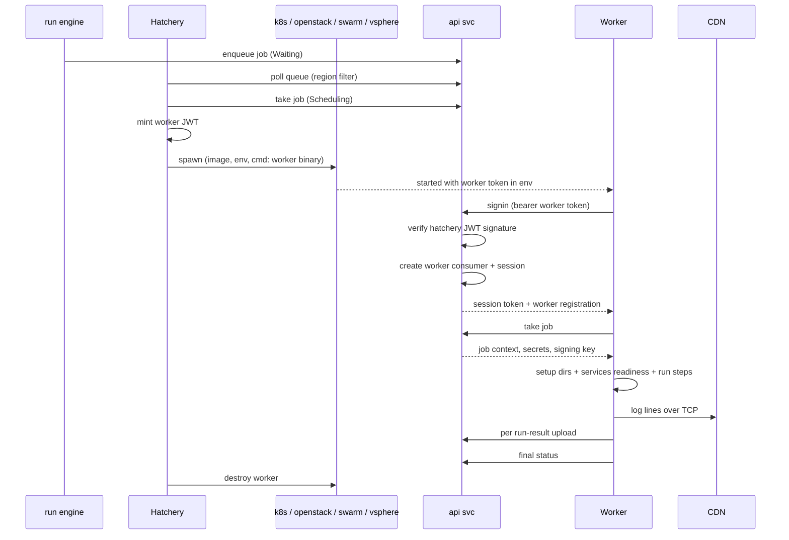

# Hatcheries

This document specifies the **hatchery** layer of CDS: the daemon that
polls the API for queued jobs and spawns workers on a configured
backend (local, Kubernetes, OpenStack, Swarm, vSphere). It covers the
`sdk.hatchery.Interface` contract, the common bootstrap, the five
concrete implementations, the sign-in handshake with region binding,
the worker provisioning sequence, the v1 and v2 worker-model models,
the v1 `Requirement` family, and the v2 `runs-on` resolution path.

The worker binary that the hatchery spawns — and the in-worker job
execution flow — is documented in [`11-workers.md`](./11-workers.md).
The gRPC plugin protocol used inside workers lives in
[`17-plugins.md`](./17-plugins.md). The data shapes for jobs (`V2Job`,
`runs-on`, `services`) live in [`04-workflow-v2.md`](./04-workflow-v2.md);
the run engine that hands jobs to hatcheries is documented in
[`07b-run-engine-v2.md`](./07b-run-engine-v2.md).

Source code anchors. Hatchery contract: `Interface` and
`InterfaceWithModels`, `HatcheryCommonConfiguration`, `SpawnArguments`
in `sdk/hatchery/types.go`; `AuthConsumerHatcherySigninResponse` in
`sdk/hatchery.go`. SDK helpers: `Create`, `routines`,
`V2QueuePolling`, `queuePolling`, `mainRoutine` in
`sdk/hatchery/hatchery.go`; starters pool in `sdk/hatchery/starter.go`;
register flow in `sdk/hatchery/register.go`; worker-token helpers
(`NewWorkerToken`, `NewWorkerTokenV2`) in
`sdk/hatchery/worker_token.go`. The five implementations under
`engine/hatchery/{local,kubernetes,openstack,swarm,vsphere}/` with a
common bootstrap in `engine/hatchery/serve.go`. Worker-side `Model`
(v1) in `sdk/worker_model.go`; `V2WorkerModel` in
`sdk/v2_worker_model.go`; requirement types in `sdk/requirement.go`.

## 1. Scope

**In scope** — `sdk.hatchery.Interface` and `InterfaceWithModels`;
`HatcheryCommonConfiguration`; the common server
(`engine/hatchery/serve.go`); the SDK helpers (`hatchery.Create`,
starters pool, worker token JWT minting); the five hatchery
implementations (local, Kubernetes, OpenStack, Swarm, vSphere); region
binding through the signin handshake; worker provisioning sequence
from the hatchery's perspective; worker model v1 (`Model`, DB) and v2
(`V2WorkerModel`, ascode); the ten `*Requirement` types; v2
`V2JobRunsOn` resolution.

**Out of scope** — Worker binary, in-worker job execution, plugin
invocation, log streaming (see [`11-workers.md`](./11-workers.md));
gRPC plugin protocol and catalogues (see
[`17-plugins.md`](./17-plugins.md)); workflow YAML schema (see
[`04-workflow-v2.md`](./04-workflow-v2.md)); run engine state machine
and crafting (see [`07b-run-engine-v2.md`](./07b-run-engine-v2.md));
RBAC `manage-hatchery` and `start-worker` roles (see
[`09-rbac.md`](./09-rbac.md)).

## 2. Table of contents

1. [Scope](#1-scope)
2. [Table of contents](#2-table-of-contents)
3. [Hatchery interface and common framework](#3-hatchery-interface-and-common-framework)
4. [The five hatchery implementations](#4-the-five-hatchery-implementations)
5. [Hatchery sign-in and region binding](#5-hatchery-sign-in-and-region-binding)
6. [Worker provisioning sequence](#6-worker-provisioning-sequence)
7. [Worker models: v1 vs v2](#7-worker-models-v1-vs-v2)
8. [V1 requirements](#8-v1-requirements)
9. [V2 `runs-on` resolution](#9-v2-runs-on-resolution)
10. [Cross-spec pointers](#10-cross-spec-pointers)

## 3. Hatchery interface and common framework

### 3.1 The interface

`sdk.hatchery.Interface` (`sdk/hatchery/types.go:159-175`) is the
contract every hatchery implements:

| Method | Purpose |
| --- | --- |
| `Name()` | Hatchery name |
| `Type()` | Service type string |
| `InitHatchery(ctx)` | Bootstrap the hatchery with its configuration |
| `SpawnWorker(ctx, args)` | Materialise a new worker for a given `SpawnArguments` value |
| `CanSpawn(ctx, model, jobID, requirements)` | Tell the run engine whether the hatchery is eligible for a (model, requirements) tuple |
| `WorkersStarted(ctx)` | List worker names currently provisioned |
| `Service()` | Identity metadata (`*sdk.Service`) |
| `CDSClient()`, `CDSClientV2()` | Configured API clients (v1 + v2 hatchery client) |
| `Configuration()` | Return the `HatcheryCommonConfiguration` |
| `Serve(ctx)` | Run the hatchery HTTP server |
| `GetPrivateKey()` | RSA private key used to sign worker JWTs |
| `GetGoRoutines()`, `GetMapPendingWorkerCreation()` | Operational helpers |
| `GetRegion()` | Region the hatchery is bound to (post-`SigninV2`) |

The hatchery surface is split across several optional extensions
(`sdk/hatchery/types.go:177-193`):

| Extension | Adds | Used by |
| --- | --- | --- |
| `InterfaceWithModels` | `ModelType()`, `NeedRegistration(ctx, model)`, `WorkerModelsEnabled()`, `WorkerModelSecretList(model)`, `CanAllocateResources(ctx, model, jobID, requirements)` | Hatcheries that manage a model catalogue (image references, capacity hints) |
| `InterfaceWithDetaultWorkerModelV2` | `GetDetaultModelV2Name(ctx, requirements)` | Hatcheries advertising a default v2 model |
| `InterfaceWithCustomBookDelay` | `ComputeBookDelay(ctx, model)` | Hatcheries needing a non-default book delay |

The signin handshake (`SigninV2`, `HeartbeatV2`) and the shared HTTP
bootstrap live on `Common` (`engine/hatchery/serve.go`), inherited by
every implementation via composition (see §3.4).

### 3.2 `HatcheryCommonConfiguration`

The shared `HatcheryCommonConfiguration` (`engine/service/types.go`)
groups the typical hatchery settings: `Name`, the `API` block
(`HTTP.URL`, `Token`, `TokenV2`, `RequestTimeout`, `MaxHeartbeatFailures`,
`InsecureSkipVerifyTLS`), the `CDN` block (`URL`, `TCP.URL`,
`TCP.Port`, `InsecureSkipVerifyTLS`), the `Provision` block (`Region`,
`IgnoreJobWithNoRegion`, `MaxWorker`, `WorkerBasedir`,
`WorkerLogsOptions`, etc.), HTTP server settings, and per-region
rate-limiting toggles. The `Provision.Region` field is the declared
region this hatchery serves; the actual region is the one echoed back
by the API at `SigninV2` time (see
[section 5](#5-hatchery-sign-in-and-region-binding)).

### 3.3 `SpawnArguments`

`SpawnArguments` (`sdk/hatchery/types.go`) is what the run engine hands
to a hatchery for each spawn: `WorkerName`, `WorkerToken` (a JWT
signed by the hatchery), `Model` (`WorkerStarterWorkerModel`),
`JobID` (v2 run-job ID), `RegisterOnly`, `HatcheryName`, `Region`,
`ModelType`.

### 3.4 Common server bootstrap

Every hatchery binary embeds `Common` (`engine/hatchery/serve.go`)
which provides the HTTP router, the `SigninV2` handshake against the
API, the `Init` lifecycle, the `Heartbeat` routine, and a
`GenerateWorkerConfig` helper used to prepare the configuration passed
to a new worker. The five concrete implementations inherit
bootstrap-level behaviour through composition.

### 3.5 SDK helpers

The SDK ships the cross-implementation engine in `sdk/hatchery/`:

| File | Purpose |
| --- | --- |
| `sdk/hatchery/hatchery.go` | `Create` main loop and `routines` goroutine fan-out (`V2QueuePolling`, `queuePolling`, `mainRoutine`, `checkErrs`) |
| `sdk/hatchery/starter.go` | Worker starters pool — caps concurrency |
| `sdk/hatchery/register.go` | `workerRegister` flow |
| `sdk/hatchery/worker_token.go` | `NewWorkerToken` (v1) and `NewWorkerTokenV2` |

Workers are minted with a JWT signed by the hatchery's private RSA
key — see [`01-architecture.md`](./01-architecture.md).

## 4. The five hatchery implementations

| Implementation | Directory | Spec | Backend |
| --- | --- | --- | --- |
| Local | `engine/hatchery/local/` (entry: `local.go`, config: `types.go`) | `V2WorkerModelDockerSpec` or simple OS process | Local processes / containers on the host |
| Kubernetes | `engine/hatchery/kubernetes/` | `V2WorkerModelDockerSpec` | Pods in a configured cluster |
| OpenStack | `engine/hatchery/openstack/` | `V2WorkerModelOpenstackSpec` (image + flavor) | Nova VMs |
| Swarm | `engine/hatchery/swarm/` | `V2WorkerModelDockerSpec` | Docker Swarm services / containers |
| vSphere | `engine/hatchery/vsphere/` | `V2WorkerModelVSphereSpec` (template + flavor) | VM template clones in vCenter |

Each `SpawnWorker` implementation receives a `SpawnArguments` value,
materialises the runtime (`docker run`, `kubectl create pod`,
`nova boot`, etc.) and bakes in a cloud-init / startup script that
downloads the worker binary and starts it with the supplied worker
token. `CanSpawn`, called by the run engine, decides whether the
hatchery is eligible for a given (model, requirements) tuple.

## 5. Hatchery sign-in and region binding

At startup, every hatchery (other than local) calls `SigninV2` against
the API at `POST /v2/auth/consumer/hatchery/signin`. The API validates
the bootstrap builtin token, mints a hatchery-typed JWT, and returns
`AuthConsumerHatcherySigninResponse` (`sdk/hatchery.go`): `Token`,
`Region`, `Hatchery`.

The `Region` echo is the source of truth — even if the hatchery
declared `Provision.Region = "rgnA"` in its config, only what the API
returns is trusted. The hatchery stores this in `c.Region` and every
subsequent `LoadQueuedRunJob` request filters by it.

RBAC rules pin the hatchery to the region as well: the bound
`RBACHatchery` (`sdk/rbac_hatchery.go`) carries `HatcheryID + RegionID
+ HatcheryRoleSpawn` (see [`09-rbac.md`](./09-rbac.md)).

## 6. Worker provisioning sequence

Numbered steps:

1. The run engine flips the job to `Waiting` (see
   [`07b-run-engine-v2.md`](./07b-run-engine-v2.md)).
2. The hatchery polls and books the job (`Scheduling`) via
   `postHatcheryTakeJobRunHandler`.
3. It mints a worker JWT (`sdk/hatchery/worker_token.go`,
   `NewWorkerTokenV2`) and spawns the backend resource.
4. The backend starts the worker binary with the token in its
   environment.
5. The worker registers against the API at
   `/auth/consumer/worker/signin`. `postRegisterWorkerHandler` creates
   a new consumer (`sdk.ConsumerBuiltin` for v1 workers via
   `NewConsumerWorker`, `sdk.ConsumerHatchery` for v2 workers via
   `NewConsumerWorkerV2`) and a session
   (`engine/api/authentication/consumer.go:49-90`).
6. The worker takes the job at
   `/v2/queue/{region}/job/{id}/worker/take`
   (`postV2WorkerTakeJobHandler`).
7. The worker runs the job (see [`11-workers.md`](./11-workers.md));
   logs stream to CDN, run-results upload back.
8. The worker reports the terminal status; the hatchery destroys the
   backend resource.

## 7. Worker models: v1 vs v2

### 7.1 V1 model

`sdk/worker_model.go` defines `Model` (legacy, DB-stored):

| Field | Purpose |
| --- | --- |
| `ID`, `Name`, `Type` (`docker`, `openstack`, `vsphere`, `host`) | Identity |
| `RegisteredOS`, `RegisteredArch` | OS / arch reported at registration |
| `NeedRegistration` | Registration toggle |
| `ModelDocker` (image, shell, cmd, envs, memory) | Docker-specific configuration |
| `ModelVirtualMachine` (image, flavor, pre/post cmd, user/password) | VM-specific configuration |
| `RegisteredCapabilities []Requirement` | Binaries / plugins discovered at register |

### 7.2 V2 model

`V2WorkerModel` (`sdk/v2_worker_model.go`) is the ascode model.
Schema, validation, and YAML examples are documented in
[`04-workflow-v2.md`](./04-workflow-v2.md). The runtime contract: the
hatchery reads `Type` and unmarshals `Spec` into one of
`V2WorkerModelDockerSpec`, `V2WorkerModelOpenstackSpec`,
`V2WorkerModelVSphereSpec`.

### 7.3 Bridging v1 and v2

When the engine resolves a v2 job (`canRunJobWithModelV2` in
`sdk/hatchery/hatchery.go`), it loads the `V2WorkerModel` from its
repo / ref / path, then builds an in-memory v1-shaped `Model` so the
existing `CanSpawn` / `SpawnWorker` paths can stay identical between
v1 and v2 jobs.

## 8. V1 requirements

V1 jobs declare what they need from a worker through `Requirement`
rows (`sdk/requirement.go`) attached to actions. Ten types:

| Constant | Type | Use |
| --- | --- | --- |
| `BinaryRequirement` | `binary` | `which <value>` must succeed on the worker |
| `ModelRequirement` | `model` | Exact worker-model name |
| `HostnameRequirement` | `hostname` | Pin to one worker |
| `PluginRequirement` | `plugin` | A specific gRPC plugin |
| `ServiceRequirement` | `service` | Side container next to the worker |
| `MemoryRequirement` | `memory` | Container memory cap |
| `OSArchRequirement` | `os-architecture` | One of `OSArchRequirementValues` |
| `RegionRequirement` | `region` | Hatchery region |
| `SecretRequirement` | `secret` | Regex pattern over the project secrets |
| `FlavorRequirement` | `flavor` | OpenStack / vSphere VM sizing |

`AvailableRequirementsType` lists every supported value.
`OSArchRequirementValues` enumerates the supported OS / arch pairs.
Validation enforces uniqueness on `model` and `hostname` and
validates regex syntax on `secret`.

The hatchery matches a job by walking the requirement list against
its capabilities (model availability, region match, binaries reported
at registration time). `LoopPath`
(`engine/worker/internal/register.go`) is the worker-side companion
that probes `which <bin>` for every binary requirement at
registration so the API knows what the worker can run.

## 9. V2 `runs-on` resolution

V2 replaces requirements with `V2JobRunsOn` (`sdk/v2_workflow.go`)
carrying `Model` (worker-model identifier), optional `Memory`, and
optional `Flavor`. The marshaller tolerates both the shorthand form
(`runs-on: "library/docker-ubuntu"`) and the structured form
(`runs-on: { model, memory, flavor }`).

### 9.1 Dispatch

`canRunJobWithModelV2` (`sdk/hatchery/hatchery.go`):

1. Parse the model path: `projKey/vcsName/repo/modelName@branch`.
2. Load the `V2WorkerModel` from the API (or library cache).
3. Compare `V2WorkerModel.Type` to `hatchery.ModelType()`:
   - `Type = docker` → Kubernetes / Swarm hatcheries.
   - `Type = openstack` → OpenStack hatchery.
   - `Type = vsphere` → vSphere hatchery.
4. Build the in-memory v1-shaped `Model` (image, envs, memory,
   flavor).
5. Call `hatchery.CanSpawn(ctx, model, jobID, requirements)`.

The v1 `model` requirement and v2 `runs-on` converge on the same
`CanSpawn` checkpoint, which is what allows the platform to keep one
hatchery codebase serving both generations.

### 9.2 Region selection

Region is enforced twice: first by the hatchery polling only its own
region, then by `RBACRegionProject` (see [`09-rbac.md`](./09-rbac.md))
which requires the project to have `RegionRoleExecute` on the region.

## 10. Cross-spec pointers

- Worker binary, in-worker execution, plugin invocation, log streaming → [`11-workers.md`](./11-workers.md)
- gRPC plugin protocol and built-in catalogues → [`17-plugins.md`](./17-plugins.md)
- Microservices, request lifecycle, API goroutines → [`01-architecture.md`](./01-architecture.md)
- Projects, regions, integrations → [`02-project-and-tenancy.md`](./02-project-and-tenancy.md)
- Workflow v1 (legacy requirements) → [`03-workflow-v1.md`](./03-workflow-v1.md)
- Workflow v2 YAML schema (`runs-on`, services, matrix) → [`04-workflow-v2.md`](./04-workflow-v2.md)
- Ascode entities (worker-model storage) → [`05-ascode-entities.md`](./05-ascode-entities.md)
- V1 hook routing → [`06a-hooks-v1.md`](./06a-hooks-v1.md)
- V2 hook routing → [`06b-hooks-v2.md`](./06b-hooks-v2.md)
- V1 run engine → [`07a-run-engine-v1.md`](./07a-run-engine-v1.md)
- V2 run engine state machine, queue handoff, retries → [`07b-run-engine-v2.md`](./07b-run-engine-v2.md)
- Auth drivers, worker consumer → [`08-auth.md`](./08-auth.md)
- RBAC v2 (hatchery binding, region rules) → [`09-rbac.md`](./09-rbac.md)
- CDN, log storage, run-result storage → [`12-cdn-and-artifacts.md`](./12-cdn-and-artifacts.md)
- VCS providers → [`13-vcs.md`](./13-vcs.md)
- Integrations → [`14-integrations.md`](./14-integrations.md)
- cdsctl → [`15-cli.md`](./15-cli.md)
- Go SDK → [`16-sdk.md`](./16-sdk.md)
- UI → [`18-ui.md`](./18-ui.md)
- Glossary, statuses, expressions → [`19-glossary-and-cross-references.md`](./19-glossary-and-cross-references.md)
