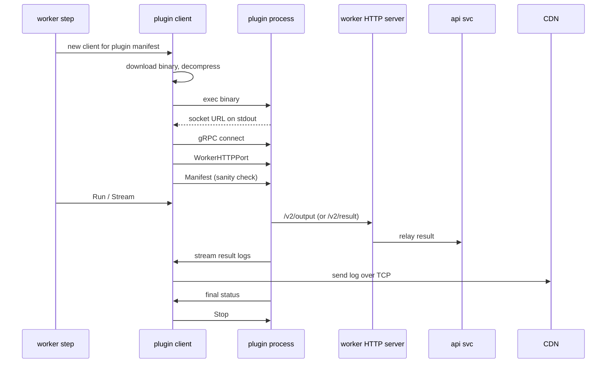

# Workers

This document specifies the **worker** layer of CDS: the worker binary
that the hatchery spawns, how it registers, how it takes a job, how
it runs the steps (`V2ProcessJob`), how it invokes gRPC plugins, how
it ships logs to the CDN service, and how it handles outputs and run
results.

The hatchery daemon that spawns workers is documented in
[`10-hatcheries.md`](./10-hatcheries.md). The gRPC plugin protocol
itself (action / integration manifest, RPCs, catalogue) lives in
[`17-plugins.md`](./17-plugins.md) — this document covers only the
worker-side invocation flow. The run engine that hands jobs to
workers via the queue is in
[`07b-run-engine-v2.md`](./07b-run-engine-v2.md).

Source code anchors. Worker binary entry in `engine/worker/main.go`;
v2 execution in `engine/worker/internal/runV2.go`; register in
`engine/worker/internal/register.go`; plugin client in
`engine/worker/internal/plugin/plugin.go`; v2 command surface in
`engine/worker/v2_cmd_output.go`, `engine/worker/v2_cmd_result.go`,
`engine/worker/pkg/workerruntime/handlers_v2.go`. Worker token / take
response in `sdk/v2_worker.go`. Log streaming to CDN in
`engine/worker/internal/take.go`.

## 1. Scope

**In scope** — Worker binary entry points (v1 vs v2 modes,
register-only mode); registration sequence; take-job flow and
`V2TakeJobResponse`; in-worker execution (`V2ProcessJob`): setup,
service readiness, hooks, step loop, output capture, post-job
cleanup; worker-side HTTP server for plugins / CLI; job services
(sidecars); worker-side plugin invocation flow; log streaming to CDN
over TCP with sensitive-data filtering.

**Out of scope** — Hatchery daemon, the five backend implementations,
worker-model dispatch, region binding (see
[`10-hatcheries.md`](./10-hatcheries.md)); gRPC plugin protocol and
the built-in catalogues (see [`17-plugins.md`](./17-plugins.md));
workflow YAML schema (see [`04-workflow-v2.md`](./04-workflow-v2.md));
run engine state machine (see
[`07b-run-engine-v2.md`](./07b-run-engine-v2.md)); CDN log storage
internals and TCP framing details (see
[`12-cdn-and-artifacts.md`](./12-cdn-and-artifacts.md)); per-provider
VCS auth used by `actions/checkout` (see [`13-vcs.md`](./13-vcs.md)).

## 2. Table of contents

1. [Scope](#1-scope)
2. [Table of contents](#2-table-of-contents)
3. [Worker binary and lifecycle](#3-worker-binary-and-lifecycle)
4. [Take job](#4-take-job)
5. [In-worker execution loop](#5-in-worker-execution-loop)
6. [Step types](#6-step-types)
7. [Worker-side handlers](#7-worker-side-handlers)
8. [Job services (sidecars)](#8-job-services-sidecars)
9. [Plugin invocation flow](#9-plugin-invocation-flow)
10. [Logs to CDN over TCP](#10-logs-to-cdn-over-tcp)
11. [Cross-spec pointers](#11-cross-spec-pointers)

## 3. Worker binary and lifecycle

### 3.1 Entry points

`engine/worker/main.go` dispatches on the runtime environment:

```
isCI() && isLegacyMode()  → v1 command set (cmd_run.go, cmd_export.go, …)
isCI() && !isLegacyMode() → v2 command set (v2_cmd_output.go, v2_cmd_result.go)
!isCI()                   → register command only (cmd_register.go)
```

CI detection relies on environment variables set by the hatchery. The
dual-mode binary means one worker artefact serves both v1 and v2
jobs.

### 3.2 Register

`engine/worker/cmd_register.go` then
`engine/worker/internal/register.go`:

1. Call the API at `/auth/consumer/worker/signin` with the
   hatchery-signed JWT.
2. Discover binary requirements (`LoopPath`).
3. Submit the registration form and receive the worker ID + session
   token.

The API handler `postRegisterWorkerHandler` (`engine/api/worker.go`)
verifies the hatchery JWT, loads the hatchery service and its
consumer, creates a worker consumer via `NewConsumerWorker` /
`NewConsumerWorkerV2`, creates a session, and returns the worker
token. For v2 workers the consumer type is `ConsumerHatchery` (see
[`08-auth.md`](./08-auth.md)).

### 3.3 Heartbeat and shutdown

The worker emits a heartbeat with the session token. On graceful
shutdown it calls `/auth/consumer/worker/signout` to revoke the
session. If the worker dies abruptly, the watchdog
`worker.DisabledDeadWorkers` (`engine/api/api.go`) marks the row as
disabled; `worker.DeleteDisabledWorkers` cleans it up later.

## 4. Take job

`postV2WorkerTakeJobHandler` (`engine/api/v2_queue_worker.go`)
validates that the worker is `Waiting` and the job is `Scheduling`,
loads the project / VCS / integrations / variable sets, computes the
run-job context (`computeRunJobContext`, see
[`07b-run-engine-v2.md`](./07b-run-engine-v2.md)), flips both worker
and job to `Building`, and returns `V2TakeJobResponse`
(`sdk/v2_worker.go`):

| Field | Purpose |
| --- | --- |
| `RunJob` | The `V2WorkflowRunJob` snapshot |
| `AsCodeActions` | Map `<complete-name> → V2Action` for the job's steps |
| `SigningKey` | base64-encoded worker private key for run-result signature |
| `Contexts` | `WorkflowRunJobsContext` (cds, git, vars, env, …) |
| `SensitiveDatas` | Literal strings the worker must filter out of every log line |

## 5. In-worker execution loop

`V2ProcessJob` (`engine/worker/internal/runV2.go`):

1. **Setup** — create working directory, key directory, tmp directory,
   hooks directory.
2. **Services readiness** — `runJobServicesReadiness` starts every
   declared service and waits for its readiness probe.
3. **Pre-job hooks** — `executeHooksSetupV2`.
4. **Step loop** — `runJobAsCode`:
   - For each step build the per-step context (parent context + step
     `env`).
   - Run the step (`runActionStep`).
   - Flush log buffer (`gelfLogger.hook.Flush()`).
   - Update the step result; propagate `continue-on-error`.
   - Report partial progress to the API via `V2QueueJobStepUpdate`.
5. **Outputs** — every job output declared in `V2Job.Outputs` is
   uploaded via `V2AddRunResult`.
6. **Post hooks** — cleanup, notifications.
7. **Cleanup** — remove temp directories.
8. **Final report** — return `V2WorkflowRunJobResult { Status, Error }`.

## 6. Step types

A step is either `run:` (inline script) or `uses:` (action
reference). The worker dispatches:

- `run:` → execute via the `Script` action (which is itself a plugin
  in v2; see [`17-plugins.md`](./17-plugins.md#5-built-in-action-plugin-catalogue)).
- `uses: .cds/actions/…` → resolve to a local action and recursively
  run its steps.
- `uses: actions/<name>` → invoke the matching gRPC action plugin
  (see [section 9](#9-plugin-invocation-flow)).

## 7. Worker-side handlers

The worker hosts a tiny HTTP server
(`engine/worker/pkg/workerruntime/handlers_v2.go`) so plugins and
steps can call back into it:

| Route | Method | Handler | Purpose |
| --- | --- | --- | --- |
| `/v2/result` | POST/PUT/GET | `V2_runResultHandler` | Register a typed `V2WorkflowRunResult` |
| `/v2/output` | POST | `V2_outputHandler` | Capture a step output (`name=value` → `${{ steps.id.outputs.name }}`) |
| `/v2/result/synchronize` | POST | `V2RunResultsSynchronizeHandler` | Push pending results to the API |

The CLI subcommands `worker output <name> <value>` and
`worker result …` (`engine/worker/v2_cmd_output.go`,
`engine/worker/v2_cmd_result.go`) call these endpoints over loopback.

## 8. Job services (sidecars)

`V2JobService` (`sdk/v2_workflow.go`) declares side containers that
run alongside the worker for the duration of the job. Each service
has an `Image`, an `Env` map, and a `Readiness` block
(`V2JobServiceReadiness`: `Command`, `Interval`, `Retries`,
`Timeout`). At job start `runJobServicesReadiness` spins up every
declared service and loops the readiness command with the configured
interval and timeout. A service whose readiness command never returns
success fails the whole job before any step runs.

Implementations across hatcheries:

- **Kubernetes** — services become co-pods (or sidecar containers)
  sharing the network.
- **Swarm** — services are containers attached to the same Docker
  network as the worker.
- **OpenStack / vSphere** — services run as additional Docker
  containers on the VM that hosts the worker.
- **Local** — services run as local Docker containers on the host.

## 9. Plugin invocation flow

The worker invokes gRPC plugins (action plugins primarily, also
integration plugins for some callbacks) through the protocol
documented in [`17-plugins.md`](./17-plugins.md). This section covers
the **worker-side flow** only — the wire contract and built-in
catalogues live in the plugins spec.



Key details from `engine/worker/internal/plugin/plugin.go`:

- `createGRPCPluginSocket` downloads the binary, extracts it,
  launches the process, and waits for the socket URL to appear on
  stdout. The Unix socket path follows
  `$HOME_CDS_PLUGINS/grpcplugin-socket-{UUID}.sock`.
- `enablePluginLogger` reads the plugin's stdout / stderr
  line-by-line and forwards each line to the worker via
  `c.w.SendLog`. This is how a plugin that just prints to stdout gets
  its output into CDN.
- `Run` dispatches by plugin kind:
  - `TypeStream` → `runStreamActionPlugin` — bidirectional stream.
  - `TypeAction` → `runActionPlugin` — request/response.
  - `TypeIntegration` → `runIntegrationPlugin` — request/response
    with `outputs`.
- `Close` calls the appropriate `Stop` RPC and stops the logger.

## 10. Logs to CDN over TCP

The worker ships logs as Graylog (GELF) lines over TCP to the CDN
service. The configuration comes from `worker.cfg.GelfServiceAddr`
and optional TLS via `GelfServiceAddrEnableTLS`
(`engine/worker/internal/take.go`).

Throttling policy on the worker side: a small batch (default
`Amount = 100` lines) is flushed every short period
(`Period = 10 ms`), so logs reach CDN promptly but the network is
never starved with one-line packets.

The CDN-side TCP handler `runTCPLogServer`
(`engine/cdn/cdn_log_tcp.go`) accepts the connection, applies a
global TCP rate limit (`GlobalTCPRateLimit`) and a per-step rate
limit (`StepLinesRateLimit`), parses lines, and forwards them to the
storage backend. The full storage pipeline is documented in
[`12-cdn-and-artifacts.md`](./12-cdn-and-artifacts.md).

The `SensitiveDatas` returned by `postV2WorkerTakeJobHandler` (see
[section 4](#4-take-job)) is applied client-side before any log line
is shipped, so secrets never reach the TCP wire.

## 11. Cross-spec pointers

- Hatchery daemon, the five implementations, region binding,
  worker-model dispatch → [`10-hatcheries.md`](./10-hatcheries.md)
- gRPC plugin protocol and built-in catalogues →
  [`17-plugins.md`](./17-plugins.md)
- Microservices, request lifecycle → [`01-architecture.md`](./01-architecture.md)
- Workflow v2 schema, services, matrix → [`04-workflow-v2.md`](./04-workflow-v2.md)
- Ascode entities (action / worker-model storage) → [`05-ascode-entities.md`](./05-ascode-entities.md)
- V2 run engine state machine, queue handoff, retries → [`07b-run-engine-v2.md`](./07b-run-engine-v2.md)
- Auth drivers, worker consumer → [`08-auth.md`](./08-auth.md)
- RBAC v2 → [`09-rbac.md`](./09-rbac.md)
- CDN, log storage, run-result storage → [`12-cdn-and-artifacts.md`](./12-cdn-and-artifacts.md)
- VCS providers (`actions/checkout` consumer) → [`13-vcs.md`](./13-vcs.md)
- Integrations (artifact-manager callbacks etc.) → [`14-integrations.md`](./14-integrations.md)
- Glossary, statuses → [`19-glossary-and-cross-references.md`](./19-glossary-and-cross-references.md)
