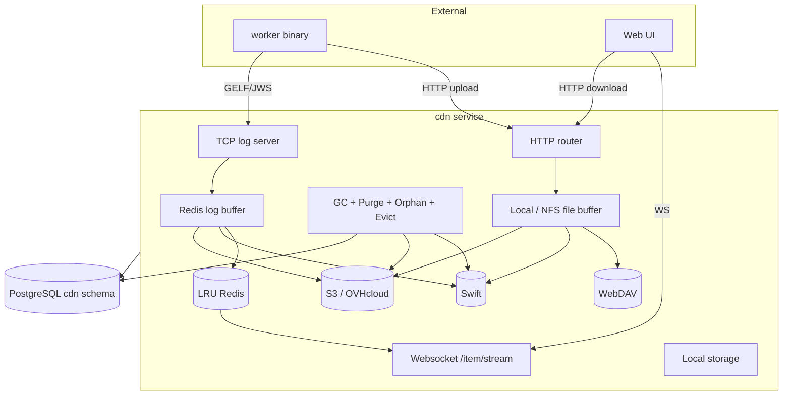

# CDN, Logs, Artifacts, Run Results

This document specifies the storage and distribution plane of CDS — the
`cdn` microservice. It documents the CDN's item model, the pluggable
storage-unit framework (S3, Swift, NFS, local, Redis, WebDAV,
encryption), the TCP log-streaming protocol, the GELF-based log
pipeline, the LRU and Redis hot caches, the synchronisation engine
that mirrors items between units, the garbage collector, and the
run-result type catalogue for both v1 and v2.

The worker-side that ships logs and run-results lives in
[`11-workers.md`](./11-workers.md). The
expression context for run-results at runtime is in
[`04-workflow-v2.md`](./04-workflow-v2.md). The run engine that
consumes run-results sits in [`07b-run-engine-v2.md`](./07b-run-engine-v2.md).

Source code anchors. CDN service entry in `engine/cdn/cdn.go`; router
in `engine/cdn/cdn_router.go`; TCP log server in
`engine/cdn/cdn_log_tcp.go`; log engine and persistence in
`engine/cdn/cdn_log_engine.go` and `engine/cdn/cdn_log_store.go`; item
read in `engine/cdn/cdn_item.go`; item upload in
`engine/cdn/item_upload.go`; GC in `engine/cdn/cdn_gc.go`. Public
types: `CDNItem`, `CDNItemUnit`, `CDNApiRef`, `CDNLogAPIRef`,
`CDNLogAPIRefV2`, `CDNRunResultAPIRef`, `CDNRunResultAPIRefV2`,
`CDNWorkerCacheAPIRef`, `CDNTypeItem*` constants,
`CDNStatusItemIncoming`, `CDNStatusItemCompleted` in `sdk/cdn.go`;
`Signature`, `SignatureWorker`, `SignatureService`,
`SignatureHatcheryService` in `sdk/cdn/signature.go`. Storage units in
`engine/cdn/storage/`: `Interface` in `engine/cdn/storage/types.go`;
implementations under
`engine/cdn/storage/{local,s3,swift,nfs,redis,webdav,encryption}/`;
LRU cache in `engine/cdn/lru/redis.go`.

## 1. Scope

**In scope** — CDN service architecture, configuration, and background
goroutines; HTTP and WebSocket routes; `CDNItem`, the per-storage
`CDNItemUnit` row, and the eight concrete `CDNTypeItem*` types; the
pluggable `storage.Interface` and its seven implementations (local,
S3, Swift, NFS, WebDAV, Redis, encryption); the buffer (hot) vs
storage (cold) split; the LRU Redis cache (`engine/cdn/lru/redis.go`)
for logs; item upload over HTTP with JWS worker signature; log
streaming over TCP with GELF / Graylog framing, rate limiting, and JWS
signature; log persistence through Redis queues and flush to buffer;
item download with hot-warm-cold fallback; WebSocket log streaming;
cross-unit synchronisation; garbage collection (`itemsGC`, `itemPurge`,
`cleanBuffer`, `cleanWaitingItem`, `cleanItemToDelete`); v1
`WorkflowRunResult` and v2 `V2WorkflowRunResult` catalogues; retention
TTLs (`ItemLogGC = 24 * 3600`).

**Out of scope** — Worker-side log shipping client (see [`11-workers.md`](./11-workers.md)); run-engine bookkeeping for run results (see [`07b-run-engine-v2.md`](./07b-run-engine-v2.md)); ascode signing (see [`05-ascode-entities.md`](./05-ascode-entities.md)); RBAC enforcement on download URLs (see [`09-rbac.md`](./09-rbac.md)).

## 2. Table of contents

1. [Scope](#1-scope)
2. [Table of contents](#2-table-of-contents)
3. [Service architecture](#3-service-architecture)
4. [Routes](#4-routes)
5. [CDN item model](#5-cdn-item-model)
6. [Storage units](#6-storage-units)
7. [Buffers vs storages](#7-buffers-vs-storages)
8. [Hot caches: LRU and Redis](#8-hot-caches-lru-and-redis)
9. [Item upload](#9-item-upload)
10. [Log streaming over TCP](#10-log-streaming-over-tcp)
11. [Log signature](#11-log-signature)
12. [Log persistence pipeline](#12-log-persistence-pipeline)
13. [Item download](#13-item-download)
14. [WebSocket stream](#14-websocket-stream)
15. [Cross-unit synchronisation](#15-cross-unit-synchronisation)
16. [Garbage collection](#16-garbage-collection)
17. [Run-result types](#17-run-result-types)
18. [Retention TTLs](#18-retention-ttls)
19. [Cross-spec pointers](#19-cross-spec-pointers)

## 3. Service architecture

The CDN service stores logs, artifacts, and run-results. Its entry
point is `Serve` in `engine/cdn/cdn.go`. It exposes an HTTP router, a
TCP server for streaming logs from workers, and a WebSocket endpoint
for live log tailing.



### 3.1 `Service` struct

`Service` (`engine/cdn/types.go`) holds:

| Field | Role |
| --- | --- |
| `Cfg` (`Configuration`) | Service configuration |
| `DBConnectionFactory` | PostgreSQL connection (CDN schema, `engine/sql/cdn/`) |
| `Router` | HTTP router |
| `Cache` (`cache.Store`) | Redis cache for log buffers, queues, locks |
| `LogCache` (`lru.Redis`) | Bounded LRU Redis cache (~128 MB default) |
| `Mapper` (`gorpmapper.Mapper`) | Integrity envelopes, encryption |
| `Units` (`storage.RunningStorageUnits`) | Runtime registry of buffers + storages |
| `WSServer`, `WSBroker` | WebSocket broker for live log streaming |
| `Metrics` | Counters (`tcpServerErrorsCount`, `itemCompletedByGCCount`, …) |

### 3.2 Background goroutines

`Start` (`engine/cdn/cdn.go`) and `runTCPLogServer`
(`engine/cdn/cdn_log_tcp.go`) fork the following goroutines:

| Goroutine | Purpose | Cadence |
| --- | --- | --- |
| `service.cdn-gc-items` | Mark expired / fully-synced items | 30 min |
| `service.cdn-purge-items` | Delete items previously marked `ToDelete` | 15 min |
| `service.log-cache-eviction` | Evict cold entries from the LRU | continuous |
| `service.cdn-orphan-cleanup` | Drop items detached from v1 workflows | 60 s |
| `cdn-waiting-job` | Drive the Redis log-job queue | 250 ms tick |
| `service.runTCPLogServer.accept` | Accept TCP connections | per connection |
| `service.runTCPLogServer.shutdown` | Graceful shutdown listener | one-shot |

## 4. Routes

The CDN service exposes a uniform HTTP surface
(`engine/cdn/cdn_router.go`):

| Route | Method | Handler |
| --- | --- | --- |
| `/mon/version`, `/mon/status`, `/mon/metrics`, `/mon/metrics/all`, `/mon/profile/{name}` | GET | monitoring |
| `/cache` | DELETE | `deleteCacheHandler` |
| `/cache/status` | GET | `getStatusCacheHandler` |
| `/bulk/item/delete` | POST | `bulkDeleteItemsHandler` |
| `/item/duplicate` | POST | `postDuplicateItemForJobHandler` |
| `/item/upload` | POST | `postUploadHandler` |
| `/item/stream` | GET (WebSocket) | `getItemLogsStreamHandler` |
| `/item/{type}` | GET | `getItemsHandler` |
| `/item/{type}/lines` | GET | `getItemsAllLogsLinesHandler` |
| `/item/{type}/{apiRef}` | GET / DELETE | `getItemHandler` / `deleteItemHandler` |
| `/item/{type}/{apiRef}/checksync` | GET | `getItemCheckSyncHandler` |
| `/item/{type}/{apiRef}/download` | GET | `getItemDownloadHandler` |
| `/item/{type}/{apiRef}/download/{unit}` | GET | `getItemDownloadInUnitHandler` |
| `/item/{type}/{apiRef}/lines` | GET | `getItemLogsLinesHandler` |
| `/unit` | GET | `getUnitsHandler` |
| `/unit/{id}` | DELETE | `deleteUnitHandler` |
| `/unit/{id}/item` | DELETE | `markItemUnitAsDeleteHandler` |
| `/sync/buffer` | POST | `syncBufferHandler` |
| `/size/item/project/{projectKey}` | GET | `getSizeByProjectHandler` |
| `/admin/database/migration*` | * | DB migrations |
| `/admin/backend/{id}/resync/{type}` | POST | resync a backend |

The TCP log server runs on a separate port (`Cfg.TCP.Addr:Cfg.TCP.Port`,
default `:8090`).

## 5. CDN item model

### 5.1 `CDNItem`

`CDNItem` (`sdk/cdn.go`) carries:

| Field | Purpose |
| --- | --- |
| `ID` | UUID |
| `Created`, `LastModified` | Timestamps |
| `Hash` | SHA-512 of the payload (encrypted at rest) |
| `APIRef` (`CDNApiRef`) | Polymorphic reference identifying the item by its logical owner |
| `APIRefHash` | SHA-256 of the API reference for fast lookup |
| `Status` | `CDNStatusItemIncoming` or `CDNStatusItemCompleted` |
| `Type` (`CDNItemType`) | The item type (see below) |
| `Size` | Payload size in bytes |
| `MD5` | MD5 of the payload |
| `ToDelete` | Flag set by the GC when the item can be physically removed |

### 5.2 Item types

The `CDNTypeItem*` constants in `sdk/cdn.go`:

| Constant | Value | Generation | Use |
| --- | --- | --- | --- |
| `CDNTypeItemStepLog` | `step-log` | v1 | Worker step logs |
| `CDNTypeItemJobStepLog` | `job-step-log` | v2 | Worker step logs |
| `CDNTypeItemServiceLog` | `service-log` | v1 | Service container logs |
| `CDNTypeItemServiceLogV2` | `service-log-v2` | v2 | Service container logs |
| `CDNTypeItemRunResult` | `run-result` | v1 | Uploaded artifact |
| `CDNTypeItemRunResultV2` | `run-result-v2` | v2 | Uploaded artifact / run-result |
| `CDNTypeItemWorkerCache` | `worker-cache` | v1 | Inter-run cache folder |
| `CDNTypeItemWorkerCacheV2` | `worker-cache-v2` | v2 | Inter-run cache folder |

### 5.3 `APIRef` polymorphism

Each item type carries its own `APIRef` shape (`sdk/cdn.go`) so the
CDN can look up an item without crawling the database:

- `CDNLogAPIRef` (v1) — `(ProjectKey, WorkflowID, RunID, NodeRunJobID, StepName)`.
- `CDNLogAPIRefV2` — `(ProjectKey, RunID, RunJobID, RunJobName)`.
- `CDNRunResultAPIRef` (v1) — `(ProjectKey, WorkflowID, RunJobID, ArtifactName)`.
- `CDNRunResultAPIRefV2` — `(ProjectKey, RunID, RunJobID, RunResultID)`.
- `CDNWorkerCacheAPIRef` — `(ProjectKey, CacheTag, ExpireAt)`.

`APIRefHash` is the SHA-256 of the canonicalised `APIRef` so the unique
key `(type, APIRefHash)` finds an item in one query.

### 5.4 `CDNItemUnit`

For every `(item, unit)` pair the CDN keeps a `CDNItemUnit`
(`sdk/cdn.go`): `ID`, `ItemID`, `UnitID`, `Type`, `LastModified`,
`Locator` (physical path — file path, S3 object key, etc.),
`HashLocator` (PBKDF2 hash of `Locator`), `Item`, `ToDelete`.

When convergent encryption is enabled, two identical payloads in
different items hash to the same locator and are physically
deduplicated.

## 6. Storage units

### 6.1 `storage.Interface`

Every storage unit (`engine/cdn/storage/types.go`) exposes:

| Method | Purpose |
| --- | --- |
| `Name()`, `ID()` | Identity |
| `New(gorts, AbstractUnitConfig)` | Bootstrap |
| `Set(u sdk.CDNUnit)` | Inject runtime config |
| `ItemExists(ctx, m, db, item)` | Probe whether an item is in this unit |
| `Status(ctx)` | Report health and sync bandwidth |
| `SyncBandwidth()` | Bandwidth shaping value |
| `Remove(ctx, itemUnit)` | Drop an item-unit |

Each unit also implements one of the role-specific extensions
(`LogBufferUnit`, `FileBufferUnit`, `StorageUnit`) depending on
whether it can serve as a buffer, a long-term store, or both.

### 6.2 Implementations

| Unit | Directory | Role | Backing technology |
| --- | --- | --- | --- |
| Local | `engine/cdn/storage/local/` | Buffer or storage | Local filesystem (`path/{locator[:3]}/{locator}`) |
| S3 | `engine/cdn/storage/s3/` | Storage | AWS S3 / OVH Cloud Storage (compatible API) |
| Swift | `engine/cdn/storage/swift/` | Storage | OpenStack Swift (per-type containers) |
| NFS | `engine/cdn/storage/nfs/` (config only) | File buffer | NFS mount |
| Redis | `engine/cdn/storage/redis/` | Log buffer | Sorted sets keyed `cdn:buffer:{itemID}` |
| WebDAV | `engine/cdn/storage/webdav/` | Storage | WebDAV server |
| Encryption | `engine/cdn/storage/encryption/` | Wrapper | Convergent or standard encryption around any other unit |

The S3 driver accepts custom endpoints (Minio, OVHcloud), force-path
style, and per-bucket prefixing — operators can layer multiple storage
tiers within one S3-compatible backend.

### 6.3 `RunningStorageUnits`

The runtime registry `storage.RunningStorageUnits` (declared in
`engine/cdn/storage/`) tracks the loaded units, distinguishes buffers
from storages, and routes sync work between them.

## 7. Buffers vs storages

CDN units split into two roles:

- **Buffers** are write-once, hot containers used by uploads and log
  streams before the content is replicated to long-term storage. Two
  flavours: `LogBufferUnit` (Redis is the canonical implementation)
  and `FileBufferUnit` (local / NFS).
- **Storages** are the long-term homes — S3, Swift, WebDAV, and the
  encryption-wrapped variants.

Every freshly-created item is first written into a buffer; the sync
engine (see [section 15](#15-cross-unit-synchronisation)) then mirrors
it to every configured storage. Once an item is synced to every
required storage, its buffer copy is eligible for deletion.

## 8. Hot caches: LRU and Redis

### 8.1 LRU Redis (`engine/cdn/lru/redis.go`)

A bounded `lru.Redis` (default 128 MB) sits in front of the storage
tier for log access. Two Redis key families maintain it:

- `cdn:lru:item:{itemID}` — string sorted set of raw log content.
- `cdn:lru:key` — index `itemID → score = timestamp`.

The `service.log-cache-eviction` goroutine continuously drops the
coldest entries when the size cap is exceeded. The LRU is read on
every log download; on a miss the downloader fetches from the buffer
or from a random storage unit, and `pushItemLogIntoCache` inserts the
result into the LRU.

### 8.2 Redis log buffer

`engine/cdn/storage/redis/redis.go` is a `LogBufferUnit` that stores
lines in a Redis sorted set per item. `Card()` reports the number of
buffered lines. The score is
`lineNumber + milliseconds_since_creation_decimal`, which keeps lines
ordered and adds a clock signal for replays.

## 9. Item upload

`POST /item/upload` (`postUploadHandler` in
`engine/cdn/item_upload.go`).

### 9.1 Worker signature

Every upload carries `X-CDS-WORKER-SIGNATURE` (a JWS). The handler
fetches the worker's public key — from the v1 cache or via the v2
worker token — and verifies the signature before accepting the
payload.

### 9.2 Store flow

`storeFile` (`engine/cdn/cdn_file.go`):

1. Decide the `itemType` from the signed payload (artifact, cache,
   run-result).
2. Build the `APIRef` with `NewCDNApiRef`.
3. Idempotency probe via `LoadByAPIRefHashAndType` — re-uploads
   short-circuit.
4. Create a new `CDNItemUnit` against the file buffer.
5. Stream the body through a `TeeReader` into:
   - the buffer writer,
   - an MD5 hasher,
   - a SHA-512 hasher,
   - a size counter.
6. Insert `CDNItem` + `CDNItemUnit` in a single transaction.
7. Push the item ID into the sync queue (`PushInSyncQueue`).
8. For `worker-cache`: drop the previous matching cache entry so the
   next pull picks up the new artefact.

The `Locator` is computed via `NewLocator` and is convergent-encrypted
when the storage layer requests it.

### 9.3 API verification

For typed run-results, the upload pre-checks against the API:

- v2: `POST /queue/v2/{region}/job/{jobID}/runresult/{resultID}`.
- v1: `POST /queue/run/{jobID}/runresult/check`.

These checks confirm the worker is allowed to upload this specific
result.

## 10. Log streaming over TCP

### 10.1 Server

`runTCPLogServer` (`engine/cdn/cdn_log_tcp.go`):

- Listens on `Cfg.TCP.Addr:Cfg.TCP.Port`.
- Initialises a global rate limiter at `Cfg.TCP.GlobalTCPRateLimit`
  (2 MB / s default).
- Spawns `waitingJobs` and per-connection `Accept` loops.

### 10.2 Connection handling

`handleConnection` (`engine/cdn/cdn_log_tcp.go`):

- Creates a per-connection line-rate limiter at `StepLinesRateLimit`
  (1800 lines/s default).
- Uses a `bufio.Reader` with a null-byte (`\0`) line delimiter — the
  GELF / Graylog convention.
- Partial lines accumulate in `currentBuffer` until the delimiter
  arrives.

### 10.3 Message dispatch

`handleLogMessage` parses the GELF message, extracts the `_signature`
extra field, and dispatches based on the signature payload:

- Worker logs → `handleWorkerLog`.
- Service logs → `handleServiceLog`.
- Hatchery service logs → analogous path.

### 10.4 Rate limiters

| Limiter | Scope | Default |
| --- | --- | --- |
| `GlobalTCPRateLimit` | Service-wide | 2 MB / s |
| `StepLinesRateLimit` | Per connection | 1800 lines / s |
| Step max size | Per `(jobID, step)` | 15 MB |

Once the per-step size cap is reached, the worker's stream is
acknowledged but further lines are dropped and replaced by a single
`...truncated\n` marker.

## 11. Log signature

The shared `Signature` shape (`sdk/cdn/signature.go`) carries:

- A `Worker *SignatureWorker` block when the producer is a worker
  (worker ID, worker name, step order and name, file name and
  permission, cache tag, run-result identifiers).
- A `Service *SignatureService` block when the producer is a job
  service.
- A `HatcheryService *SignatureHatcheryService` block when the producer
  is a hatchery's own service log.
- Run coordinates (`JobID` / `RunJobID`, `ProjectKey`, `WorkflowName`,
  `WorkflowID` / `WorkflowRunID`, `RunID`, `RunNumber`, `RunAttempt`,
  `Region`, `NodeRunName`, `NodeRunID`).
- `Timestamp`.

Verification:

- **Worker logs (v1)** — `jws.Verify(worker.PrivateKey, sig, &signature)`
  and cross-check `(JobID, WorkerID)`.
- **Worker logs (v2)** — same JWS verification with
  `(RunJobID, WorkerID)` cross-check.
- **Service logs** — fetch the hatchery public key from cache
  (refreshed via `refreshHatcheriesPK`) and verify
  `jws.Verify(pk, sig, &signature)`. Additionally validate
  `worker.HatcheryID == signature.Service.HatcheryID`.

The signature serves three purposes: authenticate the producer,
prevent log injection from a different job, and identify the
destination item type (step, service, cache, run-result).

## 12. Log persistence pipeline

### 12.1 Incoming queue

`cdn_log_engine.go`:

- Redis keys:
  - `cdn:log:job:{jobID}` — FIFO queue.
  - `cdn:log:incoming:size:{jobID}` — size counter (24 h TTL).
- `handleWorkerLog` writes via `sendIntoIncomingQueue` →
  `Cache.Enqueue`.
- When the size cap (`StepMaxSize`) is reached and the job is
  terminated, the queue stores `...truncated\n` and stops growing.

### 12.2 Dequeue and lock

`waitingJobs` (`engine/cdn/cdn_log_engine.go`) scans every queue every
250 ms. `canDequeue` acquires a 5-second Redis lock and validates a
30-second heartbeat key so a single replica drains a given queue at a
time. `dequeueMessages` consumes up to 1000 messages per second and
forwards them into `sendToBufferWithRetry`.

### 12.3 Buffer persist

`engine/cdn/cdn_log_store.go`:

1. Choose the right `itemType` from the signature (`StepLog`,
   `ServiceLog`, `JobStepLog`, `ServiceLogV2`).
2. `loadOrCreateItem` — find an existing `CDNItem` for the
   `(type, APIRefHash)` pair, or create one in `Incoming` status.
3. `loadOrCreateItemUnitBuffer` — link the item to the buffer unit
   (Redis log buffer typically).
4. `bufferUnit.Add(line, score = lineCount + ms)` — write the line into
   the Redis sorted set.
5. If the signature flags `terminated = true`: call `completeItem()`
   to flip status to `Completed`, then `PushInSyncQueue` so the storage
   units pick up the item.

If the underlying buffer is locked, the path retries up to 10 times
with 250 ms backoff.

## 13. Item download

`GET /item/{type}/{apiRef}/download` (`getItemDownloadHandler` in
`engine/cdn/item_handler.go`). Two query parameters:

- `refresh=<seconds>` — set the `Refresh` HTTP header (used for tailing
  logs in the UI).
- `sort=<int>` — `-1` for newest-first.

### 13.1 Log download (`getItemLogValue`)

`engine/cdn/cdn_item.go`:

1. **Buffer (hot)** — `LoadItemUnitByUnit(..., LogsBuffer().ID())`.
   If the item is still buffered, stream directly through
   `LogsBuffer().NewAdvancedReader()` with the requested format and
   pagination (`from`, `size`, `sort`).
2. **LRU (warm)** — probe `LogCache.Exist()`. If absent,
   `pushItemLogIntoCache` fetches the content from a random storage
   unit and inserts it into the LRU before returning it.
3. **Storage (cold)** — random selection across units
   (`getRandomItemUnitIDByItemID`) followed by `NewReader()` +
   `io.Copy()`.

### 13.2 File download (`getItemFileValue`)

`engine/cdn/cdn_item.go` — same hot-warm-cold cascade with
`Content-Type: application/octet-stream` and
`Content-Disposition: attachment; filename=…`.

## 14. WebSocket stream

`getItemLogsStreamHandler` (`engine/cdn/item_logs_handler.go`):

1. Upgrade HTTP → WebSocket.
2. Client subscribes with `CDNStreamFilter` (e.g. `JobRunID`).
3. A 100 ms ticker fires; on each tick, if the buffered item changed
   (`TriggerUpdate`), the handler sends the new lines as
   `WSLine { Number, Value, Since, ApiRefHash }`.

The reader is the same `LogsBuffer().NewAdvancedReader()` in JSON
format, so the UI receives structured updates and renders them
line-by-line.

## 15. Cross-unit synchronisation

### 15.1 Trigger

`POST /sync/buffer` (`engine/cdn/sync_handler.go`) kicks
`Units.SyncBuffer(ctx)`. The same routine fires on a timer governed
by `Cfg.StorageUnits.SyncSeconds` (30 s default).

### 15.2 Pipeline

`engine/cdn/storage/storageunit_run.go`:

1. `FillSyncItemChannel` — Redis sorted set → channel of item IDs.
2. `FillWithUnknownItems` — DB → Redis when the cache is cold.
3. `processItem` — distributed lock (20 min), skip if already in unit,
   then `runItem`.
4. `runItem` — create destination `CDNItemUnit`, deduplicate via
   `GetItemUnitByLocatorByUnit`, stream source → destination through
   `io.Pipe`, apply per-unit `shapeio.NewReader/Writer` rate limiters.

### 15.3 Knobs

| Setting | Default | Effect |
| --- | --- | --- |
| `SyncSeconds` | 30 | Tick between sync runs |
| `SyncNbElements` | 100 | Items per batch |
| `SyncParallel` | 1 | Workers per unit |
| `SyncBandwidth` (per unit) | from config | Source / destination throughput |
| `HashLocatorSalt` | min 8 chars | Salt for `HashLocator` |

## 16. Garbage collection

`engine/cdn/cdn_gc.go`:

| Routine | Cadence | Purpose |
| --- | --- | --- |
| `itemsGC` | 30 min | Mark synced item-units for delete; flush stuck `Incoming` items |
| `itemPurge` | 15 min | Physically remove `ToDelete` rows |
| `cleanBuffer` | within `itemsGC` | Drop buffer copies once every storage has the item |
| `cleanWaitingItem` | within `itemsGC` | Complete or delete items stuck in `Incoming` for > `ItemLogGC` (24 h) |
| `cleanItemToDelete` | within `itemPurge` | Page through `ToDelete`, shuffle, drop with `item.DeleteByID` and `RemoveFromRedisSyncQueue` |

Constants:

- `ItemLogGC = 24 * 3600` — 24 hours.
- `StepMaxSize` TTL — 24 hours on the Redis size counter.
- Heartbeat expiry — 30 seconds.

## 17. Run-result types

### 17.1 V2

`V2WorkflowRunResult` (`sdk/v2_workflow_run.go`) — schema documented
in [`07b-run-engine-v2.md`](./07b-run-engine-v2.md). The full
`V2WorkflowRunResultType*` catalogue (20 entries) lives in
`sdk/v2_workflow_run_detail.go`:

```
coverage, tests, release, generic, variable, docker, debian, python,
deployment, helm, terraformProvider, terraformModule, staticFiles,
npm, maven, gradle, sbt, nuget, puppet, conan
```

Each type carries a typed `Detail` struct (see
[`07b-run-engine-v2.md`](./07b-run-engine-v2.md) for the mapping).

Status flow: `PENDING → COMPLETED` → (optionally) `PROMOTED` →
`RELEASED`. `CANCELLED` is the terminal value
`CancelAbandonnedRunResults` applies to orphans (see
[`07b-run-engine-v2.md`](./07b-run-engine-v2.md)).

### 17.2 V1

`WorkflowRunResult` (`sdk/workflow_run_result.go`) carries: `ID`,
`Created`, `WorkflowRunID`, `WorkflowNodeRunID`, `WorkflowRunJobID`,
`SubNum`, `Type` (`WorkflowRunResultType`: `artifact`, `coverage`,
`artifact-manager`, `static-file`), `DataRaw` (raw payload), and
`DataSync *WorkflowRunResultSync` tracking promotions and releases
(`PENDING`, `COMPLETED`, `PROMOTED`, `RELEASED`, `CANCELLED`).

### 17.3 Mapping to CDN items

When a worker uploads a run-result, the CDN creates a `CDNItem` of
type `run-result` (v1) or `run-result-v2` (v2). The API keeps a
`WorkflowRunResult` / `V2WorkflowRunResult` row that points to the
CDN item via `APIRef`. Reads against the API return both — the typed
result struct and the CDN download URL.

## 18. Retention TTLs

Default retention values shipped in `engine/cdn/types.go`:

| Setting | Default | Scope |
| --- | --- | --- |
| `cdn.cache.ttl` | 60 s | LRU cache TTL for hot logs |
| `cdn.cache.lruSize` | 128 MB | LRU cache size |
| `cdn.log.stepMaxSize` | 15 MB | Per-step log cap |
| `cdn.log.stepLinesRateLimit` | 1800 lines/s | Per-connection line cap |
| `cdn.storageUnits.syncSeconds` | 30 s | Sync cadence |
| `cdn.storageUnits.syncNbElements` | 100 | Items per sync batch |
| `cdn.storageUnits.syncParallel` (per unit) | 1 | Workers per unit |
| `ItemLogGC` | 24 h | Incoming-log GC threshold |
| Redis size key TTL | 24 h | Per-job size counter |
| GC tick | 30 min | `itemsGC` cadence |
| Purge tick | 15 min | `itemPurge` cadence |

Project-level run retention (`ProjectRunRetention`) controls how long
the API keeps `V2WorkflowRunResult` rows referring to CDN items — see
[`04-workflow-v2.md`](./04-workflow-v2.md). The cascading deletion
goes api-first: when the API drops a `V2WorkflowRunResult`, the CDN
item is left in place until its own GC reclaims it.

## 19. Cross-spec pointers

- Microservices, request lifecycle, background work → [`01-architecture.md`](./01-architecture.md)
- Projects, integrations (artifact-manager) → [`02-project-and-tenancy.md`](./02-project-and-tenancy.md)
- Workflow v1 model → [`03-workflow-v1.md`](./03-workflow-v1.md)
- Workflow v2 schema (`outputs`, retention) → [`04-workflow-v2.md`](./04-workflow-v2.md)
- Ascode entities (run results referenced by workflows) → [`05-ascode-entities.md`](./05-ascode-entities.md)
- V1 hook routing → [`06a-hooks-v1.md`](./06a-hooks-v1.md)
- V2 hook routing → [`06b-hooks-v2.md`](./06b-hooks-v2.md)
- V1 run engine → [`07a-run-engine-v1.md`](./07a-run-engine-v1.md)
- V2 run engine, run-result status, retention watchdogs → [`07b-run-engine-v2.md`](./07b-run-engine-v2.md)
- Authentication → [`08-auth.md`](./08-auth.md)
- RBAC v2 → [`09-rbac.md`](./09-rbac.md)
- Hatcheries (spawn workers that consume CDN) → [`10-hatcheries.md`](./10-hatcheries.md)
- Worker-side log shipping and plugin invocation → [`11-workers.md`](./11-workers.md)
- VCS providers → [`13-vcs.md`](./13-vcs.md)
- Integrations (storage units back artifact-manager) → [`14-integrations.md`](./14-integrations.md)
- cdsctl → [`15-cli.md`](./15-cli.md)
- Go SDK → [`16-sdk.md`](./16-sdk.md)
- gRPC plugins → [`17-plugins.md`](./17-plugins.md)
- UI → [`18-ui.md`](./18-ui.md)
- Glossary, statuses, events → [`19-glossary-and-cross-references.md`](./19-glossary-and-cross-references.md)
