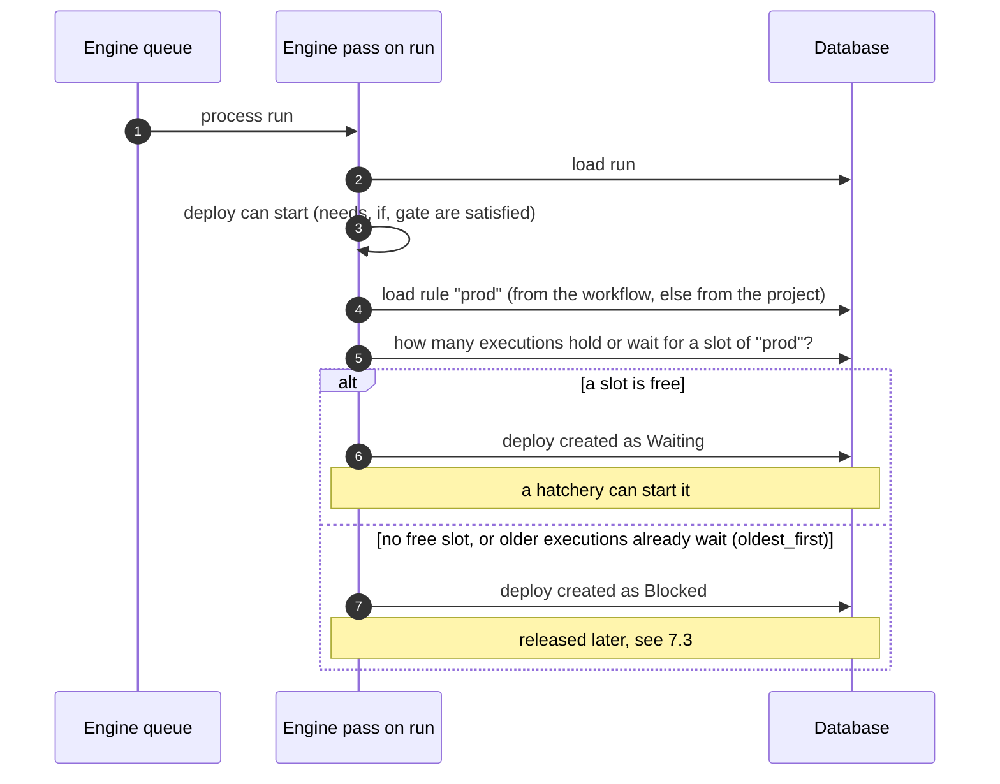
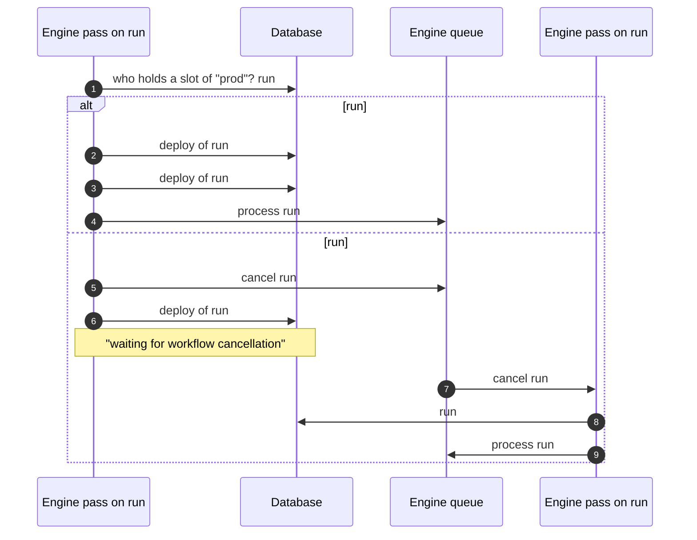
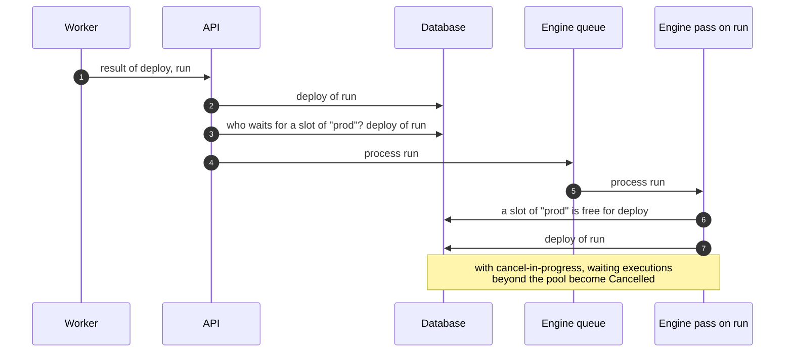

# Specification: Workflow Concurrency

## Overview

A concurrency rule limits how many executions share a named resource at the same time, such as a
deployment target. A workflow run or a single job declares the rule it uses; the engine then admits,
queues or cancels executions so that the rule holds across the project.

This document is the reference for the expected behaviour. The last section describes how the API
engine implements it.

---

## 1 — Rules

### 1.1 Definition

A rule is identified by its name and carries:

| Field | Default | Meaning |
|---|---|---|
| `name` | required | Identifier of the shared resource. May be interpolated from the run context. |
| `pool` | `1` | Number of executions admitted at the same time. A value lower than 1 means 1. |
| `order` | `oldest_first` | Which waiting execution is admitted when a slot is freed: `oldest_first` or `newest_first`. |
| `cancel-in-progress` | `false` | A new execution cancels the ones in progress instead of waiting for them. |
| `if` | none | Condition evaluated once, when the execution arrives, with the run context. When false, the execution ignores the rule. |

### 1.2 Scopes

A rule is defined either in the workflow, under `concurrencies`, or in the project. A workflow rule is
scoped to the workflow: two workflows defining the same name do not share anything. A project rule is
shared by every workflow of the project.

When a workflow and the project both define a name, the workflow definition wins for that workflow.

A rule declared by a job template is added to the workflow rules when the template is resolved, with
the same defaults and the same interpolation of its name as a rule declared by the workflow.

### 1.3 Usage

A workflow uses a rule with `concurrency`; the whole run is then one execution. A job uses a rule with
`concurrency`; the job alone is one execution. Both forms may use the same rule, in the same workflow
or across workflows.

A job must not use the rule its own workflow uses: the run holds a slot for its whole life, so with a
pool of 1 the job would wait for the run and the run for the job. The analysis rejects such a workflow.

---

## 2 — Executions and slots

An execution is a run (workflow rule) or a job (job rule). Both kinds share the same pool and are
ordered together.

An execution holds a slot from its admission to its final status. For a job this covers `Waiting`,
`Scheduling` and `Building`; for a run it covers `Building`. A `Blocked` execution waits for a slot
and holds none. A `Retrying` job keeps its slot: the retry takes it over.

Executions are ordered by arrival: a job by the time it was queued, a run by the time it was started.
"Oldest" and "newest" always refer to this order.

---

## 3 — Without cancel-in-progress

### 3.1 Arrival

A new execution is admitted when the pool has a free slot, except with `oldest_first` where older
executions already waiting are served first. Otherwise it is `Blocked`.

### 3.2 Release

When an execution reaches a final status, the freed slots go to waiting executions: the oldest ones
with `oldest_first`, the newest ones with `newest_first`. A released job is queued again from that
moment. Nothing is cancelled.

---

## 4 — With cancel-in-progress

### 4.1 Arrival

A new execution makes room for itself by cancelling, in this order and only as many as needed:

1. the oldest executions in progress,
2. the oldest executions waiting,
3. itself, when the rule still leaves no room (only when the pool is already filled by executions
   admitted in the same engine pass).

A cancelled job is cancelled immediately. A cancelled run is terminated by its own engine pass shortly
after, so the new execution is `Blocked` until then, with the message "waiting for workflow
cancellation". A new execution that cancels only jobs starts immediately.

`order` is ignored in this mode: the newest executions always win.

### 4.2 Release

When an execution reaches a final status, the newest waiting executions get the free slots. Waiting
executions beyond the `pool` newest ones have been superseded and are cancelled. The waiting
executions within the pool that get no slot yet keep waiting: they wait for cancellations already
requested.

### 4.3 Matrix jobs

Each permutation of a matrix job is one execution, and all of them arrive in the same engine pass.
With a pool smaller than the number of permutations, they supersede each other and only `pool` of them
run. Which permutations survive is not specified.

---

## 5 — Rule changes while executions are in the pool

Each execution carries the definition of the rule as it was when it arrived. When the executions in
the pool do not all carry the same definition, the rule applied to a new execution is the most
restrictive combination: the smallest `pool`, `oldest_first` when orders differ, and no
cancel-in-progress unless every execution has it.

---

## 6 — End of a run

When a run reaches a final status, for any reason (success, failure, stop, cancellation, engine
error), its remaining jobs are terminated with it and every slot held by the run or its jobs is
released. A job still running is stopped; its worker ends within a few seconds.

---

## 7 — Implementation

The engine is the part of the API that moves a run forward. It works in passes: a pass processes one
run, decides which of its jobs can start, and stops. The run is processed again when something
changes: a job ended, a slot was freed, a run was cancelled. Passes are requested through a queue.

Only one pass at a time runs on a given run, and only one pass at a time takes a decision on a given
rule, since the counts come from the database. A pass that finds the rule busy goes back to the queue
and retries.

The diagrams below follow one example: rule `prod` with a pool of 1, used by the `deploy` job of the
workflow `deploy-api`. Run #11 is in progress when run #12 arrives.

### 7.1 A job asks for a slot

### 7.2 A job asks for a slot, with cancel-in-progress

The new execution makes room for itself. A cancelled job is cancelled at once; a cancelled run is
cancelled by a pass of its own, so the new execution waits for it.

### 7.3 A slot is freed

Any execution reaching a final status frees its slot: a job whose worker sent its result, a run that
ended, was stopped or cancelled.

When the waiting execution is a whole run, the same pass turns the run from Blocked to Building, then
a next pass processes its jobs.

### 7.4 Where this lives in the code

| Behaviour | Function |
|---|---|
| One pass of the engine | `workflowRunV2Trigger` |
| Decision for one execution: admitted, blocked, or what it cancels | `canRunWithConcurrency`; `concurrencyUnlockedCount` holds the executions admitted earlier in the same pass, not yet in database |
| Order of cancellation at arrival (4.1) | `retrieveConcurrencyObjectToCancelled` |
| Release of waiting executions (3.2, 4.2) | `retrieveRunObjectsToUnLocked` |
| Request of a pass for each execution to release, after a final status | `manageEndConcurrency`; the release itself happens in the pass of each run |
| Final status of a run from the engine, with the release of its slots | `terminateWorkflowRun` |
