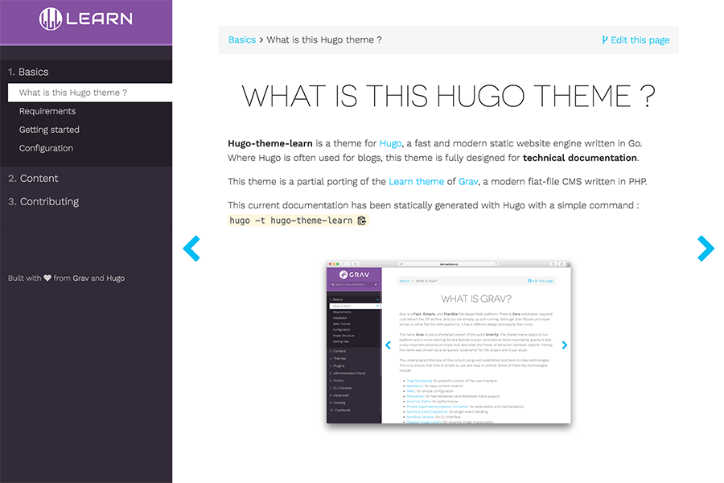

# Hugo Learn Theme

This repository contains a theme for [Hugo](https://gohugo.io/), based on great [Grav Learn Theme](http://learn.getgrav.org/).

Visit the [theme documentation](https://matcornic.github.io/hugo-learn-doc/basics/what-is-this-hugo-theme/) to see what is going on. It is actually built with this theme.

### Installation
Navigate to your themes folder in your Hugo site and use the following commands:
```
$ cd themes
$ git clone https://github.com/matcornic/hugo-theme-learn.git
```



# Main functionalities

- Handle two levels of documentation
- Tip/Note/Info and Warning boxes
- Resize images
- Preview of original image size
- Add shadow or border on images
- Automatic table of contents
- Create buttons (typically used to provide a link to a demo)

# Search
To use the `search` functionality, you just have to put a `lunr` index which respects this format :
```json
[
    {
        "uri": "/docs/01-start/index",
        "title": "Get started",
        "content": "\n\nGet started\n\nAll you need to know...\n",
        "tags": ["start", "intro"]
    },
    ...
]
```

into a `static/json/search.json` file in your hugo project.

And set `search = true` in your config.toml

To generate your lunr index, you can see this project https://github.com/gwleclerc/lunr-hugo which parse your markdown files and extract toml and yaml headers to create index with corresponding format.

# TODO

- [Handling more than 2 levels in documentation](https://github.com/matcornic/hugo-theme-learn/issues/11)
- [Handling videos](https://github.com/matcornic/hugo-theme-learn/issues/13)
- [Add optional button to create doc issue (like github)](https://github.com/matcornic/hugo-theme-learn/issues/14)
