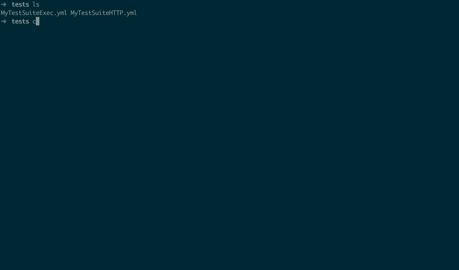

# Venom

Venom run executors (script, HTTP Request, etc... ) and assertions.
It can also output xUnit results files.



## Command Line

Install with:
```bash
$ go get github.com/ovh/venom
$ go install github.com/ovh/venom/cli/venom
```

```bash
$ venom run -h
Run Tests

Usage:
  venom run [flags]

Flags:
      --env                    Inject environment variables. export FOO=BAR -> you can use {{.FOO}} in your tests (default true)
      --exclude strings        --exclude filaA.yaml --exclude filaB.yaml --exclude fileC*.yaml
      --format string          --format:yaml, json, xml, tap (default "xml")
  -h, --help                   help for run
      --log string             Log Level : debug, info or warn (default "warn")
      --no-check-variables     Don't check variables before run
      --output-dir string      Output Directory: create tests results file inside this directory
      --parallel int           --parallel=2 : launches 2 Test Suites in parallel (default 1)
      --profiling              Enable Mem / CPU Profile with pprof
      --stop-on-failure        Stop running Test Suite on first Test Case failure
      --strict                 Exit with an error code if one test fails
      --var strings            --var cds='cds -f config.json' --var cds2='cds -f config.json'
      --var-from-file string   --var-from-file filename.yaml : hcl|json|yaml, must contains map[string]string'
```

## Executors

* **dbfixtures**: https://github.com/ovh/venom/tree/master/executors/dbfixtures
* **exec**: https://github.com/ovh/venom/tree/master/executors/exec `exec` is the default type for a step
* **http**: https://github.com/ovh/venom/tree/master/executors/http
* **imap**: https://github.com/ovh/venom/tree/master/executors/imap
* **ovhapi**: https://github.com/ovh/venom/tree/master/executors/ovhapi
* **readfile**: https://github.com/ovh/venom/tree/master/executors/readfile
* **redis**: https://github.com/ovh/venom/tree/master/executors/redis
* **smtp**: https://github.com/ovh/venom/tree/master/executors/smtp
* **ssh**: https://github.com/ovh/venom/tree/master/executors/ssh
* **web**: https://github.com/ovh/venom/tree/master/executors/web

## TestSuite files

* Run `venom template`
* Examples: https://github.com/ovh/cds/tree/master/tests


### Example:

```yaml

name: Title of TestSuite
testcases:
- name: TestCase with default value, exec cmd. Check if exit code != 1
  steps:
  - script: echo 'foo'
    type: exec

- name: Title of First TestCase
  steps:
  - script: echo 'foo'
    assertions:
    - result.code ShouldEqual 0
  - script: echo 'bar'
    assertions:
    - result.systemout ShouldNotContainSubstring foo
    - result.timeseconds ShouldBeLessThan 1

- name: GET http testcase, with 5 seconds timeout
  steps:
  - type: http
    method: GET
    url: https://eu.api.ovh.com/1.0/
    timeout: 5
    assertions:
    - result.body ShouldContainSubstring /dedicated/server
    - result.body ShouldContainSubstring /ipLoadbalancing
    - result.statuscode ShouldEqual 200
    - result.timeseconds ShouldBeLessThan 1

- name: Test with retries and delay in seconds between each try
  steps:
  - type: http
    method: GET
    url: https://eu.api.ovh.com/1.0/
    retry: 3
    delay: 2
    assertions:
    - result.statuscode ShouldEqual 200

```

Using variables and reuse results

```yaml
name: MyTestSuiteTmpl
vars:
  api.foo: 'http://api/foo'
  second: 'venomWithTmpl'

testcases:
- name: testA
  steps:
  - type: exec
    script: echo '{{.api.foo}}'
    assertions:
    - result.code ShouldEqual 0
    - result.systemout ShouldEqual http://api/foo

- name: testB
  steps:
  - type: exec
    script: echo 'XXX{{.testA.result.systemout}}YYY'
    assertions:
    - result.code ShouldEqual 0
    - result.systemout ShouldEqual XXXhttp://api/fooYYY

```

Extract variable from results and reuse it in step after

```yaml
name: MyTestSuite
testcases:
- name: testA
  steps:
  - type: exec
    script: echo 'foo with a bar here'
    extracts:
      result.systemout: foo with a {{myvariable=[a-z]+}} here

- name: testB
  steps:
  - type: exec
    script: echo {{.testA.myvariable}}
    assertions:
    - result.code ShouldEqual 0
    - result.systemout ShouldContainSubstring bar
```

Builtin venom variables

```yaml
name: MyTestSuite
testcases:
- name: testA
  steps:
  - type: exec
    script: echo '{{.venom.testsuite}} {{.venom.testsuite.filename}} {{.venom.testcase}} {{.venom.teststep.number}} {{.venom.datetime}} {{.venom.timestamp}}'
    # will display something as: MyTestSuite MyTestSuiteWithVenomBuiltinVar.yml testA 0 2018-08-05T21:38:24+02:00 1533497904

```

Builtin variables:

* {{.venom.testsuite}}
* {{.venom.testsuite.filename}}
* {{.venom.testcase}}
* {{.venom.teststep.number}}
* {{.venom.datetime}}
* {{.venom.timestamp}}

### Testsuite Versions

#### Version 2

On this new version, venom use the testsuite folder as the basepath instead of location of venom execution.


Considering this workspace :

```yaml

tests/
   testsuiteA/
      testsuite.yml
      testa.json
```

On version 1

```yaml

name: TestSuite Read File
testcases:
- name: TestCase Read File
  steps:
  - type: readfile
    path: testa.json
    assertions:
      - result.contentjson.foo ShouldEqual bar
```

If you execute ```venom run *``` into *tests/* folder, venom will try to find testa.json on tests/testa.json and will failed.
You must execute venom on the testsuite dir.

On version 2, venom use as basepath the testsuite file. So no matter where you execute venom command, testa.json will be found.

To specify the version 2, add *version* property on the testsuite :

```yaml

version: "2"
name: TestSuite Read File
testcases:
- name: TestCase Read File
  steps:
  - type: readfile
    path: testa.json
    assertions:
      - result.contentjson.foo ShouldEqual bar
```


## RUN Venom locally on CDS Integration Tests

```bash
cd $GOPATH/src/github.com/ovh/cds/tests
venom run --var cdsro='cds -f $HOME/.cds/it.user.ro.json' --var cds='cds -f $HOME/.cds/it.user.rw.json' --parallel=5
```

## RUN Venom with file var

vars.yaml :
```yaml
cdsro: 'cds -f $HOME/.cds/it.user.ro.json'
cds: 'cds -f $HOME/.cds/it.user.rw.json'
```

```bash
cd $GOPATH/src/github.com/ovh/cds/tests
venom run --var-from-file vars.yaml --parallel=5
```

## RUN Venom, with an export xUnit

```bash
venom run  --format=xml --output-dir="."
```

## Assertion

### Keywords

* ShouldEqual
* ShouldNotEqual
* ShouldAlmostEqual
* ShouldNotAlmostEqual
* ShouldResemble
* ShouldNotResemble
* ShouldPointTo
* ShouldNotPointTo
* ShouldBeNil
* ShouldNotBeNil
* ShouldBeTrue
* ShouldBeFalse
* ShouldBeZeroValue
* ShouldBeGreaterThan
* ShouldBeGreaterThanOrEqualTo
* ShouldBeLessThan
* ShouldBeLessThanOrEqualTo
* ShouldBeBetween
* ShouldNotBeBetween
* ShouldBeBetweenOrEqual
* ShouldNotBeBetweenOrEqual
* ShouldContain
* ShouldNotContain
* ShouldContainKey
* ShouldNotContainKey
* ShouldBeIn
* ShouldNotBeIn
* ShouldBeEmpty
* ShouldNotBeEmpty
* ShouldHaveLength
* ShouldStartWith
* ShouldNotStartWith
* ShouldEndWith
* ShouldNotEndWith
* ShouldBeBlank
* ShouldNotBeBlank
* ShouldContainSubstring
* ShouldNotContainSubstring
* ShouldEqualWithout
* ShouldEqualTrimSpace
* ShouldHappenBefore
* ShouldHappenOnOrBefore
* ShouldHappenAfter
* ShouldHappenOnOrAfter
* ShouldHappenBetween
* ShouldHappenOnOrBetween
* ShouldNotHappenOnOrBetween
* ShouldHappenWithin
* ShouldNotHappenWithin
* ShouldBeChronological

Most assertion keywords documentation can be found on [smartystreets/assertions README](https://github.com/smartystreets/assertions/blob/master/README.md#usage).

### Write your executor

An executor have to implement this interface

```go

// Executor execute a testStep.
type Executor interface {
	// Run run a Test Step
	Run(ctx context.Content, venom.Logger, TestStep) (ExecutorResult, error)
}
```

Example

```go


// Name of executor
const Name = "myexecutor"

// New returns a new Executor
func New() venom.Executor {
	return &Executor{}
}

// Executor struct
type Executor struct {
	Command string `json:"command,omitempty" yaml:"command,omitempty"`
}

// Result represents a step result
type Result struct {
	Code        int    `json:"code,omitempty" yaml:"code,omitempty"`
	Command     string `json:"command,omitempty" yaml:"command,omitempty"`
	Systemout   string   `json:"systemout,omitempty" yaml:"systemout,omitempty"` // put in testcase.Systemout by venom if present
	Systemerr   string   `json:"systemerr,omitempty" yaml:"systemerr,omitempty"` // put in testcase.Systemerr by venom if present
	Executor    Executor `json:"executor,omitempty" yaml:"executor,omitempty"`
}

// GetDefaultAssertions return default assertions for this executor
// Optional
func (Executor) GetDefaultAssertions() venom.StepAssertions {
	return venom.StepAssertions{Assertions: []string{"result.code ShouldEqual 0"}}
}

// Run execute TestStep
func (Executor) Run(ctx context.Context, l venom.Logger, step venom.TestStep) (venom.ExecutorResult, error) {

	// transform step to Executor Instance
	var e Executor
	if err := mapstructure.Decode(step, &e); err != nil {
		return nil, err
	}

	// to something with e.Command here...
	//...

	systemout := "foo"
	ouputCode := 0

	// prepare result
	r := Result{
		Code:    ouputCode, // return Output Code
		Command: e.Command, // return Command executed
		Systemout:  systemout,    // return Output string
		Executor: e, // return executor, useful for display Executor context in failure
	}

	return dump.ToMap(r)
}

```

Feel free to open a Pull Request with your executors.


## TestCase Context

TestCase Context allows you to inject datas in all Steps.

Define a context is optional, but can be useful to keep data between teststeps on a testcase.

### Write your TestCase Context

A TestCase Context has to implement this interface

```go

type TestCaseContext interface {
	Init() error
	Close() error
	SetTestCase(tc TestCase)
	GetName() string
}
```

Example

```go
// Context Type name
const Name = "default"

// New returns a new TestCaseContext
func New() venom.TestCaseContext {
	ctx := &DefaultTestCaseContext{}
	ctx.Name = Name
	return ctx
}

// DefaultTestCaseContext represents the context of a testcase
type DefaultTestCaseContext struct {
	venom.CommonTestCaseContext
	datas map[string]interface{}
}

// Init Initialize the context
func (tcc *DefaultTestCaseContext) Init() error {
	return nil
}

// Close the context
func (tcc *DefaultTestCaseContext) Close() error {
	return nil
}
```

Methods SetTestCase and  GetName are implemented by CommonTestCaseContext

# Dependencies

Individual packages were updated using the rough procedure:

1. `dep ensure`
2. `dep ensure -update ${PACKAGE}`
3. `dep prune`
4. `go build`


# Hacking

You've developed a new cool feature? Fixed an annoying bug? We'd be happy
to hear from you! Make sure to read [CONTRIBUTING.md](./CONTRIBUTING.md) before.

# License

This work is under the BSD license, see the [LICENSE](LICENSE) file for details.
