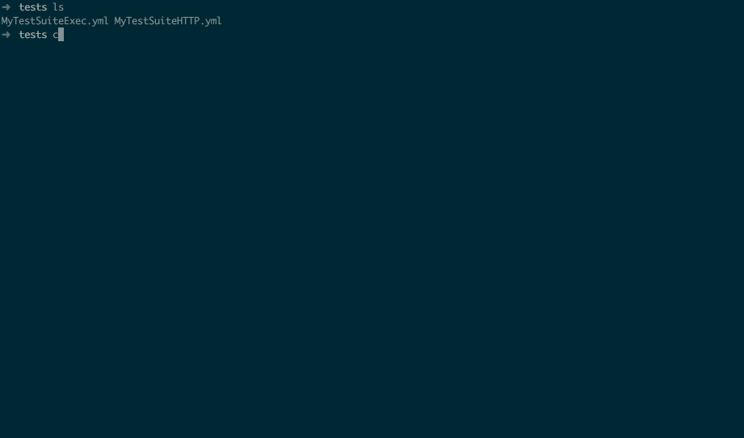

# Venom

Venom run executors (script, HTTP Request, etc... ) and assertions.
It can also output xUnit results files.



## Commmand Line

Install with:
```bash
$ go get github.com/runabove/venom
$ go install github.com/runabove/venom/cli/venom
```

```bash
$ venom run -h
Run Tests

Usage:
  venom run [flags]

Flags:
      --alias stringSlice   --alias cds:'cds -f config.json' --alias cds2:'cds -f config.json'
      --details string      Output Details Level : low, medium, high (default "medium")
      --format string       --formt:yaml, json, xml (default "xml")
      --log string          Log Level : debug, info or warn (default "warn")
      --output-dir string   Output Directory: create tests results file inside this directory
      --parallel int        --parallel=2 (default 1)
      --resume              Output Resume: one line with Total, TotalOK, TotalKO, TotalSkipped, TotalTestSuite (default true)
      --resumeFailures      Output Resume Failures (default true)
```

## TestSuite files

* Run `venom template`
* Examples: https://github.com/ovh/cds/tree/master/tests

### Example:

```yaml

name: Title of TestSuite
testcases:
- name: TestCase with default value, exec cmd. Check if exit code != 1
  steps:
  - script: echo 'foo'
    type: exec

- name: Title of First TestCase
  steps:
  - script: echo 'foo'
    assertions:
    - result.code ShouldEqual 0
  - script: echo 'bar'
    assertions:
    - result.stdout ShouldNotContainSubstring foo
    - result.timeseconds ShouldBeLessThan 1

- name: GET http testcase, with 5 seconds timeout
  steps:
  - type: http
    method: GET
    url: https://eu.api.ovh.com/1.0/
    timeout: 5
    assertions:
    - result.body ShouldContainSubstring /dedicated/server
    - result.body ShouldContainSubstring /ipLoadbalancing
    - result.statuscode ShouldEqual 200
    - result.timeseconds ShouldBeLessThan 1

- name: Test with retries and delay in seconds between each try
  steps:
  - type: http
    method: GET
    url: https://eu.api.ovh.com/1.0/
    retry: 3
    delay: 2
    assertions:
    - result.statuscode ShouldEqual 200

```

Using variables and reuse results

```yaml
name: MyTestSuiteTmpl
vars:
  api.foo: 'http://api/foo'
  second: 'venomWithTmpl'

testcases:
- name: testA
  steps:
  - type: exec
    script: echo '{{.api.foo}}'
    assertions:
    - result.code ShouldEqual 0
    - result.stdout ShouldEqual http://api/foo

- name: testB
  steps:
  - type: exec
    script: echo 'XXX{{.testA.result.stdout}}YYY'
    assertions:
    - result.code ShouldEqual 0
    - result.stdout ShouldEqual XXXhttp://api/fooYYY

```

## RUN Venom locally on CDS Integration Tests

```bash
cd $GOPATH/src/github.com/ovh/cds/tests
venom run --alias='cdsro:cds -f $HOME/.cds/it.user.ro.json' --alias='cds:cds -f $HOME/.cds/it.user.rw.json' --parallel=5
```

## RUN Venom, with an export xUnit

```bash
venom run  --details=low --format=xml --output-dir="."
```

## Assertion

### Keywords
* ShouldEqual
* ShouldNotEqual
* ShouldAlmostEqual
* ShouldNotAlmostEqual
* ShouldResemble
* ShouldNotResemble
* ShouldPointTo
* ShouldNotPointTo
* ShouldBeNil
* ShouldNotBeNil
* ShouldBeTrue
* ShouldBeFalse
* ShouldBeZeroValue
* ShouldBeGreaterThan
* ShouldBeGreaterThanOrEqualTo
* ShouldBeLessThan
* ShouldBeLessThanOrEqualTo
* ShouldBeBetween
* ShouldNotBeBetween
* ShouldBeBetweenOrEqual
* ShouldNotBeBetweenOrEqual
* ShouldContain
* ShouldNotContain
* ShouldContainKey
* ShouldNotContainKey
* ShouldBeIn
* ShouldNotBeIn
* ShouldBeEmpty
* ShouldNotBeEmpty
* ShouldHaveLength
* ShouldStartWith
* ShouldNotStartWith
* ShouldEndWith
* ShouldNotEndWith
* ShouldBeBlank
* ShouldNotBeBlank
* ShouldContainSubstring
* ShouldNotContainSubstring
* ShouldEqualWithout
* ShouldEqualTrimSpace
* ShouldHappenBefore
* ShouldHappenOnOrBefore
* ShouldHappenAfter
* ShouldHappenOnOrAfter
* ShouldHappenBetween
* ShouldHappenOnOrBetween
* ShouldNotHappenOnOrBetween
* ShouldHappenWithin
* ShouldNotHappenWithin
* ShouldBeChronological

## Executors

### Exec

Default value of type is `exec`

In your yaml file, you can use:

```yaml
  - script mandatory
```

```yaml

name: Title of TestSuite
testcases:
- name: Check if exit code != 1 and echo command response in less than 1s
  steps:
  - script: echo 'foo'
    assertions:
    - result.code ShouldEqual 0
    - result.timeseconds ShouldBeLessThan 1

```


### HTTP

In your yaml file, you can use:

```yaml
  - method optional, default value : GET
  - url mandatory
  - path optional
  - body optional
  - headers optional
```

```yaml

name: Title of TestSuite
testcases:

- name: GET http testcase
  steps:
  - type: http
    method: GET
    url: https://eu.api.ovh.com/1.0/
    assertions:
    - result.body ShouldContainSubstring /dedicated/server
    - result.body ShouldContainSubstring /ipLoadbalancing
    - result.statuscode ShouldEqual 200
    - result.bodyjson.apis.apis0.path ShouldEqual /allDom

```

### Write your executor

An executor have to implement this interface

```go

// Executor execute a testStep.
type Executor interface {
	// Run run a Test Step
	Run(*log.Entry, Aliases, TestStep) (ExecutorResult, error)
}
```

Example

```go


// Name of executor
const Name = "myexecutor"

// New returns a new Executor
func New() venom.Executor {
	return &Executor{}
}

// Executor struct
type Executor struct {
	Command string `json:"command,omitempty" yaml:"command,omitempty"`
}

// Result represents a step result
type Result struct {
	Code        int    `json:"code,omitempty" yaml:"code,omitempty"`
	Command     string `json:"command,omitempty" yaml:"command,omitempty"`
	Output      string `json:"Output,omitempty" yaml:"Output,omitempty"`
  Executor    Executor `json:"executor,omitempty" yaml:"executor,omitempty"`  
}

// GetDefaultAssertions return default assertions for this executor
// Optional
func (Executor) GetDefaultAssertions() venom.StepAssertions {
	return venom.StepAssertions{Assertions: []string{"result.code ShouldEqual 0"}}
}

// Run execute TestStep
func (Executor) Run(l *log.Entry, aliases venom.Aliases, step venom.TestStep) (venom.ExecutorResult, error) {

	// transform step to Executor Instance
	var t Executor
	if err := mapstructure.Decode(step, &t); err != nil {
		return nil, err
	}

	// to something with t.Command here...
	//...

	output := "foo"
	ouputCode := 0

	// prepare result
	r := Result{
		Code:    ouputCode, // return Output Code
		Command: t.Command, // return Command executed
		Output:  output,    // return Output string
    Executor: t, // return executor, usefull for display Executor context in failure
	}

	return dump.ToMap(r)
}

```

Feel free to open a Pull Request with your executors.


# Hacking

You've developed a new cool feature? Fixed an annoying bug? We'd be happy
to hear from you! Make sure to read [CONTRIBUTING.md](./CONTRIBUTING.md) before.

# License

This work is under the BSD license, see the [LICENSE](LICENSE) file for details.
